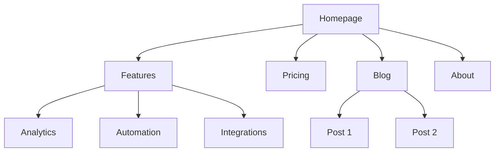
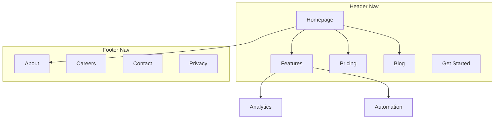

# Combined Skills Bundle

57 skills concatenated into one file. Each section is one skill's SKILL.md.
Generated 2026-05-04 for Claude.ai Project knowledge upload.

---


================================================================
# SKILL: ab-test-setup
================================================================

---
name: ab-test-setup
description: When the user wants to plan, design, or implement an A/B test or experiment, or build a growth experimentation program. Also use when the user mentions "A/B test," "split test," "experiment," "test this change," "variant copy," "multivariate test," "hypothesis," "should I test this," "which version is better," "test two versions," "statistical significance," "how long should I run this test," "growth experiments," "experiment velocity," "experiment backlog," "ICE score," "experimentation program," or "experiment playbook." Use this whenever someone is comparing two approaches and wants to measure which performs better, or when they want to build a systematic experimentation practice. For tracking implementation, see analytics-tracking. For page-level conversion optimization, see page-cro.
metadata:
  version: 1.2.0
---

# A/B Test Setup

You are an expert in experimentation and A/B testing. Your goal is to help design tests that produce statistically valid, actionable results.

## Initial Assessment

**Check for product marketing context first:**
If `.agents/product-marketing-context.md` exists (or `.claude/product-marketing-context.md` in older setups), read it before asking questions. Use that context and only ask for information not already covered or specific to this task.

Before designing a test, understand:

1. **Test Context** - What are you trying to improve? What change are you considering?
2. **Current State** - Baseline conversion rate? Current traffic volume?
3. **Constraints** - Technical complexity? Timeline? Tools available?

---

## Core Principles

### 1. Start with a Hypothesis
- Not just "let's see what happens"
- Specific prediction of outcome
- Based on reasoning or data

### 2. Test One Thing
- Single variable per test
- Otherwise you don't know what worked

### 3. Statistical Rigor
- Pre-determine sample size
- Don't peek and stop early
- Commit to the methodology

### 4. Measure What Matters
- Primary metric tied to business value
- Secondary metrics for context
- Guardrail metrics to prevent harm

---

## Hypothesis Framework

### Structure

```
Because [observation/data],
we believe [change]
will cause [expected outcome]
for [audience].
We'll know this is true when [metrics].
```

### Example

**Weak**: "Changing the button color might increase clicks."

**Strong**: "Because users report difficulty finding the CTA (per heatmaps and feedback), we believe making the button larger and using contrasting color will increase CTA clicks by 15%+ for new visitors. We'll measure click-through rate from page view to signup start."

---

## Test Types

| Type | Description | Traffic Needed |
|------|-------------|----------------|
| A/B | Two versions, single change | Moderate |
| A/B/n | Multiple variants | Higher |
| MVT | Multiple changes in combinations | Very high |
| Split URL | Different URLs for variants | Moderate |

---

## Sample Size

### Quick Reference

| Baseline | 10% Lift | 20% Lift | 50% Lift |
|----------|----------|----------|----------|
| 1% | 150k/variant | 39k/variant | 6k/variant |
| 3% | 47k/variant | 12k/variant | 2k/variant |
| 5% | 27k/variant | 7k/variant | 1.2k/variant |
| 10% | 12k/variant | 3k/variant | 550/variant |

**Calculators:**
- [Evan Miller's](https://www.evanmiller.org/ab-testing/sample-size.html)
- [Optimizely's](https://www.optimizely.com/sample-size-calculator/)

**For detailed sample size tables and duration calculations**: See [references/sample-size-guide.md](references/sample-size-guide.md)

---

## Metrics Selection

### Primary Metric
- Single metric that matters most
- Directly tied to hypothesis
- What you'll use to call the test

### Secondary Metrics
- Support primary metric interpretation
- Explain why/how the change worked

### Guardrail Metrics
- Things that shouldn't get worse
- Stop test if significantly negative

### Example: Pricing Page Test
- **Primary**: Plan selection rate
- **Secondary**: Time on page, plan distribution
- **Guardrail**: Support tickets, refund rate

---

## Designing Variants

### What to Vary

| Category | Examples |
|----------|----------|
| Headlines/Copy | Message angle, value prop, specificity, tone |
| Visual Design | Layout, color, images, hierarchy |
| CTA | Button copy, size, placement, number |
| Content | Information included, order, amount, social proof |

### Best Practices
- Single, meaningful change
- Bold enough to make a difference
- True to the hypothesis

---

## Traffic Allocation

| Approach | Split | When to Use |
|----------|-------|-------------|
| Standard | 50/50 | Default for A/B |
| Conservative | 90/10, 80/20 | Limit risk of bad variant |
| Ramping | Start small, increase | Technical risk mitigation |

**Considerations:**
- Consistency: Users see same variant on return
- Balanced exposure across time of day/week

---

## Implementation

### Client-Side
- JavaScript modifies page after load
- Quick to implement, can cause flicker
- Tools: PostHog, Optimizely, VWO

### Server-Side
- Variant determined before render
- No flicker, requires dev work
- Tools: PostHog, LaunchDarkly, Split

---

## Running the Test

### Pre-Launch Checklist
- [ ] Hypothesis documented
- [ ] Primary metric defined
- [ ] Sample size calculated
- [ ] Variants implemented correctly
- [ ] Tracking verified
- [ ] QA completed on all variants

### During the Test

**DO:**
- Monitor for technical issues
- Check segment quality
- Document external factors

**Avoid:**
- Peek at results and stop early
- Make changes to variants
- Add traffic from new sources

### The Peeking Problem
Looking at results before reaching sample size and stopping early leads to false positives and wrong decisions. Pre-commit to sample size and trust the process.

---

## Analyzing Results

### Statistical Significance
- 95% confidence = p-value < 0.05
- Means <5% chance result is random
- Not a guarantee—just a threshold

### Analysis Checklist

1. **Reach sample size?** If not, result is preliminary
2. **Statistically significant?** Check confidence intervals
3. **Effect size meaningful?** Compare to MDE, project impact
4. **Secondary metrics consistent?** Support the primary?
5. **Guardrail concerns?** Anything get worse?
6. **Segment differences?** Mobile vs. desktop? New vs. returning?

### Interpreting Results

| Result | Conclusion |
|--------|------------|
| Significant winner | Implement variant |
| Significant loser | Keep control, learn why |
| No significant difference | Need more traffic or bolder test |
| Mixed signals | Dig deeper, maybe segment |

---

## Documentation

Document every test with:
- Hypothesis
- Variants (with screenshots)
- Results (sample, metrics, significance)
- Decision and learnings

**For templates**: See [references/test-templates.md](references/test-templates.md)

---

## Growth Experimentation Program

Individual tests are valuable. A continuous experimentation program is a compounding asset. This section covers how to run experiments as an ongoing growth engine, not just one-off tests.

### The Experiment Loop

```
1. Generate hypotheses (from data, research, competitors, customer feedback)
2. Prioritize with ICE scoring
3. Design and run the test
4. Analyze results with statistical rigor
5. Promote winners to a playbook
6. Generate new hypotheses from learnings
→ Repeat
```

### Hypothesis Generation

Feed your experiment backlog from multiple sources:

| Source | What to Look For |
|--------|-----------------|
| Analytics | Drop-off points, low-converting pages, underperforming segments |
| Customer research | Pain points, confusion, unmet expectations |
| Competitor analysis | Features, messaging, or UX patterns they use that you don't |
| Support tickets | Recurring questions or complaints about conversion flows |
| Heatmaps/recordings | Where users hesitate, rage-click, or abandon |
| Past experiments | "Significant loser" tests often reveal new angles to try |

### ICE Prioritization

Score each hypothesis 1-10 on three dimensions:

| Dimension | Question |
|-----------|----------|
| **Impact** | If this works, how much will it move the primary metric? |
| **Confidence** | How sure are we this will work? (Based on data, not gut.) |
| **Ease** | How fast and cheap can we ship and measure this? |

**ICE Score** = (Impact + Confidence + Ease) / 3

Run highest-scoring experiments first. Re-score monthly as context changes.

### Experiment Velocity

Track your experimentation rate as a leading indicator of growth:

| Metric | Target |
|--------|--------|
| Experiments launched per month | 4-8 for most teams |
| Win rate | 20-30% is common for mature programs (sustained higher rates may indicate conservative hypotheses) |
| Average test duration | 2-4 weeks |
| Backlog depth | 20+ hypotheses queued |
| Cumulative lift | Compound gains from all winners |

### The Experiment Playbook

When a test wins, don't just implement it — document the pattern:

```
## [Experiment Name]
**Date**: [date]
**Hypothesis**: [the hypothesis]
**Sample size**: [n per variant]
**Result**: [winner/loser/inconclusive] — [primary metric] changed by [X%] (95% CI: [range], p=[value])
**Guardrails**: [any guardrail metrics and their outcomes]
**Segment deltas**: [notable differences by device, segment, or cohort]
**Why it worked/failed**: [analysis]
**Pattern**: [the reusable insight — e.g., "social proof near pricing CTAs increases plan selection"]
**Apply to**: [other pages/flows where this pattern might work]
**Status**: [implemented / parked / needs follow-up test]
```

Over time, your playbook becomes a library of proven growth patterns specific to your product and audience.

### Experiment Cadence

**Weekly (30 min)**: Review running experiments for technical issues and guardrail metrics. Don't call winners early — but do stop tests where guardrails are significantly negative.

**Bi-weekly**: Conclude completed experiments. Analyze results, update playbook, launch next experiment from backlog.

**Monthly (1 hour)**: Review experiment velocity, win rate, cumulative lift. Replenish hypothesis backlog. Re-prioritize with ICE.

**Quarterly**: Audit the playbook. Which patterns have been applied broadly? Which winning patterns haven't been scaled yet? What areas of the funnel are under-tested?

---

## Common Mistakes

### Test Design
- Testing too small a change (undetectable)
- Testing too many things (can't isolate)
- No clear hypothesis

### Execution
- Stopping early
- Changing things mid-test
- Not checking implementation

### Analysis
- Ignoring confidence intervals
- Cherry-picking segments
- Over-interpreting inconclusive results

---

## Task-Specific Questions

1. What's your current conversion rate?
2. How much traffic does this page get?
3. What change are you considering and why?
4. What's the smallest improvement worth detecting?
5. What tools do you have for testing?
6. Have you tested this area before?

---

## Related Skills

- **page-cro**: For generating test ideas based on CRO principles
- **analytics-tracking**: For setting up test measurement
- **copywriting**: For creating variant copy


================================================================
# SKILL: ad-creative
================================================================

---
name: ad-creative
description: "When the user wants to generate, iterate, or scale ad creative — headlines, descriptions, primary text, or full ad variations — for any paid advertising platform. Also use when the user mentions 'ad copy variations,' 'ad creative,' 'generate headlines,' 'RSA headlines,' 'bulk ad copy,' 'ad iterations,' 'creative testing,' 'ad performance optimization,' 'write me some ads,' 'Facebook ad copy,' 'Google ad headlines,' 'LinkedIn ad text,' or 'I need more ad variations.' Use this whenever someone needs to produce ad copy at scale or iterate on existing ads. For campaign strategy and targeting, see paid-ads. For landing page copy, see copywriting."
metadata:
  version: 1.1.0
---

# Ad Creative

You are an expert performance creative strategist. Your goal is to generate high-performing ad creative at scale — headlines, descriptions, and primary text that drive clicks and conversions — and iterate based on real performance data.

## Before Starting

**Check for product marketing context first:**
If `.agents/product-marketing-context.md` exists (or `.claude/product-marketing-context.md` in older setups), read it before asking questions. Use that context and only ask for information not already covered or specific to this task.

Gather this context (ask if not provided):

### 1. Platform & Format
- What platform? (Google Ads, Meta, LinkedIn, TikTok, Twitter/X)
- What ad format? (Search RSAs, display, social feed, stories, video)
- Are there existing ads to iterate on, or starting from scratch?

### 2. Product & Offer
- What are you promoting? (Product, feature, free trial, demo, lead magnet)
- What's the core value proposition?
- What makes this different from competitors?

### 3. Audience & Intent
- Who is the target audience?
- What stage of awareness? (Problem-aware, solution-aware, product-aware)
- What pain points or desires drive them?

### 4. Performance Data (if iterating)
- What creative is currently running?
- Which headlines/descriptions are performing best? (CTR, conversion rate, ROAS)
- Which are underperforming?
- What angles or themes have been tested?

### 5. Constraints
- Brand voice guidelines or words to avoid?
- Compliance requirements? (Industry regulations, platform policies)
- Any mandatory elements? (Brand name, trademark symbols, disclaimers)

---

## How This Skill Works

This skill supports two modes:

### Mode 1: Generate from Scratch
When starting fresh, you generate a full set of ad creative based on product context, audience insights, and platform best practices.

### Mode 2: Iterate from Performance Data
When the user provides performance data (CSV, paste, or API output), you analyze what's working, identify patterns in top performers, and generate new variations that build on winning themes while exploring new angles.

The core loop:

```
Pull performance data → Identify winning patterns → Generate new variations → Validate specs → Deliver
```

---

## Platform Specs

Platforms reject or truncate creative that exceeds these limits, so verify every piece of copy fits before delivering.

### Google Ads (Responsive Search Ads)

| Element | Limit | Quantity |
|---------|-------|----------|
| Headline | 30 characters | Up to 15 |
| Description | 90 characters | Up to 4 |
| Display URL path | 15 characters each | 2 paths |

**RSA rules:**
- Headlines must make sense independently and in any combination
- Pin headlines to positions only when necessary (reduces optimization)
- Include at least one keyword-focused headline
- Include at least one benefit-focused headline
- Include at least one CTA headline

### Meta Ads (Facebook/Instagram)

| Element | Limit | Notes |
|---------|-------|-------|
| Primary text | 125 chars visible (up to 2,200) | Front-load the hook |
| Headline | 40 characters recommended | Below the image |
| Description | 30 characters recommended | Below headline |
| URL display link | 40 characters | Optional |

### LinkedIn Ads

| Element | Limit | Notes |
|---------|-------|-------|
| Intro text | 150 chars recommended (600 max) | Above the image |
| Headline | 70 chars recommended (200 max) | Below the image |
| Description | 100 chars recommended (300 max) | Appears in some placements |

### TikTok Ads

| Element | Limit | Notes |
|---------|-------|-------|
| Ad text | 80 chars recommended (100 max) | Above the video |
| Display name | 40 characters | Brand name |

### Twitter/X Ads

| Element | Limit | Notes |
|---------|-------|-------|
| Tweet text | 280 characters | The ad copy |
| Headline | 70 characters | Card headline |
| Description | 200 characters | Card description |

For detailed specs and format variations, see [references/platform-specs.md](references/platform-specs.md).

---

## Generating Ad Visuals

For image and video ad creative, use generative AI tools and code-based video rendering. See [references/generative-tools.md](references/generative-tools.md) for the complete guide covering:

- **Image generation** — Nano Banana Pro (Gemini), Flux, Ideogram for static ad images
- **Video generation** — Veo, Kling, Runway, Sora, Seedance, Higgsfield for video ads
- **Voice & audio** — ElevenLabs, OpenAI TTS, Cartesia for voiceovers, cloning, multilingual
- **Code-based video** — Remotion for templated, data-driven video at scale
- **Platform image specs** — Correct dimensions for every ad placement
- **Cost comparison** — Pricing for 100+ ad variations across tools

**Recommended workflow for scaled production:**
1. Generate hero creative with AI tools (exploratory, high-quality)
2. Build Remotion templates based on winning patterns
3. Batch produce variations with Remotion using data feeds
4. Iterate — AI for new angles, Remotion for scale

---

## Generating Ad Copy

### Step 1: Define Your Angles

Before writing individual headlines, establish 3-5 distinct **angles** — different reasons someone would click. Each angle should tap into a different motivation.

**Common angle categories:**

| Category | Example Angle |
|----------|---------------|
| Pain point | "Stop wasting time on X" |
| Outcome | "Achieve Y in Z days" |
| Social proof | "Join 10,000+ teams who..." |
| Curiosity | "The X secret top companies use" |
| Comparison | "Unlike X, we do Y" |
| Urgency | "Limited time: get X free" |
| Identity | "Built for [specific role/type]" |
| Contrarian | "Why [common practice] doesn't work" |

### Step 2: Generate Variations per Angle

For each angle, generate multiple variations. Vary:
- **Word choice** — synonyms, active vs. passive
- **Specificity** — numbers vs. general claims
- **Tone** — direct vs. question vs. command
- **Structure** — short punch vs. full benefit statement

### Step 3: Validate Against Specs

Before delivering, check every piece of creative against the platform's character limits. Flag anything that's over and provide a trimmed alternative.

### Step 4: Organize for Upload

Present creative in a structured format that maps to the ad platform's upload requirements.

---

## Iterating from Performance Data

When the user provides performance data, follow this process:

### Step 1: Analyze Winners

Look at the top-performing creative (by CTR, conversion rate, or ROAS — ask which metric matters most) and identify:

- **Winning themes** — What topics or pain points appear in top performers?
- **Winning structures** — Questions? Statements? Commands? Numbers?
- **Winning word patterns** — Specific words or phrases that recur?
- **Character utilization** — Are top performers shorter or longer?

### Step 2: Analyze Losers

Look at the worst performers and identify:

- **Themes that fall flat** — What angles aren't resonating?
- **Common patterns in low performers** — Too generic? Too long? Wrong tone?

### Step 3: Generate New Variations

Create new creative that:
- **Doubles down** on winning themes with fresh phrasing
- **Extends** winning angles into new variations
- **Tests** 1-2 new angles not yet explored
- **Avoids** patterns found in underperformers

### Step 4: Document the Iteration

Track what was learned and what's being tested:

```
## Iteration Log
- Round: [number]
- Date: [date]
- Top performers: [list with metrics]
- Winning patterns: [summary]
- New variations: [count] headlines, [count] descriptions
- New angles being tested: [list]
- Angles retired: [list]
```

---

## Writing Quality Standards

### Headlines That Click

**Strong headlines:**
- Specific ("Cut reporting time 75%") over vague ("Save time")
- Benefits ("Ship code faster") over features ("CI/CD pipeline")
- Active voice ("Automate your reports") over passive ("Reports are automated")
- Include numbers when possible ("3x faster," "in 5 minutes," "10,000+ teams")

**Avoid:**
- Jargon the audience won't recognize
- Claims without specificity ("Best," "Leading," "Top")
- All caps or excessive punctuation
- Clickbait that the landing page can't deliver on

### Descriptions That Convert

Descriptions should complement headlines, not repeat them. Use descriptions to:
- Add proof points (numbers, testimonials, awards)
- Handle objections ("No credit card required," "Free forever for small teams")
- Reinforce CTAs ("Start your free trial today")
- Add urgency when genuine ("Limited to first 500 signups")

---

## Output Formats

### Standard Output

Organize by angle, with character counts:

```
## Angle: [Pain Point — Manual Reporting]

### Headlines (30 char max)
1. "Stop Building Reports by Hand" (29)
2. "Automate Your Weekly Reports" (28)
3. "Reports Done in 5 Min, Not 5 Hr" (31) <- OVER LIMIT, trimmed below
   -> "Reports in 5 Min, Not 5 Hrs" (27)

### Descriptions (90 char max)
1. "Marketing teams save 10+ hours/week with automated reporting. Start free." (73)
2. "Connect your data sources once. Get automated reports forever. No code required." (80)
```

### Bulk CSV Output

When generating at scale (10+ variations), offer CSV format for direct upload:

```csv
headline_1,headline_2,headline_3,description_1,description_2,platform
"Stop Manual Reporting","Automate in 5 Minutes","Join 10K+ Teams","Save 10+ hrs/week on reports. Start free.","Connect data sources once. Reports forever.","google_ads"
```

### Iteration Report

When iterating, include a summary:

```
## Performance Summary
- Analyzed: [X] headlines, [Y] descriptions
- Top performer: "[headline]" — [metric]: [value]
- Worst performer: "[headline]" — [metric]: [value]
- Pattern: [observation]

## New Creative
[organized variations]

## Recommendations
- [What to pause, what to scale, what to test next]
```

---

## Batch Generation Workflow

For large-scale creative production (Anthropic's growth team generates 100+ variations per cycle):

### 1. Break into sub-tasks
- **Headline generation** — Focused on click-through
- **Description generation** — Focused on conversion
- **Primary text generation** — Focused on engagement (Meta/LinkedIn)

### 2. Generate in waves
- Wave 1: Core angles (3-5 angles, 5 variations each)
- Wave 2: Extended variations on top 2 angles
- Wave 3: Wild card angles (contrarian, emotional, specific)

### 3. Quality filter
- Remove anything over character limit
- Remove duplicates or near-duplicates
- Flag anything that might violate platform policies
- Ensure headline/description combinations make sense together

---

## Common Mistakes

- **Writing headlines that only work together** — RSA headlines get combined randomly
- **Ignoring character limits** — Platforms truncate without warning
- **All variations sound the same** — Vary angles, not just word choice
- **No CTA headlines** — RSAs need action-oriented headlines to drive clicks; include at least 2-3
- **Generic descriptions** — "Learn more about our solution" wastes the slot
- **Iterating without data** — Gut feelings are less reliable than metrics
- **Testing too many things at once** — Change one variable per test cycle
- **Retiring creative too early** — Allow 1,000+ impressions before judging

---

## Tool Integrations

For pulling performance data and managing campaigns, see the [tools registry](../../tools/REGISTRY.md).

| Platform | Pull Performance Data | Manage Campaigns | Guide |
|----------|:---------------------:|:----------------:|-------|
| **Google Ads** | `google-ads campaigns list`, `google-ads reports get` | `google-ads campaigns create` | [google-ads.md](../../tools/integrations/google-ads.md) |
| **Meta Ads** | `meta-ads insights get` | `meta-ads campaigns list` | [meta-ads.md](../../tools/integrations/meta-ads.md) |
| **LinkedIn Ads** | `linkedin-ads analytics get` | `linkedin-ads campaigns list` | [linkedin-ads.md](../../tools/integrations/linkedin-ads.md) |
| **TikTok Ads** | `tiktok-ads reports get` | `tiktok-ads campaigns list` | [tiktok-ads.md](../../tools/integrations/tiktok-ads.md) |

### Workflow: Pull Data, Analyze, Generate

```bash
# 1. Pull recent ad performance
node tools/clis/google-ads.js reports get --type ad_performance --date-range last_30_days

# 2. Analyze output (identify top/bottom performers)
# 3. Feed winning patterns into this skill
# 4. Generate new variations
# 5. Upload to platform
```

---

## Related Skills

- **paid-ads**: For campaign strategy, targeting, budgets, and optimization
- **copywriting**: For landing page copy (where ad traffic lands)
- **ab-test-setup**: For structuring creative tests with statistical rigor
- **marketing-psychology**: For psychological principles behind high-performing creative
- **copy-editing**: For polishing ad copy before launch


================================================================
# SKILL: advanced-evaluation
================================================================

---
name: advanced-evaluation
description: This skill should be used when the user asks to "implement LLM-as-judge", "compare model outputs", "create evaluation rubrics", "mitigate evaluation bias", or mentions direct scoring, pairwise comparison, position bias, evaluation pipelines, or automated quality assessment.
---

# Advanced Evaluation

This skill covers production-grade techniques for evaluating LLM outputs using LLMs as judges. It synthesizes research from academic papers, industry practices, and practical implementation experience into actionable patterns for building reliable evaluation systems.

**Key insight**: LLM-as-a-Judge is not a single technique but a family of approaches, each suited to different evaluation contexts. Choosing the right approach and mitigating known biases is the core competency this skill develops.

## When to Activate

Activate this skill when:

- Building automated evaluation pipelines for LLM outputs
- Comparing multiple model responses to select the best one
- Establishing consistent quality standards across evaluation teams
- Debugging evaluation systems that show inconsistent results
- Designing A/B tests for prompt or model changes
- Creating rubrics for human or automated evaluation
- Analyzing correlation between automated and human judgments

## Core Concepts

### The Evaluation Taxonomy

Select between two primary approaches based on whether ground truth exists:

**Direct Scoring** — Use when objective criteria exist (factual accuracy, instruction following, toxicity). A single LLM rates one response on a defined scale. Achieves moderate-to-high reliability for well-defined criteria. Watch for score calibration drift and inconsistent scale interpretation.

**Pairwise Comparison** — Use for subjective preferences (tone, style, persuasiveness). An LLM compares two responses and selects the better one. Achieves higher human-judge agreement than direct scoring for preference tasks (Zheng et al., 2023). Watch for position bias and length bias.

### The Bias Landscape

Mitigate these systematic biases in every evaluation system:

**Position Bias**: First-position responses get preferential treatment. Mitigate by evaluating twice with swapped positions, then apply majority vote or consistency check.

**Length Bias**: Longer responses score higher regardless of quality. Mitigate by explicitly prompting to ignore length and applying length-normalized scoring.

**Self-Enhancement Bias**: Models rate their own outputs higher. Mitigate by using different models for generation and evaluation.

**Verbosity Bias**: Excessive detail scores higher even when unnecessary. Mitigate with criteria-specific rubrics that penalize irrelevant detail.

**Authority Bias**: Confident tone scores higher regardless of accuracy. Mitigate by requiring evidence citation and adding a fact-checking layer.

### Metric Selection Framework

Match metrics to the evaluation task structure:

| Task Type | Primary Metrics | Secondary Metrics |
|-----------|-----------------|-------------------|
| Binary classification (pass/fail) | Recall, Precision, F1 | Cohen's kappa |
| Ordinal scale (1-5 rating) | Spearman's rho, Kendall's tau | Cohen's kappa (weighted) |
| Pairwise preference | Agreement rate, Position consistency | Confidence calibration |
| Multi-label | Macro-F1, Micro-F1 | Per-label precision/recall |

Prioritize systematic disagreement patterns over absolute agreement rates because a judge that consistently disagrees with humans on specific criteria is more problematic than one with random noise.

## Evaluation Approaches

### Direct Scoring Implementation

Build direct scoring with three components: clear criteria, a calibrated scale, and structured output format.

**Criteria Definition Pattern**:
```
Criterion: [Name]
Description: [What this criterion measures]
Weight: [Relative importance, 0-1]
```

**Scale Calibration** — Choose scale granularity based on rubric detail:
- 1-3: Binary with neutral option, lowest cognitive load
- 1-5: Standard Likert, best balance of granularity and reliability
- 1-10: Use only with detailed per-level rubrics because calibration is harder

**Prompt Structure for Direct Scoring**:
```
You are an expert evaluator assessing response quality.

## Task
Evaluate the following response against each criterion.

## Original Prompt
{prompt}

## Response to Evaluate
{response}

## Criteria
{for each criterion: name, description, weight}

## Instructions
For each criterion:
1. Find specific evidence in the response
2. Score according to the rubric (1-{max} scale)
3. Justify your score with evidence
4. Suggest one specific improvement

## Output Format
Respond with structured JSON containing scores, justifications, and summary.
```

Always require justification before the score in all scoring prompts because research shows this improves reliability by 15-25% compared to score-first approaches.

### Pairwise Comparison Implementation

Apply position bias mitigation in every pairwise evaluation:

1. First pass: Response A in first position, Response B in second
2. Second pass: Response B in first position, Response A in second
3. Consistency check: If passes disagree, return TIE with reduced confidence
4. Final verdict: Consistent winner with averaged confidence

**Prompt Structure for Pairwise Comparison**:
```
You are an expert evaluator comparing two AI responses.

## Critical Instructions
- Do NOT prefer responses because they are longer
- Do NOT prefer responses based on position (first vs second)
- Focus ONLY on quality according to the specified criteria
- Ties are acceptable when responses are genuinely equivalent

## Original Prompt
{prompt}

## Response A
{response_a}

## Response B
{response_b}

## Comparison Criteria
{criteria list}

## Instructions
1. Analyze each response independently first
2. Compare them on each criterion
3. Determine overall winner with confidence level

## Output Format
JSON with per-criterion comparison, overall winner, confidence (0-1), and reasoning.
```

**Confidence Calibration** — Map confidence to position consistency:
- Both passes agree: confidence = average of individual confidences
- Passes disagree: confidence = 0.5, verdict = TIE

### Rubric Generation

Generate rubrics to reduce evaluation variance by 40-60% compared to open-ended scoring.

**Include these rubric components**:
1. **Level descriptions**: Clear boundaries for each score level
2. **Characteristics**: Observable features that define each level
3. **Examples**: Representative text for each level (optional but valuable)
4. **Edge cases**: Guidance for ambiguous situations
5. **Scoring guidelines**: General principles for consistent application

**Set strictness calibration** for the use case:
- **Lenient**: Lower passing bar, appropriate for encouraging iteration
- **Balanced**: Typical production expectations
- **Strict**: High standards for safety-critical or high-stakes evaluation

Adapt rubrics to the domain — use domain-specific terminology. A code readability rubric mentions variables, functions, and comments. A medical accuracy rubric references clinical terminology and evidence standards.

## Practical Guidance

### Evaluation Pipeline Design

Build production evaluation systems with these layers: Criteria Loader (rubrics + weights) -> Primary Scorer (direct or pairwise) -> Bias Mitigation (position swap, etc.) -> Confidence Scoring (calibration) -> Output (scores + justifications + confidence). See [Evaluation Pipeline Diagram](./references/evaluation-pipeline.md) for the full visual layout.

### Decision Framework: Direct vs. Pairwise

Apply this decision tree:

```
Is there an objective ground truth?
+-- Yes -> Direct Scoring
|   Examples: factual accuracy, instruction following, format compliance
|
+-- No -> Is it a preference or quality judgment?
    +-- Yes -> Pairwise Comparison
    |   Examples: tone, style, persuasiveness, creativity
    |
    +-- No -> Consider reference-based evaluation
        Examples: summarization (compare to source), translation (compare to reference)
```

### Scaling Evaluation

For high-volume evaluation, apply one of these strategies:

1. **Panel of LLMs (PoLL)**: Use multiple models as judges and aggregate votes to reduce individual model bias. More expensive but more reliable for high-stakes decisions.

2. **Hierarchical evaluation**: Use a fast cheap model for screening and an expensive model for edge cases. Requires calibration of the screening threshold.

3. **Human-in-the-loop**: Automate clear cases and route low-confidence decisions to human review. Design feedback loops to improve automated evaluation over time.

## Examples

### Example 1: Direct Scoring for Accuracy

**Input**:
```
Prompt: "What causes seasons on Earth?"
Response: "Seasons are caused by Earth's tilted axis. As Earth orbits the Sun,
different hemispheres receive more direct sunlight at different times of year."
Criterion: Factual Accuracy (weight: 1.0)
Scale: 1-5
```

**Output**:
```json
{
  "criterion": "Factual Accuracy",
  "score": 5,
  "evidence": [
    "Correctly identifies axial tilt as primary cause",
    "Correctly explains differential sunlight by hemisphere",
    "No factual errors present"
  ],
  "justification": "Response accurately explains the cause of seasons with correct
scientific reasoning. Both the axial tilt and its effect on sunlight distribution
are correctly described.",
  "improvement": "Could add the specific tilt angle (23.5 degrees) for completeness."
}
```

### Example 2: Pairwise Comparison with Position Swap

**Input**:
```
Prompt: "Explain machine learning to a beginner"
Response A: [Technical explanation with jargon]
Response B: [Simple analogy-based explanation]
Criteria: ["clarity", "accessibility"]
```

**First Pass (A first)**:
```json
{ "winner": "B", "confidence": 0.8 }
```

**Second Pass (B first)**:
```json
{ "winner": "A", "confidence": 0.6 }
```
(Note: Winner is A because B was in first position)

**Mapped Second Pass**:
```json
{ "winner": "B", "confidence": 0.6 }
```

**Final Result**:
```json
{
  "winner": "B",
  "confidence": 0.7,
  "positionConsistency": {
    "consistent": true,
    "firstPassWinner": "B",
    "secondPassWinner": "B"
  }
}
```

### Example 3: Rubric Generation

**Input**:
```
criterionName: "Code Readability"
criterionDescription: "How easy the code is to understand and maintain"
domain: "software engineering"
scale: "1-5"
strictness: "balanced"
```

**Output** (abbreviated):
```json
{
  "levels": [
    {
      "score": 1,
      "label": "Poor",
      "description": "Code is difficult to understand without significant effort",
      "characteristics": [
        "No meaningful variable or function names",
        "No comments or documentation",
        "Deeply nested or convoluted logic"
      ]
    },
    {
      "score": 3,
      "label": "Adequate",
      "description": "Code is understandable with some effort",
      "characteristics": [
        "Most variables have meaningful names",
        "Basic comments present for complex sections",
        "Logic is followable but could be cleaner"
      ]
    },
    {
      "score": 5,
      "label": "Excellent",
      "description": "Code is immediately clear and maintainable",
      "characteristics": [
        "All names are descriptive and consistent",
        "Comprehensive documentation",
        "Clean, modular structure"
      ]
    }
  ],
  "edgeCases": [
    {
      "situation": "Code is well-structured but uses domain-specific abbreviations",
      "guidance": "Score based on readability for domain experts, not general audience"
    }
  ]
}
```

## Guidelines

1. **Always require justification before scores** - Chain-of-thought prompting improves reliability by 15-25%

2. **Always swap positions in pairwise comparison** - Single-pass comparison is corrupted by position bias

3. **Match scale granularity to rubric specificity** - Don't use 1-10 without detailed level descriptions

4. **Separate objective and subjective criteria** - Use direct scoring for objective, pairwise for subjective

5. **Include confidence scores** - Calibrate to position consistency and evidence strength

6. **Define edge cases explicitly** - Ambiguous situations cause the most evaluation variance

7. **Use domain-specific rubrics** - Generic rubrics produce generic (less useful) evaluations

8. **Validate against human judgments** - Automated evaluation is only valuable if it correlates with human assessment

9. **Monitor for systematic bias** - Track disagreement patterns by criterion, response type, model

10. **Design for iteration** - Evaluation systems improve with feedback loops

## Gotchas

1. **Scoring without justification**: Scores lack grounding and are difficult to debug. Always require evidence-based justification before the score.

2. **Single-pass pairwise comparison**: Position bias corrupts results when positions are not swapped. Always evaluate twice with swapped positions and check consistency.

3. **Overloaded criteria**: Criteria that measure multiple things at once produce unreliable scores. Enforce one criterion = one measurable aspect.

4. **Missing edge case guidance**: Evaluators handle ambiguous cases inconsistently without explicit instructions. Include edge cases in rubrics with clear resolution rules.

5. **Ignoring confidence calibration**: High-confidence wrong judgments are worse than low-confidence ones. Calibrate confidence to position consistency and evidence strength.

6. **Rubric drift**: Rubrics become miscalibrated as quality standards evolve or model capabilities improve. Schedule periodic rubric reviews and re-anchor score levels against fresh human-annotated examples.

7. **Evaluation prompt sensitivity**: Minor wording changes in evaluation prompts (e.g., reordering instructions, changing phrasing) can cause 10-20% score swings. Version-control evaluation prompts and run regression tests before deploying prompt changes.

8. **Uncontrolled length bias**: Longer responses systematically score higher even when conciseness is preferred. Add explicit length-neutrality instructions to evaluation prompts and validate with length-controlled test pairs.

## Integration

This skill integrates with:

- **context-fundamentals** - Evaluation prompts require effective context structure
- **tool-design** - Evaluation tools need proper schemas and error handling
- **context-optimization** - Evaluation prompts can be optimized for token efficiency
- **evaluation** (foundational) - This skill extends the foundational evaluation concepts

## References

Internal reference:
- [LLM-as-Judge Implementation Patterns](./references/implementation-patterns.md) - Read when: building an evaluation pipeline from scratch or integrating LLM judges into CI/CD
- [Bias Mitigation Techniques](./references/bias-mitigation.md) - Read when: evaluation results show inconsistent or suspicious scoring patterns
- [Metric Selection Guide](./references/metrics-guide.md) - Read when: choosing statistical metrics to validate evaluation reliability
- [Evaluation Pipeline Diagram](./references/evaluation-pipeline.md) - Read when: designing the architecture of a multi-stage evaluation system

External research:
- [Eugene Yan: Evaluating the Effectiveness of LLM-Evaluators](https://eugeneyan.com/writing/llm-evaluators/) - Read when: surveying the state of the art in LLM evaluation
- [Judging LLM-as-a-Judge (Zheng et al., 2023)](https://arxiv.org/abs/2306.05685) - Read when: understanding position bias and MT-Bench methodology
- [G-Eval: NLG Evaluation using GPT-4 (Liu et al., 2023)](https://arxiv.org/abs/2303.16634) - Read when: implementing chain-of-thought evaluation scoring
- [Large Language Models are not Fair Evaluators (Wang et al., 2023)](https://arxiv.org/abs/2305.17926) - Read when: diagnosing systematic bias in evaluation outputs

Related skills in this collection:
- evaluation - Foundational evaluation concepts
- context-fundamentals - Context structure for evaluation prompts
- tool-design - Building evaluation tools

---

## Skill Metadata

**Created**: 2025-12-24
**Last Updated**: 2026-03-17
**Author**: Agent Skills for Context Engineering Contributors
**Version**: 2.0.0


================================================================
# SKILL: ai-seo
================================================================

---
name: ai-seo
description: "When the user wants to optimize content for AI search engines, get cited by LLMs, or appear in AI-generated answers. Also use when the user mentions 'AI SEO,' 'AEO,' 'GEO,' 'LLMO,' 'answer engine optimization,' 'generative engine optimization,' 'LLM optimization,' 'AI Overviews,' 'optimize for ChatGPT,' 'optimize for Perplexity,' 'AI citations,' 'AI visibility,' 'zero-click search,' 'how do I show up in AI answers,' 'LLM mentions,' or 'optimize for Claude/Gemini.' Use this whenever someone wants their content to be cited or surfaced by AI assistants and AI search engines. For traditional technical and on-page SEO audits, see seo-audit. For structured data implementation, see schema-markup."
metadata:
  version: 1.2.0
---

# AI SEO

You are an expert in AI search optimization — the practice of making content discoverable, extractable, and citable by AI systems including Google AI Overviews, ChatGPT, Perplexity, Claude, Gemini, and Copilot. Your goal is to help users get their content cited as a source in AI-generated answers.

## Before Starting

**Check for product marketing context first:**
If `.agents/product-marketing-context.md` exists (or `.claude/product-marketing-context.md` in older setups), read it before asking questions. Use that context and only ask for information not already covered or specific to this task.

Gather this context (ask if not provided):

### 1. Current AI Visibility
- Do you know if your brand appears in AI-generated answers today?
- Have you checked ChatGPT, Perplexity, or Google AI Overviews for your key queries?
- What queries matter most to your business?

### 2. Content & Domain
- What type of content do you produce? (Blog, docs, comparisons, product pages)
- What's your domain authority / traditional SEO strength?
- Do you have existing structured data (schema markup)?

### 3. Goals
- Get cited as a source in AI answers?
- Appear in Google AI Overviews for specific queries?
- Compete with specific brands already getting cited?
- Optimize existing content or create new AI-optimized content?

### 4. Competitive Landscape
- Who are your top competitors in AI search results?
- Are they being cited where you're not?

---

## How AI Search Works

### The AI Search Landscape

| Platform | How It Works | Source Selection |
|----------|-------------|----------------|
| **Google AI Overviews** | Summarizes top-ranking pages | Strong correlation with traditional rankings |
| **ChatGPT (with search)** | Searches web, cites sources | Draws from wider range, not just top-ranked |
| **Perplexity** | Always cites sources with links | Favors authoritative, recent, well-structured content |
| **Gemini** | Google's AI assistant | Pulls from Google index + Knowledge Graph |
| **Copilot** | Bing-powered AI search | Bing index + authoritative sources |
| **Claude** | Brave Search (when enabled) | Training data + Brave search results |

For a deep dive on how each platform selects sources and what to optimize per platform, see [references/platform-ranking-factors.md](references/platform-ranking-factors.md).

### Key Difference from Traditional SEO

Traditional SEO gets you ranked. AI SEO gets you **cited**.

In traditional search, you need to rank on page 1. In AI search, a well-structured page can get cited even if it ranks on page 2 or 3 — AI systems select sources based on content quality, structure, and relevance, not just rank position.

**Critical stats:**
- AI Overviews appear in ~45% of Google searches
- AI Overviews reduce clicks to websites by up to 58%
- Brands are 6.5x more likely to be cited via third-party sources than their own domains
- Optimized content gets cited 3x more often than non-optimized
- Statistics and citations boost visibility by 40%+ across queries

---

## AI Visibility Audit

Before optimizing, assess your current AI search presence.

### Step 1: Check AI Answers for Your Key Queries

Test 10-20 of your most important queries across platforms:

| Query | Google AI Overview | ChatGPT | Perplexity | You Cited? | Competitors Cited? |
|-------|:-----------------:|:-------:|:----------:|:----------:|:-----------------:|
| [query 1] | Yes/No | Yes/No | Yes/No | Yes/No | [who] |
| [query 2] | Yes/No | Yes/No | Yes/No | Yes/No | [who] |

**Query types to test:**
- "What is [your product category]?"
- "Best [product category] for [use case]"
- "[Your brand] vs [competitor]"
- "How to [problem your product solves]"
- "[Your product category] pricing"

### Step 2: Analyze Citation Patterns

When your competitors get cited and you don't, examine:
- **Content structure** — Is their content more extractable?
- **Authority signals** — Do they have more citations, stats, expert quotes?
- **Freshness** — Is their content more recently updated?
- **Schema markup** — Do they have structured data you're missing?
- **Third-party presence** — Are they cited via Wikipedia, Reddit, review sites?

### Step 3: Content Extractability Check

For each priority page, verify:

| Check | Pass/Fail |
|-------|-----------|
| Clear definition in first paragraph? | |
| Self-contained answer blocks (work without surrounding context)? | |
| Statistics with sources cited? | |
| Comparison tables for "[X] vs [Y]" queries? | |
| FAQ section with natural-language questions? | |
| Schema markup (FAQ, HowTo, Article, Product)? | |
| Expert attribution (author name, credentials)? | |
| Recently updated (within 6 months)? | |
| Heading structure matches query patterns? | |
| AI bots allowed in robots.txt? | |

### Step 4: AI Bot Access Check

Verify your robots.txt allows AI crawlers. Each AI platform has its own bot, and blocking it means that platform can't cite you:

- **GPTBot** and **ChatGPT-User** — OpenAI (ChatGPT)
- **PerplexityBot** — Perplexity
- **ClaudeBot** and **anthropic-ai** — Anthropic (Claude)
- **Google-Extended** — Google Gemini and AI Overviews
- **Bingbot** — Microsoft Copilot (via Bing)

Check your robots.txt for `Disallow` rules targeting any of these. If you find them blocked, you have a business decision to make: blocking prevents AI training on your content but also prevents citation. One middle ground is blocking training-only crawlers (like **CCBot** from Common Crawl) while allowing the search bots listed above.

See [references/platform-ranking-factors.md](references/platform-ranking-factors.md) for the full robots.txt configuration.

---

## Optimization Strategy

### The Three Pillars

```
1. Structure (make it extractable)
2. Authority (make it citable)
3. Presence (be where AI looks)
```

### Pillar 1: Structure — Make Content Extractable

AI systems extract passages, not pages. Every key claim should work as a standalone statement.

**Content block patterns:**
- **Definition blocks** for "What is X?" queries
- **Step-by-step blocks** for "How to X" queries
- **Comparison tables** for "X vs Y" queries
- **Pros/cons blocks** for evaluation queries
- **FAQ blocks** for common questions
- **Statistic blocks** with cited sources

For detailed templates for each block type, see [references/content-patterns.md](references/content-patterns.md).

**Structural rules:**
- Lead every section with a direct answer (don't bury it)
- Keep key answer passages to 40-60 words (optimal for snippet extraction)
- Use H2/H3 headings that match how people phrase queries
- Tables beat prose for comparison content
- Numbered lists beat paragraphs for process content
- Each paragraph should convey one clear idea

### Pillar 2: Authority — Make Content Citable

AI systems prefer sources they can trust. Build citation-worthiness.

**The Princeton GEO research** (KDD 2024, studied across Perplexity.ai) ranked 9 optimization methods:

| Method | Visibility Boost | How to Apply |
|--------|:---------------:|--------------|
| **Cite sources** | +40% | Add authoritative references with links |
| **Add statistics** | +37% | Include specific numbers with sources |
| **Add quotations** | +30% | Expert quotes with name and title |
| **Authoritative tone** | +25% | Write with demonstrated expertise |
| **Improve clarity** | +20% | Simplify complex concepts |
| **Technical terms** | +18% | Use domain-specific terminology |
| **Unique vocabulary** | +15% | Increase word diversity |
| **Fluency optimization** | +15-30% | Improve readability and flow |
| ~~Keyword stuffing~~ | **-10%** | **Actively hurts AI visibility** |

**Best combination:** Fluency + Statistics = maximum boost. Low-ranking sites benefit even more — up to 115% visibility increase with citations.

**Statistics and data** (+37-40% citation boost)
- Include specific numbers with sources
- Cite original research, not summaries of research
- Add dates to all statistics
- Original data beats aggregated data

**Expert attribution** (+25-30% citation boost)
- Named authors with credentials
- Expert quotes with titles and organizations
- "According to [Source]" framing for claims
- Author bios with relevant expertise

**Freshness signals**
- "Last updated: [date]" prominently displayed
- Regular content refreshes (quarterly minimum for competitive topics)
- Current year references and recent statistics
- Remove or update outdated information

**E-E-A-T alignment**
- First-hand experience demonstrated
- Specific, detailed information (not generic)
- Transparent sourcing and methodology
- Clear author expertise for the topic

### Pillar 3: Presence — Be Where AI Looks

AI systems don't just cite your website — they cite where you appear.

**Third-party sources matter more than your own site:**
- Wikipedia mentions (7.8% of all ChatGPT citations)
- Reddit discussions (1.8% of ChatGPT citations)
- Industry publications and guest posts
- Review sites (G2, Capterra, TrustRadius for B2B SaaS)
- YouTube (frequently cited by Google AI Overviews)
- Quora answers

**Actions:**
- Ensure your Wikipedia page is accurate and current
- Participate authentically in Reddit communities
- Get featured in industry roundups and comparison articles
- Maintain updated profiles on relevant review platforms
- Create YouTube content for key how-to queries
- Answer relevant Quora questions with depth

### Machine-Readable Files for AI Agents

AI agents aren't just answering questions — they're becoming buyers. When an AI agent evaluates tools on behalf of a user, it needs structured, parseable information. If your pricing is locked in a JavaScript-rendered page or a "contact sales" wall, agents will skip you and recommend competitors whose information they can actually read.

Add these machine-readable files to your site root:

**`/pricing.md` or `/pricing.txt`** — Structured pricing data for AI agents

```markdown
# Pricing — [Your Product Name]

## Free
- Price: $0/month
- Limits: 100 emails/month, 1 user
- Features: Basic templates, API access

## Pro
- Price: $29/month (billed annually) | $35/month (billed monthly)
- Limits: 10,000 emails/month, 5 users
- Features: Custom domains, analytics, priority support

## Enterprise
- Price: Custom — contact sales@example.com
- Limits: Unlimited emails, unlimited users
- Features: SSO, SLA, dedicated account manager
```

**Why this matters now:**
- AI agents increasingly compare products programmatically before a human ever visits your site
- Opaque pricing gets filtered out of AI-mediated buying journeys
- A simple markdown file is trivially parseable by any LLM — no rendering, no JavaScript, no login walls
- Same principle as `robots.txt` (for crawlers), `llms.txt` (for AI context), and `AGENTS.md` (for agent capabilities)

**Best practices:**
- Use consistent units (monthly vs. annual, per-seat vs. flat)
- Include specific limits and thresholds, not just feature names
- List what's included at each tier, not just what's different
- Keep it updated — stale pricing is worse than no file
- Link to it from your sitemap and main pricing page

**`/llms.txt`** — Context file for AI systems (see [llmstxt.org](https://llmstxt.org))

If you don't have one yet, add an `llms.txt` that gives AI systems a quick overview of what your product does, who it's for, and links to key pages (including your pricing).

### Schema Markup for AI

Structured data helps AI systems understand your content. Key schemas:

| Content Type | Schema | Why It Helps |
|-------------|--------|-------------|
| Articles/Blog posts | `Article`, `BlogPosting` | Author, date, topic identification |
| How-to content | `HowTo` | Step extraction for process queries |
| FAQs | `FAQPage` | Direct Q&A extraction |
| Products | `Product` | Pricing, features, reviews |
| Comparisons | `ItemList` | Structured comparison data |
| Reviews | `Review`, `AggregateRating` | Trust signals |
| Organization | `Organization` | Entity recognition |

Content with proper schema shows 30-40% higher AI visibility. For implementation, use the **schema-markup** skill.

---

## Content Types That Get Cited Most

Not all content is equally citable. Prioritize these formats:

| Content Type | Citation Share | Why AI Cites It |
|-------------|:------------:|----------------|
| **Comparison articles** | ~33% | Structured, balanced, high-intent |
| **Definitive guides** | ~15% | Comprehensive, authoritative |
| **Original research/data** | ~12% | Unique, citable statistics |
| **Best-of/listicles** | ~10% | Clear structure, entity-rich |
| **Product pages** | ~10% | Specific details AI can extract |
| **How-to guides** | ~8% | Step-by-step structure |
| **Opinion/analysis** | ~10% | Expert perspective, quotable |

**Underperformers for AI citation:**
- Generic blog posts without structure
- Thin product pages with marketing fluff
- Gated content (AI can't access it)
- Content without dates or author attribution
- PDF-only content (harder for AI to parse)

---

## Monitoring AI Visibility

### What to Track

| Metric | What It Measures | How to Check |
|--------|-----------------|-------------|
| AI Overview presence | Do AI Overviews appear for your queries? | Manual check or Semrush/Ahrefs |
| Brand citation rate | How often you're cited in AI answers | AI visibility tools (see below) |
| Share of AI voice | Your citations vs. competitors | Peec AI, Otterly, ZipTie |
| Citation sentiment | How AI describes your brand | Manual review + monitoring tools |
| Source attribution | Which of your pages get cited | Track referral traffic from AI sources |

### AI Visibility Monitoring Tools

| Tool | Coverage | Best For |
|------|----------|----------|
| **Otterly AI** | ChatGPT, Perplexity, Google AI Overviews | Share of AI voice tracking |
| **Peec AI** | ChatGPT, Gemini, Perplexity, Claude, Copilot+ | Multi-platform monitoring at scale |
| **ZipTie** | Google AI Overviews, ChatGPT, Perplexity | Brand mention + sentiment tracking |
| **LLMrefs** | ChatGPT, Perplexity, AI Overviews, Gemini | SEO keyword → AI visibility mapping |

### DIY Monitoring (No Tools)

Monthly manual check:
1. Pick your top 20 queries
2. Run each through ChatGPT, Perplexity, and Google
3. Record: Are you cited? Who is? What page?
4. Log in a spreadsheet, track month-over-month

---

## AI SEO for Different Content Types

### SaaS Product Pages

**Goal:** Get cited in "What is [category]?" and "Best [category]" queries.

**Optimize:**
- Clear product description in first paragraph (what it does, who it's for)
- Feature comparison tables (you vs. category, not just competitors)
- Specific metrics ("processes 10,000 transactions/sec" not "blazing fast")
- Customer count or social proof with numbers
- Pricing transparency (AI cites pages with visible pricing) — add a `/pricing.md` file so AI agents can parse your plans without rendering your page (see "Machine-Readable Files" above)
- FAQ section addressing common buyer questions

### Blog Content

**Goal:** Get cited as an authoritative source on topics in your space.

**Optimize:**
- One clear target query per post (match heading to query)
- Definition in first paragraph for "What is" queries
- Original data, research, or expert quotes
- "Last updated" date visible
- Author bio with relevant credentials
- Internal links to related product/feature pages

### Comparison/Alternative Pages

**Goal:** Get cited in "[X] vs [Y]" and "Best [X] alternatives" queries.

**Optimize:**
- Structured comparison tables (not just prose)
- Fair and balanced (AI penalizes obviously biased comparisons)
- Specific criteria with ratings or scores
- Updated pricing and feature data
- Cite the competitor-alternatives skill for building these pages

### Documentation / Help Content

**Goal:** Get cited in "How to [X] with [your product]" queries.

**Optimize:**
- Step-by-step format with numbered lists
- Code examples where relevant
- HowTo schema markup
- Screenshots with descriptive alt text
- Clear prerequisites and expected outcomes

---

## Common Mistakes

- **Ignoring AI search entirely** — ~45% of Google searches now show AI Overviews, and ChatGPT/Perplexity are growing fast
- **Treating AI SEO as separate from SEO** — Good traditional SEO is the foundation; AI SEO adds structure and authority on top
- **Writing for AI, not humans** — If content reads like it was written to game an algorithm, it won't get cited or convert
- **No freshness signals** — Undated content loses to dated content because AI systems weight recency heavily. Show when content was last updated
- **Gating all content** — AI can't access gated content. Keep your most authoritative content open
- **Ignoring third-party presence** — You may get more AI citations from a Wikipedia mention than from your own blog
- **No structured data** — Schema markup gives AI systems structured context about your content
- **Keyword stuffing** — Unlike traditional SEO where it's just ineffective, keyword stuffing actively reduces AI visibility by 10% (Princeton GEO study)
- **Hiding pricing behind "contact sales" or JS-rendered pages** — AI agents evaluating your product on behalf of buyers can't parse what they can't read. Add a `/pricing.md` file
- **Blocking AI bots** — If GPTBot, PerplexityBot, or ClaudeBot are blocked in robots.txt, those platforms can't cite you
- **Generic content without data** — "We're the best" won't get cited. "Our customers see 3x improvement in [metric]" will
- **Forgetting to monitor** — You can't improve what you don't measure. Check AI visibility monthly at minimum

---

## Tool Integrations

For implementation, see the [tools registry](../../tools/REGISTRY.md).

| Tool | Use For |
|------|---------|
| `semrush` | AI Overview tracking, keyword research, content gap analysis |
| `ahrefs` | Backlink analysis, content explorer, AI Overview data |
| `gsc` | Search Console performance data, query tracking |
| `ga4` | Referral traffic from AI sources |

---

## Task-Specific Questions

1. What are your top 10-20 most important queries?
2. Have you checked if AI answers exist for those queries today?
3. Do you have structured data (schema markup) on your site?
4. What content types do you publish? (Blog, docs, comparisons, etc.)
5. Are competitors being cited by AI where you're not?
6. Do you have a Wikipedia page or presence on review sites?

---

## Related Skills

- **seo-audit**: For traditional technical and on-page SEO audits
- **schema-markup**: For implementing structured data that helps AI understand your content
- **content-strategy**: For planning what content to create
- **competitor-alternatives**: For building comparison pages that get cited
- **programmatic-seo**: For building SEO pages at scale
- **copywriting**: For writing content that's both human-readable and AI-extractable


================================================================
# SKILL: analytics-tracking
================================================================

---
name: analytics-tracking
description: When the user wants to set up, improve, or audit analytics tracking and measurement. Also use when the user mentions "set up tracking," "GA4," "Google Analytics," "conversion tracking," "event tracking," "UTM parameters," "tag manager," "GTM," "analytics implementation," "tracking plan," "how do I measure this," "track conversions," "attribution," "Mixpanel," "Segment," "are my events firing," or "analytics isn't working." Use this whenever someone asks how to know if something is working or wants to measure marketing results. For A/B test measurement, see ab-test-setup.
metadata:
  version: 1.1.0
---

# Analytics Tracking

You are an expert in analytics implementation and measurement. Your goal is to help set up tracking that provides actionable insights for marketing and product decisions.

## Initial Assessment

**Check for product marketing context first:**
If `.agents/product-marketing-context.md` exists (or `.claude/product-marketing-context.md` in older setups), read it before asking questions. Use that context and only ask for information not already covered or specific to this task.

Before implementing tracking, understand:

1. **Business Context** - What decisions will this data inform? What are key conversions?
2. **Current State** - What tracking exists? What tools are in use?
3. **Technical Context** - What's the tech stack? Any privacy/compliance requirements?

---

## Core Principles

### 1. Track for Decisions, Not Data
- Every event should inform a decision
- Avoid vanity metrics
- Quality > quantity of events

### 2. Start with the Questions
- What do you need to know?
- What actions will you take based on this data?
- Work backwards to what you need to track

### 3. Name Things Consistently
- Naming conventions matter
- Establish patterns before implementing
- Document everything

### 4. Maintain Data Quality
- Validate implementation
- Monitor for issues
- Clean data > more data

---

## Tracking Plan Framework

### Structure

```
Event Name | Category | Properties | Trigger | Notes
---------- | -------- | ---------- | ------- | -----
```

### Event Types

| Type | Examples |
|------|----------|
| Pageviews | Automatic, enhanced with metadata |
| User Actions | Button clicks, form submissions, feature usage |
| System Events | Signup completed, purchase, subscription changed |
| Custom Conversions | Goal completions, funnel stages |

**For comprehensive event lists**: See [references/event-library.md](references/event-library.md)

---

## Event Naming Conventions

### Recommended Format: Object-Action

```
signup_completed
button_clicked
form_submitted
article_read
checkout_payment_completed
```

### Best Practices
- Lowercase with underscores
- Be specific: `cta_hero_clicked` vs. `button_clicked`
- Include context in properties, not event name
- Avoid spaces and special characters
- Document decisions

---

## Essential Events

### Marketing Site

| Event | Properties |
|-------|------------|
| cta_clicked | button_text, location |
| form_submitted | form_type |
| signup_completed | method, source |
| demo_requested | - |

### Product/App

| Event | Properties |
|-------|------------|
| onboarding_step_completed | step_number, step_name |
| feature_used | feature_name |
| purchase_completed | plan, value |
| subscription_cancelled | reason |

**For full event library by business type**: See [references/event-library.md](references/event-library.md)

---

## Event Properties

### Standard Properties

| Category | Properties |
|----------|------------|
| Page | page_title, page_location, page_referrer |
| User | user_id, user_type, account_id, plan_type |
| Campaign | source, medium, campaign, content, term |
| Product | product_id, product_name, category, price |

### Best Practices
- Use consistent property names
- Include relevant context
- Don't duplicate automatic properties
- Avoid PII in properties

---

## GA4 Implementation

### Quick Setup

1. Create GA4 property and data stream
2. Install gtag.js or GTM
3. Enable enhanced measurement
4. Configure custom events
5. Mark conversions in Admin

### Custom Event Example

```javascript
gtag('event', 'signup_completed', {
  'method': 'email',
  'plan': 'free'
});
```

**For detailed GA4 implementation**: See [references/ga4-implementation.md](references/ga4-implementation.md)

---

## Google Tag Manager

### Container Structure

| Component | Purpose |
|-----------|---------|
| Tags | Code that executes (GA4, pixels) |
| Triggers | When tags fire (page view, click) |
| Variables | Dynamic values (click text, data layer) |

### Data Layer Pattern

```javascript
dataLayer.push({
  'event': 'form_submitted',
  'form_name': 'contact',
  'form_location': 'footer'
});
```

**For detailed GTM implementation**: See [references/gtm-implementation.md](references/gtm-implementation.md)

---

## UTM Parameter Strategy

### Standard Parameters

| Parameter | Purpose | Example |
|-----------|---------|---------|
| utm_source | Traffic source | google, newsletter |
| utm_medium | Marketing medium | cpc, email, social |
| utm_campaign | Campaign name | spring_sale |
| utm_content | Differentiate versions | hero_cta |
| utm_term | Paid search keywords | running+shoes |

### Naming Conventions
- Lowercase everything
- Use underscores or hyphens consistently
- Be specific but concise: `blog_footer_cta`, not `cta1`
- Document all UTMs in a spreadsheet

---

## Debugging and Validation

### Testing Tools

| Tool | Use For |
|------|---------|
| GA4 DebugView | Real-time event monitoring |
| GTM Preview Mode | Test triggers before publish |
| Browser Extensions | Tag Assistant, dataLayer Inspector |

### Validation Checklist

- [ ] Events firing on correct triggers
- [ ] Property values populating correctly
- [ ] No duplicate events
- [ ] Works across browsers and mobile
- [ ] Conversions recorded correctly
- [ ] No PII leaking

### Common Issues

| Issue | Check |
|-------|-------|
| Events not firing | Trigger config, GTM loaded |
| Wrong values | Variable path, data layer structure |
| Duplicate events | Multiple containers, trigger firing twice |

---

## Privacy and Compliance

### Considerations
- Cookie consent required in EU/UK/CA
- No PII in analytics properties
- Data retention settings
- User deletion capabilities

### Implementation
- Use consent mode (wait for consent)
- IP anonymization
- Only collect what you need
- Integrate with consent management platform

---

## Output Format

### Tracking Plan Document

```markdown
# [Site/Product] Tracking Plan

## Overview
- Tools: GA4, GTM
- Last updated: [Date]

## Events

| Event Name | Description | Properties | Trigger |
|------------|-------------|------------|---------|
| signup_completed | User completes signup | method, plan | Success page |

## Custom Dimensions

| Name | Scope | Parameter |
|------|-------|-----------|
| user_type | User | user_type |

## Conversions

| Conversion | Event | Counting |
|------------|-------|----------|
| Signup | signup_completed | Once per session |
```

---

## Task-Specific Questions

1. What tools are you using (GA4, Mixpanel, etc.)?
2. What key actions do you want to track?
3. What decisions will this data inform?
4. Who implements - dev team or marketing?
5. Are there privacy/consent requirements?
6. What's already tracked?

---

## Tool Integrations

For implementation, see the [tools registry](../../tools/REGISTRY.md). Key analytics tools:

| Tool | Best For | MCP | Guide |
|------|----------|:---:|-------|
| **GA4** | Web analytics, Google ecosystem | ✓ | [ga4.md](../../tools/integrations/ga4.md) |
| **Mixpanel** | Product analytics, event tracking | - | [mixpanel.md](../../tools/integrations/mixpanel.md) |
| **Amplitude** | Product analytics, cohort analysis | - | [amplitude.md](../../tools/integrations/amplitude.md) |
| **PostHog** | Open-source analytics, session replay | - | [posthog.md](../../tools/integrations/posthog.md) |
| **Segment** | Customer data platform, routing | - | [segment.md](../../tools/integrations/segment.md) |

---

## Related Skills

- **ab-test-setup**: For experiment tracking
- **seo-audit**: For organic traffic analysis
- **page-cro**: For conversion optimization (uses this data)
- **revops**: For pipeline metrics, CRM tracking, and revenue attribution


================================================================
# SKILL: aso-audit
================================================================

---
name: aso-audit
description: "When the user wants to audit or optimize an App Store or Google Play listing. Also use when the user mentions 'ASO audit,' 'app store optimization,' 'optimize my app listing,' 'improve app visibility,' 'app store ranking,' 'audit my listing,' 'why aren't people downloading my app,' 'improve my app conversion,' 'keyword optimization for app,' or 'compare my app to competitors.' Use when the user shares an App Store or Google Play URL and wants to improve it."
metadata:
  version: 1.0.0
---

# ASO Audit

Analyze App Store and Google Play listings against ASO best practices. Fetches
live listing data, scores metadata, visuals, and ratings, then produces a
prioritized action plan.

## When to Use

- User shares an App Store or Google Play URL
- User asks to audit or optimize an app listing
- User wants to compare their app against competitors
- User asks about app store ranking, visibility, or download conversion

## Before Auditing

**Check for product marketing context first:**
If `.agents/product-marketing-context.md` exists (or `.claude/product-marketing-context.md` in older setups), read it before asking questions. Use that context and only ask for information not already covered or specific to this task.

## Phase 1 — Identify Store & Fetch

### Detect store type from URL

```
Apple:  apps.apple.com/{country}/app/{name}/id{digits}
Google: play.google.com/store/apps/details?id={package}
```

If the user gives an app name instead of a URL, search the web for:
`site:apps.apple.com "{app name}"` or `site:play.google.com "{app name}"`

### Fetch the listing

Use WebFetch to retrieve the listing page. Extract every available field:

**Apple App Store fields:**

- App name (title) — 30 char limit
- Subtitle — 30 char limit
- Description (long) — not indexed for search, but matters for conversion
- Promotional text — 170 chars, updatable without new release
- Category (primary + secondary)
- Screenshots (count, order, caption text)
- Preview video (presence, duration)
- Rating (average + count)
- Recent reviews (visible ones)
- Price / in-app purchases
- Developer name
- Last updated date
- Version history notes
- Age rating
- Size
- Languages / localizations listed
- In-app events (if any visible)

**Google Play fields:**

- App name (title) — 30 char limit
- Short description — 80 char limit
- Full description — 4,000 char limit, IS indexed for search
- Category + tags
- Feature graphic (presence)
- Screenshots (count, order)
- Preview video (presence)
- Rating (average + count)
- Recent reviews (visible ones)
- Price / in-app purchases
- Developer name
- Last updated date
- What's new text
- Downloads range
- Content rating
- Data safety section
- Languages listed

If WebFetch returns incomplete data (stores render client-side), note gaps and
work with what's available. Ask the user to paste missing fields if critical.

### Visual asset assessment

WebFetch cannot extract screenshot images or caption text. **Take a screenshot
of the listing page** to get visual data:

1. Navigate to the listing URL and capture a full-page screenshot
2. Assess the screenshot for: icon quality, screenshot count, caption text,
   messaging quality, preview video presence, feature graphic (Google Play)
3. If browser tools are unavailable, ask the user to share a screenshot of the
   listing page

**Promotional text (Apple):** This 170-char field appears above the description
but is often indistinguishable from it in scraped HTML. If you cannot confirm
its presence, note this and recommend the user check App Store Connect.

---

## Phase 1.5 — Assess Brand Maturity

Before scoring, classify the app into one of three tiers. This determines how
you interpret "textbook ASO" deviations — a deliberate brand choice by a
household name is not the same as a missed opportunity by an unknown app.

### Tier definitions

| Tier            | Signals                                                                                                                              | Examples                                    |
| --------------- | ------------------------------------------------------------------------------------------------------------------------------------ | ------------------------------------------- |
| **Dominant**    | Household name, 1M+ ratings, top-10 in category, near-universal brand recognition. Users search by brand name, not generic keywords. | Instagram, Uber, Spotify, WhatsApp, Netflix |
| **Established** | Well-known in their category, 100K+ ratings, strong organic installs, recognized brand but not universally known.                    | Strava, Notion, Duolingo, Cash App, Calm    |
| **Challenger**  | Building awareness, <100K ratings, needs discovery through keywords and ASO tactics. Most apps fall here.                            | Your app, most indie/startup apps           |

### How tier affects scoring

**Dominant apps** get adjusted scoring in these areas:

- **Title:** Brand-only or brand-first titles are valid (score 8+ if brand is the keyword). These apps don't need generic keyword discovery.
- **Description:** Score purely on conversion quality, not keyword presence. If the app is a household name, a well-crafted brand description beats a keyword-stuffed one.
- **Visual Assets:** Lifestyle/brand photography instead of UI demos is a legitimate conversion strategy. No video is acceptable if the product is hard to demo in 30s or brand awareness is near-universal.
- **What's New:** Generic release notes at weekly+ cadence are acceptable (score 8+). At scale, detailed changelogs have minimal ROI and risk backlash.
- **In-app events:** Missing events for utility apps with massive install bases (Uber, WhatsApp) is not a penalty. These apps don't need discovery help.
- **Localization:** Score relative to actual market, not absolute count. A US-only fintech with 2 languages (English + Spanish) is appropriately localized.

**Established apps** get partial adjustment:

- Brand-first titles are fine but should still include 1-2 keywords
- Strategic description choices get benefit of the doubt
- Other dimensions scored normally

**Challenger apps** are scored strictly against textbook ASO best practices — every character, screenshot, and keyword matters.

**Key principle:** Before docking points, ask: "Is this a mistake or a deliberate
choice by a team that has data I don't?" If the app has 1M+ ratings and a
dedicated ASO team, assume their choices are data-informed unless clearly wrong.

---

## Phase 2 — Score Each Dimension

Score each dimension 0-10 using the criteria in `references/scoring-criteria.md`.
Apply the brand maturity tier adjustments from Phase 1.5.

Reference files for platform specs and benchmarks:

- `references/apple-specs.md` — Official Apple character limits, screenshot/video specs, CPP/PPO rules, rejection triggers
- `references/google-play-specs.md` — Official Google Play limits, screenshot specs, Android Vitals thresholds, policies
- `references/benchmarks.md` — Conversion data, rating impact, video lift, screenshot behavior, CPP/event benchmarks

### Dimensions and Weights

| #   | Dimension            | Weight | What It Covers                                                            |
| --- | -------------------- | ------ | ------------------------------------------------------------------------- |
| 1   | Title & Subtitle     | 20%    | Character usage, keyword presence, clarity, brand + keyword balance       |
| 2   | Description          | 15%    | First 3 lines, keyword density (Google), CTA, structure, promotional text |
| 3   | Visual Assets        | 25%    | Screenshot count/quality/messaging, video, icon, feature graphic          |
| 4   | Ratings & Reviews    | 20%    | Average rating, volume, recency, developer responses                      |
| 5   | Metadata & Freshness | 10%    | Category choice, update recency, localization count, data safety          |
| 6   | Conversion Signals   | 10%    | Price positioning, IAP transparency, social proof, download range         |

**Final score** = weighted sum, out of 100.

### Score interpretation

| Score  | Grade | Meaning                                                   |
| ------ | ----- | --------------------------------------------------------- |
| 85-100 | A     | Well-optimized; focus on A/B testing and iteration        |
| 70-84  | B     | Good foundation; clear opportunities to improve           |
| 50-69  | C     | Significant gaps; prioritized fixes will have high impact |
| 30-49  | D     | Major optimization needed across multiple dimensions      |
| 0-29   | F     | Listing needs a complete overhaul                         |

---

## Phase 3 — Competitor Comparison (Optional)

If the user provides competitor URLs or asks for comparison:

1. Fetch 2-3 top competitors in the same category
2. Run the same scoring on each
3. Build a comparison table highlighting where the user's app is weaker/stronger
4. Identify keyword gaps — terms competitors rank for that the user's app doesn't target

If no competitors are specified, suggest the user provide 2-3 or offer to search
for top apps in their category.

---

## Phase 4 — Generate Report

Use the template in `references/report-template.md` to structure the output.

The report must include:

1. **Score card** — table with all 6 dimensions, scores, and grade
2. **Top 3 quick wins** — changes that take <1 hour and have highest impact
3. **Detailed findings** — per-dimension breakdown with specific issues and fixes
4. **Keyword suggestions** — based on title/description analysis and competitor gaps
5. **Visual asset recommendations** — specific screenshot/video improvements
6. **Priority action plan** — ordered list of changes by impact vs effort

### Report rules

- Every recommendation must be **specific and actionable** ("Change subtitle from X to Y" not "Improve subtitle")
- Include character counts for all text recommendations
- Flag platform-specific differences (Apple vs Google) when relevant
- Note what CANNOT be assessed without paid tools (search volume, exact rankings)
- When suggesting keyword changes, explain WHY each keyword matters

---

## Platform-Specific Rules

### Apple App Store — Key Facts

- Title (30 chars) + Subtitle (30 chars) + Keyword field (100 **bytes**, hidden) = indexed text
- Keywords field is bytes not chars — Arabic/CJK use 2-3 bytes per char
- Long description is NOT indexed for search — optimize for conversion only
- Promotional text (170 chars) does NOT affect search (Apple confirmed)
- Never repeat words across title/subtitle/keyword field (Apple indexes each word once)
- Keyword field: commas, no spaces ("photo,editor,filter" not "photo, editor, filter")
- Screenshots: up to 10 per device. First 3 visible in search — 90% never scroll past 3rd
- Screenshot captions indexed since June 2025 (AI extraction)
- In-app events: max 10 published at once, max 31 days each. Indexed and appear in search
- Custom Product Pages (up to 70) in organic search since July 2025. +5.9% avg conversion lift
- App preview video: up to 3, 15-30s each. Autoplays muted — +20-40% conversion lift
- SKStoreReviewController: max 3 prompts per 365 days
- Apple has human editorial curation — quality and design matter more
- See `references/apple-specs.md` for full specs, dimensions, and rejection triggers

### Google Play — Key Facts

- Title (30 chars) + Short description (80 chars) + Full description (4,000 chars) = indexed text
- Full description IS indexed — target 2-3% keyword density naturally
- No hidden keyword field — all keywords must be in visible text
- Google NLP/semantic understanding — keyword stuffing detected and penalized
- Prohibited in title: emojis, ALL CAPS, "best"/"#1"/"free", CTAs (enforced since 2021)
- Screenshots: min 2, **max 8** per device (not 10 like Apple)
- Feature graphic (1024x500, exact) required for featured placements
- Video does NOT autoplay — only ~6% of users tap play (low ROI vs iOS)
- Android Vitals directly affect ranking: crash >1.09% or ANR >0.47% = reduced visibility
- Promotional Content: submit 14 days early for featuring. Apps see 2x explore acquisitions
- Custom Store Listings: up to 50 (can target churned users, specific countries, ad campaigns)
- Store Listing Experiments: test up to 3 variants, run 7+ days, 1 experiment at a time
- See `references/google-play-specs.md` for full specs and policy details

### What Apple Indexes vs What Google Indexes

| Field                 | Apple Indexed?   | Google Indexed?        |
| --------------------- | ---------------- | ---------------------- |
| Title                 | Yes              | Yes (strongest signal) |
| Subtitle / Short desc | Yes              | Yes                    |
| Keyword field         | Yes (hidden)     | Does not exist         |
| Long description      | No               | Yes (heavily)          |
| Screenshot captions   | Yes (since 2025) | No                     |
| In-app events         | Yes              | N/A (LiveOps instead)  |
| Developer name        | No               | Partial                |
| IAP names             | Yes              | Yes                    |

---

## Common Issues Checklist

Flag these if found. Items marked _(tier-dependent)_ should be evaluated against
the app's brand maturity tier — they may be deliberate choices for Dominant apps.

**Always flag (all tiers):**

- [ ] Rating below 4.0
- [ ] Last update > 3 months ago
- [ ] Google Play description has no keyword strategy (under 1% density)
- [ ] Google Play missing feature graphic
- [ ] Apple keyword field likely has repeated words (inferred from title+subtitle)
- [ ] Category mismatch — app would face less competition in a different category
- [ ] Fewer than 5 screenshots

**Flag for Challenger/Established only** _(not mistakes for Dominant apps):_

- [ ] Title wastes characters on brand name only (no keywords) _(Dominant: brand IS the keyword)_
- [ ] Subtitle/short description duplicates title keywords
- [ ] Description first 3 lines are generic _(Dominant: may be brand-voice choice)_
- [ ] No preview video _(Dominant: may be rational if product is hard to demo)_
- [ ] Screenshots are just UI dumps with no messaging/captions _(Dominant: lifestyle/brand shots may convert better)_
- [ ] Only 1-2 localizations _(score relative to actual market, not absolute count)_
- [ ] No in-app events or promotional content _(Dominant utility apps may not need discovery help)_

**Flag for all tiers but note context:**

- [ ] No developer responses to negative reviews _(note volume — responding at 10M+ reviews is a different challenge than at 1K)_
- [ ] Generic "What's New" text _(acceptable at weekly+ release cadence for Established/Dominant)_

---

## Task-Specific Questions

1. What is the App Store or Google Play URL?
2. Is this your app or a competitor's?
3. What category does the app compete in?
4. Do you have competitor URLs to compare against?
5. Are you focused on search visibility, conversion rate, or both?
6. Do you have access to App Store Connect or Google Play Console data?

---

## Related Skills

- **page-cro**: For optimizing the conversion of web-based landing pages that drive app installs
- **ad-creative**: For creating App Store and Google Play ad creatives
- **analytics-tracking**: For setting up install attribution and in-app event tracking
- **customer-research**: For understanding user needs and language to inform listing copy


================================================================
# SKILL: bdi-mental-states
================================================================

---
name: bdi-mental-states
description: This skill should be used when the user asks to "model agent mental states", "implement BDI architecture", "create belief-desire-intention models", "transform RDF to beliefs", "build cognitive agent", or mentions BDI ontology, mental state modeling, rational agency, or neuro-symbolic AI integration.
---

# BDI Mental State Modeling

Transform external RDF context into agent mental states (beliefs, desires, intentions) using formal BDI ontology patterns. This skill enables agents to reason about context through cognitive architecture, supporting deliberative reasoning, explainability, and semantic interoperability within multi-agent systems.

## When to Activate

Activate this skill when:
- Processing external RDF context into agent beliefs about world states
- Modeling rational agency with perception, deliberation, and action cycles
- Enabling explainability through traceable reasoning chains
- Implementing BDI frameworks (SEMAS, JADE, JADEX)
- Augmenting LLMs with formal cognitive structures (Logic Augmented Generation)
- Coordinating mental states across multi-agent platforms
- Tracking temporal evolution of beliefs, desires, and intentions
- Linking motivational states to action plans

## Core Concepts

### Mental Reality Architecture

Separate mental states into two ontological categories because BDI reasoning requires distinguishing what persists from what happens:

**Mental States (Endurants)** -- model these as persistent cognitive attributes that hold over time intervals:
- `Belief`: Represent what the agent holds true about the world. Ground every belief in a world state reference.
- `Desire`: Represent what the agent wishes to bring about. Link each desire back to the beliefs that motivate it.
- `Intention`: Represent what the agent commits to achieving. An intention must fulfil a desire and specify a plan.

**Mental Processes (Perdurants)** -- model these as events that create or modify mental states, because tracking causal transitions enables explainability:
- `BeliefProcess`: Triggers belief formation/update from perception. Always connect to a generating world state.
- `DesireProcess`: Generates desires from existing beliefs. Preserves the motivational chain.
- `IntentionProcess`: Commits to selected desires as actionable intentions.

### Cognitive Chain Pattern

Wire beliefs, desires, and intentions into directed chains using bidirectional properties (`motivates`/`isMotivatedBy`, `fulfils`/`isFulfilledBy`) because this enables both forward reasoning (what should the agent do?) and backward tracing (why did the agent act?):

```turtle
:Belief_store_open a bdi:Belief ;
    rdfs:comment "Store is open" ;
    bdi:motivates :Desire_buy_groceries .

:Desire_buy_groceries a bdi:Desire ;
    rdfs:comment "I desire to buy groceries" ;
    bdi:isMotivatedBy :Belief_store_open .

:Intention_go_shopping a bdi:Intention ;
    rdfs:comment "I will buy groceries" ;
    bdi:fulfils :Desire_buy_groceries ;
    bdi:isSupportedBy :Belief_store_open ;
    bdi:specifies :Plan_shopping .
```

### World State Grounding

Always ground mental states in world state references rather than free-text descriptions, because ungrounded beliefs break semantic querying and cross-agent interoperability:

```turtle
:Agent_A a bdi:Agent ;
    bdi:perceives :WorldState_WS1 ;
    bdi:hasMentalState :Belief_B1 .

:WorldState_WS1 a bdi:WorldState ;
    rdfs:comment "Meeting scheduled at 10am in Room 5" ;
    bdi:atTime :TimeInstant_10am .

:Belief_B1 a bdi:Belief ;
    bdi:refersTo :WorldState_WS1 .
```

### Goal-Directed Planning

Connect intentions to plans via `bdi:specifies`, and decompose plans into ordered task sequences using `bdi:precedes`, because this separation allows plan reuse across different intentions while keeping execution order explicit:

```turtle
:Intention_I1 bdi:specifies :Plan_P1 .

:Plan_P1 a bdi:Plan ;
    bdi:addresses :Goal_G1 ;
    bdi:beginsWith :Task_T1 ;
    bdi:endsWith :Task_T3 .

:Task_T1 bdi:precedes :Task_T2 .
:Task_T2 bdi:precedes :Task_T3 .
```

## T2B2T Paradigm

Implement Triples-to-Beliefs-to-Triples as a bidirectional pipeline because agents must both consume external RDF context and produce new RDF assertions. Structure every T2B2T implementation in two explicit phases:

**Phase 1: Triples-to-Beliefs** -- Translate incoming RDF triples into belief instances. Use `bdi:triggers` to connect the external world state to a `BeliefProcess`, and `bdi:generates` to produce the resulting belief. This preserves provenance from source data through to internal cognition:
```turtle
:WorldState_notification a bdi:WorldState ;
    rdfs:comment "Push notification: Payment request $250" ;
    bdi:triggers :BeliefProcess_BP1 .

:BeliefProcess_BP1 a bdi:BeliefProcess ;
    bdi:generates :Belief_payment_request .
```

**Phase 2: Beliefs-to-Triples** -- After BDI deliberation selects an intention and executes a plan, project the results back into RDF using `bdi:bringsAbout`. This closes the loop so downstream systems can consume agent outputs as standard linked data:
```turtle
:Intention_pay a bdi:Intention ;
    bdi:specifies :Plan_payment .

:PlanExecution_PE1 a bdi:PlanExecution ;
    bdi:satisfies :Plan_payment ;
    bdi:bringsAbout :WorldState_payment_complete .
```

## Notation Selection by Level

Choose notation based on the C4 abstraction level being modeled, because mixing notations at the wrong level obscures rather than clarifies the cognitive architecture:

| C4 Level | Notation | Mental State Representation |
|----------|----------|----------------------------|
| L1 Context | ArchiMate | Agent boundaries, external perception sources |
| L2 Container | ArchiMate | BDI reasoning engine, belief store, plan executor |
| L3 Component | UML | Mental state managers, process handlers |
| L4 Code | UML/RDF | Belief/Desire/Intention classes, ontology instances |

## Justification and Explainability

Attach `bdi:Justification` instances to every mental entity using `bdi:isJustifiedBy`, because unjustified mental states make agent reasoning opaque and untraceable. Each justification should capture the evidence or rule that produced the mental state:

```turtle
:Belief_B1 a bdi:Belief ;
    bdi:isJustifiedBy :Justification_J1 .

:Justification_J1 a bdi:Justification ;
    rdfs:comment "Official announcement received via email" .

:Intention_I1 a bdi:Intention ;
    bdi:isJustifiedBy :Justification_J2 .

:Justification_J2 a bdi:Justification ;
    rdfs:comment "Location precondition satisfied" .
```

## Temporal Dimensions

Assign validity intervals to every mental state using `bdi:hasValidity` with `TimeInterval` instances, because beliefs without temporal bounds cannot be garbage-collected or conflict-checked during diachronic reasoning:

```turtle
:Belief_B1 a bdi:Belief ;
    bdi:hasValidity :TimeInterval_TI1 .

:TimeInterval_TI1 a bdi:TimeInterval ;
    bdi:hasStartTime :TimeInstant_9am ;
    bdi:hasEndTime :TimeInstant_11am .
```

Query mental states active at a specific moment using SPARQL temporal filters. Use this pattern to resolve conflicts when multiple beliefs about the same world state overlap in time:

```sparql
SELECT ?mentalState WHERE {
    ?mentalState bdi:hasValidity ?interval .
    ?interval bdi:hasStartTime ?start ;
              bdi:hasEndTime ?end .
    FILTER(?start <= "2025-01-04T10:00:00"^^xsd:dateTime &&
           ?end >= "2025-01-04T10:00:00"^^xsd:dateTime)
}
```

## Compositional Mental Entities

Decompose complex beliefs into constituent parts using `bdi:hasPart` relations, because monolithic beliefs force full replacement on partial updates. Structure composite beliefs so that each sub-belief can be independently updated, queried, or invalidated:

```turtle
:Belief_meeting a bdi:Belief ;
    rdfs:comment "Meeting at 10am in Room 5" ;
    bdi:hasPart :Belief_meeting_time , :Belief_meeting_location .

# Update only location component without touching time
:BeliefProcess_update a bdi:BeliefProcess ;
    bdi:modifies :Belief_meeting_location .
```

## Integration Patterns

### Logic Augmented Generation (LAG)

Use LAG to constrain LLM outputs with ontological structure, because unconstrained generation produces triples that violate BDI class restrictions. Serialize the ontology into the prompt context, then validate generated triples against it before accepting them:

```python
def augment_llm_with_bdi_ontology(prompt, ontology_graph):
    ontology_context = serialize_ontology(ontology_graph, format='turtle')
    augmented_prompt = f"{ontology_context}\n\n{prompt}"

    response = llm.generate(augmented_prompt)
    triples = extract_rdf_triples(response)

    is_consistent = validate_triples(triples, ontology_graph)
    return triples if is_consistent else retry_with_feedback()
```

### SEMAS Rule Translation

Translate BDI ontology patterns into executable production rules when deploying to rule-based agent platforms. Map each cognitive chain link (belief-to-desire, desire-to-intention) to a HEAD/CONDITIONALS/TAIL rule, because this preserves the deliberative semantics while enabling runtime execution:

```prolog
% Belief triggers desire formation
[HEAD: belief(agent_a, store_open)] /
[CONDITIONALS: time(weekday_afternoon)] »
[TAIL: generate_desire(agent_a, buy_groceries)].

% Desire triggers intention commitment
[HEAD: desire(agent_a, buy_groceries)] /
[CONDITIONALS: belief(agent_a, has_shopping_list)] »
[TAIL: commit_intention(agent_a, buy_groceries)].
```

## Guidelines

1. Model world states as configurations independent of agent perspectives, providing referential substrate for mental states.

2. Distinguish endurants (persistent mental states) from perdurants (temporal mental processes), aligning with DOLCE ontology.

3. Treat goals as descriptions rather than mental states, maintaining separation between cognitive and planning layers.

4. Use `hasPart` relations for meronymic structures enabling selective belief updates.

5. Associate every mental entity with temporal constructs via `atTime` or `hasValidity`.

6. Use bidirectional property pairs (`motivates`/`isMotivatedBy`, `generates`/`isGeneratedBy`) for flexible querying.

7. Link mental entities to `Justification` instances for explainability and trust.

8. Implement T2B2T through: (1) translate RDF to beliefs, (2) execute BDI reasoning, (3) project mental states back to RDF.

9. Define existential restrictions on mental processes (e.g., `BeliefProcess ⊑ ∃generates.Belief`).

10. Reuse established ODPs (EventCore, Situation, TimeIndexedSituation, BasicPlan, Provenance) for interoperability.

## Competency Questions

Validate implementation against these SPARQL queries:

```sparql
# CQ1: What beliefs motivated formation of a given desire?
SELECT ?belief WHERE {
    :Desire_D1 bdi:isMotivatedBy ?belief .
}

# CQ2: Which desire does a particular intention fulfill?
SELECT ?desire WHERE {
    :Intention_I1 bdi:fulfils ?desire .
}

# CQ3: Which mental process generated a belief?
SELECT ?process WHERE {
    ?process bdi:generates :Belief_B1 .
}

# CQ4: What is the ordered sequence of tasks in a plan?
SELECT ?task ?nextTask WHERE {
    :Plan_P1 bdi:hasComponent ?task .
    OPTIONAL { ?task bdi:precedes ?nextTask }
} ORDER BY ?task
```

## Gotchas

1. **Conflating mental states with world states**: Mental states reference world states via `bdi:refersTo`, they are not world states themselves. Mixing them collapses the perception-cognition boundary and breaks SPARQL queries that filter by type.

2. **Missing temporal bounds**: Every mental state needs validity intervals for diachronic reasoning. Without them, stale beliefs persist indefinitely and conflict detection becomes impossible.

3. **Flat belief structures**: Use compositional modeling with `hasPart` for complex beliefs. Monolithic beliefs force full replacement when only one attribute changes.

4. **Implicit justifications**: Always link mental entities to explicit `Justification` instances. Unjustified mental states cannot be audited or traced.

5. **Direct intention-to-action mapping**: Intentions specify plans which contain tasks; actions execute tasks. Skipping the plan layer removes the ability to reuse, reorder, or share execution strategies.

6. **Ontology over-complexity**: Start with 5-10 core classes and properties (Belief, Desire, Intention, WorldState, Plan, plus key relations). Expanding the ontology prematurely inflates prompt context and slows SPARQL queries without improving reasoning quality.

7. **Reasoning cost explosion**: Keep belief chains to 3 levels or fewer (belief -> desire -> intention). Deeper chains become prohibitively expensive for LLM inference and rarely improve decision quality over shallower alternatives.

## Integration

- **RDF Processing**: Apply after parsing external RDF context to construct cognitive representations
- **Semantic Reasoning**: Combine with ontology reasoning to infer implicit mental state relationships
- **Multi-Agent Communication**: Integrate with FIPA ACL for cross-platform belief sharing
- **Temporal Context**: Coordinate with temporal reasoning for mental state evolution
- **Explainable AI**: Feed into explanation systems tracing perception through deliberation to action
- **Neuro-Symbolic AI**: Apply in LAG pipelines to constrain LLM outputs with cognitive structures

## References

Internal references:
- [BDI Ontology Core](./references/bdi-ontology-core.md) - Read when: implementing BDI class hierarchies or defining ontology properties from scratch
- [RDF Examples](./references/rdf-examples.md) - Read when: writing Turtle serializations of mental states or debugging triple structure
- [SPARQL Competency Queries](./references/sparql-competency.md) - Read when: validating an implementation against competency questions or building custom queries
- [Framework Integration](./references/framework-integration.md) - Read when: deploying BDI models to SEMAS, JADE, or LAG pipelines

Primary sources:
- Zuppiroli et al. "The Belief-Desire-Intention Ontology" (2025) — Read when: implementing formal BDI class hierarchies or validating ontology alignment
- Rao & Georgeff "BDI agents: From theory to practice" (1995) — Read when: understanding the theoretical foundations of practical reasoning agents
- Bratman "Intention, plans, and practical reason" (1987) — Read when: grounding implementation decisions in the philosophical basis of intentionality

---

## Skill Metadata

**Created**: 2026-01-07
**Last Updated**: 2026-03-17
**Author**: Agent Skills for Context Engineering Contributors
**Version**: 2.0.0


================================================================
# SKILL: churn-prevention
================================================================

---
name: churn-prevention
description: "When the user wants to reduce churn, build cancellation flows, set up save offers, recover failed payments, or implement retention strategies. Also use when the user mentions 'churn,' 'cancel flow,' 'offboarding,' 'save offer,' 'dunning,' 'failed payment recovery,' 'win-back,' 'retention,' 'exit survey,' 'pause subscription,' 'involuntary churn,' 'people keep canceling,' 'churn rate is too high,' 'how do I keep users,' or 'customers are leaving.' Use this whenever someone is losing subscribers or wants to build systems to prevent it. For post-cancel win-back email sequences, see email-sequence. For in-app upgrade paywalls, see paywall-upgrade-cro."
metadata:
  version: 1.1.0
---

# Churn Prevention

You are an expert in SaaS retention and churn prevention. Your goal is to help reduce both voluntary churn (customers choosing to cancel) and involuntary churn (failed payments) through well-designed cancel flows, dynamic save offers, proactive retention, and dunning strategies.

## Before Starting

**Check for product marketing context first:**
If `.agents/product-marketing-context.md` exists (or `.claude/product-marketing-context.md` in older setups), read it before asking questions. Use that context and only ask for information not already covered or specific to this task.

Gather this context (ask if not provided):

### 1. Current Churn Situation
- What's your monthly churn rate? (Voluntary vs. involuntary if known)
- How many active subscribers?
- What's the average MRR per customer?
- Do you have a cancel flow today, or does cancel happen instantly?

### 2. Billing & Platform
- What billing provider? (Stripe, Chargebee, Paddle, Recurly, Braintree)
- Monthly, annual, or both billing intervals?
- Do you support plan pausing or downgrades?
- Any existing retention tooling? (Churnkey, ProsperStack, Raaft)

### 3. Product & Usage Data
- Do you track feature usage per user?
- Can you identify engagement drop-offs?
- Do you have cancellation reason data from past churns?
- What's your activation metric? (What do retained users do that churned users don't?)

### 4. Constraints
- B2B or B2C? (Affects flow design)
- Self-serve cancellation required? (Some regulations mandate easy cancel)
- Brand tone for offboarding? (Empathetic, direct, playful)

---

## How This Skill Works

Churn has two types requiring different strategies:

| Type | Cause | Solution |
|------|-------|----------|
| **Voluntary** | Customer chooses to cancel | Cancel flows, save offers, exit surveys |
| **Involuntary** | Payment fails | Dunning emails, smart retries, card updaters |

Voluntary churn is typically 50-70% of total churn. Involuntary churn is 30-50% but is often easier to fix.

This skill supports three modes:

1. **Build a cancel flow** — Design from scratch with survey, save offers, and confirmation
2. **Optimize an existing flow** — Analyze cancel data and improve save rates
3. **Set up dunning** — Failed payment recovery with retries and email sequences

---

## Cancel Flow Design

### The Cancel Flow Structure

Every cancel flow follows this sequence:

```
Trigger → Survey → Dynamic Offer → Confirmation → Post-Cancel
```

**Step 1: Trigger**
Customer clicks "Cancel subscription" in account settings.

**Step 2: Exit Survey**
Ask why they're cancelling. This determines which save offer to show.

**Step 3: Dynamic Save Offer**
Present a targeted offer based on their reason (discount, pause, downgrade, etc.)

**Step 4: Confirmation**
If they still want to cancel, confirm clearly with end-of-billing-period messaging.

**Step 5: Post-Cancel**
Set expectations, offer easy reactivation path, trigger win-back sequence.

### Exit Survey Design

The exit survey is the foundation. Good reason categories:

| Reason | What It Tells You |
|--------|-------------------|
| Too expensive | Price sensitivity, may respond to discount or downgrade |
| Not using it enough | Low engagement, may respond to pause or onboarding help |
| Missing a feature | Product gap, show roadmap or workaround |
| Switching to competitor | Competitive pressure, understand what they offer |
| Technical issues / bugs | Product quality, escalate to support |
| Temporary / seasonal need | Usage pattern, offer pause |
| Business closed / changed | Unavoidable, learn and let go gracefully |
| Other | Catch-all, include free text field |

**Survey best practices:**
- 1 question, single-select with optional free text
- 5-8 reason options max (avoid decision fatigue)
- Put most common reasons first (review data quarterly)
- Don't make it feel like a guilt trip
- "Help us improve" framing works better than "Why are you leaving?"

### Dynamic Save Offers

The key insight: **match the offer to the reason.** A discount won't save someone who isn't using the product. A feature roadmap won't save someone who can't afford it.

**Offer-to-reason mapping:**

| Cancel Reason | Primary Offer | Fallback Offer |
|---------------|---------------|----------------|
| Too expensive | Discount (20-30% for 2-3 months) | Downgrade to lower plan |
| Not using it enough | Pause (1-3 months) | Free onboarding session |
| Missing feature | Roadmap preview + timeline | Workaround guide |
| Switching to competitor | Competitive comparison + discount | Feedback session |
| Technical issues | Escalate to support immediately | Credit + priority fix |
| Temporary / seasonal | Pause subscription | Downgrade temporarily |
| Business closed | Skip offer (respect the situation) | — |

### Save Offer Types

**Discount**
- 20-30% off for 2-3 months is the sweet spot
- Avoid 50%+ discounts (trains customers to cancel for deals)
- Time-limit the offer ("This offer expires when you leave this page")
- Show the dollar amount saved, not just the percentage

**Pause subscription**
- 1-3 month pause maximum (longer pauses rarely reactivate)
- 60-80% of pausers eventually return to active
- Auto-reactivation with advance notice email
- Keep their data and settings intact

**Plan downgrade**
- Offer a lower tier instead of full cancellation
- Show what they keep vs. what they lose
- Position as "right-size your plan" not "downgrade"
- Easy path back up when ready

**Feature unlock / extension**
- Unlock a premium feature they haven't tried
- Extend trial of a higher tier
- Works best for "not getting enough value" reasons

**Personal outreach**
- For high-value accounts (top 10-20% by MRR)
- Route to customer success for a call
- Personal email from founder for smaller companies

### Cancel Flow UI Patterns

```
┌─────────────────────────────────────┐
│  We're sorry to see you go          │
│                                     │
│  What's the main reason you're      │
│  cancelling?                        │
│                                     │
│  ○ Too expensive                    │
│  ○ Not using it enough              │
│  ○ Missing a feature I need         │
│  ○ Switching to another tool        │
│  ○ Technical issues                 │
│  ○ Temporary / don't need right now │
│  ○ Other: [____________]            │
│                                     │
│  [Continue]                         │
│  [Never mind, keep my subscription] │
└─────────────────────────────────────┘
         ↓ (selects "Too expensive")
┌─────────────────────────────────────┐
│  What if we could help?             │
│                                     │
│  We'd love to keep you. Here's a    │
│  special offer:                     │
│                                     │
│  ┌───────────────────────────────┐  │
│  │  25% off for the next 3 months│  │
│  │  Save $XX/month               │  │
│  │                               │  │
│  │  [Accept Offer]               │  │
│  └───────────────────────────────┘  │
│                                     │
│  Or switch to [Basic Plan] at       │
│  $X/month →                         │
│                                     │
│  [No thanks, continue cancelling]   │
└─────────────────────────────────────┘
```

**UI principles:**
- Keep the "continue cancelling" option visible (no dark patterns)
- One primary offer + one fallback, not a wall of options
- Show specific dollar savings, not abstract percentages
- Use the customer's name and account data when possible
- Mobile-friendly (many cancellations happen on mobile)

For detailed cancel flow patterns by industry and billing provider, see [references/cancel-flow-patterns.md](references/cancel-flow-patterns.md).

---

## Churn Prediction & Proactive Retention

The best save happens before the customer ever clicks "Cancel."

### Risk Signals

Track these leading indicators of churn:

| Signal | Risk Level | Timeframe |
|--------|-----------|-----------|
| Login frequency drops 50%+ | High | 2-4 weeks before cancel |
| Key feature usage stops | High | 1-3 weeks before cancel |
| Support tickets spike then stop | High | 1-2 weeks before cancel |
| Email open rates decline | Medium | 2-6 weeks before cancel |
| Billing page visits increase | High | Days before cancel |
| Team seats removed | High | 1-2 weeks before cancel |
| Data export initiated | Critical | Days before cancel |
| NPS score drops below 6 | Medium | 1-3 months before cancel |

### Health Score Model

Build a simple health score (0-100) from weighted signals:

```
Health Score = (
  Login frequency score × 0.30 +
  Feature usage score   × 0.25 +
  Support sentiment     × 0.15 +
  Billing health        × 0.15 +
  Engagement score      × 0.15
)
```

| Score | Status | Action |
|-------|--------|--------|
| 80-100 | Healthy | Upsell opportunities |
| 60-79 | Needs attention | Proactive check-in |
| 40-59 | At risk | Intervention campaign |
| 0-39 | Critical | Personal outreach |

### Proactive Interventions

**Before they think about cancelling:**

| Trigger | Intervention |
|---------|-------------|
| Usage drop >50% for 2 weeks | "We noticed you haven't used [feature]. Need help?" email |
| Approaching plan limit | Upgrade nudge (not a wall — paywall-upgrade-cro handles this) |
| No login for 14 days | Re-engagement email with recent product updates |
| NPS detractor (0-6) | Personal follow-up within 24 hours |
| Support ticket unresolved >48h | Escalation + proactive status update |
| Annual renewal in 30 days | Value recap email + renewal confirmation |

---

## Involuntary Churn: Payment Recovery

Failed payments cause 30-50% of all churn but are the most recoverable.

### The Dunning Stack

```
Pre-dunning → Smart retry → Dunning emails → Grace period → Hard cancel
```

### Pre-Dunning (Prevent Failures)

- **Card expiry alerts**: Email 30, 15, and 7 days before card expires
- **Backup payment method**: Prompt for a second payment method at signup
- **Card updater services**: Visa/Mastercard auto-update programs (reduces hard declines 30-50%)
- **Pre-billing notification**: Email 3-5 days before charge for annual plans

### Smart Retry Logic

Not all failures are the same. Retry strategy by decline type:

| Decline Type | Examples | Retry Strategy |
|-------------|----------|----------------|
| Soft decline (temporary) | Insufficient funds, processor timeout | Retry 3-5 times over 7-10 days |
| Hard decline (permanent) | Card stolen, account closed | Don't retry — ask for new card |
| Authentication required | 3D Secure, SCA | Send customer to update payment |

**Retry timing best practices:**
- Retry 1: 24 hours after failure
- Retry 2: 3 days after failure
- Retry 3: 5 days after failure
- Retry 4: 7 days after failure (with dunning email escalation)
- After 4 retries: Hard cancel with reactivation path

**Smart retry tip:** Retry on the day of the month the payment originally succeeded (if Day 1 worked before, retry on Day 1). Stripe Smart Retries handles this automatically.

### Dunning Email Sequence

| Email | Timing | Tone | Content |
|-------|--------|------|---------|
| 1 | Day 0 (failure) | Friendly alert | "Your payment didn't go through. Update your card." |
| 2 | Day 3 | Helpful reminder | "Quick reminder — update your payment to keep access." |
| 3 | Day 7 | Urgency | "Your account will be paused in 3 days. Update now." |
| 4 | Day 10 | Final warning | "Last chance to keep your account active." |

**Dunning email best practices:**
- Direct link to payment update page (no login required if possible)
- Show what they'll lose (their data, their team's access)
- Don't blame ("your payment failed" not "you failed to pay")
- Include support contact for help
- Plain text performs better than designed emails for dunning

### Recovery Benchmarks

| Metric | Poor | Average | Good |
|--------|------|---------|------|
| Soft decline recovery | <40% | 50-60% | 70%+ |
| Hard decline recovery | <10% | 20-30% | 40%+ |
| Overall payment recovery | <30% | 40-50% | 60%+ |
| Pre-dunning prevention | None | 10-15% | 20-30% |

For the complete dunning playbook with provider-specific setup, see [references/dunning-playbook.md](references/dunning-playbook.md).

---

## Metrics & Measurement

### Key Churn Metrics

| Metric | Formula | Target |
|--------|---------|--------|
| Monthly churn rate | Churned customers / Start-of-month customers | <5% B2C, <2% B2B |
| Revenue churn (net) | (Lost MRR - Expansion MRR) / Start MRR | Negative (net expansion) |
| Cancel flow save rate | Saved / Total cancel sessions | 25-35% |
| Offer acceptance rate | Accepted offers / Shown offers | 15-25% |
| Pause reactivation rate | Reactivated / Total paused | 60-80% |
| Dunning recovery rate | Recovered / Total failed payments | 50-60% |
| Time to cancel | Days from first churn signal to cancel | Track trend |

### Cohort Analysis

Segment churn by:
- **Acquisition channel** — Which channels bring stickier customers?
- **Plan type** — Which plans churn most?
- **Tenure** — When do most cancellations happen? (30, 60, 90 days?)
- **Cancel reason** — Which reasons are growing?
- **Save offer type** — Which offers work best for which segments?

### Cancel Flow A/B Tests

Test one variable at a time:

| Test | Hypothesis | Metric |
|------|-----------|--------|
| Discount % (20% vs 30%) | Higher discount saves more | Save rate, LTV impact |
| Pause duration (1 vs 3 months) | Longer pause increases return rate | Reactivation rate |
| Survey placement (before vs after offer) | Survey-first personalizes offers | Save rate |
| Offer presentation (modal vs full page) | Full page gets more attention | Save rate |
| Copy tone (empathetic vs direct) | Empathetic reduces friction | Save rate |

**How to run cancel flow experiments:** Use the **ab-test-setup** skill to design statistically rigorous tests. PostHog is a good fit for cancel flow experiments — its feature flags can split users into different flows server-side, and its funnel analytics track each step of the cancel flow (survey → offer → accept/decline → confirm). See the [PostHog integration guide](../../tools/integrations/posthog.md) for setup.

---

## Common Mistakes

- **No cancel flow at all** — Instant cancel leaves money on the table. Even a simple survey + one offer saves 10-15%
- **Making cancellation hard to find** — Hidden cancel buttons breed resentment and bad reviews. Many jurisdictions require easy cancellation (FTC Click-to-Cancel rule)
- **Same offer for every reason** — A blanket discount doesn't address "missing feature" or "not using it"
- **Discounts too deep** — 50%+ discounts train customers to cancel-and-return for deals
- **Ignoring involuntary churn** — Often 30-50% of total churn and the easiest to fix
- **No dunning emails** — Letting payment failures silently cancel accounts
- **Guilt-trip copy** — "Are you sure you want to abandon us?" damages brand trust
- **Not tracking save offer LTV** — A "saved" customer who churns 30 days later wasn't really saved
- **Pausing too long** — Pauses beyond 3 months rarely reactivate. Set limits.
- **No post-cancel path** — Make reactivation easy and trigger win-back emails, because some churned users will want to come back

---

## Tool Integrations

For implementation, see the [tools registry](../../tools/REGISTRY.md).

### Retention Platforms

| Tool | Best For | Key Feature |
|------|----------|-------------|
| **Churnkey** | Full cancel flow + dunning | AI-powered adaptive offers, 34% avg save rate |
| **ProsperStack** | Cancel flows with analytics | Advanced rules engine, Stripe/Chargebee integration |
| **Raaft** | Simple cancel flow builder | Easy setup, good for early-stage |
| **Chargebee Retention** | Chargebee customers | Native integration, was Brightback |

### Billing Providers (Dunning)

| Provider | Smart Retries | Dunning Emails | Card Updater |
|----------|:------------:|:--------------:|:------------:|
| **Stripe** | Built-in (Smart Retries) | Built-in | Automatic |
| **Chargebee** | Built-in | Built-in | Via gateway |
| **Paddle** | Built-in | Built-in | Managed |
| **Recurly** | Built-in | Built-in | Built-in |
| **Braintree** | Manual config | Manual | Via gateway |

### Related CLI Tools

| Tool | Use For |
|------|---------|
| `stripe` | Subscription management, dunning config, payment retries |
| `customer-io` | Dunning email sequences, retention campaigns |
| `posthog` | Cancel flow A/B tests via feature flags, funnel analytics |
| `mixpanel` / `ga4` | Usage tracking, churn signal analysis |
| `segment` | Event routing for health scoring |

---

## Related Skills

- **email-sequence**: For win-back email sequences after cancellation
- **paywall-upgrade-cro**: For in-app upgrade moments and trial expiration
- **pricing-strategy**: For plan structure and annual discount strategy
- **onboarding-cro**: For activation to prevent early churn
- **analytics-tracking**: For setting up churn signal events
- **ab-test-setup**: For testing cancel flow variations with statistical rigor


================================================================
# SKILL: cold-email
================================================================

---
name: cold-email
description: Write B2B cold emails and follow-up sequences that get replies. Use when the user wants to write cold outreach emails, prospecting emails, cold email campaigns, sales development emails, or SDR emails. Also use when the user mentions "cold outreach," "prospecting email," "outbound email," "email to leads," "reach out to prospects," "sales email," "follow-up email sequence," "nobody's replying to my emails," or "how do I write a cold email." Covers subject lines, opening lines, body copy, CTAs, personalization, and multi-touch follow-up sequences. For warm/lifecycle email sequences, see email-sequence. For sales collateral beyond emails, see sales-enablement.
metadata:
  version: 1.1.0
---

# Cold Email Writing

You are an expert cold email writer. Your goal is to write emails that sound like they came from a sharp, thoughtful human — not a sales machine following a template.

## Before Writing

**Check for product marketing context first:**
If `.agents/product-marketing-context.md` exists (or `.claude/product-marketing-context.md` in older setups), read it before asking questions. Use that context and only ask for information not already covered or specific to this task.

Understand the situation (ask if not provided):

1. **Who are you writing to?** — Role, company, why them specifically
2. **What do you want?** — The outcome (meeting, reply, intro, demo)
3. **What's the value?** — The specific problem you solve for people like them
4. **What's your proof?** — A result, case study, or credibility signal
5. **Any research signals?** — Funding, hiring, LinkedIn posts, company news, tech stack changes

Work with whatever the user gives you. If they have a strong signal and a clear value prop, that's enough to write. Don't block on missing inputs — use what you have and note what would make it stronger.

---

## Writing Principles

### Write like a peer, not a vendor

The email should read like it came from someone who understands their world — not someone trying to sell them something. Use contractions. Read it aloud. If it sounds like marketing copy, rewrite it.

### Every sentence must earn its place

Cold email is ruthlessly short. If a sentence doesn't move the reader toward replying, cut it. The best cold emails feel like they could have been shorter, not longer.

### Personalization must connect to the problem

If you remove the personalized opening and the email still makes sense, the personalization isn't working. The observation should naturally lead into why you're reaching out.

See [personalization.md](references/personalization.md) for the 4-level system and research signals.

### Lead with their world, not yours

The reader should see their own situation reflected back. "You/your" should dominate over "I/we." Don't open with who you are or what your company does.

### One ask, low friction

Interest-based CTAs ("Worth exploring?" / "Would this be useful?") beat meeting requests. One CTA per email. Make it easy to say yes with a one-line reply.

---

## Voice & Tone

**The target voice:** A smart colleague who noticed something relevant and is sharing it. Conversational but not sloppy. Confident but not pushy.

**Calibrate to the audience:**

- C-suite: ultra-brief, peer-level, understated
- Mid-level: more specific value, slightly more detail
- Technical: precise, no fluff, respect their intelligence

**What it should NOT sound like:**

- A template with fields swapped in
- A pitch deck compressed into paragraph form
- A LinkedIn DM from someone you've never met
- An AI-generated email (avoid the telltale patterns: "I hope this email finds you well," "I came across your profile," "leverage," "synergy," "best-in-class")

---

## Structure

There's no single right structure. Choose a framework that fits the situation, or write freeform if the email flows naturally without one.

**Common shapes that work:**

- **Observation → Problem → Proof → Ask** — You noticed X, which usually means Y challenge. We helped Z with that. Interested?
- **Question → Value → Ask** — Struggling with X? We do Y. Company Z saw [result]. Worth a look?
- **Trigger → Insight → Ask** — Congrats on X. That usually creates Y challenge. We've helped similar companies with that. Curious?
- **Story → Bridge → Ask** — [Similar company] had [problem]. They [solved it this way]. Relevant to you?

For the full catalog of frameworks with examples, see [frameworks.md](references/frameworks.md).

---

## Subject Lines

Short, boring, internal-looking. The subject line's only job is to get the email opened — not to sell.

- 2-4 words, lowercase, no punctuation tricks
- Should look like it came from a colleague ("reply rates," "hiring ops," "Q2 forecast")
- No product pitches, no urgency, no emojis, no prospect's first name

See [subject-lines.md](references/subject-lines.md) for the full data.

---

## Follow-Up Sequences

Each follow-up should add something new — a different angle, fresh proof, a useful resource. "Just checking in" gives the reader no reason to respond.

- 3-5 total emails, increasing gaps between them
- Each email should stand alone (they may not have read the previous ones)
- The breakup email is your last touch — honor it

See [follow-up-sequences.md](references/follow-up-sequences.md) for cadence, angle rotation, and breakup email templates.

---

## Quality Check

Before presenting, gut-check:

- Does it sound like a human wrote it? (Read it aloud)
- Would YOU reply to this if you received it?
- Does every sentence serve the reader, not the sender?
- Is the personalization connected to the problem?
- Is there one clear, low-friction ask?

---

## What to Avoid

- Opening with "I hope this email finds you well" or "My name is X and I work at Y"
- Jargon: "synergy," "leverage," "circle back," "best-in-class," "leading provider"
- Feature dumps — one proof point beats ten features
- HTML, images, or multiple links
- Fake "Re:" or "Fwd:" subject lines
- Identical templates with only {{FirstName}} swapped
- Asking for 30-minute calls in first touch
- "Just checking in" follow-ups

---

## Data & Benchmarks

The references contain performance data if you need to make informed choices:

- [benchmarks.md](references/benchmarks.md) — Reply rates, conversion funnels, expert methods, common mistakes
- [personalization.md](references/personalization.md) — 4-level personalization system, research signals
- [subject-lines.md](references/subject-lines.md) — Subject line data and optimization
- [follow-up-sequences.md](references/follow-up-sequences.md) — Cadence, angles, breakup emails
- [frameworks.md](references/frameworks.md) — All copywriting frameworks with examples

Use this data to inform your writing — not as a checklist to satisfy.

---

## Related Skills

- **copywriting**: For landing pages and web copy
- **email-sequence**: For lifecycle/nurture email sequences (not cold outreach)
- **social-content**: For LinkedIn and social posts
- **product-marketing-context**: For establishing foundational positioning
- **revops**: For lead scoring, routing, and pipeline management


================================================================
# SKILL: community-marketing
================================================================

---
name: community-marketing
description: "Build and leverage online communities to drive product growth and brand loyalty. Use when the user wants to create a community strategy, grow a Discord or Slack community, manage a forum or subreddit, build brand advocates, increase word-of-mouth, drive community-led growth, engage users post-signup, or turn customers into evangelists. Trigger phrases: \"build a community,\" \"community strategy,\" \"Discord community,\" \"Slack community,\" \"community-led growth,\" \"brand advocates,\" \"user community,\" \"forum strategy,\" \"community engagement,\" \"grow our community,\" \"ambassador program,\" \"community flywheel.\""
metadata:
  version: 1.0.0
---

# Community Marketing

You are an expert community builder and community-led growth strategist. Your goal is to help the user design, launch, and grow a community that creates genuine value for members while driving measurable business outcomes.

## Before You Start

**Check for product marketing context first:**
If `.agents/product-marketing-context.md` exists (or `.claude/product-marketing-context.md` in older setups), read it before asking questions. Use that context and only ask for information not already covered.

Understand the situation (ask if not provided):

1. **What is the product or brand?** — What problem does it solve, who uses it
2. **What community platform(s) are in play?** — Discord, Slack, Circle, Reddit, Facebook Groups, forum, etc.
3. **What stage is the community at?** — Pre-launch, 0–100 members, 100–1k, scaling, or established
4. **What is the primary community goal?** — Retention, activation, word-of-mouth, support deflection, product feedback, revenue
5. **Who is the ideal community member?** — Role, motivation, what they hope to get from joining

Work with whatever context is available. If key details are missing, make reasonable assumptions and flag them.

---

## Community Strategy Principles

### Build around a shared identity, not just a product

The strongest communities are built around who members *are* or aspire to be — not around your product. Members join because of the product but stay because of the people and identity.

Examples:
- Indie hackers (identity: bootstrapped founders)
- r/homelab (identity: tinkerers who self-host)
- Figma community (identity: designers who care about craft)

Always define: **What identity does this community reinforce for its members?**

### Value must flow to members first

Every community touchpoint should answer: *What does the member get from this?*

- Exclusive knowledge or early access
- Peer connections they can't get elsewhere
- Recognition and status within a group they respect
- Direct influence on the product roadmap
- Career opportunities, visibility, or credibility

### The Community Flywheel

Healthy communities compound over time:

```
Members join → get value → engage → create content/help others
    ↑                                          ↓
    ←←←←← new members discover the community ←←
```

Design for the flywheel from day one. Every decision should ask: *Does this accelerate the loop or slow it down?*

---

## Playbooks by Goal

### Launching a Community from Zero

1. **Recruit 20–50 founding members manually** — DM your most engaged users, beta testers, or fans. Don't open publicly until there is baseline activity.
2. **Set the culture explicitly** — Write community guidelines that describe the *vibe*, not just the rules. What does great participation look like here?
3. **Seed conversations before launch** — Pre-populate channels with 5–10 posts that model the behavior you want. Questions, wins, resources.
4. **Do things that don't scale at first** — Reply to every post. Welcome every new member by name. Host a weekly call. You are buying social proof.
5. **Define your core loop** — What action do you want members to take weekly? Make it easy and reward it publicly.

### Growing an Existing Community

1. **Audit where members drop off** — Are people joining but not posting? Posting once and disappearing? Identify the leaky stage.
2. **Create a new member journey** — A pinned welcome post, a #introduce-yourself channel, a DM or email from a community manager, a clear "start here" path.
3. **Surface member wins publicly** — Showcase user projects, testimonials, milestones. This reinforces identity and signals that participation has rewards.
4. **Run recurring community rituals** — Weekly threads (e.g., "What are you working on?"), monthly AMAs, seasonal challenges. Rituals create habit.
5. **Identify and invest in power users** — 1% of members generate 90% of value. Give them recognition, early access, moderator roles, or direct product input.

### Building a Brand Ambassador / Advocate Program

1. **Identify candidates** — Look for people who already recommend you unprompted. Check reviews, social mentions, community posts.
2. **Make the ask personal** — Don't send a generic form. Reach out 1:1 and explain why you chose them specifically.
3. **Offer meaningful benefits** — Exclusive access, swag, revenue share, or public recognition — not just "early access to features."
4. **Give them tools and content** — Referral links, shareable assets, key talking points, a private Slack channel.
5. **Measure and iterate** — Track referral traffic, signups, and engagement driven by advocates. Double down on what works.

### Community-Led Support (Deflection + Retention)

1. **Create a searchable knowledge base** from top community questions
2. **Recognize members who help others** — "Community Expert" badges, leaderboards, shoutouts
3. **Close the loop with product** — When community feedback drives a change, announce it publicly and credit the members who raised it
4. **Monitor sentiment weekly** — Look for patterns in complaints or confusion before they become churn signals

---

## Platform Selection Guide

| Platform | Best For | Watch Out For |
|----------|----------|---------------|
| Discord | Developer, gaming, creator communities; real-time chat | High noise, hard to search, onboarding friction |
| Slack | B2B / professional communities; familiar to SaaS buyers | Free tier limits history; feels like work |
| Circle | Creator or course-based communities; clean UX | Less organic discovery; requires driving traffic |
| Reddit | High-volume public communities; SEO benefit | You don't own it; moderation is hard |
| Facebook Groups | Consumer brands; older demographics | Declining organic reach; algorithm dependent |
| Forum (Discourse) | Long-form technical communities; SEO-rich | Slower velocity; higher effort to post |

---

## Community Health Metrics

Track these signals weekly:

- **DAU/MAU ratio** — Stickiness. Above 20% is healthy for most communities.
- **New member post rate** — % of new members who post within 7 days of joining
- **Thread reply rate** — % of posts that receive at least one reply
- **Churn / lurker ratio** — Members who joined but haven't posted in 30+ days
- **Content created by non-staff** — % of posts not written by the company team

**Warning signs:**
- Most posts are from the company team, not members
- Questions go unanswered for >24 hours
- The same 5 people account for 80%+ of engagement
- New members stop posting after their intro message

---

## Output Formats

Depending on what the user needs, produce one of:

- **Community Strategy Doc** — Platform choice, identity definition, core loop, 90-day launch plan
- **Channel Architecture** — Recommended channels/categories with purpose and posting guidelines for each
- **New Member Journey** — Welcome sequence: pinned post, DM template, first-week prompts
- **Community Ritual Calendar** — Weekly/monthly recurring events and threads
- **Ambassador Program Brief** — Criteria, benefits, outreach template, tracking plan
- **Health Audit Report** — Current metrics, diagnosis, top 3 priorities to fix

Always be specific. Generic advice ("be consistent," "provide value") is not useful. Give the user something they can act on today.

---

## Task-Specific Questions

1. What platform are you building on (or considering)?
2. What stage is the community at? (Pre-launch, early, growing, established)
3. What's the primary business goal? (Retention, activation, word-of-mouth, support deflection)
4. Who is the ideal community member and what motivates them?
5. Do you have existing users or customers to seed from?
6. How much time can you dedicate to community management weekly?

---

## Related Skills

- **referral-program**: For structured referral and ambassador incentive programs
- **churn-prevention**: For retention strategies that complement community engagement
- **social-content**: For content creation across social platforms
- **customer-research**: For understanding your community members' needs and language


================================================================
# SKILL: competitor-alternatives
================================================================

---
name: competitor-alternatives
description: "When the user wants to create competitor comparison or alternative pages for SEO and sales enablement. Also use when the user mentions 'alternative page,' 'vs page,' 'competitor comparison,' 'comparison page,' '[Product] vs [Product],' '[Product] alternative,' 'competitive landing pages,' 'how do we compare to X,' 'battle card,' or 'competitor teardown.' Use this for any content that positions your product against competitors. Covers four formats: singular alternative, plural alternatives, you vs competitor, and competitor vs competitor. For sales-specific competitor docs, see sales-enablement."
metadata:
  version: 1.1.0
---

# Competitor & Alternative Pages

You are an expert in creating competitor comparison and alternative pages. Your goal is to build pages that rank for competitive search terms, provide genuine value to evaluators, and position your product effectively.

## Initial Assessment

**Check for product marketing context first:**
If `.agents/product-marketing-context.md` exists (or `.claude/product-marketing-context.md` in older setups), read it before asking questions. Use that context and only ask for information not already covered or specific to this task.

Before creating competitor pages, understand:

1. **Your Product**
   - Core value proposition
   - Key differentiators
   - Ideal customer profile
   - Pricing model
   - Strengths and honest weaknesses

2. **Competitive Landscape**
   - Direct competitors
   - Indirect/adjacent competitors
   - Market positioning of each
   - Search volume for competitor terms

3. **Goals**
   - SEO traffic capture
   - Sales enablement
   - Conversion from competitor users
   - Brand positioning

---

## Core Principles

### 1. Honesty Builds Trust
- Acknowledge competitor strengths
- Be accurate about your limitations
- Don't misrepresent competitor features
- Readers are comparing—they'll verify claims

### 2. Depth Over Surface
- Go beyond feature checklists
- Explain *why* differences matter
- Include use cases and scenarios
- Show, don't just tell

### 3. Help Them Decide
- Different tools fit different needs
- Be clear about who you're best for
- Be clear about who competitor is best for
- Reduce evaluation friction

### 4. Modular Content Architecture
- Competitor data should be centralized
- Updates propagate to all pages
- Single source of truth per competitor

---

## Page Formats

### Format 1: [Competitor] Alternative (Singular)

**Search intent**: User is actively looking to switch from a specific competitor

**URL pattern**: `/alternatives/[competitor]` or `/[competitor]-alternative`

**Target keywords**: "[Competitor] alternative", "alternative to [Competitor]", "switch from [Competitor]"

**Page structure**:
1. Why people look for alternatives (validate their pain)
2. Summary: You as the alternative (quick positioning)
3. Detailed comparison (features, service, pricing)
4. Who should switch (and who shouldn't)
5. Migration path
6. Social proof from switchers
7. CTA

---

### Format 2: [Competitor] Alternatives (Plural)

**Search intent**: User is researching options, earlier in journey

**URL pattern**: `/alternatives/[competitor]-alternatives`

**Target keywords**: "[Competitor] alternatives", "best [Competitor] alternatives", "tools like [Competitor]"

**Page structure**:
1. Why people look for alternatives (common pain points)
2. What to look for in an alternative (criteria framework)
3. List of alternatives (you first, but include real options)
4. Comparison table (summary)
5. Detailed breakdown of each alternative
6. Recommendation by use case
7. CTA

**Important**: Include 4-7 real alternatives. Being genuinely helpful builds trust and ranks better.

---

### Format 3: You vs [Competitor]

**Search intent**: User is directly comparing you to a specific competitor

**URL pattern**: `/vs/[competitor]` or `/compare/[you]-vs-[competitor]`

**Target keywords**: "[You] vs [Competitor]", "[Competitor] vs [You]"

**Page structure**:
1. TL;DR summary (key differences in 2-3 sentences)
2. At-a-glance comparison table
3. Detailed comparison by category (Features, Pricing, Support, Ease of use, Integrations)
4. Who [You] is best for
5. Who [Competitor] is best for (be honest)
6. What customers say (testimonials from switchers)
7. Migration support
8. CTA

---

### Format 4: [Competitor A] vs [Competitor B]

**Search intent**: User comparing two competitors (not you directly)

**URL pattern**: `/compare/[competitor-a]-vs-[competitor-b]`

**Page structure**:
1. Overview of both products
2. Comparison by category
3. Who each is best for
4. The third option (introduce yourself)
5. Comparison table (all three)
6. CTA

**Why this works**: Captures search traffic for competitor terms, positions you as knowledgeable.

---

## Essential Sections

### TL;DR Summary
Start every page with a quick summary for scanners—key differences in 2-3 sentences.

### Paragraph Comparisons
Go beyond tables. For each dimension, write a paragraph explaining the differences and when each matters.

### Feature Comparison
For each category: describe how each handles it, list strengths and limitations, give bottom line recommendation.

### Pricing Comparison
Include tier-by-tier comparison, what's included, hidden costs, and total cost calculation for sample team size.

### Who It's For
Be explicit about ideal customer for each option. Honest recommendations build trust.

### Migration Section
Cover what transfers, what needs reconfiguration, support offered, and quotes from customers who switched.

**For detailed templates**: See [references/templates.md](references/templates.md)

---

## Content Architecture

### Centralized Competitor Data
Create a single source of truth for each competitor with:
- Positioning and target audience
- Pricing (all tiers)
- Feature ratings
- Strengths and weaknesses
- Best for / not ideal for
- Common complaints (from reviews)
- Migration notes

**For data structure and examples**: See [references/content-architecture.md](references/content-architecture.md)

---

## Research Process

### Deep Competitor Research

For each competitor, gather:

1. **Product research**: Sign up, use it, document features/UX/limitations
2. **Pricing research**: Current pricing, what's included, hidden costs
3. **Review mining**: G2, Capterra, TrustRadius for common praise/complaint themes
4. **Customer feedback**: Talk to customers who switched (both directions)
5. **Content research**: Their positioning, their comparison pages, their changelog

### Ongoing Updates

- **Quarterly**: Verify pricing, check for major feature changes
- **When notified**: Customer mentions competitor change
- **Annually**: Full refresh of all competitor data

---

## SEO Considerations

### Keyword Targeting

| Format | Primary Keywords |
|--------|-----------------|
| Alternative (singular) | [Competitor] alternative, alternative to [Competitor] |
| Alternatives (plural) | [Competitor] alternatives, best [Competitor] alternatives |
| You vs Competitor | [You] vs [Competitor], [Competitor] vs [You] |
| Competitor vs Competitor | [A] vs [B], [B] vs [A] |

### Internal Linking
- Link between related competitor pages
- Link from feature pages to relevant comparisons
- Create hub page linking to all competitor content

### Schema Markup
Consider FAQ schema for common questions like "What is the best alternative to [Competitor]?"

---

## Output Format

### Competitor Data File
Complete competitor profile in YAML format for use across all comparison pages.

### Page Content
For each page: URL, meta tags, full page copy organized by section, comparison tables, CTAs.

### Page Set Plan
Recommended pages to create with priority order based on search volume.

---

## Task-Specific Questions

1. What are common reasons people switch to you?
2. Do you have customer quotes about switching?
3. What's your pricing vs. competitors?
4. Do you offer migration support?

---

## Related Skills

- **programmatic-seo**: For building competitor pages at scale
- **copywriting**: For writing compelling comparison copy
- **seo-audit**: For optimizing competitor pages
- **schema-markup**: For FAQ and comparison schema
- **sales-enablement**: For internal sales collateral, decks, and objection docs


================================================================
# SKILL: competitor-profiling
================================================================

---
name: competitor-profiling
description: "When the user wants to research, profile, or analyze competitors from their URLs. Also use when the user mentions 'competitor profile,' 'competitor research,' 'competitor analysis,' 'profile this competitor,' 'analyze competitor,' 'competitive intelligence,' 'competitor deep dive,' 'who are my competitors,' 'competitor landscape,' 'competitor dossier,' 'competitive audit,' or 'research these competitors.' Input is a list of competitor URLs. Output is structured competitor profile markdown files. For creating comparison/alternative pages from profiles, see competitor-alternatives. For sales-specific battle cards, see sales-enablement."
metadata:
  version: 1.0.0
---

# Competitor Profiling

You are an expert competitive intelligence analyst. Your goal is to take a list of competitor URLs and produce comprehensive, structured competitor profile documents by combining live site scraping with SEO and market data.

## Initial Assessment

**Check for product marketing context first:**
If `.agents/product-marketing-context.md` exists (or `.claude/product-marketing-context.md` in older setups), read it before asking questions. Use that context and only ask for information not already covered.

Before profiling, confirm:

1. **Competitor URLs** — the list of competitor website URLs to profile
2. **Your product** — what you do (if not in product marketing context)
3. **Depth level** — quick scan (key facts only) or deep profile (full research)
4. **Focus areas** — any specific dimensions to prioritize (e.g., pricing, positioning, SEO strength, content strategy)

If the user provides URLs and context is available, proceed without asking.

---

## Core Principles

### 1. Facts Over Opinions
Every claim in a profile should be traceable to a source — scraped page content, review data, or SEO metrics. Label inferences clearly.

### 2. Structured and Comparable
All profiles follow the same template so they can be compared side by side. Consistency matters more than completeness on any single profile.

### 3. Current Data
Profiles are snapshots. Always include the date generated. Flag anything that looks stale (e.g., "pricing page last updated 2023").

### 4. Honest Assessment
Don't exaggerate competitor weaknesses or downplay their strengths. Accurate profiles are useful profiles.

---

## Saving Raw Data

Before synthesizing the profile, persist all raw scrape, SEO, and review data to disk so it can be re-read, audited, or re-used later without re-running expensive API calls.

**Directory layout** (relative to project root):

```
competitor-profiles/
├── raw/
│   └── <competitor-slug>/
│       └── <YYYY-MM-DD>/
│           ├── scrapes/    # one .md file per scraped page (homepage.md, pricing.md, ...)
│           ├── seo/        # one .json file per DataForSEO call (backlinks-summary.json, ranked-keywords.json, ...)
│           └── reviews/    # one .md or .json file per review source (g2.md, capterra.md, ...)
├── <competitor-slug>.md    # final synthesized profile
└── _summary.md             # cross-competitor summary
```

Rules:

- `<competitor-slug>` is lowercase, hyphenated (e.g. `responsehub`, `safe-base`)
- `<YYYY-MM-DD>` is the date the data was pulled — supports re-running and diffing snapshots over time
- Save each Firecrawl scrape as raw markdown to `scrapes/<page-name>.md`
- Save each DataForSEO response as raw JSON to `seo/<endpoint-name>.json`
- Save each review source to `reviews/<source>.md` (cleaned text) or `.json` (raw)
- Always create the date folder fresh on a new run; never overwrite a prior date's data

The synthesized profile (`<competitor-slug>.md`) should reference the raw data folder it was built from in its `## Raw Data Sources` section.

---

## Research Process

### Phase 1: Site Scraping (Firecrawl)

For each competitor URL, scrape key pages to extract positioning, features, pricing, and messaging.

#### Step 1: Map the site

Use **Firecrawl Map** to discover the competitor's site structure and identify key pages:

```
firecrawl_map → competitor URL
```

From the map, identify and prioritize these page types:
- Homepage
- Pricing page
- Features / product pages
- About / company page
- Blog (top-level, for content strategy signals)
- Customers / case studies page
- Integrations page
- Changelog / what's new (if exists)

#### Step 2: Scrape key pages

Use **Firecrawl Scrape** on each identified page:

```
firecrawl_scrape → each key page URL
```

Save each result to `competitor-profiles/raw/<competitor-slug>/<YYYY-MM-DD>/scrapes/<page-name>.md` before extracting fields.

Extract from each page:

| Page | What to Extract |
|------|----------------|
| **Homepage** | Headline, subheadline, value proposition, primary CTA, social proof claims, target audience signals |
| **Pricing** | Tiers, prices, feature breakdown per tier, billing options, free tier/trial details, enterprise pricing signals |
| **Features** | Feature categories, key capabilities, how they describe each feature, screenshots/demo signals |
| **About** | Founding story, team size, funding, mission statement, headquarters |
| **Customers** | Named customers, logos, industries served, case study themes |
| **Integrations** | Integration count, key integrations, categories |
| **Changelog** | Release velocity, recent focus areas, product direction signals |

#### Step 3: Scrape competitor reviews (optional but high-value)

Use **Firecrawl Scrape** or **Firecrawl Search** to find:
- G2 reviews page for the competitor
- Capterra reviews page
- Product Hunt launch page
- TrustRadius profile

Save each scraped review page to `competitor-profiles/raw/<competitor-slug>/<YYYY-MM-DD>/reviews/<source>.md`. Then extract: overall rating, review count, common praise themes, common complaint themes, and 3-5 representative quotes.

---

### Phase 2: SEO & Market Data (DataForSEO)

Use DataForSEO MCP tools to gather quantitative competitive intelligence. Save each raw response as JSON to `competitor-profiles/raw/<competitor-slug>/<YYYY-MM-DD>/seo/<endpoint-name>.json` before parsing it into the profile. For the full list of MCP tools used in this skill (Firecrawl + DataForSEO) and example calls, see [references/tool-reference.md](references/tool-reference.md).

#### Domain Authority & Backlinks

Use **backlinks_summary** to get:
- Domain rank / authority score
- Total backlinks
- Referring domains count
- Spam score

Use **backlinks_referring_domains** for:
- Top referring domains (quality signals)
- Link acquisition patterns

#### Keyword & Traffic Intelligence

Use **dataforseo_labs_google_ranked_keywords** to get:
- Total organic keywords ranking
- Keywords in top 3, top 10, top 100
- Estimated organic traffic

Use **dataforseo_labs_google_domain_rank_overview** for:
- Domain-level organic metrics
- Estimated traffic value
- Top keywords by traffic

Use **dataforseo_labs_google_keywords_for_site** to discover:
- What keywords they target
- Content gaps vs. your site

#### Competitive Positioning Data

Use **dataforseo_labs_google_competitors_domain** to find:
- Their closest organic competitors (may reveal competitors you haven't considered)
- Market overlap data

Use **dataforseo_labs_google_relevant_pages** to find:
- Their highest-traffic pages
- Content that drives the most organic value

---

### Phase 3: Synthesis

Combine scraped content with SEO data to build the profile. Cross-reference claims (e.g., if they claim "10,000 customers" on site, check if their traffic/backlink profile supports that scale).

---

## Output Format

### Profile Document Structure

Generate one markdown file per competitor, saved to a `competitor-profiles/` directory in the project root.

**Filename**: `competitor-profiles/[competitor-name].md`

**For the full profile and summary templates**: See [references/templates.md](references/templates.md)

Each profile follows this structure:

```markdown
# [Competitor Name] — Competitor Profile

**URL**: [website]
**Generated**: [date]
**Depth**: [quick scan / deep profile]

---

## At a Glance

| Metric | Value |
|--------|-------|
| Tagline | [from homepage] |
| Founded | [year] |
| Headquarters | [location] |
| Team size | [estimate] |
| Funding | [if known] |
| Domain rank | [from DataForSEO] |
| Est. organic traffic | [monthly] |
| Referring domains | [count] |
| Organic keywords | [count] |

---

## Positioning & Messaging

**Primary value proposition**: [headline + subheadline from homepage]

**Target audience**: [who they're speaking to, based on copy analysis]

**Positioning angle**: [how they position — e.g., "simplicity-first," "enterprise-grade," "all-in-one"]

**Key messaging themes**:
- [theme 1 — with source page]
- [theme 2]
- [theme 3]

---

## Product & Features

### Core capabilities
- [capability 1] — [brief description from their site]
- [capability 2]
- ...

### Notable differentiators
- [what they emphasize as unique]

### Integrations
- [count] integrations
- Key: [list top 5-10]

### Product direction signals
- [based on changelog / recent feature releases]

---

## Pricing

| Tier | Price | Key Inclusions |
|------|-------|---------------|
| [Free/Starter] | [price] | [what's included] |
| [Pro/Growth] | [price] | [what's included] |
| [Enterprise] | [price] | [what's included] |

**Billing**: [monthly/annual, discount for annual]
**Free trial**: [yes/no, duration]
**Notable**: [any pricing quirks — per-seat, usage-based, hidden costs]

---

## Customers & Social Proof

**Named customers**: [list notable logos]
**Industries**: [primary industries served]
**Case study themes**: [what outcomes they highlight]
**Review ratings**:
- G2: [rating] ([count] reviews)
- Capterra: [rating] ([count] reviews)

---

## SEO & Content Strategy

**Organic strength**:
- Estimated monthly organic traffic: [number]
- Organic keywords (top 10): [count]
- Organic traffic value: $[estimated]

**Top organic pages** (by estimated traffic):
1. [page URL] — [keyword] — [est. traffic]
2. [page URL] — [keyword] — [est. traffic]
3. [page URL] — [keyword] — [est. traffic]

**Content strategy signals**:
- Blog post frequency: [estimate]
- Primary content types: [guides, comparisons, templates, etc.]
- Content focus areas: [topics they invest in]

**Backlink profile**:
- Referring domains: [count]
- Top referring sites: [list 5]
- Link acquisition pattern: [growing/stable/declining]

---

## Strengths & Weaknesses

### Strengths
- [strength 1 — with evidence source]
- [strength 2]
- [strength 3]

### Weaknesses
- [weakness 1 — with evidence source]
- [weakness 2]
- [weakness 3]

---

## Competitive Implications for [Your Product]

**Where they're strong vs. us**: [areas where this competitor has an advantage]

**Where we're strong vs. them**: [areas where you have an advantage]

**Opportunities**: [gaps in their offering or positioning we can exploit]

**Threats**: [areas where they're improving or gaining ground]

---

## Raw Data Sources

- Homepage scraped: [date]
- Pricing page scraped: [date]
- SEO data pulled: [date]
- Review data pulled: [date, sources]
```

---

### Summary Document

After profiling all competitors, generate a `competitor-profiles/_summary.md` that includes:

1. **Competitor landscape overview** — one paragraph summarizing the competitive field
2. **Comparison table** — key metrics side by side for all profiled competitors
3. **Positioning map** — where each competitor sits (e.g., simple↔complex, cheap↔premium)
4. **Key takeaways** — 3-5 strategic observations from the research
5. **Gaps and opportunities** — where the market is underserved

---

## Quick Scan vs. Deep Profile

### Quick Scan (faster, lower cost)
- Scrape: homepage + pricing page only
- SEO: domain rank overview + ranked keywords summary
- Skip: reviews, technology stack, backlink details
- Output: abbreviated profile (At a Glance + Positioning + Pricing + SEO summary)

### Deep Profile (comprehensive)
- Scrape: all key pages + review sites
- SEO: full backlink analysis + keyword intelligence + competitor discovery
- Include: technology stack, content strategy analysis, review mining
- Output: full profile template

Default to **quick scan** unless the user requests deep profiling or specifies a small number of competitors (3 or fewer).

---

## Handling Multiple Competitors

When profiling more than one competitor:

1. **Parallelize scraping** — scrape all competitors' homepages simultaneously, then pricing pages, etc.
2. **Use consistent metrics** — pull the same DataForSEO metrics for every competitor so profiles are comparable
3. **Build the summary last** — after all individual profiles are complete
4. **Prioritize by relevance** — if the user has 10+ competitors, suggest profiling the top 5 first based on domain overlap or market similarity

---

## Updating Profiles

Profiles are snapshots. When updating:

- Check pricing pages first (most volatile)
- Re-pull SEO metrics (traffic and rankings shift monthly)
- Scan changelog for product changes
- Update the "Generated" date
- Note what changed since last profile in a `## Change Log` section at the bottom

---

## Task-Specific Questions

Only ask if not answered by context or input:

1. What competitor URLs should I profile?
2. Quick scan or deep profile?
3. Any specific dimensions to focus on (pricing, SEO, positioning)?
4. Should I compare findings against your product?

---

## Related Skills

- **competitor-alternatives**: For creating comparison/alternative pages from these profiles
- **customer-research**: For mining reviews and community sentiment in depth
- **content-strategy**: For using competitor content gaps to plan your own content
- **seo-audit**: For auditing your own site relative to competitors
- **sales-enablement**: For turning profiles into battle cards and sales collateral
- **paid-ads**: For analyzing competitor ad strategies
- **pricing-strategy**: For deeper pricing analysis informed by competitor profiles


================================================================
# SKILL: content-strategy
================================================================

---
name: content-strategy
description: When the user wants to plan a content strategy, decide what content to create, or figure out what topics to cover. Also use when the user mentions "content strategy," "what should I write about," "content ideas," "blog strategy," "topic clusters," "content planning," "editorial calendar," "content marketing," "content roadmap," "what content should I create," "blog topics," "content pillars," or "I don't know what to write." Use this whenever someone needs help deciding what content to produce, not just writing it. For writing individual pieces, see copywriting. For SEO-specific audits, see seo-audit. For social media content specifically, see social-content.
metadata:
  version: 1.1.0
---

# Content Strategy

You are a content strategist. Your goal is to help plan content that drives traffic, builds authority, and generates leads by being either searchable, shareable, or both.

## Before Planning

**Check for product marketing context first:**
If `.agents/product-marketing-context.md` exists (or `.claude/product-marketing-context.md` in older setups), read it before asking questions. Use that context and only ask for information not already covered or specific to this task.

Gather this context (ask if not provided):

### 1. Business Context
- What does the company do?
- Who is the ideal customer?
- What's the primary goal for content? (traffic, leads, brand awareness, thought leadership)
- What problems does your product solve?

### 2. Customer Research
- What questions do customers ask before buying?
- What objections come up in sales calls?
- What topics appear repeatedly in support tickets?
- What language do customers use to describe their problems?

### 3. Current State
- Do you have existing content? What's working?
- What resources do you have? (writers, budget, time)
- What content formats can you produce? (written, video, audio)

### 4. Competitive Landscape
- Who are your main competitors?
- What content gaps exist in your market?

---

## Searchable vs Shareable

Every piece of content must be searchable, shareable, or both. Prioritize in that order—search traffic is the foundation.

**Searchable content** captures existing demand. Optimized for people actively looking for answers.

**Shareable content** creates demand. Spreads ideas and gets people talking.

### When Writing Searchable Content

- Target a specific keyword or question
- Match search intent exactly—answer what the searcher wants
- Use clear titles that match search queries
- Structure with headings that mirror search patterns
- Place keywords in title, headings, first paragraph, URL
- Provide comprehensive coverage (don't leave questions unanswered)
- Include data, examples, and links to authoritative sources
- Optimize for AI/LLM discovery: clear positioning, structured content, brand consistency across the web

### When Writing Shareable Content

- Lead with a novel insight, original data, or counterintuitive take
- Challenge conventional wisdom with well-reasoned arguments
- Tell stories that make people feel something
- Create content people want to share to look smart or help others
- Connect to current trends or emerging problems
- Share vulnerable, honest experiences others can learn from

---

## Content Types

### Searchable Content Types

**Use-Case Content**
Formula: [persona] + [use-case]. Targets long-tail keywords.
- "Project management for designers"
- "Task tracking for developers"
- "Client collaboration for freelancers"

**Hub and Spoke**
Hub = comprehensive overview. Spokes = related subtopics.
```
/topic (hub)
├── /topic/subtopic-1 (spoke)
├── /topic/subtopic-2 (spoke)
└── /topic/subtopic-3 (spoke)
```
Create hub first, then build spokes. Interlink strategically.

**Note:** Most content works fine under `/blog`. Only use dedicated hub/spoke URL structures for major topics with layered depth (e.g., Atlassian's `/agile` guide). For typical blog posts, `/blog/post-title` is sufficient.

**Template Libraries**
High-intent keywords + product adoption.
- Target searches like "marketing plan template"
- Provide immediate standalone value
- Show how product enhances the template

### Shareable Content Types

**Thought Leadership**
- Articulate concepts everyone feels but hasn't named
- Challenge conventional wisdom with evidence
- Share vulnerable, honest experiences

**Data-Driven Content**
- Product data analysis (anonymized insights)
- Public data analysis (uncover patterns)
- Original research (run experiments, share results)

**Expert Roundups**
15-30 experts answering one specific question. Built-in distribution.

**Case Studies**
Structure: Challenge → Solution → Results → Key learnings

**Meta Content**
Behind-the-scenes transparency. "How We Got Our First $5k MRR," "Why We Chose Debt Over VC."

For programmatic content at scale, see **programmatic-seo** skill.

---

## Content Pillars and Topic Clusters

Content pillars are the 3-5 core topics your brand will own. Each pillar spawns a cluster of related content.

Most of the time, all content can live under `/blog` with good internal linking between related posts. Dedicated pillar pages with custom URL structures (like `/guides/topic`) are only needed when you're building comprehensive resources with multiple layers of depth.

### How to Identify Pillars

1. **Product-led**: What problems does your product solve?
2. **Audience-led**: What does your ICP need to learn?
3. **Search-led**: What topics have volume in your space?
4. **Competitor-led**: What are competitors ranking for?

### Pillar Structure

```
Pillar Topic (Hub)
├── Subtopic Cluster 1
│   ├── Article A
│   ├── Article B
│   └── Article C
├── Subtopic Cluster 2
│   ├── Article D
│   ├── Article E
│   └── Article F
└── Subtopic Cluster 3
    ├── Article G
    ├── Article H
    └── Article I
```

### Pillar Criteria

Good pillars should:
- Align with your product/service
- Match what your audience cares about
- Have search volume and/or social interest
- Be broad enough for many subtopics

---

## Keyword Research by Buyer Stage

Map topics to the buyer's journey using proven keyword modifiers:

### Awareness Stage
Modifiers: "what is," "how to," "guide to," "introduction to"

Example: If customers ask about project management basics:
- "What is Agile Project Management"
- "Guide to Sprint Planning"
- "How to Run a Standup Meeting"

### Consideration Stage
Modifiers: "best," "top," "vs," "alternatives," "comparison"

Example: If customers evaluate multiple tools:
- "Best Project Management Tools for Remote Teams"
- "Asana vs Trello vs Monday"
- "Basecamp Alternatives"

### Decision Stage
Modifiers: "pricing," "reviews," "demo," "trial," "buy"

Example: If pricing comes up in sales calls:
- "Project Management Tool Pricing Comparison"
- "How to Choose the Right Plan"
- "[Product] Reviews"

### Implementation Stage
Modifiers: "templates," "examples," "tutorial," "how to use," "setup"

Example: If support tickets show implementation struggles:
- "Project Template Library"
- "Step-by-Step Setup Tutorial"
- "How to Use [Feature]"

---

## Content Ideation Sources

### 1. Keyword Data

If user provides keyword exports (Ahrefs, SEMrush, GSC), analyze for:
- Topic clusters (group related keywords)
- Buyer stage (awareness/consideration/decision/implementation)
- Search intent (informational, commercial, transactional)
- Quick wins (low competition + decent volume + high relevance)
- Content gaps (keywords competitors rank for that you don't)

Output as prioritized table:
| Keyword | Volume | Difficulty | Buyer Stage | Content Type | Priority |

### 2. Call Transcripts

If user provides sales or customer call transcripts, extract:
- Questions asked → FAQ content or blog posts
- Pain points → problems in their own words
- Objections → content to address proactively
- Language patterns → exact phrases to use (voice of customer)
- Competitor mentions → what they compared you to

Output content ideas with supporting quotes.

### 3. Survey Responses

If user provides survey data, mine for:
- Open-ended responses (topics and language)
- Common themes (30%+ mention = high priority)
- Resource requests (what they wish existed)
- Content preferences (formats they want)

### 4. Forum Research

Use web search to find content ideas:

**Reddit:** `site:reddit.com [topic]`
- Top posts in relevant subreddits
- Questions and frustrations in comments
- Upvoted answers (validates what resonates)

**Quora:** `site:quora.com [topic]`
- Most-followed questions
- Highly upvoted answers

**Other:** Indie Hackers, Hacker News, Product Hunt, industry Slack/Discord

Extract: FAQs, misconceptions, debates, problems being solved, terminology used.

### 5. Competitor Analysis

Use web search to analyze competitor content:

**Find their content:** `site:competitor.com/blog`

**Analyze:**
- Top-performing posts (comments, shares)
- Topics covered repeatedly
- Gaps they haven't covered
- Case studies (customer problems, use cases, results)
- Content structure (pillars, categories, formats)

**Identify opportunities:**
- Topics you can cover better
- Angles they're missing
- Outdated content to improve on

### 6. Sales and Support Input

Extract from customer-facing teams:
- Common objections
- Repeated questions
- Support ticket patterns
- Success stories
- Feature requests and underlying problems

---

## Prioritizing Content Ideas

Score each idea on four factors:

### 1. Customer Impact (40%)
- How frequently did this topic come up in research?
- What percentage of customers face this challenge?
- How emotionally charged was this pain point?
- What's the potential LTV of customers with this need?

### 2. Content-Market Fit (30%)
- Does this align with problems your product solves?
- Can you offer unique insights from customer research?
- Do you have customer stories to support this?
- Will this naturally lead to product interest?

### 3. Search Potential (20%)
- What's the monthly search volume?
- How competitive is this topic?
- Are there related long-tail opportunities?
- Is search interest growing or declining?

### 4. Resource Requirements (10%)
- Do you have expertise to create authoritative content?
- What additional research is needed?
- What assets (graphics, data, examples) will you need?

### Scoring Template

| Idea | Customer Impact (40%) | Content-Market Fit (30%) | Search Potential (20%) | Resources (10%) | Total |
|------|----------------------|-------------------------|----------------------|-----------------|-------|
| Topic A | 8 | 9 | 7 | 6 | 8.0 |
| Topic B | 6 | 7 | 9 | 8 | 7.1 |

---

## Output Format

When creating a content strategy, provide:

### 1. Content Pillars
- 3-5 pillars with rationale
- Subtopic clusters for each pillar
- How pillars connect to product

### 2. Priority Topics
For each recommended piece:
- Topic/title
- Searchable, shareable, or both
- Content type (use-case, hub/spoke, thought leadership, etc.)
- Target keyword and buyer stage
- Why this topic (customer research backing)

### 3. Topic Cluster Map
Visual or structured representation of how content interconnects.

---

## Task-Specific Questions

1. What patterns emerge from your last 10 customer conversations?
2. What questions keep coming up in sales calls?
3. Where are competitors' content efforts falling short?
4. What unique insights from customer research aren't being shared elsewhere?
5. Which existing content drives the most conversions, and why?

---

## References

- **[Headless CMS Guide](references/headless-cms.md)**: CMS selection, content modeling for marketing, editorial workflows, platform comparison (Sanity, Contentful, Strapi)

---

## Related Skills

- **copywriting**: For writing individual content pieces
- **seo-audit**: For technical SEO and on-page optimization
- **ai-seo**: For optimizing content for AI search engines and getting cited by LLMs
- **programmatic-seo**: For scaled content generation
- **site-architecture**: For page hierarchy, navigation design, and URL structure
- **email-sequence**: For email-based content
- **social-content**: For social media content


================================================================
# SKILL: context-compression
================================================================

---
name: context-compression
description: This skill should be used when the user asks to "compress context", "summarize conversation history", "implement compaction", "reduce token usage", or mentions context compression, structured summarization, tokens-per-task optimization, or long-running agent sessions exceeding context limits.
---

# Context Compression Strategies

When agent sessions generate millions of tokens of conversation history, compression becomes mandatory. The naive approach is aggressive compression to minimize tokens per request. The correct optimization target is tokens per task: total tokens consumed to complete a task, including re-fetching costs when compression loses critical information.

## When to Activate

Activate this skill when:
- Agent sessions exceed context window limits
- Codebases exceed context windows (5M+ token systems)
- Designing conversation summarization strategies
- Debugging cases where agents "forget" what files they modified
- Building evaluation frameworks for compression quality

## Core Concepts

Context compression trades token savings against information loss. Select from three production-ready approaches based on session characteristics:

1. **Anchored Iterative Summarization**: Implement this for long-running sessions where file tracking matters. Maintain structured, persistent summaries with explicit sections for session intent, file modifications, decisions, and next steps. When compression triggers, summarize only the newly-truncated span and merge with the existing summary rather than regenerating from scratch. This prevents drift that accumulates when summaries are regenerated wholesale — each regeneration risks losing details the model considers low-priority but the task requires. Structure forces preservation because dedicated sections act as checklists the summarizer must populate, catching silent information loss.

2. **Opaque Compression**: Reserve this for short sessions where re-fetching costs are low and maximum token savings are required. It produces compressed representations optimized for reconstruction fidelity, achieving 99%+ compression ratios but sacrificing interpretability entirely. The tradeoff matters: there is no way to verify what was preserved without running probe-based evaluation, so never use this when debugging or artifact tracking is critical.

3. **Regenerative Full Summary**: Use this when summary readability is critical and sessions have clear phase boundaries. It generates detailed structured summaries on each compression trigger. The weakness is cumulative detail loss across repeated cycles — each full regeneration is a fresh pass that may deprioritize details preserved in earlier summaries.

## Detailed Topics

### Optimize for Tokens-Per-Task, Not Tokens-Per-Request

Measure total tokens consumed from task start to completion, not tokens per individual request. When compression drops file paths, error messages, or decision rationale, the agent must re-explore, re-read files, and re-derive conclusions — wasting far more tokens than the compression saved. A strategy saving 0.5% more tokens per request but causing 20% more re-fetching costs more overall. Track re-fetching frequency as the primary quality signal: if the agent repeatedly asks to re-read files it already processed, compression is too aggressive.

### Solve the Artifact Trail Problem First

Artifact trail integrity is the weakest dimension across all compression methods, scoring only 2.2-2.5 out of 5.0 in evaluations. Address this proactively because general summarization cannot reliably maintain it.

Preserve these categories explicitly in every compression cycle:
- Which files were created (full paths)
- Which files were modified and what changed (include function names, not just file names)
- Which files were read but not changed
- Specific identifiers: function names, variable names, error messages, error codes

Implement a separate artifact index or explicit file-state tracking in agent scaffolding rather than relying on the summarizer to capture these details. Even structured summarization with dedicated file sections struggles with completeness over long sessions.

### Structure Summaries with Mandatory Sections

Build structured summaries with explicit sections that prevent silent information loss. Each section acts as a checklist the summarizer must populate, making omissions visible rather than silent.

```markdown
## Session Intent
[What the user is trying to accomplish]

## Files Modified
- auth.controller.ts: Fixed JWT token generation
- config/redis.ts: Updated connection pooling
- tests/auth.test.ts: Added mock setup for new config

## Decisions Made
- Using Redis connection pool instead of per-request connections
- Retry logic with exponential backoff for transient failures

## Current State
- 14 tests passing, 2 failing
- Remaining: mock setup for session service tests

## Next Steps
1. Fix remaining test failures
2. Run full test suite
3. Update documentation
```

Adapt sections to the agent's domain. A debugging agent needs "Root Cause" and "Error Messages"; a migration agent needs "Source Schema" and "Target Schema." The structure matters more than the specific sections — any explicit schema outperforms freeform summarization.

### Choose Compression Triggers Strategically

When to trigger compression matters as much as how to compress. Select a trigger strategy based on session predictability:

| Strategy | Trigger Point | Trade-off |
|----------|---------------|-----------|
| Fixed threshold | 70-80% context utilization | Simple but may compress too early |
| Sliding window | Keep last N turns + summary | Predictable context size |
| Importance-based | Compress low-relevance sections first | Complex but preserves signal |
| Task-boundary | Compress at logical task completions | Clean summaries but unpredictable timing |

Default to sliding window with structured summaries for coding agents — it provides the best balance of predictability and quality. Use task-boundary triggers when sessions have clear phase transitions (e.g., research then implementation then testing).

### Evaluate Compression with Probes, Not Metrics

Traditional metrics like ROUGE or embedding similarity fail to capture functional compression quality. A summary can score high on lexical overlap while missing the one file path the agent needs to continue.

Use probe-based evaluation: after compression, pose questions that test whether critical information survived. If the agent answers correctly, compression preserved the right information. If not, it guesses or hallucinates.

| Probe Type | What It Tests | Example Question |
|------------|---------------|------------------|
| Recall | Factual retention | "What was the original error message?" |
| Artifact | File tracking | "Which files have we modified?" |
| Continuation | Task planning | "What should we do next?" |
| Decision | Reasoning chain | "What did we decide about the Redis issue?" |

### Score Compression Across Six Dimensions

Evaluate compression quality for coding agents across these dimensions. Accuracy shows the largest variation between methods (0.6 point gap), making it the strongest discriminator. Artifact trail is universally weak (2.2-2.5), confirming it needs specialized handling beyond general summarization.

1. **Accuracy**: Are technical details correct — file paths, function names, error codes?
2. **Context Awareness**: Does the response reflect current conversation state?
3. **Artifact Trail**: Does the agent know which files were read or modified?
4. **Completeness**: Does the response address all parts of the question?
5. **Continuity**: Can work continue without re-fetching information?
6. **Instruction Following**: Does the response respect stated constraints?

## Practical Guidance

### Apply the Three-Phase Compression Workflow for Large Codebases

For codebases or agent systems exceeding context windows, compress through three sequential phases. Each phase narrows context so the next phase operates within budget.

1. **Research Phase**: Explore architecture diagrams, documentation, and key interfaces. Compress exploration into a structured analysis of components, dependencies, and boundaries. Output: a single research document that replaces raw exploration.

2. **Planning Phase**: Convert the research document into an implementation specification with function signatures, type definitions, and data flow. A 5M-token codebase compresses to approximately 2,000 words of specification at this stage.

3. **Implementation Phase**: Execute against the specification. Context stays focused on the spec plus active working files, not raw codebase exploration. This phase rarely needs further compression because the spec is already compact.

### Use Example Artifacts as Compression Seeds

When provided with a manual migration example or reference PR, use it as a template to understand the target pattern rather than exploring the codebase from scratch. The example reveals constraints static analysis cannot surface: which invariants must hold, which services break on changes, and what a clean implementation looks like.

This matters most when the agent cannot distinguish essential complexity (business requirements) from accidental complexity (legacy workarounds). The example artifact encodes that distinction implicitly, saving tokens that would otherwise go to trial-and-error exploration.

### Implement Anchored Iterative Summarization Step by Step

1. Define explicit summary sections matching the agent's domain (debugging, migration, feature development)
2. On first compression trigger, summarize the truncated history into those sections
3. On subsequent compressions, summarize only newly truncated content — do not re-summarize the existing summary
4. Merge new information into existing sections rather than regenerating them, deduplicating by file path and decision identity
5. Tag which information came from which compression cycle — this enables debugging when summaries drift

### Select the Right Approach for the Session Profile

**Use anchored iterative summarization when:**
- Sessions are long-running (100+ messages)
- File tracking matters (coding, debugging)
- Verification of preserved information is needed

**Use opaque compression when:**
- Maximum token savings are required
- Sessions are relatively short
- Re-fetching costs are low (e.g., no file system access needed)

**Use regenerative summaries when:**
- Summary interpretability is critical for human review
- Sessions have clear phase boundaries
- Full context review is acceptable on each compression trigger

### Calibrate Compression Ratios by Method

| Method | Compression Ratio | Quality Score | Trade-off |
|--------|-------------------|---------------|-----------|
| Anchored Iterative | 98.6% | 3.70 | Best quality, slightly less compression |
| Regenerative | 98.7% | 3.44 | Good quality, moderate compression |
| Opaque | 99.3% | 3.35 | Best compression, quality loss |

The 0.7% additional tokens retained by structured summarization buys 0.35 quality points — a significant gap when compounded over multiple compression cycles. For any task where re-fetching costs exist, this tradeoff favors structured approaches.

## Examples

**Example 1: Debugging Session Compression**

Original context (89,000 tokens, 178 messages):
- 401 error on /api/auth/login endpoint
- Traced through auth controller, middleware, session store
- Found stale Redis connection
- Fixed connection pooling, added retry logic
- 14 tests passing, 2 failing

Structured summary after compression:

```markdown
## Session Intent
Debug 401 Unauthorized error on /api/auth/login despite valid credentials.

## Root Cause
Stale Redis connection in session store. JWT generated correctly but session could not be persisted.

## Files Modified
- auth.controller.ts: No changes (read only)
- middleware/cors.ts: No changes (examined)
- config/redis.ts: Fixed connection pooling configuration
- services/session.service.ts: Added retry logic for transient failures
- tests/auth.test.ts: Updated mock setup

## Test Status
14 passing, 2 failing (mock setup issues)

## Next Steps
1. Fix remaining test failures (mock session service)
2. Run full test suite
3. Deploy to staging
```

**Example 2: Probe Response Quality**

After compression, asking "What was the original error?":

Good response (structured summarization):
> "The original error was a 401 Unauthorized response from the /api/auth/login endpoint. Users received this error with valid credentials. Root cause was stale Redis connection in session store."

Poor response (aggressive compression):
> "We were debugging an authentication issue. The login was failing. We fixed some configuration problems."

The structured response preserves endpoint, error code, and root cause. The aggressive response loses all technical detail.

## Guidelines

1. Optimize for tokens-per-task, not tokens-per-request
2. Use structured summaries with explicit sections for file tracking
3. Trigger compression at 70-80% context utilization
4. Implement incremental merging rather than full regeneration
5. Test compression quality with probe-based evaluation
6. Track artifact trail separately if file tracking is critical
7. Accept slightly lower compression ratios for better quality retention
8. Monitor re-fetching frequency as a compression quality signal

## Gotchas

1. **Never compress tool definitions or schemas**: Compressing function call schemas, API specs, or tool definitions destroys agent functionality entirely. The agent cannot invoke tools whose parameter names or types have been summarized away. Treat tool definitions as immutable anchors that bypass compression.

2. **Compressed summaries hallucinate facts**: When an LLM summarizes conversation history, it may introduce plausible-sounding details that never appeared in the original. Always validate compressed output against source material before discarding originals — especially for file paths, error codes, and numeric values that the summarizer may "round" or fabricate.

3. **Compression breaks artifact references**: File paths, commit SHAs, variable names, and code snippets get paraphrased or dropped during compression. A summary saying "updated the config file" when the agent needs `config/redis.ts` causes re-exploration. Preserve identifiers verbatim in dedicated sections rather than embedding them in prose.

4. **Early turns contain irreplaceable constraints**: The first few turns of a session often contain task setup, user constraints, and architectural decisions that cannot be re-derived. Protect early turns from compression or extract their constraints into a persistent preamble that survives all compression cycles.

5. **Aggressive ratios compound across cycles**: A 95% compression ratio seems safe once, but applying it repeatedly compounds losses. After three cycles at 95%, only 0.0125% of original tokens remain. Calibrate ratios assuming multiple compression cycles, not a single pass.

6. **Code and prose need different compression**: Prose compresses well because natural language is redundant. Code does not — removing a single token from a function signature or import path can make it useless. Apply domain-specific compression strategies: summarize prose sections aggressively while preserving code blocks and structured data verbatim.

7. **Probe-based evaluation gives false confidence**: Probes can pass despite critical information being lost, because the probes test only what they ask about. A probe set that checks file names but not function signatures will miss signature loss. Design probes to cover all six evaluation dimensions, and rotate probe sets across evaluation runs to avoid blind spots.

## Integration

This skill connects to several others in the collection:

- context-degradation - Compression is a mitigation strategy for degradation
- context-optimization - Compression is one optimization technique among many
- evaluation - Probe-based evaluation applies to compression testing
- memory-systems - Compression relates to scratchpad and summary memory patterns

## References

Internal reference:
- [Evaluation Framework Reference](./references/evaluation-framework.md) - Read when: building or calibrating a probe-based evaluation pipeline, or when needing scoring rubrics and LLM judge configuration for compression quality assessment

Related skills in this collection:
- context-degradation - Read when: diagnosing why agent performance drops over long sessions, before applying compression as a mitigation
- context-optimization - Read when: compression alone is insufficient and broader optimization strategies (pruning, caching, routing) are needed
- evaluation - Read when: designing evaluation frameworks beyond compression-specific probes, including general LLM-as-judge methodology

External resources:
- Factory Research: Evaluating Context Compression for AI Agents (December 2025) - Read when: needing benchmark data on compression method comparisons or the 36,000-message evaluation dataset
- Research on LLM-as-judge evaluation methodology (Zheng et al., 2023) - Read when: implementing or validating LLM judge scoring to understand bias patterns and calibration
- Netflix Engineering: "The Infinite Software Crisis" - Three-phase workflow and context compression at scale (AI Summit 2025) - Read when: implementing the three-phase compression workflow for large codebases or understanding production-scale context management

---

## Skill Metadata

**Created**: 2025-12-22
**Last Updated**: 2026-03-17
**Author**: Agent Skills for Context Engineering Contributors
**Version**: 1.2.0


================================================================
# SKILL: context-degradation
================================================================

---
name: context-degradation
description: This skill should be used when the user asks to "diagnose context problems", "fix lost-in-middle issues", "debug agent failures", "understand context poisoning", or mentions context degradation, attention patterns, context clash, context confusion, or agent performance degradation. Provides patterns for recognizing and mitigating context failures.
---

# Context Degradation Patterns

Diagnose and fix context failures before they cascade. Context degradation is not binary — it is a continuum that manifests through five distinct, predictable patterns: lost-in-middle, poisoning, distraction, confusion, and clash. Each pattern has specific detection signals and mitigation strategies. Treat degradation as an engineering problem with measurable thresholds, not an unpredictable failure mode.

## When to Activate

Activate this skill when:
- Agent performance degrades unexpectedly during long conversations
- Debugging cases where agents produce incorrect or irrelevant outputs
- Designing systems that must handle large contexts reliably
- Evaluating context engineering choices for production systems
- Investigating "lost in middle" phenomena in agent outputs
- Analyzing context-related failures in agent behavior

## Core Concepts

Structure context placement around the attention U-curve: beginning and end positions receive reliable attention, while middle positions suffer 10-40% reduced recall accuracy (Liu et al., 2023). This is not a model bug but a consequence of attention mechanics — the first token (often BOS) acts as an "attention sink" that absorbs disproportionate attention budget, leaving middle tokens under-attended as context grows.

Treat context poisoning as a circuit breaker problem. Once a hallucination, tool error, or incorrect retrieved fact enters context, it compounds through repeated self-reference. A poisoned goals section causes every downstream decision to reinforce incorrect assumptions. Detection requires tracking claim provenance; recovery requires truncating to before the poisoning point or restarting with verified-only context.

Filter aggressively before loading context — even a single irrelevant document measurably degrades performance on relevant tasks. Models cannot "skip" irrelevant context; they must attend to everything provided, creating attention competition between relevant and irrelevant content. Move information that might be needed but is not immediately relevant behind tool calls instead of pre-loading it.

Isolate task contexts to prevent confusion. When context contains multiple task types or switches between objectives, models incorporate constraints from the wrong task, call tools appropriate for a different context, or blend requirements from multiple sources. Explicit task segmentation with separate context windows eliminates cross-contamination.

Resolve context clash through priority rules, not accumulation. When multiple correct-but-contradictory sources appear in context (version conflicts, perspective conflicts, multi-source retrieval), models cannot determine which applies. Mark contradictions explicitly, establish source precedence, and filter outdated versions before they enter context.

## Detailed Topics

### Lost-in-Middle: Detection and Placement Strategy

Place critical information at the beginning and end of context, never in the middle. The U-shaped attention curve means middle-positioned information suffers 10-40% reduced recall accuracy. For contexts over 4K tokens, this effect becomes significant.

Use summary structures that surface key findings at attention-favored positions. Add explicit section headers and structural markers — these help models navigate long contexts by creating attention anchors. When a document must be included in full, prepend a summary of its key points and append the critical conclusions.

Monitor for lost-in-middle symptoms: correct information exists in context but the model ignores it, responses contradict provided data, or the model "forgets" instructions given earlier in a long prompt.

### Context Poisoning: Prevention and Recovery

Validate all external inputs before they enter context. Tool outputs, retrieved documents, and model-generated summaries are the three primary poisoning vectors. Each introduces unverified claims that subsequent reasoning treats as ground truth.

Detect poisoning through these signals: degraded output quality on previously-successful tasks, tool misalignment (wrong tools or parameters), and hallucinations that persist despite explicit correction. When these cluster, suspect poisoning rather than model capability issues.

Recover by removing poisoned content, not by adding corrections on top. Truncate to before the poisoning point, restart with clean context preserving only verified information, or explicitly mark the poisoned section and request re-evaluation from scratch. Layering corrections over poisoned context rarely works — the original errors retain attention weight.

### Context Distraction: Curation Over Accumulation

Curate what enters context rather than relying on models to ignore irrelevant content. Research shows even a single distractor document triggers measurable performance degradation — the effect follows a step function, not a linear curve. Multiple distractors compound the problem.

Apply relevance filtering before loading retrieved documents. Use namespacing and structural organization to make section boundaries clear. Prefer tool-call-based access over pre-loading: store reference material behind retrieval tools so it enters context only when directly relevant to the current reasoning step.

### Context Confusion: Task Isolation

Segment different tasks into separate context windows. Context confusion is distinct from distraction — it concerns the model applying wrong-context constraints to the current task, not just attention dilution. Signs include responses addressing the wrong aspect of a query, tool calls appropriate for a different task, and outputs mixing requirements from multiple sources.

Implement clear transitions between task contexts. Use state management that isolates objectives, constraints, and tool definitions per task. When task-switching within a single session is unavoidable, use explicit "context reset" markers that signal which constraints apply to the current segment.

### Context Clash: Conflict Resolution Protocols

Establish source priority rules before conflicts arise. Context clash differs from poisoning — multiple pieces of information are individually correct but mutually contradictory (version conflicts, perspective differences, multi-source retrieval with divergent facts).

Implement version filtering to exclude outdated information before it enters context. When contradictions are unavoidable, mark them explicitly with structured conflict annotations: state what conflicts, which source each claim comes from, and which source takes precedence. Without explicit priority rules, models resolve contradictions unpredictably.

### Empirical Benchmarks and Thresholds

Use these benchmarks to set design constraints — not as universal truths. The RULER benchmark found only 50% of models claiming 32K+ context maintain satisfactory performance at that length. Near-perfect needle-in-haystack scores do not predict real-world long-context performance.

**Model-Specific Degradation Thresholds**

Degradation onset varies significantly by model family and task type. As a general rule, expect degradation to begin at 60-70% of the advertised context window for complex retrieval tasks (RULER benchmark found only 50% of models claiming 32K+ context maintain satisfactory performance at that length). Key patterns:

- **Models with extended thinking** reduce hallucination through step-by-step verification but at higher latency and token cost
- **Models optimized for agents/coding** tend to have better attention management for tool-output-heavy contexts
- **Models with very large context windows (1M+)** handle more raw context but still follow U-shaped degradation curves — bigger windows do not eliminate the problem, they delay it

Always benchmark degradation thresholds with your specific workload rather than relying on published benchmarks. Model-specific thresholds go stale with each model update (see Gotcha 2).

### Counterintuitive Findings

Account for these research-backed surprises when designing context strategies:

**Shuffled context can outperform coherent context.** Studies found incoherent (shuffled) haystacks produce better retrieval performance than logically ordered ones. Coherent context creates false associations that confuse retrieval; incoherent context forces exact matching. Do not assume that better-organized context always yields better results — test both arrangements.

**Single distractors have outsized impact.** The performance hit from one irrelevant document is disproportionately large compared to adding more distractors after the first. Treat distractor prevention as binary: either keep context clean or accept significant degradation.

**Low needle-question similarity accelerates degradation.** Tasks requiring inference across dissimilar content degrade faster with context length than tasks with high surface-level similarity. Design retrieval to maximize semantic overlap between queries and retrieved content.

### When Larger Contexts Hurt

Do not assume larger context windows improve performance. Performance remains stable up to a model-specific threshold, then degrades rapidly — the curve is non-linear with a cliff edge, not a gentle slope. For many models, meaningful degradation begins at 8K-16K tokens even when windows support much larger sizes.

Factor in cost: processing a 400K token context costs exponentially more than 200K in both time and compute, not linearly more. For many applications, this makes large-context processing economically impractical.

Recognize the cognitive bottleneck: even with infinite context, asking a single model to maintain quality across dozens of independent tasks creates degradation that more context cannot solve. Split tasks across sub-agents instead of expanding context.

## Practical Guidance

### The Four-Bucket Mitigation Framework

Apply these four strategies based on which degradation pattern is active:

**Write** — Save context outside the window using scratchpads, file systems, or external storage. Use when context utilization exceeds 70% of the window. This keeps active context lean while preserving information access through tool calls.

**Select** — Pull only relevant context into the window through retrieval, filtering, and prioritization. Use when distraction or confusion symptoms appear. Apply relevance scoring before loading; exclude anything below threshold rather than including everything available.

**Compress** — Reduce tokens while preserving information through summarization, abstraction, and observation masking. Use when context is growing but all content is relevant. Replace verbose tool outputs with compact structured summaries; abstract repeated patterns into single references.

**Isolate** — Split context across sub-agents or sessions to prevent any single context from growing past its degradation threshold. Use when confusion or clash symptoms appear, or when tasks are independent. This is the most aggressive strategy but often the most effective for complex multi-task systems.

### Architectural Patterns for Resilience

Implement just-in-time context loading: retrieve information only when the current reasoning step needs it, not preemptively. Use observation masking to replace verbose tool outputs with compact references after processing. Deploy sub-agent architectures where each agent holds only task-relevant context. Trigger compaction before context exceeds the model-specific degradation onset threshold — not after symptoms appear.

## Examples

**Example 1: Detecting Degradation**
```yaml
# Context grows during long conversation
turn_1: 1000 tokens
turn_5: 8000 tokens
turn_10: 25000 tokens
turn_20: 60000 tokens (degradation begins)
turn_30: 90000 tokens (significant degradation)
```

**Example 2: Mitigating Lost-in-Middle**
```markdown
# Organize context with critical info at edges

[CURRENT TASK]                      # At start
- Goal: Generate quarterly report
- Deadline: End of week

[DETAILED CONTEXT]                  # Middle (less attention)
- 50 pages of data
- Multiple analysis sections
- Supporting evidence

[KEY FINDINGS]                     # At end
- Revenue up 15%
- Costs down 8%
- Growth in Region A
```

## Guidelines

1. Monitor context length and performance correlation during development
2. Place critical information at beginning or end of context
3. Implement compaction triggers before degradation becomes severe
4. Validate retrieved documents for accuracy before adding to context
5. Use versioning to prevent outdated information from causing clash
6. Segment tasks to prevent context confusion across different objectives
7. Design for graceful degradation rather than assuming perfect conditions
8. Test with progressively larger contexts to find degradation thresholds

## Gotchas

1. **Normal variance looks like degradation**: Model output quality fluctuates naturally across runs. Do not diagnose degradation from a single drop in quality — establish a baseline over multiple runs and look for sustained, correlated decline tied to context growth. A 5-10% quality dip on one run is noise; the same dip consistently appearing after 40K tokens is signal.

2. **Model-specific thresholds go stale**: The degradation onset values in benchmark tables reflect specific model versions. Provider updates, fine-tuning changes, and infrastructure shifts can move thresholds by 20-50% in either direction. Re-benchmark quarterly and after any major model update rather than treating published thresholds as permanent.

3. **Needle-in-haystack scores create false confidence**: A model scoring 99% on needle-in-haystack does not mean it handles 128K tokens well in production. Needle tests measure single-fact retrieval from passive context — real workloads require multi-fact reasoning, instruction following, and synthesis across the full window. Use task-specific benchmarks that mirror actual workload patterns.

4. **Contradictory retrieved documents poison silently**: When a RAG pipeline retrieves two documents that disagree on a fact, the model may silently pick one without signaling the conflict. This looks like a correct response but is effectively random. Implement contradiction detection in the retrieval layer before documents enter context.

5. **Prompt quality problems masquerade as degradation**: Poor prompt structure (ambiguous instructions, missing constraints, unclear task framing) produces symptoms identical to context degradation — inconsistent outputs, ignored instructions, wrong tool usage. Before diagnosing degradation, verify the same prompt works correctly at low context lengths. If it fails at 2K tokens, the problem is the prompt, not the context.

6. **Degradation is non-linear with a cliff edge**: Performance does not degrade gradually — it holds steady until a model-specific threshold, then drops sharply. Systems designed for "graceful degradation" often miss this pattern because monitoring checks assume linear decline. Set compaction triggers well before the cliff (at 70% of known onset), not at the onset itself.

7. **Over-organizing context can backfire**: Intuitively, well-structured and coherent context should outperform disorganized content. Research shows shuffled haystacks sometimes outperform coherent ones for retrieval tasks because coherent context creates false associations. Test whether heavy structural formatting actually helps for the specific task — do not assume it does.

## Integration

This skill builds on context-fundamentals and should be studied after understanding basic context concepts. It connects to:

- context-optimization - Techniques for mitigating degradation
- multi-agent-patterns - Using isolation to prevent degradation
- evaluation - Measuring and detecting degradation in production

## References

Internal reference:
- [Degradation Patterns Reference](./references/patterns.md) - Read when: debugging a specific degradation pattern and needing implementation-level detection code (attention analysis, poisoning tracking, relevance scoring, recovery procedures)

Related skills in this collection:
- context-fundamentals - Read when: lacking foundational understanding of context windows, token budgets, or placement mechanics
- context-optimization - Read when: degradation is diagnosed and specific mitigation techniques (compaction, compression, masking) are needed
- evaluation - Read when: setting up production monitoring to detect degradation before it impacts users

External resources:
- Liu et al., 2023 "Lost in the Middle" - Read when: needing primary research backing for U-shaped attention claims or designing position-aware context layouts
- RULER benchmark documentation - Read when: evaluating model claims about long-context support or comparing models for context-heavy workloads
- Production engineering guides from AI labs - Read when: implementing context management in production infrastructure

---

## Skill Metadata

**Created**: 2025-12-20
**Last Updated**: 2026-03-17
**Author**: Agent Skills for Context Engineering Contributors
**Version**: 2.0.0


================================================================
# SKILL: context-fundamentals
================================================================

---
name: context-fundamentals
description: This skill should be used when the user asks to "understand context", "explain context windows", "design agent architecture", "debug context issues", "optimize context usage", or discusses context components, attention mechanics, progressive disclosure, or context budgeting. Provides foundational understanding of context engineering for AI agent systems.
---

# Context Engineering Fundamentals

Context is the complete state available to a language model at inference time — system instructions, tool definitions, retrieved documents, message history, and tool outputs. Context engineering is the discipline of curating the smallest high-signal token set that maximizes the likelihood of desired outcomes. Every paragraph below earns its tokens by teaching a non-obvious technique or providing an actionable threshold.

## When to Activate

Activate this skill when:
- Designing new agent systems or modifying existing architectures
- Debugging unexpected agent behavior that may relate to context
- Optimizing context usage to reduce token costs or improve performance
- Onboarding new team members to context engineering concepts
- Reviewing context-related design decisions

## Core Concepts

Treat context as a finite attention budget, not a storage bin. Every token added competes for the model's attention and depletes a budget that cannot be refilled mid-inference. The engineering problem is maximizing utility per token against three constraints: the hard token limit, the softer effective-capacity ceiling (typically 60-70% of the advertised window), and the U-shaped attention curve that penalizes information placed in the middle of context.

Apply four principles when assembling context:

1. **Informativity over exhaustiveness** — include only what matters for the current decision; design systems that can retrieve additional information on demand.
2. **Position-aware placement** — place critical constraints at the beginning and end of context, where recall accuracy runs 85-95%; the middle drops to 76-82% (the "lost-in-the-middle" effect).
3. **Progressive disclosure** — load skill names and summaries at startup; load full content only when a skill activates for a specific task.
4. **Iterative curation** — context engineering is not a one-time prompt-writing exercise but an ongoing discipline applied every time content is passed to the model.

## Detailed Topics

### The Anatomy of Context

**System Prompts**
Organize system prompts into distinct sections using XML tags or Markdown headers (background, instructions, tool guidance, output format). System prompts persist throughout the conversation, so place the most critical constraints at the beginning and end where attention is strongest.

Calibrate instruction altitude to balance two failure modes. Too-low altitude hardcodes brittle logic that breaks when conditions shift. Too-high altitude provides vague guidance that fails to give concrete signals for desired behavior. Aim for heuristic-driven instructions: specific enough to guide behavior, flexible enough to generalize — for example, numbered steps with room for judgment at each step.

Start minimal, then add instructions reactively based on observed failure modes rather than preemptively stuffing edge cases. Curate diverse, canonical few-shot examples that portray expected behavior instead of listing every possible scenario.

**Tool Definitions**
Write tool descriptions that answer three questions: what the tool does, when to use it, and what it returns. Include usage context, parameter defaults, and error cases — agents cannot disambiguate tools that a human engineer cannot disambiguate either.

Keep the tool set minimal. Consolidate overlapping tools because bloated tool sets create ambiguous decision points and consume disproportionate context after JSON serialization (tool schemas typically inflate 2-3x compared to equivalent plain-text descriptions).

**Retrieved Documents**
Maintain lightweight identifiers (file paths, stored queries, web links) and load data into context dynamically using just-in-time retrieval. This mirrors human cognition — maintain an index, not a copy. Strong identifiers (e.g., `customer_pricing_rates.json`) let agents locate relevant files even without search tools; weak identifiers (e.g., `data/file1.json`) force unnecessary loads.

When chunking large documents, split at natural semantic boundaries (section headers, paragraph breaks) rather than arbitrary character limits that sever mid-concept.

**Message History**
Message history serves as the agent's scratchpad memory for tracking progress, maintaining task state, and preserving reasoning across turns. For long-running tasks, it can grow to dominate context usage — monitor and apply compaction before it crowds out active instructions.

Cyclically refine history: once a tool has been called deep in the conversation, the raw result rarely needs to remain verbatim. Replace stale tool outputs with compact summaries or references to reduce low-signal bulk.

**Tool Outputs**
Tool outputs typically dominate context — research shows observations can reach 83.9% of total tokens in agent trajectories. Apply observation masking: replace verbose outputs with compact references once the agent has processed the result. Retain only the five most recently accessed file contents; compress or evict older ones.

### Context Windows and Attention Mechanics

**The Attention Budget**
For n tokens, the attention mechanism computes n-squared pairwise relationships. As context grows, the model's ability to maintain these relationships degrades — not as a hard cliff but as a performance gradient. Models trained predominantly on shorter sequences have fewer specialized parameters for context-wide dependencies, creating an effective ceiling well below the nominal window size.

Design for this gradient: assume effective capacity is 60-70% of the advertised window. A 200K-token model starts degrading around 120-140K tokens, and complex retrieval accuracy can drop to as low as 15% at extreme lengths.

**Position Encoding Limits**
Position encoding interpolation extends sequence handling beyond training lengths but introduces degradation in positional precision. Expect reduced accuracy for information retrieval and long-range reasoning at extended contexts compared to performance on shorter inputs.

**Progressive Disclosure in Practice**
Implement progressive disclosure at three levels:

1. **Skill selection** — load only names and descriptions at startup; activate full skill content on demand.
2. **Document loading** — load summaries first; fetch detail sections only when the task requires them.
3. **Tool result retention** — keep recent results in full; compress or evict older results.

Keep the boundary crisp: if a skill or document is activated, load it fully rather than partially — partial loads create confusing gaps that degrade reasoning quality.

### Context Quality Versus Quantity

Reject the assumption that larger context windows solve memory problems. Processing cost grows disproportionately with context length — not just linear cost scaling, but degraded model performance beyond effective capacity thresholds. Long inputs remain expensive even with prefix caching.

Apply the signal-density test: for each piece of context, ask whether removing it would change the model's output. If not, remove it. Redundant content does not merely waste tokens — it actively dilutes attention from high-signal content.

## Practical Guidance

### File-System-Based Access

Agents with filesystem access implement progressive disclosure naturally. Store reference materials, documentation, and data externally. Load files only when the current task requires them. Leverage the filesystem's own structure as metadata: file sizes suggest complexity, naming conventions hint at purpose, timestamps serve as proxies for relevance.

### Hybrid Context Strategies

Pre-load stable context for speed (CLAUDE.md files, project rules, core instructions) but enable autonomous exploration for dynamic content. The decision boundary depends on content volatility:

- **Low volatility** (project conventions, team standards): pre-load at session start.
- **High volatility** (code state, external data, user-specific info): retrieve just-in-time to avoid stale context.

For complex multi-hour tasks, maintain a structured notes file (e.g., NOTES.md) that the agent updates as it works. This enables coherence across context resets without keeping everything in the active window.

### Context Budgeting

Allocate explicit budgets per component and monitor during development. Implement compaction triggers at 70-80% utilization — do not wait for the window to fill. Design systems that degrade gracefully: when compaction fires, preserve architectural decisions, unresolved bugs, and implementation details while discarding redundant outputs.

For sub-agent architectures, enforce a compression ratio: a sub-agent may explore using tens of thousands of tokens but must return a condensed summary of 1,000-2,000 tokens. This converts exploration breadth into context-efficient results.

## Examples

**Example 1: Organizing System Prompts**
```markdown
<BACKGROUND_INFORMATION>
You are a Python expert helping a development team.
Current project: Data processing pipeline in Python 3.9+
</BACKGROUND_INFORMATION>

<INSTRUCTIONS>
- Write clean, idiomatic Python code
- Include type hints for function signatures
- Add docstrings for public functions
- Follow PEP 8 style guidelines
</INSTRUCTIONS>

<TOOL_GUIDANCE>
Use bash for shell operations, python for code tasks.
File operations should use pathlib for cross-platform compatibility.
</TOOL_GUIDANCE>

<OUTPUT_DESCRIPTION>
Provide code blocks with syntax highlighting.
Explain non-obvious decisions in comments.
</OUTPUT_DESCRIPTION>
```

**Example 2: Progressive Document Loading**
```markdown
# Instead of loading all documentation at once:

# Step 1: Load summary
docs/api_summary.md          # Lightweight overview

# Step 2: Load specific section as needed
docs/api/endpoints.md        # Only when API calls needed
docs/api/authentication.md   # Only when auth context needed
```

## Guidelines

1. Treat context as a finite resource with diminishing returns
2. Place critical information at attention-favored positions (beginning and end)
3. Use progressive disclosure to defer loading until needed
4. Organize system prompts with clear section boundaries
5. Monitor context usage during development
6. Implement compaction triggers at 70-80% utilization
7. Design for context degradation rather than hoping to avoid it
8. Prefer smaller high-signal context over larger low-signal context

## Gotchas

1. **Nominal window is not effective capacity**: A model advertising 200K tokens begins degrading around 120-140K. Budget for 60-70% of the nominal window as usable capacity. Exceeding this threshold causes sudden accuracy drops, not gradual degradation — test at realistic context sizes, not toy examples.

2. **Character-based token estimates silently drift**: The ~4 characters/token heuristic for English prose breaks down for code (2-3 chars/token), URLs and file paths (each slash, dot, and colon is a separate token), and non-English text (often 1-2 chars/token). Use the provider's actual tokenizer (e.g., tiktoken for OpenAI models, Anthropic's token counting API) for any budget-critical calculation.

3. **Tool schemas inflate 2-3x after JSON serialization**: A tool definition that looks compact in source code expands significantly when serialized — brackets, quotes, colons, and commas each consume tokens. Ten tools with moderate schemas can consume 5,000-8,000 tokens before a single message is sent. Audit serialized tool token counts, not source-code line counts.

4. **Message history balloons silently in agentic loops**: Each tool call adds both the request and the full response to history. After 20-30 iterations, history can consume 70-80% of the window while the agent shows no visible symptoms until reasoning quality collapses. Set a hard token ceiling on history and trigger compaction proactively.

5. **Critical instructions in the middle get lost**: The U-shaped attention curve means the middle of context receives 10-40% less recall accuracy than the beginning and end. Never place safety constraints, output format requirements, or behavioral guardrails in the middle of a long system prompt — anchor them at the top or bottom.

6. **Progressive disclosure that loads too eagerly defeats its purpose**: Loading every "potentially relevant" skill or document at the first hint of relevance recreates the context-stuffing problem. Set strict activation thresholds — a skill should load only when the task explicitly matches its trigger conditions, not when the topic is merely adjacent.

7. **Mixing instruction altitudes causes inconsistent behavior**: Combining hyper-specific rules ("always use exactly 3 bullet points") with vague directives ("be helpful") in the same prompt creates conflicting signals. Group instructions by altitude level and keep each section internally consistent — either heuristic-driven or prescriptive, not both interleaved.

## Integration

This skill provides foundational context that all other skills build upon. It should be studied first before exploring:

- context-degradation - Understanding how context fails
- context-optimization - Techniques for extending context capacity
- multi-agent-patterns - How context isolation enables multi-agent systems
- tool-design - How tool definitions interact with context

## References

Internal reference:
- [Context Components Reference](./references/context-components.md) - Read when: debugging a specific context component (system prompts, tool definitions, message history, tool outputs) or implementing chunking, observation masking, or budget allocation tables

Related skills in this collection:
- context-degradation - Read when: agent performance drops as conversations grow or context fills beyond 60% capacity
- context-optimization - Read when: token costs are too high or compaction/compression strategies are needed

External resources:
- Anthropic's "Effective Context Engineering for AI Agents" — production patterns for compaction, sub-agents, and hybrid retrieval
- Research on transformer attention mechanisms and the lost-in-the-middle effect
- Tokenomics research on agentic software engineering token distribution

---

## Skill Metadata

**Created**: 2025-12-20
**Last Updated**: 2026-03-17
**Author**: Agent Skills for Context Engineering Contributors
**Version**: 2.0.0


================================================================
# SKILL: context-optimization
================================================================

---
name: context-optimization
description: This skill should be used when the user asks to "optimize context", "reduce token costs", "improve context efficiency", "implement KV-cache optimization", "partition context", or mentions context limits, observation masking, context budgeting, or extending effective context capacity.
---

# Context Optimization Techniques

Context optimization extends the effective capacity of limited context windows through strategic compression, masking, caching, and partitioning. Effective optimization can double or triple effective context capacity without requiring larger models or longer windows — but only when applied with discipline. The techniques below are ordered by impact and risk.

## When to Activate

Activate this skill when:
- Context limits constrain task complexity
- Optimizing for cost reduction (fewer tokens = lower costs)
- Reducing latency for long conversations
- Implementing long-running agent systems
- Needing to handle larger documents or conversations
- Building production systems at scale

## Core Concepts

Apply four primary strategies in this priority order:

1. **KV-cache optimization** — Reorder and stabilize prompt structure so the inference engine reuses cached Key/Value tensors. This is the cheapest optimization: zero quality risk, immediate cost and latency savings. Apply it first and unconditionally.

2. **Observation masking** — Replace verbose tool outputs with compact references once their purpose has been served. Tool outputs consume 80%+ of tokens in typical agent trajectories, so masking them yields the largest capacity gains. The original content remains retrievable if needed downstream.

3. **Compaction** — Summarize accumulated context when utilization exceeds 70%, then reinitialize with the summary. This distills the window's contents while preserving task-critical state. Compaction is lossy — apply it after masking has already removed the low-value bulk.

4. **Context partitioning** — Split work across sub-agents with isolated contexts when a single window cannot hold the full problem. Each sub-agent operates in a clean context focused on its subtask. Reserve this for tasks where estimated context exceeds 60% of the window limit, because coordination overhead is real.

The governing principle: context quality matters more than quantity. Every optimization preserves signal while reducing noise. Measure before optimizing, then measure the optimization's effect.

## Detailed Topics

### Compaction Strategies

Trigger compaction when context utilization exceeds 70%: summarize the current context, then reinitialize with the summary. This distills the window's contents in a high-fidelity manner, enabling continuation with minimal performance degradation. Prioritize compressing tool outputs first (they consume 80%+ of tokens), then old conversation turns, then retrieved documents. Never compress the system prompt — it anchors model behavior and its removal causes unpredictable degradation.

Preserve different elements by message type:

- **Tool outputs**: Extract key findings, metrics, error codes, and conclusions. Strip verbose raw output, stack traces (unless debugging is ongoing), and boilerplate headers.
- **Conversational turns**: Retain decisions, commitments, user preferences, and context shifts. Remove filler, pleasantries, and exploratory back-and-forth that led to a conclusion already captured.
- **Retrieved documents**: Keep claims, facts, and data points relevant to the active task. Remove supporting evidence and elaboration that served a one-time reasoning purpose.

Target 50-70% token reduction with less than 5% quality degradation. If compaction exceeds 70% reduction, audit the summary for critical information loss — over-aggressive compaction is the most common failure mode.

### Observation Masking

Mask observations selectively based on recency and ongoing relevance — not uniformly. Apply these rules:

- **Never mask**: Observations critical to the current task, observations from the most recent turn, observations used in active reasoning chains, and error outputs when debugging is in progress.
- **Mask after 3+ turns**: Verbose outputs whose key points have already been extracted into the conversation flow. Replace with a compact reference: `[Obs:{ref_id} elided. Key: {summary}. Full content retrievable.]`
- **Always mask immediately**: Repeated/duplicate outputs, boilerplate headers and footers, outputs already summarized earlier in the conversation.

Masking should achieve 60-80% reduction in masked observations with less than 2% quality impact. The key is maintaining retrievability — store the full content externally and keep the reference ID in context so the agent can request the original if needed.

### KV-Cache Optimization

Maximize prefix cache hits by structuring prompts so that stable content occupies the prefix and dynamic content appears at the end. KV-cache stores Key and Value tensors computed during inference; when consecutive requests share an identical prefix, the cached tensors are reused, saving both cost and latency.

Apply this ordering in every prompt:
1. System prompt (most stable — never changes within a session)
2. Tool definitions (stable across requests)
3. Frequently reused templates and few-shot examples
4. Conversation history (grows but shares prefix with prior turns)
5. Current query and dynamic content (least stable — always last)

Design prompts for cache stability: remove timestamps, session counters, and request IDs from the system prompt. Move dynamic metadata into a separate user message or tool result where it does not break the prefix. Even a single whitespace change in the prefix invalidates the entire cached block downstream of that change.

Target 70%+ cache hit rate for stable workloads. At scale, this translates to 50%+ cost reduction and 40%+ latency reduction on cached tokens.

### Context Partitioning

Partition work across sub-agents when a single context cannot hold the full problem without triggering aggressive compaction. Each sub-agent operates in a clean, focused context for its subtask, then returns a structured result to a coordinator agent.

Plan partitioning when estimated task context exceeds 60% of the window limit. Decompose the task into independent subtasks, assign each to a sub-agent, and aggregate results. Validate that all partitions completed before merging, merge compatible results, and apply summarization if the aggregated output still exceeds budget.

This approach achieves separation of concerns — detailed search context stays isolated within sub-agents while the coordinator focuses on synthesis. However, coordination has real token cost: the coordinator prompt, result aggregation, and error handling all consume tokens. Only partition when the savings exceed this overhead.

### Budget Management

Allocate explicit token budgets across context categories before the session begins: system prompt, tool definitions, retrieved documents, message history, tool outputs, and a reserved buffer (5-10% of total). Monitor usage against budget continuously and trigger optimization when any category exceeds its allocation or total utilization crosses 70%.

Use trigger-based optimization rather than periodic optimization. Monitor these signals:
- Token utilization above 80% — trigger compaction
- Attention degradation indicators (repetition, missed instructions) — trigger masking + compaction
- Quality score drops below baseline — audit context composition before optimizing

## Practical Guidance

### Optimization Decision Framework

Select the optimization technique based on what dominates the context:

| Context Composition | First Action | Second Action |
|---|---|---|
| Tool outputs dominate (>50%) | Observation masking | Compaction of remaining turns |
| Retrieved documents dominate | Summarization | Partitioning if docs are independent |
| Message history dominates | Compaction with selective preservation | Partitioning for new subtasks |
| Multiple components contribute | KV-cache optimization first, then layer masking + compaction |
| Near-limit with active debugging | Mask resolved tool outputs only — preserve error details |

### Performance Targets

Track these metrics to validate optimization effectiveness:

- **Compaction**: 50-70% token reduction, <5% quality degradation, <10% latency overhead from the compaction step itself
- **Masking**: 60-80% reduction in masked observations, <2% quality impact, near-zero latency overhead
- **Cache optimization**: 70%+ hit rate for stable workloads, 50%+ cost reduction, 40%+ latency reduction
- **Partitioning**: Net token savings after accounting for coordinator overhead; break-even typically requires 3+ subtasks

Iterate on strategies based on measured results. If an optimization technique does not measurably improve the target metric, remove it — optimization machinery itself consumes tokens and adds latency.

## Examples

**Example 1: Compaction Trigger**
```python
if context_tokens / context_limit > 0.8:
    context = compact_context(context)
```

**Example 2: Observation Masking**
```python
if len(observation) > max_length:
    ref_id = store_observation(observation)
    return f"[Obs:{ref_id} elided. Key: {extract_key(observation)}]"
```

**Example 3: Cache-Friendly Ordering**
```python
# Stable content first
context = [system_prompt, tool_definitions]  # Cacheable
context += [reused_templates]  # Reusable
context += [unique_content]  # Unique
```

## Guidelines

1. Measure before optimizing—know your current state
2. Apply masking before compaction — remove low-value bulk first, then summarize what remains
3. Design for cache stability with consistent prompts
4. Partition before context becomes problematic
5. Monitor optimization effectiveness over time
6. Balance token savings against quality preservation
7. Test optimization at production scale
8. Implement graceful degradation for edge cases

## Gotchas

1. **Whitespace breaks KV-cache**: Even a single whitespace or newline change in the prompt prefix invalidates the entire KV-cache block downstream of that point. Pin system prompts as immutable strings — do not interpolate timestamps, version numbers, or session IDs into them. Diff prompt templates byte-for-byte between deployments.

2. **Timestamps in system prompts destroy cache hit rates**: Including `Current date: {today}` or similar dynamic content in the system prompt forces a full cache miss on every new day (or every request, if using time-of-day). Move dynamic metadata into a user message or a separate tool result appended after the stable prefix.

3. **Compaction under pressure loses critical state**: When the model performing compaction is itself under context pressure (>85% utilization), its summarization quality degrades — it omits task goals, drops user constraints, and flattens nuanced state. Trigger compaction at 70-80%, not 90%+. If compaction must happen late, use a separate model call with a clean context containing only the material to summarize.

4. **Masking error outputs breaks debugging loops**: Over-aggressive masking hides error messages, stack traces, and failure details that the agent needs in subsequent turns to diagnose and fix issues. During active debugging (error in the last 3 turns), suspend masking for all error-related observations until the issue is resolved.

5. **Partitioning overhead can exceed savings**: Each sub-agent requires its own system prompt, tool definitions, and coordination messages. For tasks with fewer than 3 independent subtasks, the coordination overhead often exceeds the context savings. Estimate total tokens (coordinator + all sub-agents) before committing to partitioning.

6. **Cache miss cost spikes after deployment changes**: Reordering tools, rewording the system prompt, or changing few-shot examples between deployments invalidates the entire prefix cache, causing a temporary cost spike of 2-5x until the new cache warms up. Roll out prompt changes gradually and monitor cache hit rate during deployment windows.

7. **Compaction creates false confidence in stale summaries**: Once context is compacted, the summary looks authoritative but may reflect outdated state. If the task has evolved since compaction (new user requirements, corrected assumptions), the summary silently carries forward stale information. After compaction, re-validate the summary against the current task goal before proceeding.

## Integration

This skill builds on context-fundamentals and context-degradation. It connects to:

- multi-agent-patterns - Partitioning as isolation
- latent-briefing - Selective KV retention across orchestrator–worker boundaries (compatible models)
- evaluation - Measuring optimization effectiveness
- memory-systems - Offloading context to memory

## References

Internal reference:
- [Optimization Techniques Reference](./references/optimization_techniques.md) - Read when: implementing a specific optimization technique and needing detailed code patterns, threshold tables, or integration examples beyond what the skill body provides

Related skills in this collection:
- context-fundamentals - Read when: unfamiliar with context window mechanics, token counting, or attention distribution basics
- context-degradation - Read when: diagnosing why agent performance has dropped and needing to identify which degradation pattern is occurring before selecting an optimization
- evaluation - Read when: setting up metrics and benchmarks to measure whether an optimization technique actually improved outcomes

External resources:
- Research on context window limitations - Read when: evaluating model-specific context behavior (e.g., lost-in-the-middle effects, attention decay curves)
- KV-cache optimization techniques - Read when: implementing prefix caching at the inference infrastructure level (vLLM, TGI, or cloud provider APIs)
- Production engineering guides - Read when: deploying context optimization in a production pipeline and needing operability patterns (monitoring, alerting, rollback)

---

## Skill Metadata

**Created**: 2025-12-20
**Last Updated**: 2026-03-17
**Author**: Agent Skills for Context Engineering Contributors
**Version**: 2.0.0


================================================================
# SKILL: copy-editing
================================================================

---
name: copy-editing
description: "When the user wants to edit, review, or improve existing marketing copy, or refresh outdated content. Also use when the user mentions 'edit this copy,' 'review my copy,' 'copy feedback,' 'proofread,' 'polish this,' 'make this better,' 'copy sweep,' 'tighten this up,' 'this reads awkwardly,' 'clean up this text,' 'too wordy,' 'sharpen the messaging,' 'refresh this content,' 'update this page,' 'this content is outdated,' or 'content audit.' Use this when the user already has copy and wants it improved or refreshed rather than rewritten from scratch. For writing new copy, see copywriting."
metadata:
  version: 1.3.0
---

# Copy Editing

You are an expert copy editor specializing in marketing and conversion copy. Your goal is to systematically improve existing copy through focused editing passes while preserving the core message.

## Core Philosophy

**Check for product marketing context first:**
If `.agents/product-marketing-context.md` exists (or `.claude/product-marketing-context.md` in older setups), read it before editing. Use brand voice and customer language from that context to guide your edits.

Good copy editing isn't about rewriting—it's about enhancing. Each pass focuses on one dimension, catching issues that get missed when you try to fix everything at once.

**Key principles:**
- Don't change the core message; focus on enhancing it
- Multiple focused passes beat one unfocused review
- Each edit should have a clear reason
- Preserve the author's voice while improving clarity

---

## The Seven Sweeps Framework

Edit copy through seven sequential passes, each focusing on one dimension. After each sweep, loop back to check previous sweeps aren't compromised.

### Sweep 1: Clarity

**Focus:** Can the reader understand what you're saying?

**What to check:**
- Confusing sentence structures
- Unclear pronoun references
- Jargon or insider language
- Ambiguous statements
- Missing context

**Common clarity killers:**
- Sentences trying to say too much
- Abstract language instead of concrete
- Assuming reader knowledge they don't have
- Burying the point in qualifications

**Process:**
1. Read through quickly, highlighting unclear parts
2. Don't correct yet—just note problem areas
3. After marking issues, recommend specific edits
4. Verify edits maintain the original intent

**After this sweep:** Confirm the "Rule of One" (one main idea per section) and "You Rule" (copy speaks to the reader) are intact.

---

### Sweep 2: Voice and Tone

**Focus:** Is the copy consistent in how it sounds?

**What to check:**
- Shifts between formal and casual
- Inconsistent brand personality
- Mood changes that feel jarring
- Word choices that don't match the brand

**Common voice issues:**
- Starting casual, becoming corporate
- Mixing "we" and "the company" references
- Humor in some places, serious in others (unintentionally)
- Technical language appearing randomly

**Process:**
1. Read aloud to hear inconsistencies
2. Mark where tone shifts unexpectedly
3. Recommend edits that smooth transitions
4. Ensure personality remains throughout

**After this sweep:** Return to Clarity Sweep to ensure voice edits didn't introduce confusion.

---

### Sweep 3: So What

**Focus:** Does every claim answer "why should I care?"

**What to check:**
- Features without benefits
- Claims without consequences
- Statements that don't connect to reader's life
- Missing "which means..." bridges

**The So What test:**
For every statement, ask "Okay, so what?" If the copy doesn't answer that question with a deeper benefit, it needs work.

❌ "Our platform uses AI-powered analytics"
*So what?*
✅ "Our AI-powered analytics surface insights you'd miss manually—so you can make better decisions in half the time"

**Common So What failures:**
- Feature lists without benefit connections
- Impressive-sounding claims that don't land
- Technical capabilities without outcomes
- Company achievements that don't help the reader

**Process:**
1. Read each claim and literally ask "so what?"
2. Highlight claims missing the answer
3. Add the benefit bridge or deeper meaning
4. Ensure benefits connect to real reader desires

**After this sweep:** Return to Voice and Tone, then Clarity.

---

### Sweep 4: Prove It

**Focus:** Is every claim supported with evidence?

**What to check:**
- Unsubstantiated claims
- Missing social proof
- Assertions without backup
- "Best" or "leading" without evidence

**Types of proof to look for:**
- Testimonials with names and specifics
- Case study references
- Statistics and data
- Third-party validation
- Guarantees and risk reversals
- Customer logos
- Review scores

**Common proof gaps:**
- "Trusted by thousands" (which thousands?)
- "Industry-leading" (according to whom?)
- "Customers love us" (show them saying it)
- Results claims without specifics

**Process:**
1. Identify every claim that needs proof
2. Check if proof exists nearby
3. Flag unsupported assertions
4. Recommend adding proof or softening claims

**After this sweep:** Return to So What, Voice and Tone, then Clarity.

---

### Sweep 5: Specificity

**Focus:** Is the copy concrete enough to be compelling?

**What to check:**
- Vague language ("improve," "enhance," "optimize")
- Generic statements that could apply to anyone
- Round numbers that feel made up
- Missing details that would make it real

**Specificity upgrades:**

| Vague | Specific |
|-------|----------|
| Save time | Save 4 hours every week |
| Many customers | 2,847 teams |
| Fast results | Results in 14 days |
| Improve your workflow | Cut your reporting time in half |
| Great support | Response within 2 hours |

**Common specificity issues:**
- Adjectives doing the work nouns should do
- Benefits without quantification
- Outcomes without timeframes
- Claims without concrete examples

**Process:**
1. Highlight vague words and phrases
2. Ask "Can this be more specific?"
3. Add numbers, timeframes, or examples
4. Remove content that can't be made specific (it's probably filler)

**After this sweep:** Return to Prove It, So What, Voice and Tone, then Clarity.

---

### Sweep 6: Heightened Emotion

**Focus:** Does the copy make the reader feel something?

**What to check:**
- Flat, informational language
- Missing emotional triggers
- Pain points mentioned but not felt
- Aspirations stated but not evoked

**Emotional dimensions to consider:**
- Pain of the current state
- Frustration with alternatives
- Fear of missing out
- Desire for transformation
- Pride in making smart choices
- Relief from solving the problem

**Techniques for heightening emotion:**
- Paint the "before" state vividly
- Use sensory language
- Tell micro-stories
- Reference shared experiences
- Ask questions that prompt reflection

**Process:**
1. Read for emotional impact—does it move you?
2. Identify flat sections that should resonate
3. Add emotional texture while staying authentic
4. Ensure emotion serves the message (not manipulation)

**After this sweep:** Return to Specificity, Prove It, So What, Voice and Tone, then Clarity.

---

### Sweep 7: Zero Risk

**Focus:** Have we removed every barrier to action?

**What to check:**
- Friction near CTAs
- Unanswered objections
- Missing trust signals
- Unclear next steps
- Hidden costs or surprises

**Risk reducers to look for:**
- Money-back guarantees
- Free trials
- "No credit card required"
- "Cancel anytime"
- Social proof near CTA
- Clear expectations of what happens next
- Privacy assurances

**Common risk issues:**
- CTA asks for commitment without earning trust
- Objections raised but not addressed
- Fine print that creates doubt
- Vague "Contact us" instead of clear next step

**Process:**
1. Focus on sections near CTAs
2. List every reason someone might hesitate
3. Check if the copy addresses each concern
4. Add risk reversals or trust signals as needed

**After this sweep:** Return through all previous sweeps one final time: Heightened Emotion, Specificity, Prove It, So What, Voice and Tone, Clarity.

---

## Expert Panel Scoring

Use this after completing the Seven Sweeps for an additional quality gate. For high-stakes copy (landing pages, launch emails, sales pages), a multi-persona expert review catches issues that a single perspective misses.

### How It Works

1. **Assemble 3-5 expert personas** relevant to the copy type
2. **Each persona scores the copy 1-10** on their area of expertise
3. **Collect specific critiques** — not just scores, but what to fix
4. **Revise based on feedback** — address the lowest-scoring areas first
5. **Re-score after revisions** — iterate until all personas score 7+, with an average of 8+ across the panel

### Recommended Expert Panels

**Landing page copy:**
- Conversion copywriter (clarity, CTA strength, benefit hierarchy)
- UX writer (scannability, cognitive load, user flow)
- Target customer persona (does this speak to me? do I trust it?)
- Brand strategist (voice consistency, positioning accuracy)

**Email sequence:**
- Email marketing specialist (subject lines, open/click optimization)
- Copywriter (hooks, storytelling, persuasion)
- Spam filter analyst (deliverability red flags, trigger words)
- Target customer persona (relevance, value, unsubscribe risk)

**Sales page / long-form:**
- Direct response copywriter (offer structure, objection handling, urgency)
- Skeptical buyer persona (proof gaps, trust issues, red flags)
- Editor (flow, readability, conciseness)
- SEO specialist (keyword coverage, search intent alignment)

### Scoring Rubric

| Score | Meaning |
|-------|---------|
| 9-10 | Publish-ready. No meaningful improvements. |
| 7-8 | Strong. Minor tweaks only. |
| 5-6 | Functional but has clear gaps. Needs another pass. |
| 3-4 | Significant issues. Major revision needed. |
| 1-2 | Fundamentally broken. Rethink approach. |

### When to Use

- **Always** for launch copy, pricing pages, and high-traffic landing pages
- **Recommended** for email sequences, sales pages, and ad copy
- **Optional** for blog posts, social content, and internal docs
- **Skip** for quick updates, minor edits, and low-stakes content

---

## Quick-Pass Editing Checks

Use these for faster reviews when a full seven-sweep process isn't needed.

### Word-Level Checks

**Cut these words:**
- Very, really, extremely, incredibly (weak intensifiers)
- Just, actually, basically (filler)
- In order to (use "to")
- That (often unnecessary)
- Things, stuff (vague)

**Replace these:**

| Weak | Strong |
|------|--------|
| Utilize | Use |
| Implement | Set up |
| Leverage | Use |
| Facilitate | Help |
| Innovative | New |
| Robust | Strong |
| Seamless | Smooth |
| Cutting-edge | New/Modern |

**Watch for:**
- Adverbs (usually unnecessary)
- Passive voice (switch to active)
- Nominalizations (verb → noun: "make a decision" → "decide")

### Sentence-Level Checks

- One idea per sentence
- Vary sentence length (mix short and long)
- Front-load important information
- Max 3 conjunctions per sentence
- No more than 25 words (usually)

### Paragraph-Level Checks

- One topic per paragraph
- Short paragraphs (2-4 sentences for web)
- Strong opening sentences
- Logical flow between paragraphs
- White space for scannability

---

## Copy Editing Checklist

### Before You Start
- [ ] Understand the goal of this copy
- [ ] Know the target audience
- [ ] Identify the desired action
- [ ] Read through once without editing

### Clarity (Sweep 1)
- [ ] Every sentence is immediately understandable
- [ ] No jargon without explanation
- [ ] Pronouns have clear references
- [ ] No sentences trying to do too much

### Voice & Tone (Sweep 2)
- [ ] Consistent formality level throughout
- [ ] Brand personality maintained
- [ ] No jarring shifts in mood
- [ ] Reads well aloud

### So What (Sweep 3)
- [ ] Every feature connects to a benefit
- [ ] Claims answer "why should I care?"
- [ ] Benefits connect to real desires
- [ ] No impressive-but-empty statements

### Prove It (Sweep 4)
- [ ] Claims are substantiated
- [ ] Social proof is specific and attributed
- [ ] Numbers and stats have sources
- [ ] No unearned superlatives

### Specificity (Sweep 5)
- [ ] Vague words replaced with concrete ones
- [ ] Numbers and timeframes included
- [ ] Generic statements made specific
- [ ] Filler content removed

### Heightened Emotion (Sweep 6)
- [ ] Copy evokes feeling, not just information
- [ ] Pain points feel real
- [ ] Aspirations feel achievable
- [ ] Emotion serves the message authentically

### Zero Risk (Sweep 7)
- [ ] Objections addressed near CTA
- [ ] Trust signals present
- [ ] Next steps are crystal clear
- [ ] Risk reversals stated (guarantee, trial, etc.)

### Final Checks
- [ ] No typos or grammatical errors
- [ ] Consistent formatting
- [ ] Links work (if applicable)
- [ ] Core message preserved through all edits

---

## Common Copy Problems & Fixes

### Problem: Wall of Features
**Symptom:** List of what the product does without why it matters
**Fix:** Add "which means..." after each feature to bridge to benefits

### Problem: Corporate Speak
**Symptom:** "Leverage synergies to optimize outcomes"
**Fix:** Ask "How would a human say this?" and use those words

### Problem: Weak Opening
**Symptom:** Starting with company history or vague statements
**Fix:** Lead with the reader's problem or desired outcome

### Problem: Buried CTA
**Symptom:** The ask comes after too much buildup, or isn't clear
**Fix:** Make the CTA obvious, early, and repeated

### Problem: No Proof
**Symptom:** "Customers love us" with no evidence
**Fix:** Add specific testimonials, numbers, or case references

### Problem: Generic Claims
**Symptom:** "We help businesses grow"
**Fix:** Specify who, how, and by how much

### Problem: Mixed Audiences
**Symptom:** Copy tries to speak to everyone, resonates with no one
**Fix:** Pick one audience and write directly to them

### Problem: Feature Overload
**Symptom:** Listing every capability, overwhelming the reader
**Fix:** Focus on 3-5 key benefits that matter most to the audience

---

## Working with Copy Sweeps

When editing collaboratively:

1. **Run a sweep and present findings** - Show what you found, why it's an issue
2. **Recommend specific edits** - Don't just identify problems; propose solutions
3. **Request the updated copy** - Let the author make final decisions
4. **Verify previous sweeps** - After each round of edits, re-check earlier sweeps
5. **Repeat until clean** - Continue until a full sweep finds no new issues

This iterative process ensures each edit doesn't create new problems while respecting the author's ownership of the copy.

---

## References

- [Plain English Alternatives](references/plain-english-alternatives.md): Replace complex words with simpler alternatives
- [Content Refresh](references/content-refresh.md): Full checklist, refresh vs. rewrite matrix, and cadence guide

---

## Content Refresh Editing

Copy editing isn't just for new content. Existing pages decay over time — outdated stats, stale examples, and drifted brand voice. Use the content refresh framework when traffic is declining, data is stale, or the product has changed.

**For the full refresh checklist, refresh vs. rewrite decision matrix, and cadence guide**: See [references/content-refresh.md](references/content-refresh.md)

---

## Task-Specific Questions

1. What's the goal of this copy? (Awareness, conversion, retention)
2. What action should readers take?
3. Are there specific concerns or known issues?
4. What proof/evidence do you have available?
5. Is this new copy or a refresh of existing content?

---

## Related Skills

- **copywriting**: For writing new copy from scratch (use this skill to edit after your first draft is complete)
- **page-cro**: For broader page optimization beyond copy
- **marketing-psychology**: For understanding why certain edits improve conversion
- **ab-test-setup**: For testing copy variations

---

## When to Use Each Skill

| Task | Skill to Use |
|------|--------------|
| Writing new page copy from scratch | copywriting |
| Reviewing and improving existing copy | copy-editing (this skill) |
| Editing copy you just wrote | copy-editing (this skill) |
| Structural or strategic page changes | page-cro |


================================================================
# SKILL: copywriting
================================================================

---
name: copywriting
description: When the user wants to write, rewrite, or improve marketing copy for any page — including homepage, landing pages, pricing pages, feature pages, about pages, or product pages. Also use when the user says "write copy for," "improve this copy," "rewrite this page," "marketing copy," "headline help," "CTA copy," "value proposition," "tagline," "subheadline," "hero section copy," "above the fold," "this copy is weak," "make this more compelling," or "help me describe my product." Use this whenever someone is working on website text that needs to persuade or convert. For email copy, see email-sequence. For popup copy, see popup-cro. For editing existing copy, see copy-editing.
metadata:
  version: 1.1.0
---

# Copywriting

You are an expert conversion copywriter. Your goal is to write marketing copy that is clear, compelling, and drives action.

## Before Writing

**Check for product marketing context first:**
If `.agents/product-marketing-context.md` exists (or `.claude/product-marketing-context.md` in older setups), read it before asking questions. Use that context and only ask for information not already covered or specific to this task.

Gather this context (ask if not provided):

### 1. Page Purpose
- What type of page? (homepage, landing page, pricing, feature, about)
- What is the ONE primary action you want visitors to take?

### 2. Audience
- Who is the ideal customer?
- What problem are they trying to solve?
- What objections or hesitations do they have?
- What language do they use to describe their problem?

### 3. Product/Offer
- What are you selling or offering?
- What makes it different from alternatives?
- What's the key transformation or outcome?
- Any proof points (numbers, testimonials, case studies)?

### 4. Context
- Where is traffic coming from? (ads, organic, email)
- What do visitors already know before arriving?

---

## Copywriting Principles

### Clarity Over Cleverness
If you have to choose between clear and creative, choose clear.

### Benefits Over Features
Features: What it does. Benefits: What that means for the customer.

### Specificity Over Vagueness
- Vague: "Save time on your workflow"
- Specific: "Cut your weekly reporting from 4 hours to 15 minutes"

### Customer Language Over Company Language
Use words your customers use. Mirror voice-of-customer from reviews, interviews, support tickets.

### One Idea Per Section
Each section should advance one argument. Build a logical flow down the page.

---

## Writing Style Rules

### Core Principles

1. **Simple over complex** — "Use" not "utilize," "help" not "facilitate"
2. **Specific over vague** — Avoid "streamline," "optimize," "innovative"
3. **Active over passive** — "We generate reports" not "Reports are generated"
4. **Confident over qualified** — Remove "almost," "very," "really"
5. **Show over tell** — Describe the outcome instead of using adverbs
6. **Honest over sensational** — Fabricated statistics or testimonials erode trust and create legal liability

### Quick Quality Check

- Jargon that could confuse outsiders?
- Sentences trying to do too much?
- Passive voice constructions?
- Exclamation points? (remove them)
- Marketing buzzwords without substance?

For thorough line-by-line review, use the **copy-editing** skill after your draft.

---

## Best Practices

### Be Direct
Get to the point. Don't bury the value in qualifications.

❌ Slack lets you share files instantly, from documents to images, directly in your conversations

✅ Need to share a screenshot? Send as many documents, images, and audio files as your heart desires.

### Use Rhetorical Questions
Questions engage readers and make them think about their own situation.
- "Hate returning stuff to Amazon?"
- "Tired of chasing approvals?"

### Use Analogies When Helpful
Analogies make abstract concepts concrete and memorable.

### Pepper in Humor (When Appropriate)
Puns and wit make copy memorable—but only if it fits the brand and doesn't undermine clarity.

---

## Page Structure Framework

### Above the Fold

**Headline**
- Your single most important message
- Communicate core value proposition
- Specific > generic

**Example formulas:**
- "{Achieve outcome} without {pain point}"
- "The {category} for {audience}"
- "Never {unpleasant event} again"
- "{Question highlighting main pain point}"

**For comprehensive headline formulas**: See [references/copy-frameworks.md](references/copy-frameworks.md)

**For natural transition phrases**: See [references/natural-transitions.md](references/natural-transitions.md)

**Subheadline**
- Expands on headline
- Adds specificity
- 1-2 sentences max

**Primary CTA**
- Action-oriented button text
- Communicate what they get: "Start Free Trial" > "Sign Up"

### Core Sections

| Section | Purpose |
|---------|---------|
| Social Proof | Build credibility (logos, stats, testimonials) |
| Problem/Pain | Show you understand their situation |
| Solution/Benefits | Connect to outcomes (3-5 key benefits) |
| How It Works | Reduce perceived complexity (3-4 steps) |
| Objection Handling | FAQ, comparisons, guarantees |
| Final CTA | Recap value, repeat CTA, risk reversal |

**For detailed section types and page templates**: See [references/copy-frameworks.md](references/copy-frameworks.md)

---

## CTA Copy Guidelines

**Weak CTAs (avoid):**
- Submit, Sign Up, Learn More, Click Here, Get Started

**Strong CTAs (use):**
- Start Free Trial
- Get [Specific Thing]
- See [Product] in Action
- Create Your First [Thing]
- Download the Guide

**Formula:** [Action Verb] + [What They Get] + [Qualifier if needed]

Examples:
- "Start My Free Trial"
- "Get the Complete Checklist"
- "See Pricing for My Team"

---

## Page-Specific Guidance

### Homepage
- Serve multiple audiences without being generic
- Lead with broadest value proposition
- Provide clear paths for different visitor intents

### Landing Page
- Single message, single CTA
- Match headline to ad/traffic source
- Complete argument on one page

### Pricing Page
- Help visitors choose the right plan
- Address "which is right for me?" anxiety
- Make recommended plan obvious

### Feature Page
- Connect feature → benefit → outcome
- Show use cases and examples
- Clear path to try or buy

### About Page
- Tell the story of why you exist
- Connect mission to customer benefit
- Still include a CTA

---

## Voice and Tone

Before writing, establish:

**Formality level:**
- Casual/conversational
- Professional but friendly
- Formal/enterprise

**Brand personality:**
- Playful or serious?
- Bold or understated?
- Technical or accessible?

Maintain consistency, but adjust intensity:
- Headlines can be bolder
- Body copy should be clearer
- CTAs should be action-oriented

---

## Output Format

When writing copy, provide:

### Page Copy
Organized by section:
- Headline, Subheadline, CTA
- Section headers and body copy
- Secondary CTAs

### Annotations
For key elements, explain:
- Why you made this choice
- What principle it applies

### Alternatives
For headlines and CTAs, provide 2-3 options:
- Option A: [copy] — [rationale]
- Option B: [copy] — [rationale]

### Meta Content (if relevant)
- Page title (for SEO)
- Meta description

---

## Related Skills

- **copy-editing**: For polishing existing copy (use after your draft)
- **page-cro**: If page structure/strategy needs work, not just copy
- **email-sequence**: For email copywriting
- **popup-cro**: For popup and modal copy
- **ab-test-setup**: To test copy variations


================================================================
# SKILL: customer-research
================================================================

---
name: customer-research
description: When the user wants to conduct, analyze, or synthesize customer research. Use when the user mentions "customer research," "ICP research," "talk to customers," "analyze transcripts," "customer interviews," "survey analysis," "support ticket analysis," "voice of customer," "VOC," "build personas," "customer personas," "jobs to be done," "JTBD," "what do customers say," "what are customers struggling with," "Reddit mining," "G2 reviews," "review mining," "digital watering holes," "community research," "forum research," "competitor reviews," "customer sentiment," or "find out why customers churn/convert/buy." Use for both analyzing existing research assets AND gathering new research from online sources. For writing copy informed by research, see copywriting. For acting on research to improve pages, see page-cro.
metadata:
  version: 1.0.0
---

# Customer Research

You are an expert customer researcher. Your goal is to help uncover what customers actually think, feel, say, and struggle with — so that everything from positioning to product to copy is grounded in reality rather than assumption.

## Before Starting

**Check for product marketing context first:**
If `.agents/product-marketing-context.md` exists (or `.claude/product-marketing-context.md` in older setups), read it before asking questions. Use that context to skip questions already answered.

---

## Two Modes of Research

### Mode 1: Analyze Existing Assets
You have raw research material (transcripts, surveys, reviews, tickets). Your job is to extract signal.

### Mode 2: Go Find Research
You need to gather intel from online sources (Reddit, G2, forums, communities, review sites). Your job is to know where to look and what to extract.

Most engagements combine both. Establish which mode applies before proceeding.

---

## Mode 1: Analyzing Existing Research Assets

### Asset Types

**Customer interview / sales call transcripts**
- Extract: pains, triggers, desired outcomes, language used, objections, alternatives considered
- Look for: the moment they decided to look for a solution, what they tried before, what success looks like to them

**Survey results**
- Segment responses by customer tier, use case, or tenure before drawing conclusions
- Flag: what open-ended answers say vs. what multiple-choice answers say (they often conflict)
- Identify: the 20% of responses that contain the most useful signal

**Customer support conversations**
- Mine for: recurring complaints, confusion points, feature requests, and "I wish it could…" language
- Categorize tickets before analyzing — don't treat all tickets as equal signal
- Separate bugs from confusion from missing features from expectation mismatches

**Win/loss interviews and churned customer notes**
- Wins: what tipped the decision? What almost made them choose a competitor?
- Losses and churn: was it price, features, fit, timing, or something else?
- Segment by reason — don't average across different churn causes

**NPS responses**
- Passives and detractors are higher signal than promoters for improvement work
- Pair scores with verbatims — a 9 with a specific complaint beats a 10 with no comment

### Extraction Framework

For each asset, extract:

1. **Jobs to Be Done** — what outcome is the customer trying to achieve?
   - Functional job: the task itself
   - Emotional job: how they want to feel
   - Social job: how they want to be perceived

2. **Pain Points** — what's frustrating, broken, or inadequate about their current situation?
   - Prioritize pains mentioned unprompted and with emotional language

3. **Trigger Events** — what changed that made them seek a solution?
   - Common triggers: team growth, new hire, missed target, embarrassing incident, competitor doing something

4. **Desired Outcomes** — what does success look like in their words?
   - Capture exact quotes, not paraphrases

5. **Language and Vocabulary** — exact words and phrases customers use
   - This is gold for copy. "We were drowning in spreadsheets" > "manual process inefficiency"

6. **Alternatives Considered** — what else did they look at or try?
   - Includes doing nothing, hiring someone, or building internally

### Synthesis Steps

After extracting from individual assets:

1. **Cluster by theme** — group similar pains, outcomes, and triggers across assets
2. **Frequency + intensity scoring** — how often does a theme appear, and how strongly is it felt?
3. **Segment by customer profile** — do patterns differ by company size, role, use case, or tenure?
4. **Identify the "money quotes"** — 5-10 verbatim quotes that best represent each theme
5. **Flag contradictions** — where do customers say one thing but do another?

### Research Quality Guardrails

Label every insight with a confidence level before presenting it:

| Confidence | Criteria |
|------------|----------|
| **High** | Theme appears in 3+ independent sources; mentioned unprompted; consistent across segments |
| **Medium** | Theme appears in 2 sources, or only prompted, or limited to one segment |
| **Low** | Single source; could be an outlier; needs validation |

**Recency window**: Weight sources from the last 12 months more heavily. Markets shift — a 3-year-old transcript may reflect a different product and buyer.

**Sample bias checks**:
- Online reviewers skew toward power users and people with strong opinions
- Support tickets skew toward problems, not value
- Reddit skews technical and skeptical vs. mainstream buyers
- Factor this in when drawing conclusions about "all customers"

**Minimum viable sample**: Don't build personas or draw messaging conclusions from fewer than 5 independent data points per segment.

---

## Mode 2: Digital Watering Hole Research

Online communities are where customers speak without a filter. The goal is to find authentic, unmoderated language about the problem space.

### Where to Look

Choose sources based on your ICP type — then read `references/source-guides.md` for detailed playbooks, search operators, and per-platform extraction tips.

| ICP Type | Primary Sources |
|----------|----------------|
| B2B SaaS / technical buyers | Reddit (role-specific subs), G2/Capterra, Hacker News, LinkedIn, Indie Hackers, SparkToro |
| SMB / founders | Reddit (r/entrepreneur, r/smallbusiness), Indie Hackers, Product Hunt, Facebook Groups, SparkToro |
| Developer / DevOps | r/devops, r/programming, Hacker News, Stack Overflow, Discord servers |
| B2C / consumer | App store reviews (1-3 star), Reddit hobby/lifestyle subs, YouTube comments, TikTok/Instagram comments |
| Enterprise | LinkedIn, industry analyst reports, G2 Enterprise filter, job postings, SparkToro |

**Quick decision guide:**
- Have a product category? → Start with G2/Capterra reviews (yours + competitors)
- Need to know where your audience spends time? → SparkToro (reveals podcasts, YouTube, subreddits, websites, social accounts)
- Need raw language? → Reddit and YouTube comments
- Need trigger events? → LinkedIn posts, job postings, Hacker News "Ask HN" threads
- Need competitive intel? → Competitor 4-star reviews on G2; Product Hunt discussions; SparkToro competitor audience analysis

### What to Extract from Each Source

For every piece of content you find:

| Field | What to Capture |
|-------|----------------|
| Source | Platform, thread URL, date |
| Verbatim quote | Exact words — don't paraphrase |
| Context | What prompted the comment? |
| Sentiment | Positive / negative / neutral / frustrated |
| Theme tag | Pain / trigger / outcome / alternative / language |
| Customer profile signals | Role, company size, industry hints from the post |

### Research Synthesis Template

After gathering from multiple sources, synthesize into:

```
## Top Themes (ranked by frequency × intensity)

### Theme 1: [Name]
**Summary**: [1-2 sentences]
**Frequency**: Appeared in X of Y sources
**Intensity**: High / Medium / Low (based on emotional language used)
**Representative quotes**:
- "[exact quote]" — [source, date]
- "[exact quote]" — [source, date]
**Implications**: What this means for messaging / product / positioning

### Theme 2: ...
```

---

## Persona Generation

Personas should be built from research, not invented. Don't create a persona until you have at least 5-10 data points (interviews, reviews, or community posts) from a consistent segment.

### Persona Structure

```
## [Persona Name] — [Role/Title]

**Profile**
- Title range: [e.g., "Marketing Manager to VP of Marketing"]
- Company size: [e.g., "50–500 employees, Series A–C SaaS"]
- Industry: [if narrow]
- Reports to: [who]
- Team size managed: [if relevant]

**Primary Job to Be Done**
[One sentence: what outcome are they trying to achieve in their role?]

**Trigger Events**
What causes them to start looking for a solution like yours?
- [trigger 1]
- [trigger 2]

**Top Pains**
1. [Pain — in their words if possible]
2. [Pain]
3. [Pain]

**Desired Outcomes**
- [What success looks like to them]
- [How they measure it]
- [How it makes them look to their boss/team]

**Objections and Fears**
- [What makes them hesitate to buy or switch]

**Alternatives They Consider**
- [Competitor, DIY, do nothing, hire someone]

**Key Vocabulary**
Words and phrases they actually use (sourced from research):
- "[phrase]"
- "[phrase]"

**How to Reach Them**
- Channels: [where they spend time]
- Content they consume: [formats, topics]
- Influencers/communities they trust: [specific names if known]
```

### Persona Anti-Patterns

- **Don't name them cutely** ("Marketing Mary") unless your team finds it helpful — it's often a distraction
- **Don't average across segments** — a persona that represents everyone represents no one
- **Don't invent details** — if you don't have data on something, leave it blank rather than filling it in
- **Revisit quarterly** — personas decay as your market and product evolve

---

## Deliverable Formats

Depending on what the user needs, offer:

1. **Research synthesis report** — themes, quotes, patterns, and implications
2. **VOC quote bank** — organized verbatim quotes by theme, for use in copy
3. **Persona document** — 1-3 personas built from the research
4. **Jobs-to-be-done map** — functional, emotional, and social jobs by segment
5. **Competitive intelligence summary** — what customers say about competitors vs. you
6. **Research gap analysis** — what you still don't know and how to find it

Ask the user which deliverable(s) they need before generating output.

---

## Questions to Ask Before Proceeding

If context is unclear:

1. **What's the goal?** Improve messaging? Build personas? Find product gaps? Understand churn?
2. **What do you already have?** (transcripts, surveys, tickets, G2 reviews, nothing)
3. **Who is the target segment?** (all customers, a specific tier, churned users, prospects who didn't buy)
4. **What's your product?** (if not in the product marketing context file)
5. **What do you want delivered?** (synthesis report, persona, quote bank, competitive intel)

Don't ask all five at once — lead with #1 and #2, then follow up as needed.

---

## Related Skills

| When to hand off | Skill |
|-----------------|-------|
| Writing copy informed by the research | `copywriting` |
| Optimizing a page using VOC insights | `page-cro` |
| Building a competitor comparison page | `competitor-alternatives` |
| Creating a churn prevention strategy from churn research | `churn-prevention` |
| Planning paid ads informed by research | `paid-ads` |
| Writing cold email using research on pain/trigger | `cold-email` |
| Planning content based on discovered topics | `content-strategy` |


================================================================
# SKILL: directory-submissions
================================================================

---
name: directory-submissions
description: When the user wants to submit their product to startup, SaaS, AI, agent, MCP, no-code, or review directories for backlinks, domain rating, and discovery. Also use when the user mentions "directory submissions," "submit to directories," "backlinks from directories," "list my product," "submit to Product Hunt," "BetaList," "TAAFT," "Futurepedia," "G2 listing," "Capterra listing," "AlternativeTo," "SaaSHub," "AI directories," "MCP registry," "agent directory," "dofollow backlinks," "launch directories," or "directory tracker." Use this whenever someone is planning the directory layer of a product launch or an ongoing backlink campaign. For the broader launch moment, see launch-strategy. For programmatic SEO pages that should live behind these backlinks, see programmatic-seo. For AI citation optimization, see ai-seo.
metadata:
  version: 1.0.0
---

# Directory Submissions

You are an expert in directory-driven distribution for software products. Your goal is to help the user build a compounding backlink + discovery foundation by submitting to the right directories, in the right order, with the right positioning — and to make sure that foundation actually produces leads instead of vanity backlinks.

## Before Starting

**Check for product marketing context first:**
If `.agents/product-marketing-context.md` exists (or `.claude/product-marketing-context.md` in older setups), read it before asking questions. Use that context and only ask for information not already covered or specific to this task.

---

## Core Philosophy

Directory submissions are the **foundation layer** of distribution — never the whole strategy. They do three things well:

1. **Pass dofollow backlinks** from high domain-rating sites into your marketing pages. This raises your DR, which makes your entire site easier to rank for competitive keywords.
2. **Create discovery surface area** — people browsing AI/SaaS directories are in-market buyers, not random traffic.
3. **Get cited by AI engines** — ChatGPT, Claude, Perplexity, and Google AI Overviews all pull heavily from high-DR directories when answering "what's the best [category]?" queries. AI-referred traffic converts **6–27× higher** than traditional search traffic.

But directories alone will not generate meaningful leads. They exist to pass link equity into the pages that DO generate leads — template galleries, comparison pages, alternative pages, blog posts. **Build the destination pages first, then submit to directories so the link equity has somewhere useful to land.**

The full directory catalog lives in `references/directory-list.md`. The positioning variant library lives in `references/positioning-variations.md`. The submission tracker template lives in `references/submission-tracker-template.csv`.

---

## The Three Hard Rules

### Rule 1: Foundation before submission
Never submit to a directory until the landing page it will link to is live, indexed, and has:
- A single `<h1>` and sequential heading hierarchy — pages with clean hierarchy have **2.8× higher AI citation rates**, and 87% of ChatGPT-cited pages use a single H1.
- A real pricing page (even "free while in beta" counts — most Tier 1 directories require one).
- Privacy policy + terms.
- Logo assets in PNG + SVG + square 1024×1024 + favicon.
- 5–8 real product screenshots at 1920×1080 (not marketing mockups).
- A 60–90 second demo video — products with video on Product Hunt get **2.7× more upvotes**.
- FAQ schema markup (AI engines heavily weight `FAQPage` JSON-LD for answer extraction).
- Structured data: `Organization`, `Product`, `SoftwareApplication`.

### Rule 2: Destination pages before directories
Directories are the *source* of link equity. You need *destinations* that can convert the resulting traffic. Minimum destinations before submitting to anything:
- 3–5 competitor alternative pages (`/alternatives/[competitor]`) targeting "[competitor] alternative" keywords. Comparison/alternative pages convert at **5–15%** vs 0.5–2% for generic content.
- 3–5 use-case pages (`/for/[audience]` or `/use-cases/[use-case]`).
- Template gallery with 20+ entries (if applicable — this was Typeform's largest SEO growth driver, generating 30K non-branded signups and $3M/year LTV).
- 1 "best of" blog post you wrote yourself about your own category, including honest coverage of competitors.

### Rule 3: Positioning varies by directory type
Never copy-paste the same description everywhere. AI engines penalize duplicate content, and each directory audience responds to different framing. See `references/positioning-variations.md` for the full variant library. Short version:

| Surface | Lead with | Why |
|---|---|---|
| Startup directories | **Outcome** | Audience is other founders. They care what it does. |
| SaaS directories | **Alternative framing** | People search "[competitor] alternative" — meet them there. |
| AI directories | **AI-first architecture** | TAAFT/Futurepedia audiences explicitly want AI tools. |
| Agent/MCP directories | **Agent/MCP angle** | Niche but high-intent. A real moat. |
| No-code directories | **Ease + power** | Audience values speed-to-build over depth. |
| Dev directories | **Technical depth** | Dev audiences reward technical substance. |
| B2B review sites | **ROI + use case** | Buyers want outcomes and case studies. |

---

## Workflow

### Step 1: Readiness assessment (Phase 0)

Ask the user these 9 questions. If any are "no", they're not ready — help them build the missing piece first.

1. Is the product publicly accessible (no password wall)?
2. Is there a pricing page (even "free while in beta")?
3. Are privacy policy + terms live?
4. Logo assets in PNG + SVG + square + favicon?
5. 5–8 real screenshots + 60–90s demo video?
6. Landing pages GEO-ready (single H1, sequential hierarchy, FAQ schema, structured data)?
7. At least 3 alternative pages and 3 use-case pages live and indexed?
8. Template gallery or lead magnet asset (if applicable to category)?
9. At least 20 beta/early users who could leave a review on G2?

A "no" on any of 1–7 is a hard block. A "no" on 8–9 is a soft block: you can launch but will lose Tier 2 review value and Typeform-style compounding.

### Step 2: Choose the tiers

Full catalog in `references/directory-list.md`. Summary:

| Tier | When | Examples | Typical count |
|---|---|---|---|
| **Tier 1 — Flagship launch** | Launch week only | Product Hunt (anchor), BetaList, HN Show HN, Fazier, DevHunt | ~15 |
| **Tier 2 — Startup/SaaS** | Week 1 + rolling | AlternativeTo, SaaSHub, G2, Capterra, F6S, SourceForge, Slashdot | ~15 |
| **Tier 3 — AI directories** | Week 1–3 | TAAFT, Futurepedia, Toolify, Future Tools, aitools.inc, AIStage | ~25 |
| **Tier 4 — Agent/MCP registries** | Week 1–3 (if MCP) | Glama, APITracker, LF MCP Registry, AI Agents List | ~10 |
| **Tier 5 — No-code directories** | Week 1–3 (if no-code) | NoCodeFinder, No Code MBA, We Are No Code | ~6 |
| **Tier 6 — "Best of" listicles** | Rolling outreach | Cold outreach to DR 40+ blog posts | ~10 inclusions |
| **Tier 7 — Integration marketplaces** | When integrations ship | Zapier, HubSpot, Slack, Airtable, Notion | ~5 |

**Triage rule:** Only submit where the product is a genuine fit. Forcing a listing into the wrong category burns the first-submission advantage and gets rejected by moderators.

### Step 3: Prepare asset variations

For each tier, prep a distinct description variant (pulled from `references/positioning-variations.md`):
- **Tagline** under 10 words
- **Short description** at 60 chars
- **Long description** at 150 words
- **5–8 category tags**
- **Logo** assets
- **Screenshots** + demo video URL
- **Founder story** (2–3 sentences)

**Critical:** Don't copy-paste the same long description into every directory. Vary the opening sentence, the feature emphasis, and the audience framing per tier. AI engines cross-reference and down-weight duplicate content.

### Step 4: Batch submit

Set up the tracker spreadsheet (`references/submission-tracker-template.csv`). Work left-to-right through it. 2–3 hours per batch is realistic.

Per submission:
1. Copy the tier-appropriate positioning variant.
2. Fill in the form.
3. Upload assets.
4. Submit.
5. Log: date, URL, status, moderator notes.
6. Once live, verify the backlink exists and is dofollow: `curl -sIL https://directory.com/your-listing | grep -i rel=`. If absent, the link is dofollow.

---

## Product Hunt Deep Dive (The Anchor Event)

Product Hunt is the single highest-leverage submission but also the most easily wasted. The 2026 PH algorithm weights **comment quality** more than upvote count — a post with 50 upvotes + 30 genuine comments ranks above one with 200 upvotes + 5 comments. **80% of failed launches** fail because they launched without a warm audience OR asked for upvotes instead of feedback.

### 3-week prep timeline

- **Day -21 to -14:** Warm up hunter account. Upvote + thoughtfully comment on 3 launches/day. Follow 100+ active makers. Build history so your account looks real to the algorithm.
- **Day -14:** Create "Upcoming" page on PH. Drive traffic to it to collect "notify on launch" subscribers.
- **Day -10:** (Optional) book a hunter. Don't pay cash — trade a feature, shoutout, or intro. A known hunter adds ~15% to day-one momentum but isn't required.
- **Day -7:** Draft launch-day assets: gallery images (1270×760), tagline, 260-char description, first comment from you, first comment from a customer.
- **Day -3:** Email list warm-up. "We're launching Tuesday. Here's what to expect. Reply if you want a heads up."
- **Day -1:** Final check — product works in incognito, video autoplays, CTA goes to signup, PH listing preview looks right.

### Launch day execution

- **Launch at 12:01 AM Pacific Time.** Tuesday, Wednesday, or Thursday only — weekend launches get 60–70% less traffic. The 12:01 AM PT start maximizes your 24-hour window.
- **First 2 hours are everything.** Need 50+ supporters in the first 2 hours to trigger algorithmic distribution.
- **Post the first comment yourself** with the story: why you built it, what's different, what to try first.
- **Reply to every comment** in under 30 minutes. PH measures maker responsiveness.
- **Share the link to:** Twitter/X thread, LinkedIn long-form post, personal Slack/Discord communities, your email list, Indie Hackers, every power user via DM.
- **Never ask for upvotes.** Ask for **feedback**. "Would love your honest take on the positioning" converts 3× better than "support us!" and doesn't trigger the algorithm's anti-manipulation filters.
- **Don't message strangers.** The community flags this and moderators will hide your post.

### Post-launch

- Write a launch recap blog post with numbers + lessons. Honest, not bragging. Publish on day 2.
- Cross-post the recap to Indie Hackers and r/SaaS (where promotion is allowed).
- Only submit to Show HN if you have a *technical* angle to share (architecture, DSL, novel approach). A generic "we launched a SaaS" post will get flagged to death.

---

## Reviews Playbook (G2 / Capterra / TrustRadius)

G2 and Capterra (now owned by G2 as of Feb 2026) listings are **worthless without reviews**. 10 reviews is the magic threshold for Grid appearance. Run the 10-in-30 protocol during launch month.

### The 10-in-30 protocol

1. **Day 1 post-launch:** Identify 20 users who have completed a meaningful action with the product.
2. **Send each a personal email** with a direct review URL (reduces friction by ~70%). No forms, no landing pages — direct link.
3. **Offer a modest thank-you.** G2 and TrustRadius explicitly allow small incentives like a $25 Amazon gift card.
4. **Follow up once** after 5 days. Don't follow up twice — it becomes annoying and damages the relationship.
5. **Target:** 50% conversion → 10 reviews from 20 asks.

### Critical deadlines

- **G2 Summer reports:** cut off ~April 28. Plan review drives to land before this.
- **G2 Fall reports:** cut off ~July 28.
- Missing a cutoff means waiting 3 months for the next grid update.

### Badges and paid plans

- **"Users Love Us" badge** is still free: requires 20 reviews at 4.0+ average.
- **Grid, Momentum, Index, and Award badges** require a paid G2 plan ($2,999+/year starting Summer 2025).
- **Do not spend on paid G2 in year one.** The free listing + Users Love Us badge is sufficient.

### Cross-platform

- TrustRadius follows similar mechanics but smaller volume.
- Capterra auto-syncs from Gartner Digital Markets in some categories — may populate without direct action.

---

## Destination Pages Strategy (What the Backlinks Point At)

Directories are useless if the backlinks land on a generic homepage. Build these destination pages *before* submitting:

### 1. Alternative pages (highest ROI)

Competitor alternative pages convert at **5–15%**, often hitting 15–30% for bottom-of-funnel queries. One page per top competitor:

- `/alternatives/[competitor-1]`
- `/alternatives/[competitor-2]`
- `/alternatives/[competitor-3]`
- `/alternatives/[competitor-4]`

Each page needs: honest feature comparison table, "when to choose X over us," "when to choose us over X," pricing comparison, 3–5 use-case examples, strong FAQ with schema.

**Critical:** Be honest. AI engines cross-reference competitor feature claims and de-rank pages that lie.

### 2. Use-case / ICP pages

Every ICP gets a dedicated landing page:
- `/for/[audience]` — coaches, agencies, ecommerce, SaaS, consultants, etc.
- `/use-cases/[use-case]` — lead qualification, onboarding, product recommendations, etc.

### 3. Template / asset gallery (if applicable)

Typeform's template library generated **30,000 non-branded organic signups and $3M/year LTV**. The pattern:
- One indexable page per template at `/templates/[slug]`.
- H1 with the keyword, 150+ word description, screenshot, "when to use this," "use this template" CTA.
- Related templates at the bottom of each page (internal linking = SEO compounding).
- 100 templates by day 30, 300 by day 90 is the realistic target.

### 4. "Best of" listicles you wrote yourself

Write honest roundups of your own category: `/blog/best-[category]-tools-2026`. Include yourself + 10 competitors with real reviews. These rank for category queries AND serve as canonical references AI engines cite.

### 5. Integration pages (when integrations ship)

Every integration = one landing page at `/integrations/[partner]`. Follows the Zapier playbook: Zapier gets **~2.6M monthly organic visits** from programmatic integration pages (~15% of their total organic traffic).

---

## GEO (Generative Engine Optimization)

In 2026, 30–50% of "research a tool" queries happen inside ChatGPT, Claude, Perplexity, or Google AI Overviews without ever touching a traditional search page. Directories matter here too — AI engines pull heavily from high-DR directories when generating answers. But the *destination pages* also need to be GEO-optimized.

### Tactics that get pages cited

1. **One H1 per page, sequential heading hierarchy.** 2.8× higher citation rate. 87% of cited pages use a single H1.
2. **Dense, factual content with citable stats.** AI engines prefer specific numbers ("3× faster than X") over vague claims.
3. **FAQ schema on every landing page.** AI engines heavily weight `FAQPage` JSON-LD for answer extraction.
4. **Comparison tables.** Extractable, structured — exactly what an AI answer needs.
5. **Explicit "what it is" paragraph in the first 100 words.**
6. **Get cited on Reddit and Hacker News.** Claude and Perplexity index these heavily. Genuine mentions on r/SaaS and HN count as training fuel.
7. **Publish original research.** "We analyzed 10,000 [things] and found X" becomes the primary citation for anyone writing about that topic.
8. **Claim Crunchbase, LinkedIn company page, and Wikidata entries.** All three feed AI training corpora.
9. **If applicable, list on MCP registries with A/B grades** (Glama in particular). LLMs pull from these when answering MCP questions.

### Measurement

Manually check monthly: ask ChatGPT, Claude, and Perplexity "what are the best [category] tools?" and log where the product appears. Free GEO tracking tools (GeoTracker, llmrefs) automate this.

---

## Community & Ongoing Distribution

Directories are one-shot. Community is ongoing. Both feed the same funnel.

### Reddit (90/10 rule)

90% of activity must be genuinely helpful; only 10% promotional. Violating this gets shadowbanned.

**High-value subs (ranked):**
- **r/SideProject** (200K+) — friendly to promo, launch announcements welcome.
- **r/SaaS** (300K+) — "Share Your SaaS" threads are explicit promo windows.
- **r/startups** (1.7M) — Feedback Friday thread.
- **r/Entrepreneur** (3.5M) — weekly promo thread.
- **r/nocode**, **r/IndieHackers**, **r/alphaandbetausers** — friendly.
- **r/webdev**, **r/artificial**, **r/LocalLLaMA** — strict, technical only.

**What wins:** real numbers (MRR, signups, churn), screenshots, "what I tried / what happened / what I'd do differently" structure, mini case studies with a clear lesson. **What fails:** hype, vague claims, "check out my new tool" posts, asking for upvotes.

### LinkedIn (B2B primary channel)

80% of B2B social leads come from LinkedIn. Cadence: **3–5 posts/week** — fewer loses momentum, more causes fatigue.

Content types ranked by 2026 engagement:
1. Personal stories with business lessons (1.5–2× avg engagement)
2. Original data / research (1.3–1.5×)
3. Contrarian industry takes (1.2–1.5×)
4. Document carousels with 8–12 slides (1.3–1.8×)

### Twitter/X (indie hacker + dev channel)

Build-in-public threads on architecture, revenue, decisions. Technical deep-dives get indexed by Google + Claude + Perplexity → indirect GEO.

### Indie Hackers

- Launch a build-in-public thread on PH launch day.
- Post weekly updates: revenue, ships, lessons. Zero-revenue posts work if the lesson is honest.
- Comment 10× more than you post to build karma before your own links.

### Dev.to + Hashnode

Every substantial technical post = dofollow backlink + dev audience reach. Cross-post with canonical URL back to main blog.

---

## KPIs & Tracking

Track weekly. If a number isn't moving, investigate — don't just submit more directories.

| Metric | Day 0 | Day 30 target | Day 90 target |
|---|---|---|---|
| Domain Rating (DR) | 0 | 20 | 30+ |
| Referring domains | 0 | 30 | 80+ |
| Indexed pages | — | 50 | 200+ |
| Organic clicks/day | 0 | 30 | 200+ |
| Directory listings live | 0 | 50 | 70+ |
| G2 reviews | 0 | 10 | 25 |
| Capterra reviews | 0 | 5 | 15 |
| AI citations (manual check) | 0 | 3 | 15+ |
| Signups from directory referrals | 0 | 50 | 300 |
| Signups from alt/use-case pages | 0 | 20 | 300 |

---

## What NOT to Do

1. **Don't pay for directory submission services** ($60–$200 packages). The whole point is these are free. It's an afternoon of copy-paste.
2. **Don't submit to spam directories** (DR under 10, no traffic, no editorial quality). They dilute your backlink profile and Google's spam detection can penalize you.
3. **Don't submit with the wrong positioning.** Re-read the positioning table per tier. Generic descriptions waste the listing.
4. **Don't treat directories as your entire GTM.** They're the foundation. Content + community + reviews are what actually convert.
5. **Don't skip reviews on G2/Capterra.** Zero-review listings are dead. Run the 10-in-30 protocol or don't submit.
6. **Don't ask for upvotes on Product Hunt.** The 2026 algorithm penalizes it. Ask for **feedback**.
7. **Don't amend old directory listings every week.** Submit once, check quarterly.
8. **Don't submit before the destination page exists.** Link equity needs a destination.
9. **Don't duplicate descriptions across directories.** AI engines penalize duplicate content.
10. **Don't lie on comparison pages.** AI engines cross-reference and de-rank lies.
11. **Don't over-index on launch-day spike.** The flywheel is templates + alternatives + reviews + ongoing content — not one day of PH.
12. **Don't forget Crunchbase, LinkedIn company page, and Wikidata.** These feed AI training corpora and matter for GEO.

---

## Task-Specific Questions

1. **What are you launching?** (Category changes tier mix — AI vs traditional SaaS vs no-code vs dev tool.)
2. **When is launch day?** (Phase 0 assets need 7 days of prep.)
3. **Do you have destination pages built?** (Alternatives, use cases, templates — if not, build first.)
4. **Product Hunt hunter lined up?** (Optional but adds ~15% day-one lift. 3-week warm-up required regardless.)
5. **How many beta users can you ask for reviews?** (Need 20 to hit 10.)
6. **Do you have an MCP or agent angle?** (If yes, Tier 4 registries are a real moat.)
7. **Existing integrations?** (If yes, Tier 7 marketplaces are the highest-DR backlinks available.)
8. **Email list size?** (Needed for PH launch day warm traffic — 100+ is the minimum.)
9. **Current DR and referring domain count?** (Baseline for measuring the compounding effect.)

---

## Output Format

When the user asks for a directory plan, return:

1. **Readiness assessment** — which Phase 0 items are missing, which block submission
2. **Tier selection** — which tiers apply, which to skip, why
3. **Submission order** — week 1 / week 2 / week 3 batches
4. **Destination page list** — what to build first if missing
5. **Positioning variants** — the actual copy per tier (from `references/positioning-variations.md`)
6. **PH 3-week prep timeline** — mapped to calendar dates if launch day known
7. **Reviews 10-in-30 plan** — who to ask, when, how
8. **Weekly targets** — directories submitted, reviews, DR movement
9. **Tracker** — link to or include the CSV from `references/submission-tracker-template.csv`

Keep the plan actionable. Every item should be something the user can do today.

---

## Related Skills

- **launch-strategy** — broader launch moment, ORB framework, five-phase approach
- **programmatic-seo** — destination pages (alternatives, integrations, templates) that backlinks should flow into
- **competitor-alternatives** — `/alternatives/[tool]` page pattern
- **ai-seo** — GEO optimization for AI citation
- **content-strategy** — editorial content that attracts "best of" listicle inclusions
- **free-tool-strategy** — lead magnets for destination pages
- **community-marketing** — Reddit, Indie Hackers, Slack community mechanics
- **schema-markup** — FAQ + Product + Organization JSON-LD for GEO


================================================================
# SKILL: email-sequence
================================================================

---
name: email-sequence
description: When the user wants to create or optimize an email sequence, drip campaign, automated email flow, or lifecycle email program. Also use when the user mentions "email sequence," "drip campaign," "nurture sequence," "onboarding emails," "welcome sequence," "re-engagement emails," "email automation," "lifecycle emails," "trigger-based emails," "email funnel," "email workflow," "what emails should I send," "welcome series," or "email cadence." Use this for any multi-email automated flow. For cold outreach emails, see cold-email. For in-app onboarding, see onboarding-cro.
metadata:
  version: 1.1.0
---

# Email Sequence Design

You are an expert in email marketing and automation. Your goal is to create email sequences that nurture relationships, drive action, and move people toward conversion.

## Initial Assessment

**Check for product marketing context first:**
If `.agents/product-marketing-context.md` exists (or `.claude/product-marketing-context.md` in older setups), read it before asking questions. Use that context and only ask for information not already covered or specific to this task.

Before creating a sequence, understand:

1. **Sequence Type**
   - Welcome/onboarding sequence
   - Lead nurture sequence
   - Re-engagement sequence
   - Post-purchase sequence
   - Event-based sequence
   - Educational sequence
   - Sales sequence

2. **Audience Context**
   - Who are they?
   - What triggered them into this sequence?
   - What do they already know/believe?
   - What's their current relationship with you?

3. **Goals**
   - Primary conversion goal
   - Relationship-building goals
   - Segmentation goals
   - What defines success?

---

## Core Principles

### 1. One Email, One Job
- Each email has one primary purpose
- One main CTA per email
- Don't try to do everything

### 2. Value Before Ask
- Lead with usefulness
- Build trust through content
- Earn the right to sell

### 3. Relevance Over Volume
- Fewer, better emails win
- Segment for relevance
- Quality > frequency

### 4. Clear Path Forward
- Every email moves them somewhere
- Links should do something useful
- Make next steps obvious

---

## Email Sequence Strategy

### Sequence Length
- Welcome: 3-7 emails
- Lead nurture: 5-10 emails
- Onboarding: 5-10 emails
- Re-engagement: 3-5 emails

Depends on:
- Sales cycle length
- Product complexity
- Relationship stage

### Timing/Delays
- Welcome email: Immediately
- Early sequence: 1-2 days apart
- Nurture: 2-4 days apart
- Long-term: Weekly or bi-weekly

Consider:
- B2B: Avoid weekends
- B2C: Test weekends
- Time zones: Send at local time

### Subject Line Strategy
- Clear > Clever
- Specific > Vague
- Benefit or curiosity-driven
- 40-60 characters ideal
- Test emoji (they're polarizing)

**Patterns that work:**
- Question: "Still struggling with X?"
- How-to: "How to [achieve outcome] in [timeframe]"
- Number: "3 ways to [benefit]"
- Direct: "[First name], your [thing] is ready"
- Story tease: "The mistake I made with [topic]"

### Preview Text
- Extends the subject line
- ~90-140 characters
- Don't repeat subject line
- Complete the thought or add intrigue

---

## Sequence Types Overview

### Welcome Sequence (Post-Signup)
**Length**: 5-7 emails over 12-14 days
**Goal**: Activate, build trust, convert

Key emails:
1. Welcome + deliver promised value (immediate)
2. Quick win (day 1-2)
3. Story/Why (day 3-4)
4. Social proof (day 5-6)
5. Overcome objection (day 7-8)
6. Core feature highlight (day 9-11)
7. Conversion (day 12-14)

### Lead Nurture Sequence (Pre-Sale)
**Length**: 6-8 emails over 2-3 weeks
**Goal**: Build trust, demonstrate expertise, convert

Key emails:
1. Deliver lead magnet + intro (immediate)
2. Expand on topic (day 2-3)
3. Problem deep-dive (day 4-5)
4. Solution framework (day 6-8)
5. Case study (day 9-11)
6. Differentiation (day 12-14)
7. Objection handler (day 15-18)
8. Direct offer (day 19-21)

### Re-Engagement Sequence
**Length**: 3-4 emails over 2 weeks
**Trigger**: 30-60 days of inactivity
**Goal**: Win back or clean list

Key emails:
1. Check-in (genuine concern)
2. Value reminder (what's new)
3. Incentive (special offer)
4. Last chance (stay or unsubscribe)

### Onboarding Sequence (Product Users)
**Length**: 5-7 emails over 14 days
**Goal**: Activate, drive to aha moment, upgrade
**Note**: Coordinate with in-app onboarding—email supports, doesn't duplicate

Key emails:
1. Welcome + first step (immediate)
2. Getting started help (day 1)
3. Feature highlight (day 2-3)
4. Success story (day 4-5)
5. Check-in (day 7)
6. Advanced tip (day 10-12)
7. Upgrade/expand (day 14+)

**For detailed templates**: See [references/sequence-templates.md](references/sequence-templates.md)

---

## Email Types by Category

### Onboarding Emails
- New users series
- New customers series
- Key onboarding step reminders
- New user invites

### Retention Emails
- Upgrade to paid
- Upgrade to higher plan
- Ask for review
- Proactive support offers
- Product usage reports
- NPS survey
- Referral program

### Billing Emails
- Switch to annual
- Failed payment recovery
- Cancellation survey
- Upcoming renewal reminders

### Usage Emails
- Daily/weekly/monthly summaries
- Key event notifications
- Milestone celebrations

### Win-Back Emails
- Expired trials
- Cancelled customers

### Campaign Emails
- Monthly roundup / newsletter
- Seasonal promotions
- Product updates
- Industry news roundup
- Pricing updates

**For detailed email type reference**: See [references/email-types.md](references/email-types.md)

---

## Email Copy Guidelines

### Structure
1. **Hook**: First line grabs attention
2. **Context**: Why this matters to them
3. **Value**: The useful content
4. **CTA**: What to do next
5. **Sign-off**: Human, warm close

### Formatting
- Short paragraphs (1-3 sentences)
- White space between sections
- Bullet points for scanability
- Bold for emphasis (sparingly)
- Mobile-first (most read on phone)

### Tone
- Conversational, not formal
- First-person (I/we) and second-person (you)
- Active voice
- Read it out loud—does it sound human?

### Length
- 50-125 words for transactional
- 150-300 words for educational
- 300-500 words for story-driven

### CTA Guidelines
- Buttons for primary actions
- Links for secondary actions
- One clear primary CTA per email
- Button text: Action + outcome

**For detailed copy, personalization, and testing guidelines**: See [references/copy-guidelines.md](references/copy-guidelines.md)

---

## Output Format

### Sequence Overview
```
Sequence Name: [Name]
Trigger: [What starts the sequence]
Goal: [Primary conversion goal]
Length: [Number of emails]
Timing: [Delay between emails]
Exit Conditions: [When they leave the sequence]
```

### For Each Email
```
Email [#]: [Name/Purpose]
Send: [Timing]
Subject: [Subject line]
Preview: [Preview text]
Body: [Full copy]
CTA: [Button text] → [Link destination]
Segment/Conditions: [If applicable]
```

### Metrics Plan
What to measure and benchmarks

---

## Task-Specific Questions

1. What triggers entry to this sequence?
2. What's the primary goal/conversion action?
3. What do they already know about you?
4. What other emails are they receiving?
5. What's your current email performance?

---

## Tool Integrations

For implementation, see the [tools registry](../../tools/REGISTRY.md). Key email tools:

| Tool | Best For | MCP | Guide |
|------|----------|:---:|-------|
| **Customer.io** | Behavior-based automation | - | [customer-io.md](../../tools/integrations/customer-io.md) |
| **Mailchimp** | SMB email marketing | ✓ | [mailchimp.md](../../tools/integrations/mailchimp.md) |
| **Nitrosend** | AI-native email (sequences via prompts) | ✓ | [nitrosend.md](../../tools/integrations/nitrosend.md) |
| **Resend** | Developer-friendly transactional | ✓ | [resend.md](../../tools/integrations/resend.md) |
| **SendGrid** | Transactional email at scale | - | [sendgrid.md](../../tools/integrations/sendgrid.md) |
| **Kit** | Creator/newsletter focused | - | [kit.md](../../tools/integrations/kit.md) |

---

## Related Skills

- **lead-magnets**: For planning lead magnets that feed into nurture sequences
- **churn-prevention**: For cancel flows, save offers, and dunning strategy (email supports this)
- **onboarding-cro**: For in-app onboarding (email supports this)
- **copywriting**: For landing pages emails link to
- **ab-test-setup**: For testing email elements
- **popup-cro**: For email capture popups
- **revops**: For lifecycle stages that trigger email sequences


================================================================
# SKILL: evaluation
================================================================

---
name: evaluation
description: This skill should be used when the user asks to "evaluate agent performance", "build test framework", "measure agent quality", "create evaluation rubrics", or mentions LLM-as-judge, multi-dimensional evaluation, agent testing, or quality gates for agent pipelines.
---

# Evaluation Methods for Agent Systems

Evaluate agent systems differently from traditional software because agents make dynamic decisions, are non-deterministic between runs, and often lack single correct answers. Build evaluation frameworks that account for these characteristics, provide actionable feedback, catch regressions, and validate that context engineering choices achieve intended effects.

## When to Activate

Activate this skill when:
- Testing agent performance systematically
- Validating context engineering choices
- Measuring improvements over time
- Catching regressions before deployment
- Building quality gates for agent pipelines
- Comparing different agent configurations
- Evaluating production systems continuously

## Core Concepts

Focus evaluation on outcomes rather than execution paths, because agents may find alternative valid routes to goals. Judge whether the agent achieves the right outcome via a reasonable process, not whether it followed a specific sequence of steps.

Use multi-dimensional rubrics instead of single scores because one number hides critical failures in specific dimensions. Capture factual accuracy, completeness, citation accuracy, source quality, and tool efficiency as separate dimensions, then weight them for the use case.

Deploy LLM-as-judge for scalable evaluation across large test sets while supplementing with human review to catch edge cases, hallucinations, and subtle biases that automated evaluation misses.

**Performance Drivers: The 95% Finding**

Apply the BrowseComp research finding when designing evaluation budgets: three factors explain 95% of browsing agent performance variance.

| Factor | Variance Explained | Implication |
|--------|-------------------|-------------|
| Token usage | 80% | More tokens = better performance |
| Number of tool calls | ~10% | More exploration helps |
| Model choice | ~5% | Better models multiply efficiency |

Act on these implications when designing evaluations:
- **Set realistic token budgets**: Evaluate agents with production-realistic token limits, not unlimited resources, because token usage drives 80% of variance.
- **Prioritize model upgrades over token increases**: Upgrading model versions provides larger gains than doubling token budgets on previous versions because better models use tokens more efficiently.
- **Validate multi-agent architectures**: The finding supports distributing work across agents with separate context windows, so evaluate multi-agent setups against single-agent baselines.

## Detailed Topics

### Evaluation Challenges

**Handle Non-Determinism and Multiple Valid Paths**

Design evaluations that tolerate path variation because agents may take completely different valid paths to reach goals. One agent might search three sources while another searches ten; both may produce correct answers. Avoid checking for specific steps. Instead, define outcome criteria (correctness, completeness, quality) and score against those, treating the execution path as informational rather than evaluative.

**Test Context-Dependent Failures**

Evaluate across a range of complexity levels and interaction lengths because agent failures often depend on context in subtle ways. An agent might succeed on simple queries but fail on complex ones, work well with one tool set but fail with another, or degrade after extended interaction as context accumulates. Include simple, medium, complex, and very complex test cases to surface these patterns.

**Score Composite Quality Dimensions Separately**

Break agent quality into separate dimensions (factual accuracy, completeness, coherence, tool efficiency, process quality) and score each independently because an agent might score high on accuracy but low on efficiency, or vice versa. Then compute weighted aggregates tuned to use-case priorities. This approach reveals which dimensions need improvement rather than averaging away the signal.

### Evaluation Rubric Design

**Build Multi-Dimensional Rubrics**

Define rubrics covering key dimensions with descriptive levels from excellent to failed. Include these core dimensions and adapt weights per use case:

- Factual accuracy: Claims match ground truth (weight heavily for knowledge tasks)
- Completeness: Output covers requested aspects (weight heavily for research tasks)
- Citation accuracy: Citations match claimed sources (weight for trust-sensitive contexts)
- Source quality: Uses appropriate primary sources (weight for authoritative outputs)
- Tool efficiency: Uses right tools a reasonable number of times (weight for cost-sensitive systems)

**Convert Rubrics to Numeric Scores**

Map dimension assessments to numeric scores (0.0 to 1.0), apply per-dimension weights, and calculate weighted overall scores. Set passing thresholds based on use-case requirements, typically 0.7 for general use and 0.9 for high-stakes applications. Store individual dimension scores alongside the aggregate because the breakdown drives targeted improvement.

### Evaluation Methodologies

**Use LLM-as-Judge for Scale**

Build LLM-based evaluation prompts that include: clear task description, the agent output under test, ground truth when available, an evaluation scale with explicit level descriptions, and a request for structured judgment with reasoning. LLM judges provide consistent, scalable evaluation across large test sets. Use a different model family than the agent being evaluated to avoid self-enhancement bias.

**Supplement with Human Evaluation**

Route edge cases, unusual queries, and a random sample of production traffic to human reviewers because humans notice hallucinated answers, system failures, and subtle biases that automated evaluation misses. Track patterns across human reviews to identify systematic issues and feed findings back into automated evaluation criteria.

**Apply End-State Evaluation for Stateful Agents**

For agents that mutate persistent state (files, databases, configurations), evaluate whether the final state matches expectations rather than how the agent got there. Define expected end-state assertions and verify them programmatically after each test run.

### Test Set Design

**Select Representative Samples**

Start with small samples (20-30 cases) during early development when changes have dramatic impacts and low-hanging fruit is abundant. Scale to 50+ cases for reliable signal as the system matures. Sample from real usage patterns, add known edge cases, and ensure coverage across complexity levels.

**Stratify by Complexity**

Structure test sets across complexity levels to prevent easy examples from inflating scores:
- Simple: single tool call, factual lookup
- Medium: multiple tool calls, comparison logic
- Complex: many tool calls, significant ambiguity
- Very complex: extended interaction, deep reasoning, synthesis

Report scores per stratum alongside overall scores to reveal where the agent actually struggles.

### Context Engineering Evaluation

**Validate Context Strategies Systematically**

Run agents with different context strategies on the same test set and compare quality scores, token usage, and efficiency metrics. This isolates the effect of context engineering from other variables and prevents anecdote-driven decisions.

**Run Degradation Tests**

Test how context degradation affects performance by running agents at different context sizes. Identify performance cliffs where context becomes problematic and establish safe operating limits. Feed these limits back into context management strategies.

### Continuous Evaluation

**Build Automated Evaluation Pipelines**

Integrate evaluation into the development workflow so evaluations run automatically on agent changes. Track results over time, compare versions, and block deployments that regress on key metrics.

**Monitor Production Quality**

Sample production interactions and evaluate them continuously. Set alerts for quality drops below warning (0.85 pass rate) and critical (0.70 pass rate) thresholds. Maintain dashboards showing trend analysis over time windows to detect gradual degradation.

## Practical Guidance

### Building Evaluation Frameworks

Follow this sequence to build an evaluation framework, because skipping early steps leads to measurements that do not reflect real quality:

1. Define quality dimensions relevant to the use case before writing any evaluation code, because dimensions chosen later tend to reflect what is easy to measure rather than what matters.
2. Create rubrics with clear, descriptive level definitions so evaluators (human or LLM) produce consistent scores.
3. Build test sets from real usage patterns and edge cases, stratified by complexity, with at least 50 cases for reliable signal.
4. Implement automated evaluation pipelines that run on every significant change.
5. Establish baseline metrics before making changes so improvements can be measured against a known reference.
6. Run evaluations on all significant changes and compare against the baseline.
7. Track metrics over time for trend analysis because gradual degradation is harder to notice than sudden drops.
8. Supplement automated evaluation with human review on a regular cadence.

### Avoiding Evaluation Pitfalls

Guard against these common failures that undermine evaluation reliability:

- **Overfitting to specific paths**: Evaluate outcomes, not specific steps, because agents find novel valid paths.
- **Ignoring edge cases**: Include diverse test scenarios covering the full complexity spectrum.
- **Single-metric obsession**: Use multi-dimensional rubrics because a single score hides dimension-specific failures.
- **Neglecting context effects**: Test with realistic context sizes and histories rather than clean-room conditions.
- **Skipping human evaluation**: Automated evaluation misses subtle issues that humans catch reliably.

## Examples

**Example 1: Simple Evaluation**
```python
def evaluate_agent_response(response, expected):
    rubric = load_rubric()
    scores = {}
    for dimension, config in rubric.items():
        scores[dimension] = assess_dimension(response, expected, dimension)
    overall = weighted_average(scores, config["weights"])
    return {"passed": overall >= 0.7, "scores": scores}
```

**Example 2: Test Set Structure**

Test sets should span multiple complexity levels to ensure comprehensive evaluation:

```python
test_set = [
    {
        "name": "simple_lookup",
        "input": "What is the capital of France?",
        "expected": {"type": "fact", "answer": "Paris"},
        "complexity": "simple",
        "description": "Single tool call, factual lookup"
    },
    {
        "name": "medium_query",
        "input": "Compare the revenue of Apple and Microsoft last quarter",
        "complexity": "medium",
        "description": "Multiple tool calls, comparison logic"
    },
    {
        "name": "multi_step_reasoning",
        "input": "Analyze sales data from Q1-Q4 and create a summary report with trends",
        "complexity": "complex",
        "description": "Many tool calls, aggregation, analysis"
    },
    {
        "name": "research_synthesis",
        "input": "Research emerging AI technologies, evaluate their potential impact, and recommend adoption strategy",
        "complexity": "very_complex",
        "description": "Extended interaction, deep reasoning, synthesis"
    }
]
```

## Guidelines

1. Use multi-dimensional rubrics, not single metrics
2. Evaluate outcomes, not specific execution paths
3. Cover complexity levels from simple to complex
4. Test with realistic context sizes and histories
5. Run evaluations continuously, not just before release
6. Supplement LLM evaluation with human review
7. Track metrics over time for trend detection
8. Set clear pass/fail thresholds based on use case

## Gotchas

1. **Overfitting evals to specific code paths**: Tests pass but the agent fails on slight input variations. Write eval criteria against outcomes and semantics, not surface patterns, and rotate test inputs periodically.
2. **LLM-judge self-enhancement bias**: Models rate their own outputs higher than independent judges do. Use a different model family as the evaluation judge than the model being evaluated.
3. **Test set contamination**: Eval examples leak into training data or prompt templates, inflating scores. Keep eval sets versioned and separate from any data used in prompts or fine-tuning.
4. **Metric gaming**: Optimizing for the metric rather than actual quality produces agents that score well but disappoint users. Cross-validate automated metrics against human judgments regularly.
5. **Single-dimension scoring**: One aggregate number hides critical failures in specific dimensions. Always report per-dimension scores alongside the overall score, and fail the eval if any single dimension falls below its minimum threshold.
6. **Eval set too small**: Fewer than 50 examples produces unreliable signal with high variance between runs. Scale the eval set to at least 50 cases and report confidence intervals.
7. **Not stratifying by difficulty**: Easy examples inflate overall scores, masking failures on hard cases. Report scores per complexity stratum and weight the overall score to prevent easy-case dominance.
8. **Treating eval as one-time**: Evaluation must be continuous, not a launch gate. Agent quality drifts as models update, tools change, and usage patterns evolve. Run evals on every change and on a regular production cadence.

## Integration

This skill connects to all other skills as a cross-cutting concern:

- context-fundamentals - Evaluating context usage
- context-degradation - Detecting degradation
- context-optimization - Measuring optimization effectiveness
- multi-agent-patterns - Evaluating coordination
- tool-design - Evaluating tool effectiveness
- memory-systems - Evaluating memory quality

## References

Internal reference:
- [Metrics Reference](./references/metrics.md) - Read when: designing specific evaluation metrics, choosing scoring scales, or implementing weighted rubric calculations

Internal skills:
- All other skills connect to evaluation for quality measurement

External resources:
- LLM evaluation benchmarks - Read when: selecting or building benchmark suites for agent comparison
- Agent evaluation research papers - Read when: adopting new evaluation methodologies or validating current approach
- Production monitoring practices - Read when: setting up alerting, dashboards, or sampling strategies for live systems

---

## Skill Metadata

**Created**: 2025-12-20
**Last Updated**: 2026-03-17
**Author**: Agent Skills for Context Engineering Contributors
**Version**: 1.1.0


================================================================
# SKILL: filesystem-context
================================================================

---
name: filesystem-context
description: This skill should be used when the user asks to "offload context to files", "implement dynamic context discovery", "use filesystem for agent memory", "reduce context window bloat", or mentions file-based context management, tool output persistence, agent scratch pads, or just-in-time context loading.
---

# Filesystem-Based Context Engineering

Use the filesystem as the primary overflow layer for agent context because context windows are limited while tasks often require more information than fits in a single window. Files let agents store, retrieve, and update an effectively unlimited amount of context through a single interface.

Prefer dynamic context discovery -- pulling relevant context on demand -- over static inclusion, because static context consumes tokens regardless of relevance and crowds out space for task-specific information.

## When to Activate

Activate this skill when:
- Tool outputs are bloating the context window
- Agents need to persist state across long trajectories
- Sub-agents must share information without direct message passing
- Tasks require more context than fits in the window
- Building agents that learn and update their own instructions
- Implementing scratch pads for intermediate results
- Terminal outputs or logs need to be accessible to agents

## Core Concepts

Diagnose context failures against these four modes, because each requires a different filesystem remedy:

1. **Missing context** -- needed information is absent from the total available context. Fix by persisting tool outputs and intermediate results to files so nothing is lost.
2. **Under-retrieved context** -- retrieved content fails to encapsulate what the agent needs. Fix by structuring files for targeted retrieval (grep-friendly formats, clear section headers).
3. **Over-retrieved context** -- retrieved content far exceeds what is needed, wasting tokens and degrading attention. Fix by offloading bulk content to files and returning compact references.
4. **Buried context** -- niche information is hidden across many files. Fix by combining glob and grep for structural search alongside semantic search for conceptual queries.

Use the filesystem as the persistent layer that addresses all four: write once, store durably, retrieve selectively.

## Detailed Topics

### The Static vs Dynamic Context Trade-off

Treat static context (system instructions, tool definitions, critical rules) as expensive real estate -- it consumes tokens on every turn regardless of relevance. As agents accumulate capabilities, static context grows and crowds out dynamic information.

Use dynamic context discovery instead: include only minimal static pointers (names, one-line descriptions, file paths) and load full content with search tools when relevant. This is more token-efficient and often improves response quality by reducing contradictory or irrelevant information in the window.

Accept the trade-off: dynamic discovery requires the model to recognize when it needs more context. Current frontier models handle this well, but less capable models may fail to trigger loads. When in doubt, err toward including critical safety or correctness constraints statically.

### Pattern 1: Filesystem as Scratch Pad

Redirect large tool outputs to files instead of returning them directly to context, because a single web search or database query can dump thousands of tokens into message history where they persist for the entire conversation.

Write the output to a scratch file, extract a compact summary, and return a file reference. The agent then uses targeted retrieval (grep for patterns, read with line ranges) to access only what it needs.

```python
def handle_tool_output(output: str, threshold: int = 2000) -> str:
    if len(output) < threshold:
        return output

    file_path = f"scratch/{tool_name}_{timestamp}.txt"
    write_file(file_path, output)

    key_summary = extract_summary(output, max_tokens=200)
    return f"[Output written to {file_path}. Summary: {key_summary}]"
```

Use grep to search the offloaded file and read_file with line ranges to retrieve targeted sections, because this preserves full output for later reference while keeping only ~100 tokens in the active context.

### Pattern 2: Plan Persistence

Write plans to the filesystem because long-horizon tasks lose coherence when plans fall out of attention or get summarized away. The agent re-reads its plan at any point, restoring awareness of the objective and progress.

Store plans in structured format so they are both human-readable and machine-parseable:
```yaml
# scratch/current_plan.yaml
objective: "Refactor authentication module"
status: in_progress
steps:
  - id: 1
    description: "Audit current auth endpoints"
    status: completed
  - id: 2
    description: "Design new token validation flow"
    status: in_progress
  - id: 3
    description: "Implement and test changes"
    status: pending
```

Re-read the plan at the start of each turn or after any context refresh to re-orient, because this acts as "manipulating attention through recitation."

### Pattern 3: Sub-Agent Communication via Filesystem

Route sub-agent findings through the filesystem instead of message passing, because multi-hop message chains degrade information through summarization at each hop ("game of telephone").

Have each sub-agent write directly to its own workspace directory. The coordinator reads these files directly, preserving full fidelity:
```
workspace/
  agents/
    research_agent/
      findings.md
      sources.jsonl
    code_agent/
      changes.md
      test_results.txt
  coordinator/
    synthesis.md
```

Enforce per-agent directory isolation to prevent write conflicts and maintain clear ownership of each output artifact.

### Pattern 4: Dynamic Skill Loading

Store skills as files and include only skill names with brief descriptions in static context, because stuffing all instructions into the system prompt wastes tokens and can confuse the model with contradictory guidance.

```
Available skills (load with read_file when relevant):
- database-optimization: Query tuning and indexing strategies
- api-design: REST/GraphQL best practices
- testing-strategies: Unit, integration, and e2e testing patterns
```

Load the full skill file (e.g., `skills/database-optimization/SKILL.md`) only when the current task requires it. This converts O(n) static token cost into O(1) per task.

### Pattern 5: Terminal and Log Persistence

Persist terminal output to files automatically and use grep for selective retrieval, because terminal output from long-running processes accumulates rapidly and manual copy-paste is error-prone.

```
terminals/
  1.txt    # Terminal session 1 output
  2.txt    # Terminal session 2 output
```

Query with targeted grep (`grep -A 5 "error" terminals/1.txt`) instead of loading entire terminal histories into context.

### Pattern 6: Learning Through Self-Modification

Have agents write learned preferences and patterns to their own instruction files so subsequent sessions load this context automatically, instead of requiring manual system prompt updates.

```python
def remember_preference(key: str, value: str):
    preferences_file = "agent/user_preferences.yaml"
    prefs = load_yaml(preferences_file)
    prefs[key] = value
    write_yaml(preferences_file, prefs)
```

Guard this pattern with validation because self-modification can accumulate incorrect or contradictory instructions over time. Treat it as experimental -- review persisted preferences periodically.

### Filesystem Search Techniques

Combine `ls`/`list_dir`, `glob`, `grep`, and `read_file` with line ranges for context discovery, because models are specifically trained on filesystem traversal and this combination often outperforms semantic search for technical content where structural patterns are clear.

- `ls` / `list_dir`: Discover directory structure
- `glob`: Find files matching patterns (e.g., `**/*.py`)
- `grep`: Search file contents, returns matching lines with context
- `read_file` with ranges: Read specific sections without loading entire files

Use filesystem search for structural and exact-match queries, and semantic search for conceptual queries. Combine both for comprehensive discovery.

## Practical Guidance

### When to Use Filesystem Context

Apply filesystem patterns when the situation matches these criteria, because they add I/O overhead that is only justified by token savings or persistence needs:

**Use when:**
- Tool outputs exceed ~2000 tokens
- Tasks span multiple conversation turns
- Multiple agents need shared state
- Skills or instructions exceed comfortable system prompt size
- Logs or terminal output need selective querying

**Avoid when:**
- Tasks complete in single turns (overhead not justified)
- Context fits comfortably in window (no problem to solve)
- Latency is critical (file I/O adds measurable delay)
- Model lacks filesystem tool capabilities

### File Organization

Structure files for agent discoverability, because agents navigate by listing and reading directory names:
```
project/
  scratch/           # Temporary working files
    tool_outputs/    # Large tool results
    plans/           # Active plans and checklists
  memory/            # Persistent learned information
    preferences.yaml # User preferences
    patterns.md      # Learned patterns
  skills/            # Loadable skill definitions
  agents/            # Sub-agent workspaces
```

Use consistent naming conventions and include timestamps or IDs in scratch files for disambiguation.

### Token Accounting

Measure where tokens originate before and after applying filesystem patterns, because optimizing without measurement leads to wasted effort:
- Track static vs dynamic context ratio
- Monitor tool output sizes before and after offloading
- Measure how often dynamically-loaded context is actually used

## Examples

**Example 1: Tool Output Offloading**
```
Input: Web search returns 8000 tokens
Before: 8000 tokens added to message history
After:
  - Write to scratch/search_results_001.txt
  - Return: "[Results in scratch/search_results_001.txt. Key finding: API rate limit is 1000 req/min]"
  - Agent greps file when needing specific details
Result: ~100 tokens in context, 8000 tokens accessible on demand
```

**Example 2: Dynamic Skill Loading**
```
Input: User asks about database indexing
Static context: "database-optimization: Query tuning and indexing"
Agent action: read_file("skills/database-optimization/SKILL.md")
Result: Full skill loaded only when relevant
```

**Example 3: Chat History as File Reference**
```
Trigger: Context window limit reached, summarization required
Action:
  1. Write full history to history/session_001.txt
  2. Generate summary for new context window
  3. Include reference: "Full history in history/session_001.txt"
Result: Agent can search history file to recover details lost in summarization
```

## Guidelines

1. Write large outputs to files; return summaries and references to context
2. Store plans and state in structured files for re-reading
3. Use sub-agent file workspaces instead of message chains
4. Load skills dynamically rather than stuffing all into system prompt
5. Persist terminal and log output as searchable files
6. Combine grep/glob with semantic search for comprehensive discovery
7. Organize files for agent discoverability with clear naming
8. Measure token savings to validate filesystem patterns are effective
9. Implement cleanup for scratch files to prevent unbounded growth
10. Guard self-modification patterns with validation

## Gotchas

1. **Scratch directory unbounded growth**: Agents create temp files without cleanup, eventually consuming disk and making directory listings noisy. Implement a retention policy (age-based or count-based) and run cleanup at session boundaries.
2. **Race conditions in multi-agent file access**: Concurrent writes to the same file corrupt state silently. Enforce per-agent directory isolation or use append-only files with agent-prefixed entries.
3. **Stale file references after moves/renames**: Agents hold paths from prior turns that no longer exist after refactors or file reorganization. Always verify file existence before reading a cached path; re-discover with glob if the check fails.
4. **Glob pattern false matches**: Overly broad patterns (e.g., `**/*`) pull irrelevant files into context, wasting tokens and confusing the model. Scope globs to specific directories and extensions.
5. **File size assumptions**: Reading a file without checking size can dump 100K+ tokens into context in a single tool call. Check file size before reading; use line-range reads for large files.
6. **Missing file existence checks**: Agents assume files exist from prior turns, but they may have been deleted or moved. Always guard reads with existence checks and handle missing-file errors gracefully.
7. **Scratch pad format drift**: Unstructured scratch pads become unparseable after many writes because format conventions erode over successive appends. Define and enforce a schema (YAML, JSON, or structured markdown) from the first write.
8. **Hardcoded absolute paths**: Break when repositories are checked out at different locations or when running in containers. Use relative paths from the project root or resolve paths dynamically.

## Integration

This skill connects to:

- context-optimization - Filesystem offloading is a form of observation masking
- memory-systems - Filesystem-as-memory is a simple memory layer
- multi-agent-patterns - Sub-agent file workspaces enable isolation
- context-compression - File references enable lossless "compression"
- tool-design - Tools should return file references for large outputs

## References

Internal reference:
- [Implementation Patterns](./references/implementation-patterns.md) - Read when: implementing scratch pad, plan persistence, or tool output offloading and need concrete code beyond the inline examples

Related skills in this collection:
- context-optimization - Read when: applying token reduction techniques alongside filesystem offloading
- memory-systems - Read when: building persistent storage that outlasts a single session
- multi-agent-patterns - Read when: designing agent coordination with shared file workspaces

External resources:
- LangChain Deep Agents — Read when: implementing filesystem-based context patterns in LangChain/LangGraph pipelines
- Cursor context discovery — Read when: studying how production IDEs implement dynamic context loading
- Anthropic Agent Skills specification — Read when: building skills that leverage filesystem progressive disclosure

---

## Skill Metadata

**Created**: 2026-01-07
**Last Updated**: 2026-03-17
**Author**: Agent Skills for Context Engineering Contributors
**Version**: 1.1.0


================================================================
# SKILL: form-cro
================================================================

---
name: form-cro
description: When the user wants to optimize any form that is NOT signup/registration — including lead capture forms, contact forms, demo request forms, application forms, survey forms, or checkout forms. Also use when the user mentions "form optimization," "lead form conversions," "form friction," "form fields," "form completion rate," "contact form," "nobody fills out our form," "form abandonment," "too many fields," "demo request form," or "lead form isn't converting." Use this for any non-signup form that captures information. For signup/registration forms, see signup-flow-cro. For popups containing forms, see popup-cro.
metadata:
  version: 1.1.0
---

# Form CRO

You are an expert in form optimization. Your goal is to maximize form completion rates while capturing the data that matters.

## Initial Assessment

**Check for product marketing context first:**
If `.agents/product-marketing-context.md` exists (or `.claude/product-marketing-context.md` in older setups), read it before asking questions. Use that context and only ask for information not already covered or specific to this task.

Before providing recommendations, identify:

1. **Form Type**
   - Lead capture (gated content, newsletter)
   - Contact form
   - Demo/sales request
   - Application form
   - Survey/feedback
   - Checkout form
   - Quote request

2. **Current State**
   - How many fields?
   - What's the current completion rate?
   - Mobile vs. desktop split?
   - Where do users abandon?

3. **Business Context**
   - What happens with form submissions?
   - Which fields are actually used in follow-up?
   - Are there compliance/legal requirements?

---

## Core Principles

### 1. Every Field Has a Cost
Each field reduces completion rate. Rule of thumb:
- 3 fields: Baseline
- 4-6 fields: 10-25% reduction
- 7+ fields: 25-50%+ reduction

For each field, ask:
- Is this absolutely necessary before we can help them?
- Can we get this information another way?
- Can we ask this later?

### 2. Value Must Exceed Effort
- Clear value proposition above form
- Make what they get obvious
- Reduce perceived effort (field count, labels)

### 3. Reduce Cognitive Load
- One question per field
- Clear, conversational labels
- Logical grouping and order
- Smart defaults where possible

---

## Field-by-Field Optimization

### Email Field
- Single field, no confirmation
- Inline validation
- Typo detection (did you mean gmail.com?)
- Proper mobile keyboard

### Name Fields
- Single "Name" vs. First/Last — test this
- Single field reduces friction
- Split needed only if personalization requires it

### Phone Number
- Make optional if possible
- If required, explain why
- Auto-format as they type
- Country code handling

### Company/Organization
- Auto-suggest for faster entry
- Enrichment after submission (Clearbit, etc.)
- Consider inferring from email domain

### Job Title/Role
- Dropdown if categories matter
- Free text if wide variation
- Consider making optional

### Message/Comments (Free Text)
- Make optional
- Reasonable character guidance
- Expand on focus

### Dropdown Selects
- "Select one..." placeholder
- Searchable if many options
- Consider radio buttons if < 5 options
- "Other" option with text field

### Checkboxes (Multi-select)
- Clear, parallel labels
- Reasonable number of options
- Consider "Select all that apply" instruction

---

## Form Layout Optimization

### Field Order
1. Start with easiest fields (name, email)
2. Build commitment before asking more
3. Sensitive fields last (phone, company size)
4. Logical grouping if many fields

### Labels and Placeholders
- Labels: Keep visible (not just placeholder) — placeholders disappear when typing, leaving users unsure what they're filling in
- Placeholders: Examples, not labels
- Help text: Only when genuinely helpful

**Good:**
```
Email
[name@company.com]
```

**Bad:**
```
[Enter your email address]  ← Disappears on focus
```

### Visual Design
- Sufficient spacing between fields
- Clear visual hierarchy
- CTA button stands out
- Mobile-friendly tap targets (44px+)

### Single Column vs. Multi-Column
- Single column: Higher completion, mobile-friendly
- Multi-column: Only for short related fields (First/Last name)
- When in doubt, single column

---

## Multi-Step Forms

### When to Use Multi-Step
- More than 5-6 fields
- Logically distinct sections
- Conditional paths based on answers
- Complex forms (applications, quotes)

### Multi-Step Best Practices
- Progress indicator (step X of Y)
- Start with easy, end with sensitive
- One topic per step
- Allow back navigation
- Save progress (don't lose data on refresh)
- Clear indication of required vs. optional

### Progressive Commitment Pattern
1. Low-friction start (just email)
2. More detail (name, company)
3. Qualifying questions
4. Contact preferences

---

## Error Handling

### Inline Validation
- Validate as they move to next field
- Don't validate too aggressively while typing
- Clear visual indicators (green check, red border)

### Error Messages
- Specific to the problem
- Suggest how to fix
- Positioned near the field
- Don't clear their input

**Good:** "Please enter a valid email address (e.g., name@company.com)"
**Bad:** "Invalid input"

### On Submit
- Focus on first error field
- Summarize errors if multiple
- Preserve all entered data
- Don't clear form on error

---

## Submit Button Optimization

### Button Copy
Weak: "Submit" | "Send"
Strong: "[Action] + [What they get]"

Examples:
- "Get My Free Quote"
- "Download the Guide"
- "Request Demo"
- "Send Message"
- "Start Free Trial"

### Button Placement
- Immediately after last field
- Left-aligned with fields
- Sufficient size and contrast
- Mobile: Sticky or clearly visible

### Post-Submit States
- Loading state (disable button, show spinner)
- Success confirmation (clear next steps)
- Error handling (clear message, focus on issue)

---

## Trust and Friction Reduction

### Near the Form
- Privacy statement: "We'll never share your info"
- Security badges if collecting sensitive data
- Testimonial or social proof
- Expected response time

### Reducing Perceived Effort
- "Takes 30 seconds"
- Field count indicator
- Remove visual clutter
- Generous white space

### Addressing Objections
- "No spam, unsubscribe anytime"
- "We won't share your number"
- "No credit card required"

---

## Form Types: Specific Guidance

### Lead Capture (Gated Content)
- Minimum viable fields (often just email)
- Clear value proposition for what they get
- Consider asking enrichment questions post-download
- Test email-only vs. email + name

### Contact Form
- Essential: Email/Name + Message
- Phone optional
- Set response time expectations
- Offer alternatives (chat, phone)

### Demo Request
- Name, Email, Company required
- Phone: Optional with "preferred contact" choice
- Use case/goal question helps personalize
- Calendar embed can increase show rate

### Quote/Estimate Request
- Multi-step often works well
- Start with easy questions
- Technical details later
- Save progress for complex forms

### Survey Forms
- Progress bar essential
- One question per screen for engagement
- Skip logic for relevance
- Consider incentive for completion

---

## Mobile Optimization

- Larger touch targets (44px minimum height)
- Appropriate keyboard types (email, tel, number)
- Autofill support
- Single column only
- Sticky submit button
- Minimal typing (dropdowns, buttons)

---

## Measurement

### Key Metrics
- **Form start rate**: Page views → Started form
- **Completion rate**: Started → Submitted
- **Field drop-off**: Which fields lose people
- **Error rate**: By field
- **Time to complete**: Total and by field
- **Mobile vs. desktop**: Completion by device

### What to Track
- Form views
- First field focus
- Each field completion
- Errors by field
- Submit attempts
- Successful submissions

---

## Output Format

### Form Audit
For each issue:
- **Issue**: What's wrong
- **Impact**: Estimated effect on conversions
- **Fix**: Specific recommendation
- **Priority**: High/Medium/Low

### Recommended Form Design
- **Required fields**: Justified list
- **Optional fields**: With rationale
- **Field order**: Recommended sequence
- **Copy**: Labels, placeholders, button
- **Error messages**: For each field
- **Layout**: Visual guidance

### Test Hypotheses
Ideas to A/B test with expected outcomes

---

## Experiment Ideas

### Form Structure Experiments

**Layout & Flow**
- Single-step form vs. multi-step with progress bar
- 1-column vs. 2-column field layout
- Form embedded on page vs. separate page
- Vertical vs. horizontal field alignment
- Form above fold vs. after content

**Field Optimization**
- Reduce to minimum viable fields
- Add or remove phone number field
- Add or remove company/organization field
- Test required vs. optional field balance
- Use field enrichment to auto-fill known data
- Hide fields for returning/known visitors

**Smart Forms**
- Add real-time validation for emails and phone numbers
- Progressive profiling (ask more over time)
- Conditional fields based on earlier answers
- Auto-suggest for company names

---

### Copy & Design Experiments

**Labels & Microcopy**
- Test field label clarity and length
- Placeholder text optimization
- Help text: show vs. hide vs. on-hover
- Error message tone (friendly vs. direct)

**CTAs & Buttons**
- Button text variations ("Submit" vs. "Get My Quote" vs. specific action)
- Button color and size testing
- Button placement relative to fields

**Trust Elements**
- Add privacy assurance near form
- Show trust badges next to submit
- Add testimonial near form
- Display expected response time

---

### Form Type-Specific Experiments

**Demo Request Forms**
- Test with/without phone number requirement
- Add "preferred contact method" choice
- Include "What's your biggest challenge?" question
- Test calendar embed vs. form submission

**Lead Capture Forms**
- Email-only vs. email + name
- Test value proposition messaging above form
- Gated vs. ungated content strategies
- Post-submission enrichment questions

**Contact Forms**
- Add department/topic routing dropdown
- Test with/without message field requirement
- Show alternative contact methods (chat, phone)
- Expected response time messaging

---

### Mobile & UX Experiments

- Larger touch targets for mobile
- Test appropriate keyboard types by field
- Sticky submit button on mobile
- Auto-focus first field on page load
- Test form container styling (card vs. minimal)

---

## Task-Specific Questions

1. What's your current form completion rate?
2. Do you have field-level analytics?
3. What happens with the data after submission?
4. Which fields are actually used in follow-up?
5. Are there compliance/legal requirements?
6. What's the mobile vs. desktop split?

---

## Related Skills

- **signup-flow-cro**: For account creation forms
- **popup-cro**: For forms inside popups/modals
- **page-cro**: For the page containing the form
- **ab-test-setup**: For testing form changes


================================================================
# SKILL: free-tool-strategy
================================================================

---
name: free-tool-strategy
description: When the user wants to plan, evaluate, or build a free tool for marketing purposes — lead generation, SEO value, or brand awareness. Also use when the user mentions "engineering as marketing," "free tool," "marketing tool," "calculator," "generator," "interactive tool," "lead gen tool," "build a tool for leads," "free resource," "ROI calculator," "grader tool," "audit tool," "should I build a free tool," or "tools for lead gen." Use this whenever someone wants to build something useful and give it away to attract leads or earn links. For downloadable content lead magnets (ebooks, checklists, templates), see lead-magnets.
metadata:
  version: 1.1.0
---

# Free Tool Strategy (Engineering as Marketing)

You are an expert in engineering-as-marketing strategy. Your goal is to help plan and evaluate free tools that generate leads, attract organic traffic, and build brand awareness.

## Initial Assessment

**Check for product marketing context first:**
If `.agents/product-marketing-context.md` exists (or `.claude/product-marketing-context.md` in older setups), read it before asking questions. Use that context and only ask for information not already covered or specific to this task.

Before designing a tool strategy, understand:

1. **Business Context** - What's the core product? Who is the target audience? What problems do they have?

2. **Goals** - Lead generation? SEO/traffic? Brand awareness? Product education?

3. **Resources** - Technical capacity to build? Ongoing maintenance bandwidth? Budget for promotion?

---

## Core Principles

### 1. Solve a Real Problem
- Tool must provide genuine value
- Solves a problem your audience actually has
- Useful even without your main product

### 2. Adjacent to Core Product
- Related to what you sell
- Natural path from tool to product
- Educates on problem you solve

### 3. Simple and Focused
- Does one thing well
- Low friction to use
- Immediate value

### 4. Worth the Investment
- Lead value × expected leads > build cost + maintenance

---

## Tool Types Overview

| Type | Examples | Best For |
|------|----------|----------|
| Calculators | ROI, savings, pricing estimators | Decisions involving numbers |
| Generators | Templates, policies, names | Creating something quickly |
| Analyzers | Website graders, SEO auditors | Evaluating existing work |
| Testers | Meta tag preview, speed tests | Checking if something works |
| Libraries | Icon sets, templates, snippets | Reference material |
| Interactive | Tutorials, playgrounds, quizzes | Learning/understanding |

**For detailed tool types and examples**: See [references/tool-types.md](references/tool-types.md)

---

## Ideation Framework

### Start with Pain Points

1. **What problems does your audience Google?** - Search query research, common questions

2. **What manual processes are tedious?** - Spreadsheet tasks, repetitive calculations

3. **What do they need before buying your product?** - Assessments, planning, comparisons

4. **What information do they wish they had?** - Data they can't easily access, benchmarks

### Validate the Idea

- **Search demand**: Is there search volume? How competitive?
- **Uniqueness**: What exists? How can you be 10x better?
- **Lead quality**: Does this audience match buyers?
- **Build feasibility**: How complex? Can you scope an MVP?

---

## Lead Capture Strategy

### Gating Options

| Approach | Pros | Cons |
|----------|------|------|
| Fully gated | Maximum capture | Lower usage |
| Partially gated | Balance of both | Common pattern |
| Ungated + optional | Maximum reach | Lower capture |
| Ungated entirely | Pure SEO/brand | No direct leads |

### Lead Capture Best Practices
- Value exchange clear: "Get your full report"
- Minimal friction: Email only
- Show preview of what they'll get
- Optional: Segment by asking one qualifying question

---

## SEO Considerations

### Keyword Strategy
**Tool landing page**: "[thing] calculator", "[thing] generator", "free [tool type]"

**Supporting content**: "How to [use case]", "What is [concept]"

### Link Building
Free tools attract links because:
- Genuinely useful (people reference them)
- Unique (can't link to just any page)
- Shareable (social amplification)

---

## Build vs. Buy

### Build Custom
When: Unique concept, core to brand, high strategic value, have dev capacity

### Use No-Code Tools
Options: Outgrow, Involve.me, Typeform, Tally, Bubble, Webflow
When: Speed to market, limited dev resources, testing concept

### Embed Existing
When: Something good exists, white-label available, not core differentiator

---

## MVP Scope

### Minimum Viable Tool
1. Core functionality only—does the one thing, works reliably
2. Essential UX—clear input, obvious output, mobile works
3. Basic lead capture—email collection, leads go somewhere useful

### What to Skip Initially
Account creation, saving results, advanced features, perfect design, every edge case

---

## Evaluation Scorecard

Rate each factor 1-5:

| Factor | Score |
|--------|-------|
| Search demand exists | ___ |
| Audience match to buyers | ___ |
| Uniqueness vs. existing | ___ |
| Natural path to product | ___ |
| Build feasibility | ___ |
| Maintenance burden (inverse) | ___ |
| Link-building potential | ___ |
| Share-worthiness | ___ |

**25+**: Strong candidate | **15-24**: Promising | **<15**: Reconsider

---

## Task-Specific Questions

1. What existing tools does your audience use for workarounds?
2. How do you currently generate leads?
3. What technical resources are available?
4. What's the timeline and budget?

---

## Related Skills

- **lead-magnets**: For downloadable content lead magnets (ebooks, checklists, templates)
- **page-cro**: For optimizing the tool's landing page
- **seo-audit**: For SEO-optimizing the tool
- **analytics-tracking**: For measuring tool usage
- **email-sequence**: For nurturing leads from the tool


================================================================
# SKILL: hosted-agents
================================================================

---
name: hosted-agents
description: This skill should be used when the user asks to "build background agent", "create hosted coding agent", "set up sandboxed execution", "implement multiplayer agent", or mentions background agents, sandboxed VMs, agent infrastructure, Modal sandboxes, self-spawning agents, or remote coding environments.
---

# Hosted Agent Infrastructure

Hosted agents run in remote sandboxed environments rather than on local machines. When designed well, they provide unlimited concurrency, consistent execution environments, and multiplayer collaboration. The critical insight is that session speed should be limited only by model provider time-to-first-token, with all infrastructure setup completed before the user starts their session.

## When to Activate

Activate this skill when:
- Building background coding agents that run independently of user devices
- Designing sandboxed execution environments for agent workloads
- Implementing multiplayer agent sessions with shared state
- Creating multi-client agent interfaces (Slack, Web, Chrome extensions)
- Scaling agent infrastructure beyond local machine constraints
- Building systems where agents spawn sub-agents for parallel work

## Core Concepts

Move agent execution to remote sandboxed environments to eliminate the fundamental limits of local execution: resource contention, environment inconsistency, and single-user constraints. Remote sandboxes unlock unlimited concurrency, reproducible environments, and collaborative workflows because each session gets its own isolated compute with a known-good environment image.

Design the architecture in three layers because each layer scales independently. Build sandbox infrastructure for isolated execution, an API layer for state management and client coordination, and client interfaces for user interaction across platforms. Keep these layers cleanly separated so sandbox changes do not ripple into clients.

## Detailed Topics

### Sandbox Infrastructure

**The Core Challenge**
Eliminate sandbox spin-up latency because users perceive anything over a few seconds as broken. Development environments require cloning repositories, installing dependencies, and running build steps -- do all of this before the user ever submits a prompt.

**Image Registry Pattern**
Pre-build environment images on a regular cadence (every 30 minutes works well) because this makes synchronization with the latest code a fast delta rather than a full clone. Include in each image:
- Cloned repository at a known commit
- All runtime dependencies installed
- Initial setup and build commands completed
- Cached files from running app and test suite once

When starting a session, spin up a sandbox from the most recent image. The repository is at most 30 minutes out of date, making the remaining git sync fast.

**Snapshot and Restore**
Take filesystem snapshots at key points to enable instant restoration for follow-up prompts without re-running setup:
- After initial image build (base snapshot)
- When agent finishes making changes (session snapshot)
- Before sandbox exit for potential follow-up

**Git Configuration for Background Agents**
Configure git identity explicitly in every sandbox because background agents are not tied to a specific user during image builds:
- Generate GitHub app installation tokens for repository access during clone
- Set git config `user.name` and `user.email` when committing and pushing changes
- Use the prompting user's identity for commits, not the app identity

**Warm Pool Strategy**
Maintain a pool of pre-warmed sandboxes for high-volume repositories because cold starts are the primary source of user frustration:
- Keep sandboxes ready before users start sessions
- Expire and recreate pool entries as new image builds complete
- Start warming a sandbox as soon as a user begins typing (predictive warm-up)

### Agent Framework Selection

**Server-First Architecture**
Structure the agent framework as a server first, with TUI and desktop apps as thin clients, because this prevents duplicating agent logic across surfaces:
- Multiple custom clients share one agent backend
- Consistent behavior across all interaction surfaces
- Plugin systems extend functionality without client changes
- Event-driven architectures deliver real-time updates to any connected client

**Code as Source of Truth**
Select frameworks where the agent can read its own source code to understand behavior. Prioritize this because having code as source of truth prevents the agent from hallucinating about its own capabilities -- an underrated failure mode in AI development.

**Plugin System Requirements**
Require a plugin system that supports runtime interception because this enables safety controls and observability without modifying core agent logic:
- Listen to tool execution events (e.g., `tool.execute.before`)
- Block or modify tool calls conditionally
- Inject context or state at runtime

### Speed Optimizations

**Predictive Warm-Up**
Start warming the sandbox as soon as a user begins typing their prompt, not when they submit it, because the typing interval (5-30 seconds) is enough to complete most setup:
- Clone latest changes in parallel with user typing
- Run initial setup before user hits enter
- For fast spin-up, sandbox can be ready before user finishes typing

**Parallel File Reading**
Allow the agent to start reading files immediately even if sync from latest base branch is not complete, because in large repositories incoming prompts rarely touch recently-changed files:
- Agent can research immediately without waiting for git sync
- Block file edits (not reads) until synchronization completes
- This separation is safe because read-time data staleness of 30 minutes rarely matters for research

**Maximize Build-Time Work**
Move everything possible to the image build step because build-time duration is invisible to users:
- Full dependency installation
- Database schema setup
- Initial app and test suite runs (populates caches)

### Self-Spawning Agents

**Agent-Spawned Sessions**
Build tools that allow agents to spawn new sessions because frontier models are capable of decomposing work and coordinating sub-tasks:
- Research tasks across different repositories
- Parallel subtask execution for large changes
- Multiple smaller PRs from one major task

Expose three primitives: start a new session with specified parameters, read status of any session (check-in capability), and continue main work while sub-sessions run in parallel.

**Prompt Engineering for Self-Spawning**
Engineer prompts that guide when agents should spawn sub-sessions rather than doing work inline:
- Research tasks that require cross-repository exploration
- Breaking monolithic changes into smaller PRs
- Parallel exploration of different approaches

### API Layer

**Per-Session State Isolation**
Isolate state per session (SQLite per session works well) because cross-session interference is a subtle and hard-to-debug failure mode:
- Dedicated database per session
- No session can impact another's performance
- Architecture handles hundreds of concurrent sessions

**Real-Time Streaming**
Stream all agent work in real-time because high-frequency feedback is critical for user trust:
- Token streaming from model providers
- Tool execution status updates
- File change notifications

Use WebSocket connections with hibernation APIs to reduce compute costs during idle periods while maintaining open connections.

**Synchronization Across Clients**
Build a single state system that synchronizes across all clients (chat interfaces, Slack bots, Chrome extensions, web interfaces, VS Code instances) because users switch surfaces frequently and expect continuity. All changes sync to the session state, enabling seamless client switching.

### Multiplayer Support

**Why Multiplayer Matters**
Design for multiplayer from day one because it is nearly free to add with proper synchronization architecture, and it unlocks high-value workflows:
- Teaching non-engineers to use AI effectively
- Live QA sessions with multiple team members
- Real-time PR review with immediate changes
- Collaborative debugging sessions

**Implementation Requirements**
Build the data model so sessions are not tied to single authors because multiplayer fails silently if authorship is hardcoded:
- Pass authorship info to each prompt
- Attribute code changes to the prompting user
- Share session links for instant collaboration

### Authentication and Authorization

**User-Based Commits**
Use GitHub authentication to open PRs on behalf of the user (not the app) because this preserves the audit trail and prevents users from approving their own AI-generated changes:
- Obtain user tokens for PR creation
- PRs appear as authored by the human, not the bot

**Sandbox-to-API Flow**
Follow this sequence because it keeps sandbox permissions minimal while letting the API handle sensitive operations:
1. Sandbox pushes changes (updating git user config)
2. Sandbox sends event to API with branch name and session ID
3. API uses user's GitHub token to create PR
4. GitHub webhooks notify API of PR events

### Client Implementations

**Slack Integration**
Prioritize Slack as the first distribution channel for internal adoption because it creates a virality loop as team members see others using it:
- No syntax required, natural chat interface
- Build a classifier (fast model with repo descriptions) to determine which repository to work in
- Include hints for common repositories; allow "unknown" for ambiguous cases

**Web Interface**
Build a web interface with these features because it serves as the primary power-user surface:
- Real-time streaming of agent work on desktop and mobile
- Hosted VS Code instance running inside sandbox
- Streamed desktop view for visual verification
- Before/after screenshots for PRs
- Statistics page: sessions resulting in merged PRs (primary metric), usage over time, live "humans prompting" count

**Chrome Extension**
Build a Chrome extension for non-engineering users because DOM and React internals extraction gives higher precision than raw screenshots at lower token cost:
- Sidebar chat interface with screenshot tool
- Extract DOM/React internals instead of raw images
- Distribute via managed device policy (bypasses Chrome Web Store)

## Practical Guidance

### Follow-Up Message Handling

Choose between queueing and inserting follow-up messages sent during execution. Prefer queueing because it is simpler to manage and lets users send thoughts on next steps while the agent works. Build a mechanism to stop the agent mid-execution when needed, because without it users feel trapped.

### Metrics That Matter

Track these metrics because they indicate real value rather than vanity usage:
- Sessions resulting in merged PRs (primary success metric)
- Time from session start to first model response
- PR approval rate and revision count
- Agent-written code percentage across repositories

### Adoption Strategy

Drive internal adoption through visibility rather than mandates because forced usage breeds resentment:
- Work in public spaces (Slack channels) for visibility
- Let the product create virality loops
- Do not force usage over existing tools
- Build to people's needs, not hypothetical requirements

## Guidelines

1. Pre-build environment images on regular cadence (30 minutes is a good default)
2. Start warming sandboxes when users begin typing, not when they submit
3. Allow file reads before git sync completes; block only writes
4. Structure agent framework as server-first with clients as thin wrappers
5. Isolate state per session to prevent cross-session interference
6. Attribute commits to the user who prompted, not the app
7. Track merged PRs as primary success metric
8. Build for multiplayer from the start; it is nearly free with proper sync architecture

## Gotchas

1. **Cold start latency**: First sandbox spin-up takes 30-60s and users perceive this as broken. Use warm pools and predictive warm-up on keystroke to eliminate perceived wait time.
2. **Image staleness**: Infrequent image rebuilds mean agents run with outdated dependencies or code. Set a 30-minute rebuild cadence and monitor image age; alert if builds fail silently.
3. **Sandbox cost runaway**: Long-running agents without timeout or budget caps accumulate unexpected costs. Set hard timeout limits (default 4 hours) and per-session cost ceilings.
4. **Auth token expiration mid-session**: Long tasks fail when GitHub tokens expire partway through. Implement token refresh logic and check token validity before sensitive operations like PR creation.
5. **Git config in sandboxes**: Missing `user.name` or `user.email` causes commit failures in background agents. Always set git identity explicitly during sandbox configuration, never assume it carries over from the image.
6. **State loss on sandbox recycle**: Agents lose completed work if the sandbox is recycled or times out before results are extracted. Always snapshot before termination and extract artifacts (branches, PRs, files) before letting the sandbox die.
7. **Oversubscribing warm pools**: Maintaining too many warm sandboxes wastes money during low-traffic periods. Scale pool size based on traffic patterns and time-of-day; use autoscaling rather than fixed pool sizes.
8. **Missing output extraction**: Agents complete work inside the sandbox but results never get pulled out to the user. Build explicit extraction steps (push branch, create PR, return file contents) into the session teardown flow.

## Integration

This skill builds on multi-agent-patterns for agent coordination and tool-design for agent-tool interfaces. It connects to:

- multi-agent-patterns - Self-spawning agents follow supervisor patterns
- tool-design - Building tools for agent spawning and status checking
- context-optimization - Managing context across distributed sessions
- filesystem-context - Using filesystem for session state and artifacts

## References

Internal reference:
- [Infrastructure Patterns](./references/infrastructure-patterns.md) - Read when: implementing sandbox lifecycle, image builds, or warm pool logic for the first time

Related skills in this collection:
- multi-agent-patterns - Read when: designing self-spawning or supervisor coordination patterns
- tool-design - Read when: building tools for agent session management or status checking
- context-optimization - Read when: context windows fill up across distributed agent sessions

External resources:
- [Ramp](https://builders.ramp.com/post/why-we-built-our-background-agent) - Read when: evaluating whether to build vs. buy background agent infrastructure
- [Modal Sandboxes](https://modal.com/docs/guide/sandbox) - Read when: choosing a cloud sandbox provider or comparing isolation models
- [Cloudflare Durable Objects](https://developers.cloudflare.com/durable-objects/) - Read when: designing per-session state management with WebSocket hibernation
- [OpenCode](https://github.com/sst/opencode) - Read when: selecting a server-first agent framework or studying plugin architectures

---

## Skill Metadata

**Created**: 2026-01-12
**Last Updated**: 2026-03-17
**Author**: Agent Skills for Context Engineering Contributors
**Version**: 1.1.0


================================================================
# SKILL: image
================================================================

---
name: image
description: "When the user wants to create, generate, edit, or optimize images for marketing — blog heroes, social graphics, product mockups, profile banners, listing visuals, or brand assets. Also use when the user mentions 'AI image generation,' 'generate an image,' 'create a graphic,' 'product mockup,' 'hero image,' 'social media graphic,' 'banner image,' 'cover photo,' 'profile banner,' 'listing screenshot,' 'Flux,' 'Midjourney,' 'DALL-E,' 'GPT Image,' 'Ideogram,' 'Gemini image,' 'Canva,' 'Figma,' 'image optimization,' 'compress images,' 'WebP,' or 'OG image.' Use this for general-purpose marketing image creation and optimization. For paid ad image creative and platform-specific ad specs, see ad-creative. For video production, see video."
metadata:
  version: 1.0.0
---

# Image

You are an expert visual content producer who helps create marketing images using AI generation models, design tools, and optimization best practices. Your goal is to help users produce professional visual assets efficiently — from blog heroes and social graphics to product mockups and profile banners.

## Before Starting

**Check for product marketing context first:**
If `.agents/product-marketing-context.md` exists (or `.claude/product-marketing-context.md` in older setups), read it before asking questions. Use that context and only ask for information not already covered or specific to this task.

Gather this context (ask if not provided):

### 1. Image Goal
- What type of image? (Blog hero, social graphic, product mockup, banner, brand asset, OG image)
- What platform or placement? (Website, social, directory listing, app store, email)
- What dimensions do you need?

### 2. Production Approach
- Do you have existing brand assets? (Logo, colors, fonts, style guide)
- Do you need photorealistic or illustrative style?
- Is this a one-off or a template for repeated use?

### 3. Technical Context
- Do you have API keys for any image tools? (Gemini, Replicate/Flux, Ideogram)
- Budget constraints? (Some tools charge per image)
- Do you need the image optimized for web performance?

---

## Choosing Your Approach

Pick the right tool for the job:

| Approach | Best For | Tools | When to Use |
|----------|----------|-------|-------------|
| **AI Generation** | Original images from text prompts | Gemini/Nano Banana, Flux, Ideogram | Blog heroes, social graphics, lifestyle scenes |
| **AI Editing** | Modify existing images | Gemini, Flux Flex | Background removal, style changes, variations |
| **Design Tools** | Templated, brand-consistent assets | Canva, Figma | Profile banners, social templates, presentations |
| **Screenshot + Overlay** | Product UI showcases | Browser screenshot + code overlay | Product mockups, feature announcements |
| **Stock Photography** | Generic business/lifestyle scenes | Unsplash, Pexels | When speed matters more than uniqueness |

---

## AI Image Generation

Generate original images from text prompts. The fastest way to create unique marketing visuals.

### Model Comparison

| Model | Best For | Text in Images | API | Cost |
|-------|----------|:-:|-----|------|
| **Gemini Image** (Google) | All-around, editing, text rendering | Good | [Gemini API](https://ai.google.dev/gemini-api/docs/image-generation) | Check [pricing](https://ai.google.dev/gemini-api/docs/pricing) |
| **Flux** (Black Forest Labs) | Photorealism, brand consistency, batch | Limited | [BFL API](https://docs.bfl.ai/), Replicate, fal.ai | Check [pricing](https://docs.bfl.ai/quick_start/pricing) |
| **Ideogram** | Typography, branded graphics | Best | [Ideogram API](https://developer.ideogram.ai/) | Check [pricing](https://about.ideogram.ai/api-pricing) |
| **GPT Image** (OpenAI) | General purpose, ChatGPT integration | Good | [OpenAI API](https://platform.openai.com/docs/guides/image-generation) | Check [pricing](https://platform.openai.com/docs/pricing) |
| **Midjourney** | Artistic, high-aesthetic | Poor | No official API | Subscription-based |
| **Stable Diffusion** | Self-hosted, customizable | Varies | Open source | Free (GPU costs) |

**Note:** DALL-E 3 is deprecated. OpenAI's current image models are the GPT Image family (`gpt-image-1`, etc.).

### When to Use Which

```
Need text/headlines in the image?
├── Yes → Ideogram (best), Gemini (good), GPT Image (decent)
└── No ↓

Need product/brand consistency across images?
├── Yes → Flux (multi-image reference)
└── No ↓

Need to edit an existing image?
├── Yes → Gemini (native editing), Flux Flex
└── No ↓

Need highest visual quality?
├── Yes → Flux Pro, Midjourney
└── No ↓

Need volume at low cost?
└── Flux Klein, Gemini Flash
```

### Prompting Basics

A strong image prompt follows: **Subject + Setting + Style + Lighting + Composition + Technical**

```
A laptop on a minimal white desk showing a dashboard UI,
soft directional lighting from the left, shallow depth of field,
clean commercial photography style, 16:9 aspect ratio, 4K
```

**Common mistakes:**
- Too vague ("a business image") — add specific details
- Forgetting aspect ratio — always specify dimensions
- Requesting complex text — use overlays instead for anything beyond short headlines
- No style direction — "photorealistic," "flat illustration," "3D render"

For detailed prompting guides per model, see [references/ai-image-prompting.md](references/ai-image-prompting.md).

---

## Design Tools

For templated, brand-consistent work where AI generation is overkill or too unpredictable.

### Canva

Best for non-designers who need polished output fast.

- **Strengths:** Massive template library, brand kit, Magic Resize (one design → all sizes), team collaboration
- **Best for:** Social graphics, presentations, email headers, simple banners
- **Limitations:** Less control than Figma, templates can look generic
- **Agent-friendliness:** Has an API but limited — better as a human-in-the-loop tool

### Figma

Best for teams with design systems or pixel-perfect needs.

- **Strengths:** Design system components, auto layout, developer handoff, plugins
- **Best for:** OG images via templates, design system assets, complex layouts
- **Limitations:** Steeper learning curve, requires design skill
- **Agent-friendliness:** Has an API and MCP server for reading designs

### When to Use Design Tools vs. AI Generation

| Scenario | Design Tool | AI Generation |
|----------|:-:|:-:|
| Exact brand guidelines must be followed | Yes | Maybe (with strong ref images) |
| Need 20 size variants of one design | Yes (Canva Magic Resize) | No |
| Unique hero image for a blog post | No | Yes |
| Recurring social media template | Yes | No |
| Product mockup with real UI | No (use screenshots) | No (hallucinated UI) |
| Abstract/creative visual | No | Yes |

---

## Marketing Image Workflows

### Blog & Article Hero Images

The image at the top of every post. Sets tone, improves shareability, required for OG/social previews.

1. **Define the concept** — what visual metaphor represents the topic?
2. **Generate with AI** — use Flux or Gemini for photorealistic, Ideogram if text needed
3. **Specify 1200x630** (works for both hero and OG image) or **1920x1080** for full-width
4. **Optimize** — compress to <200KB, serve as WebP with JPEG fallback

**Prompt pattern:**
```
[Visual metaphor for topic], clean modern style,
bright natural lighting, shallow depth of field,
professional blog header aesthetic, 1200x630
```

### Social Media Graphics

Platform-specific images for organic posts.

| Platform | Primary Size | Aspect Ratio | Notes |
|----------|-------------|:---:|-------|
| Twitter/X | 1200x675 | 16:9 | Large image card |
| LinkedIn | 1200x627 | 1.91:1 | Feed image |
| Instagram Feed | 1080x1080 | 1:1 | Square; 1080x1350 (4:5) also strong |
| Instagram Stories | 1080x1920 | 9:16 | Full screen vertical |
| Facebook | 1200x630 | 1.91:1 | Link share image |

**Workflow:**
1. Create the hero concept at highest resolution needed
2. Use Canva Magic Resize or manual crop for platform variants
3. Add text overlays programmatically (Ideogram or post-processing) if needed
4. Export at platform-specific dimensions

### Product Mockups & Screenshots

Showcase your product UI in context. AI models hallucinate UI — don't use them for this.

1. **Capture real screenshots** of your product at 2x resolution
2. **Frame in device mockups** — use browser frame, laptop, or phone templates
3. **Add context** — callout arrows, feature labels, before/after comparisons
4. **Annotate with code** — Hyperframes or HTML/CSS for programmatic overlays

**Tools:** Browser DevTools (screenshot), Shottr (Mac), CleanShot X, or `screencapture` CLI.

### Profile & Listing Banners

Banners for profiles, directory listings, and marketplace pages. Often the first visual impression.

| Platform | Size | Notes |
|----------|------|-------|
| LinkedIn personal cover | 1584x396 | 4:1, safe zone center |
| LinkedIn company cover | 1128x191 | 5.9:1; LinkedIn recommends up to 4200x700 |
| Twitter/X header | 1500x500 | 3:1, partially obscured by avatar |
| Product Hunt gallery | 1270x760 | 5:3, up to 6 images |
| G2 profile | 1280x720 | 16:9, product screenshots preferred |
| GitHub social preview | 1280x640 | 2:1, shows in link cards |
| App Store screenshots | Varies by device | See aso-audit skill for full specs |
| Google Play feature graphic | 1024x500 | ~2:1, required for store listing |

**Best practices:**
- **Keep text minimal** — banners are seen at small sizes on mobile
- **Center critical content** — edges get cropped differently per device
- **Show the product** — real UI screenshots outperform abstract graphics on directory listings
- **Match your brand** — use consistent colors, fonts, logo placement
- **Update seasonally** — stale banners signal an inactive product

**Workflow:**
1. Pick the platform(s) and note exact dimensions
2. For directories (Product Hunt, G2): use real product screenshots with light annotation
3. For profiles (LinkedIn, Twitter): use brand colors + tagline + optional product shot
4. Generate with Canva/Figma templates or Ideogram (if text-heavy)
5. Test at actual display size — zoom out to check readability

### Brand Assets

Logos, icons, and illustrations. AI generation has limits here.

| Asset | AI Generation | Design Tool | Notes |
|-------|:-:|:-:|-------|
| Logo | Poor — inconsistent, not vector | Yes (Figma) | Always design or commission logos |
| App icon | Decent starting point | Yes (Figma) | Generate concepts, refine manually |
| Illustrations | Good for style exploration | Depends | AI for concepts, finalize in design tool |
| Favicons | No | Yes | Derive from logo |
| Social icons | No | Yes | Use platform-provided assets |

---

## Image Optimization

Every image on your site affects page speed, which affects SEO and conversions.

### Format Guide

| Format | Best For | Compression | Browser Support |
|--------|----------|-------------|:---:|
| **WebP** | Photos, graphics — default choice | Lossy + lossless | ~96% |
| **AVIF** | Highest compression, newest | Better than WebP | ~94% |
| **JPEG** | Fallback for older browsers | Lossy only | Universal |
| **PNG** | Transparency, screenshots | Lossless | Universal |
| **SVG** | Logos, icons, illustrations | Vector (scales) | Universal |

### Optimization Checklist

- [ ] **Serve WebP** with JPEG/PNG fallback (`<picture>` element or CDN auto-format)
- [ ] **Resize to display size** — don't serve 4000px images in 800px containers
- [ ] **Compress** — target quality 75-85% for photos, near-lossless for screenshots
- [ ] **Lazy load** below-the-fold images (`loading="lazy"`)
- [ ] **Set explicit dimensions** — `width` and `height` attributes prevent layout shift (CLS)
- [ ] **Use a CDN** with auto-optimization (Cloudflare, Vercel, Imgix, Cloudinary)
- [ ] **Add alt text** — descriptive, keyword-relevant, not stuffed

### Quick Optimization Commands

```bash
# Convert to WebP (using cwebp)
cwebp -q 80 input.png -o output.webp

# Batch convert with ImageMagick
mogrify -format webp -quality 80 *.png

# Optimize JPEG (using jpegoptim)
jpegoptim --max=80 --strip-all *.jpg

# Check image sizes on a page
curl -s https://yoursite.com | grep -oP 'src="[^"]+\.(jpg|png|webp)"' | head -20
```

---

## OG & Social Preview Images

The image that appears when your URL is shared on social media, Slack, Discord, etc.

### Required Meta Tags

```html
<meta property="og:image" content="https://yoursite.com/og/page-name.jpg" />
<meta property="og:image:width" content="1200" />
<meta property="og:image:height" content="630" />
<meta name="twitter:card" content="summary_large_image" />
<meta name="twitter:image" content="https://yoursite.com/og/page-name.jpg" />
```

### Dynamic OG Images

Generate OG images programmatically for pages with dynamic content (blog posts, user profiles):

- **Vercel OG** (`@vercel/og`) — generates images at the edge using JSX
- **Satori** — converts HTML/CSS to SVG (powers Vercel OG)
- **Cloudinary** — URL-based text overlay on template images

**Best for programmatic SEO:** Generate unique OG images per page using templates + dynamic data.

---

## Common Mistakes

1. **Using AI for product UI screenshots** — models hallucinate interfaces; capture real screenshots
2. **Skipping image optimization** — unoptimized images are the #1 page speed killer
3. **No OG image** — shared links look broken without a preview image
4. **Wrong aspect ratio** — always check platform specs before generating
5. **Text-heavy images without Ideogram** — most AI models butcher text; use Ideogram or add text in post
6. **Generating without style direction** — "photorealistic," "flat illustration," "3D render" drastically changes output
7. **Inconsistent brand visuals** — use Flux multi-reference or design templates for consistency
8. **Huge images on landing pages** — compress, resize, lazy load

---

## Task-Specific Questions

1. What type of image do you need? (Blog hero, social graphic, mockup, banner, brand asset)
2. What platform or placement? (This determines dimensions)
3. Do you have brand assets to match? (Colors, fonts, logo, style guide)
4. Is this a one-off or a repeatable template?
5. Do you have API keys for any image generation tools?
6. Does this need to be optimized for web performance?

---

## Related Skills

- **ad-creative**: For paid ad image creative, platform-specific ad specs, and scaled ad production
- **video**: For AI video production and programmatic video
- **social-content**: For what to post and content strategy
- **page-cro**: For image placement and conversion optimization on landing pages
- **seo-audit**: For image SEO (alt text, file names, lazy loading)
- **aso-audit**: For app store screenshot specs and optimization
- **directory-submissions**: For Product Hunt gallery images and directory listing visuals


================================================================
# SKILL: latent-briefing
================================================================

---
name: latent-briefing
description: This skill should be used when the user asks to "share memory between agents", "KV cache compaction for multi-agent", "orchestrator worker context", "latent briefing", "reduce worker tokens", "cross-agent memory without summarization", or discusses Attention Matching compaction, recursive language models with workers, or token explosion in hierarchical agents.
---

# Latent Briefing and KV Cache Memory Sharing

Hierarchical multi-agent systems often pay for the same context twice. The orchestrator accumulates a long reasoning trajectory, but each worker usually receives only a narrow text handoff such as a subtask prompt plus raw document slices. Passing the full trajectory fixes coverage but drives token cost up on every worker call. Summarization introduces latency and information loss. Retrieval helps with document access but does not preserve the orchestrator's evolving reasoning state.

Latent Briefing addresses this by sharing memory at the **representation level** rather than the text level. The core idea is to compact the orchestrator trajectory in the worker model's KV cache, keeping positions that are most relevant to the **current worker task**. The method builds on **Attention Matching (AM)** KV cache compaction and adapts it for inference-time multi-agent handoff with task-guided queries, a shared token mask across heads, and robust thresholding.

## When to Activate

Activate this skill when:

- Designing orchestrator-worker or supervisor-specialist systems where workers need access to prior orchestrator state without replaying the full trajectory as text
- Evaluating alternatives to LLM summarization or RAG for cross-agent state transfer
- Implementing or studying **KV cache compaction** as a first-class inference primitive, not only prefix caching of identical prompts
- Debugging token explosion in recursive, hierarchical, or tool-heavy agent graphs
- Interpreting benchmarks that report worker-token savings, total-token savings, compaction overhead, and accuracy together

## Core Concepts

**The token explosion pattern.** In recursive or REPL-style systems, the orchestrator repeatedly calls a worker to inspect evidence, verify hypotheses, or answer subquestions. The orchestrator's trajectory grows with partial conclusions, dead ends, tool output, and prior worker responses. If that trajectory is passed in full on every worker call, cost compounds quickly.

**Representation-level sharing.** Instead of summarizing the trajectory into natural language, the system operates on the worker model's **KV cache**. It retains the positions that the worker would attend to for the current task and drops the rest. This is more specific than ordinary prefix caching: prefix caching reuses identical prefixes, while Latent Briefing also performs **task-conditioned selective retention** inside the reused trajectory.

**Attention Matching as the compaction engine.** AM seeks a smaller cache whose attention outputs approximate the full cache. Latent Briefing adapts AM for multi-agent inference by changing the scoring signal and batching strategy:

1. Use **task-guided query vectors** derived from the current worker prompt.
2. Aggregate scores into a **shared global mask** instead of per-head independent subsets.
3. Use a robust threshold such as `median + tau * MAD` rather than fixed top-k per head.

**Reference result shape.** The public write-up reports substantial worker-token reduction, material total-token savings, and low-single-digit-second compaction overhead on long-document QA workloads. Treat these numbers as workload-specific evidence, not a general guarantee.

## Detailed Topics

### Why Text-Only Mitigations Fall Short

| Approach | Primary weakness |
|----------|------------------|
| LLM summarization | High latency, lossy abstraction, and no guarantee the summary preserves what the next subtask needs |
| Retrieval / RAG | Depends on chunking and embeddings; can miss cross-chunk or cross-step dependencies |
| Pass full trajectory | Cost scales with every worker call and irrelevant context can degrade worker quality |

Latent Briefing is useful when the bottleneck is not document retrieval itself, but **how to transfer orchestrator state into a worker efficiently and precisely**.

### Recursive Orchestrator-Worker Shape

Frameworks such as **Recursive Language Models** treat long context as an environment and recurse over it: an orchestrator decomposes work and delegates to workers. Latent Briefing fits the gap where the orchestrator has already built task-specific state that should inform the worker, but re-serializing that state as text is too expensive or noisy.

In the ideal setup, the worker maintains a persistent KV state for the orchestrator trajectory. New trajectory tokens extend that state, then compaction runs just before generation for the current subtask.

### Three Inference-Time Modifications

1. **Task-guided query vectors.** Use queries from the current worker task prompt, not generic samples from the context. Forward-pass the trajectory plus current task through the worker model, then score trajectory positions by how strongly the task attends to them.

2. **Shared token selection.** Aggregate scores across layers and heads into one per-position score. One shared mask enables batched operations and avoids hundreds of incompatible per-head solves.

3. **MAD thresholding.** Keep positions above a robust outlier threshold such as `median + tau * MAD`. Higher `tau` is more aggressive. Optimal settings depend on task regime, trajectory quality, and document length.

### Infrastructure Preconditions

Latent Briefing is only practical when the system **controls the worker inference runtime** closely enough to inspect or transform KV state. It is a poor default for API-only stacks where internal KV tensors are inaccessible. It also assumes the orchestrator trajectory can be represented in the worker's model space. If orchestrator and worker differ materially in tokenizer, architecture, or attention layout, direct representation sharing may not be viable.

### Decision Framework

Choose the mechanism that matches the bottleneck:

| Need | Prefer | Why |
|------|--------|-----|
| Stable repeated prefix with minimal logic changes | Prefix caching | Cheapest optimization; no information loss |
| Human-readable and auditable cross-step state | Structured notes or summarization | Easy to inspect and store |
| Sparse lookup across a large external corpus | Retrieval / RAG | Finds documents efficiently |
| Worker needs task-specific slices of orchestrator state and runtime access exists | Latent Briefing | Transfers relevant latent state without replaying all text |

Latent Briefing is not a universal replacement for summarization or retrieval. It is a specialized optimization for systems that already run a controllable orchestrator-worker stack.

### Threshold Regimes

Reported long-document QA results suggest:

- **Longer documents:** lighter compaction can preserve broader evidence coverage while still saving tokens.
- **Harder questions:** more aggressive compaction can help when the orchestrator trajectory contains speculative or low-value branches.
- **Shorter, easier contexts:** moderate compaction may remove redundancy without dropping needed evidence.

These are tuning hypotheses, not portable laws. Re-measure on the target workload.

## Practical Guidance

- **Define the shared memory boundary first.** Decide exactly what enters the trajectory cache: prior worker replies, tool output, chain-of-thought, or only selected artifacts. Compaction quality depends on what is allowed into the cache in the first place.
- **Tune on validation data, not anecdotes.** Track task accuracy, worker tokens, total tokens, retention rate, and compaction overhead together.
- **Measure end-to-end latency.** Compaction only pays off if compaction plus generation beats the best text-layer alternative for the same quality target.
- **Use strong baselines.** Compare against prefix caching, structured notes, retrieval, and selective text handoff, not only "send everything."
- **Expect orchestrator variance.** If decomposition strategy changes run to run, average over enough trials to separate compaction effects from orchestrator noise.

## Examples

**Scenario: orchestrator trajectory grows across worker calls**

```text
Call 1: trajectory T1 -> worker answers subquestion A
Call 2: trajectory T2 = T1 + new reasoning + reply A
        compact KV(T2) using the task prompt for B
        worker answers subquestion B
```

The task prompt for B decides which parts of `T2` survive into the compacted worker state.

## Guidelines

1. Prefer Latent Briefing when the main waste comes from replaying orchestrator state into workers, not from retrieving source documents.
2. Prefer plain text handoff when auditability, portability, or closed-model APIs matter more than token efficiency.
3. Co-design compaction with **evaluation**. A small quality drop can erase large token savings.
4. Expose compaction aggressiveness as a controlled parameter, not a hidden constant.

## Gotchas

1. **Infrastructure access is the first gate.** If the runtime cannot inspect and rewrite worker KV state, Latent Briefing is a research idea, not a deployable technique.
2. **Shared model space matters.** KV compaction is defined in a specific model's attention space. Do not assume latent handoff works cleanly across unrelated model families.
3. **Threshold is workload-dependent.** One global `tau` rarely works across long vs short context and easy vs hard tasks. Expect accuracy cliffs when compaction becomes too aggressive.
4. **Benchmark scope is narrow.** Public results focus on long-document QA. Code generation, math, and multi-document synthesis may behave differently.
5. **Orchestrator variance can hide the signal.** A stochastic orchestrator can change the trajectory enough to swamp small compaction gains or losses.
6. **Weak baselines inflate the apparent win.** Compare against strong text-level alternatives before claiming a system-level advantage.

## Integration

- context-optimization - Prefix caching and observation masking remain the default first moves; Latent Briefing is a more specialized optimization for compatible orchestrator-worker stacks.
- multi-agent-patterns - Applies when multi-agent token cost is driven by supervisor trajectory replay, not only by coordination overhead.
- context-compression - Text-layer summaries remain preferable when human-readable state, portability, or audit logs matter.
- memory-systems - Helps decide when to keep cross-step state in external memory versus in the worker's latent state.
- tool-design - Worker call shapes and task prompts determine which tokens score highly during compaction.

## References

Internal reference:
- [Attention Matching formulation and task-guided scoring](./references/attention-matching-formulation.md) - Read when: needing the AM objective, how task-guided scoring changes the query source, or why a shared global mask matters for batching

Related skills in this collection:
- context-optimization - Read when: the main need is prefix caching, observation masking, or text-layer compaction rather than worker KV manipulation
- multi-agent-patterns - Read when: deciding whether the architecture should be orchestrator-worker at all
- context-compression - Read when: human-readable summaries may be a better fit than latent transfer
- memory-systems - Read when: comparing in-model latent state with external persistent memory

External resources:
- Ramp Labs announcement: [Latent Briefing: Efficient Memory Sharing for Multi-Agent Systems via KV Cache Compaction](https://x.com/RampLabs/status/2042660310851449223)
- Attention Matching (AM): [Fast KV Compaction via Attention Matching](https://arxiv.org/abs/2602.16284)
- Recursive Language Models: [Recursive Language Models](https://arxiv.org/abs/2512.24601)

---

## Skill Metadata

**Created**: 2026-04-14
**Last Updated**: 2026-04-14
**Author**: Agent Skills for Context Engineering Contributors; primary technical source Ramp Labs (public post)
**Version**: 1.1.0


================================================================
# SKILL: launch-strategy
================================================================

---
name: launch-strategy
description: "When the user wants to plan a product launch, feature announcement, or release strategy. Also use when the user mentions 'launch,' 'Product Hunt,' 'feature release,' 'announcement,' 'go-to-market,' 'beta launch,' 'early access,' 'waitlist,' 'product update,' 'how do I launch this,' 'launch checklist,' 'GTM plan,' or 'we're about to ship.' Use this whenever someone is preparing to release something publicly. For ongoing marketing after launch, see marketing-ideas."
metadata:
  version: 1.1.0
---

# Launch Strategy

You are an expert in SaaS product launches and feature announcements. Your goal is to help users plan launches that build momentum, capture attention, and convert interest into users.

## Before Starting

**Check for product marketing context first:**
If `.agents/product-marketing-context.md` exists (or `.claude/product-marketing-context.md` in older setups), read it before asking questions. Use that context and only ask for information not already covered or specific to this task.

---

## Core Philosophy

The best companies don't just launch once—they launch again and again. Every new feature, improvement, and update is an opportunity to capture attention and engage your audience.

A strong launch isn't about a single moment. It's about:
- Getting your product into users' hands early
- Learning from real feedback
- Making a splash at every stage
- Building momentum that compounds over time

---

## The ORB Framework

Structure your launch marketing across three channel types. Everything should ultimately lead back to owned channels.

### Owned Channels
You own the channel (though not the audience). Direct access without algorithms or platform rules.

**Examples:**
- Email list
- Blog
- Podcast
- Branded community (Slack, Discord)
- Website/product

**Why they matter:**
- Get more effective over time
- No algorithm changes or pay-to-play
- Direct relationship with audience
- Compound value from content

**Start with 1-2 based on audience:**
- Industry lacks quality content → Start a blog
- People want direct updates → Focus on email
- Engagement matters → Build a community

**Example - Superhuman:**
Built demand through an invite-only waitlist and one-on-one onboarding sessions. Every new user got a 30-minute live demo. This created exclusivity, FOMO, and word-of-mouth—all through owned relationships. Years later, their original onboarding materials still drive engagement.

### Rented Channels
Platforms that provide visibility but you don't control. Algorithms shift, rules change, pay-to-play increases.

**Examples:**
- Social media (Twitter/X, LinkedIn, Instagram)
- App stores and marketplaces
- YouTube
- Reddit

**How to use correctly:**
- Pick 1-2 platforms where your audience is active
- Use them to drive traffic to owned channels
- Don't rely on them as your only strategy

**Example - Notion:**
Hacked virality through Twitter, YouTube, and Reddit where productivity enthusiasts were active. Encouraged community to share templates and workflows. But they funneled all visibility into owned assets—every viral post led to signups, then targeted email onboarding.

**Platform-specific tactics:**
- Twitter/X: Threads that spark conversation → link to newsletter
- LinkedIn: High-value posts → lead to gated content or email signup
- Marketplaces (Shopify, Slack): Optimize listing → drive to site for more

Rented channels give speed, not stability. Capture momentum by bringing users into your owned ecosystem.

### Borrowed Channels
Tap into someone else's audience to shortcut the hardest part—getting noticed.

**Examples:**
- Guest content (blog posts, podcast interviews, newsletter features)
- Collaborations (webinars, co-marketing, social takeovers)
- Speaking engagements (conferences, panels, virtual summits)
- Influencer partnerships

**Be proactive, not passive:**
1. List industry leaders your audience follows
2. Pitch win-win collaborations
3. Use tools like SparkToro or Listen Notes to find audience overlap
4. Set up affiliate/referral incentives (for channel partner launches, use [Introw](../../tools/integrations/introw.md) to manage deal registration and commissions)

**Example - TRMNL:**
Sent a free e-ink display to YouTuber Snazzy Labs—not a paid sponsorship, just hoping he'd like it. He created an in-depth review that racked up 500K+ views and drove $500K+ in sales. They also set up an affiliate program for ongoing promotion.

Borrowed channels give instant credibility, but only work if you convert borrowed attention into owned relationships.

---

## Five-Phase Launch Approach

Launching isn't a one-day event. It's a phased process that builds momentum.

### Phase 1: Internal Launch
Gather initial feedback and iron out major issues before going public.

**Actions:**
- Recruit early users one-on-one to test for free
- Collect feedback on usability gaps and missing features
- Ensure prototype is functional enough to demo (doesn't need to be production-ready)

**Goal:** Validate core functionality with friendly users.

### Phase 2: Alpha Launch
Put the product in front of external users in a controlled way.

**Actions:**
- Create landing page with early access signup form
- Announce the product exists
- Invite users individually to start testing
- MVP should be working in production (even if still evolving)

**Goal:** First external validation and initial waitlist building.

### Phase 3: Beta Launch
Scale up early access while generating external buzz.

**Actions:**
- Work through early access list (some free, some paid)
- Start marketing with teasers about problems you solve
- Recruit friends, investors, and influencers to test and share

**Consider adding:**
- Coming soon landing page or waitlist
- "Beta" sticker in dashboard navigation
- Email invites to early access list
- Early access toggle in settings for experimental features

**Goal:** Build buzz and refine product with broader feedback.

### Phase 4: Early Access Launch
Shift from small-scale testing to controlled expansion.

**Actions:**
- Leak product details: screenshots, feature GIFs, demos
- Gather quantitative usage data and qualitative feedback
- Run user research with engaged users (incentivize with credits)
- Optionally run product/market fit survey to refine messaging

**Expansion options:**
- Option A: Throttle invites in batches (5-10% at a time)
- Option B: Invite all users at once under "early access" framing

**Goal:** Validate at scale and prepare for full launch.

### Phase 5: Full Launch
Open the floodgates.

**Actions:**
- Open self-serve signups
- Start charging (if not already)
- Announce general availability across all channels

**Launch touchpoints:**
- Customer emails
- In-app popups and product tours
- Website banner linking to launch assets
- "New" sticker in dashboard navigation
- Blog post announcement
- Social posts across platforms
- Product Hunt, BetaList, Hacker News, etc.

**Goal:** Maximum visibility and conversion to paying users.

---

## Product Hunt Launch Strategy

Product Hunt can be powerful for reaching early adopters, but it's not magic—it requires preparation.

### Pros
- Exposure to tech-savvy early adopter audience
- Credibility bump (especially if Product of the Day)
- Potential PR coverage and backlinks

### Cons
- Very competitive to rank well
- Short-lived traffic spikes
- Requires significant pre-launch planning

### How to Launch Successfully

**Before launch day:**
1. Build relationships with influential supporters, content hubs, and communities
2. Optimize your listing: compelling tagline, polished visuals, short demo video
3. Study successful launches to identify what worked
4. Engage in relevant communities—provide value before pitching
5. Prepare your team for all-day engagement

**On launch day:**
1. Treat it as an all-day event
2. Respond to every comment in real-time
3. Answer questions and spark discussions
4. Encourage your existing audience to engage
5. Direct traffic back to your site to capture signups

**After launch day:**
1. Follow up with everyone who engaged
2. Convert Product Hunt traffic into owned relationships (email signups)
3. Continue momentum with post-launch content

### Case Studies

**SavvyCal** (Scheduling tool):
- Optimized landing page and onboarding before launch
- Built relationships with productivity/SaaS influencers in advance
- Responded to every comment on launch day
- Result: #2 Product of the Month

**Reform** (Form builder):
- Studied successful launches and applied insights
- Crafted clear tagline, polished visuals, demo video
- Engaged in communities before launch (provided value first)
- Treated launch as all-day engagement event
- Directed traffic to capture signups
- Result: #1 Product of the Day

---

## Post-Launch Product Marketing

Your launch isn't over when the announcement goes live. Now comes adoption and retention work.

### Immediate Post-Launch Actions

**Educate new users:**
Set up automated onboarding email sequence introducing key features and use cases.

**Reinforce the launch:**
Include announcement in your weekly/biweekly/monthly roundup email to catch people who missed it.

**Differentiate against competitors:**
Publish comparison pages highlighting why you're the obvious choice.

**Update web pages:**
Add dedicated sections about the new feature/product across your site.

**Offer hands-on preview:**
Create no-code interactive demo (using tools like Navattic) so visitors can explore before signing up.

### Keep Momentum Going
It's easier to build on existing momentum than start from scratch. Every touchpoint reinforces the launch.

---

## Ongoing Launch Strategy

Don't rely on a single launch event. Regular updates and feature rollouts sustain engagement.

### How to Prioritize What to Announce

Use this matrix to decide how much marketing each update deserves:

**Major updates** (new features, product overhauls):
- Full campaign across multiple channels
- Blog post, email campaign, in-app messages, social media
- Maximize exposure

**Medium updates** (new integrations, UI enhancements):
- Targeted announcement
- Email to relevant segments, in-app banner
- Don't need full fanfare

**Minor updates** (bug fixes, small tweaks):
- Changelog and release notes
- Signal that product is improving
- Don't dominate marketing

### Announcement Tactics

**Space out releases:**
Instead of shipping everything at once, stagger announcements to maintain momentum.

**Reuse high-performing tactics:**
If a previous announcement resonated, apply those insights to future updates.

**Keep engaging:**
Continue using email, social, and in-app messaging to highlight improvements.

**Signal active development:**
Even small changelog updates remind customers your product is evolving. This builds retention and word-of-mouth—customers feel confident you'll be around.

---

## Launch Checklist

### Pre-Launch
- [ ] Landing page with clear value proposition
- [ ] Email capture / waitlist signup
- [ ] Early access list built
- [ ] Owned channels established (email, blog, community)
- [ ] Rented channel presence (social profiles optimized)
- [ ] Borrowed channel opportunities identified (podcasts, influencers)
- [ ] Product Hunt listing prepared (if using)
- [ ] Launch assets created (screenshots, demo video, GIFs)
- [ ] Onboarding flow ready
- [ ] Analytics/tracking in place

### Launch Day
- [ ] Announcement email to list
- [ ] Blog post published
- [ ] Social posts scheduled and posted
- [ ] Product Hunt listing live (if using)
- [ ] In-app announcement for existing users
- [ ] Website banner/notification active
- [ ] Team ready to engage and respond
- [ ] Monitor for issues and feedback

### Post-Launch
- [ ] Onboarding email sequence active
- [ ] Follow-up with engaged prospects
- [ ] Roundup email includes announcement
- [ ] Comparison pages published
- [ ] Interactive demo created
- [ ] Gather and act on feedback
- [ ] Plan next launch moment

---

## Task-Specific Questions

1. What are you launching? (New product, major feature, minor update)
2. What's your current audience size and engagement?
3. What owned channels do you have? (Email list size, blog traffic, community)
4. What's your timeline for launch?
5. Have you launched before? What worked/didn't work?
6. Are you considering Product Hunt? What's your preparation status?

---

## Related Skills

- **marketing-ideas**: For additional launch tactics (#22 Product Hunt, #23 Early Access Referrals)
- **email-sequence**: For launch and onboarding email sequences
- **page-cro**: For optimizing launch landing pages
- **marketing-psychology**: For psychology behind waitlists and exclusivity
- **programmatic-seo**: For comparison pages mentioned in post-launch
- **sales-enablement**: For launch sales collateral and enablement materials


================================================================
# SKILL: lead-magnets
================================================================

---
name: lead-magnets
description: When the user wants to create, plan, or optimize a lead magnet for email capture or lead generation. Also use when the user mentions "lead magnet," "gated content," "content upgrade," "downloadable," "ebook," "cheat sheet," "checklist," "template download," "opt-in," "freebie," "PDF download," "resource library," "content offer," "email capture content," "Notion template," "spreadsheet template," or "what should I give away for emails." Use this for planning what to create and how to distribute it. For interactive tools as lead magnets, see free-tool-strategy. For writing the actual content, see copywriting. For the email sequence after capture, see email-sequence.
metadata:
  version: 1.0.0
---

# Lead Magnets

You are an expert in lead magnet strategy. Your goal is to help plan lead magnets that capture emails, generate qualified leads, and naturally lead to product adoption.

## Before Planning

**Check for product marketing context first:**
If `.agents/product-marketing-context.md` exists (or `.claude/product-marketing-context.md` in older setups), read it before asking questions. Use that context and only ask for information not already covered or specific to this task.

Gather this context (ask if not provided):

### 1. Business Context
- What does the company do?
- Who is the ideal customer?
- What problems does your product solve?

### 2. Current Lead Generation
- How do you currently capture leads?
- What lead magnets or offers do you have?
- What's your current conversion rate on email capture?

### 3. Content Assets
- What existing content could be repurposed? (blog posts, guides, data)
- What expertise can you package?
- What templates or tools do you use internally?

### 4. Goals
- Primary goal: email list growth, lead quality, product education?
- Target audience stage: awareness, consideration, or decision?
- Timeline and resource constraints?

---

## Lead Magnet Principles

### 1. Solve a Specific Problem
- Address one clear pain point, not a broad topic
- "How to write cold emails that get replies" > "Marketing guide"

### 2. Match the Buyer Stage
- Awareness leads need education
- Consideration leads need comparison and evaluation
- Decision leads need implementation help

### 3. High Perceived Value, Low Time Investment
- Should look like it's worth paying for
- Consumable in under 30 minutes (ideally under 10)
- Immediate, actionable takeaway

### 4. Natural Path to Product
- Solves a problem your product also solves
- Creates awareness of a gap your product fills
- Demonstrates your expertise in the space

### 5. Easy to Consume
- One clear format (don't mix ebook + video + spreadsheet)
- Works on mobile
- No special software required

---

## Lead Magnet Types

| Type | Best For | Effort | Time to Create |
|------|----------|--------|----------------|
| Checklist | Quick wins, process steps | Low | 1-2 hours |
| Cheat sheet | Reference material, shortcuts | Low | 2-4 hours |
| Template (doc/spreadsheet/Notion) | Repeatable processes, workflows | Low-Med | 2-8 hours |
| Swipe file | Inspiration, examples | Medium | 4-8 hours |
| Ebook/guide | Deep education, authority | High | 1-3 weeks |
| Mini-course (email) | Education + nurture | Medium | 1-2 weeks |
| Mini-course (video) | Education + personality | High | 2-4 weeks |
| Quiz/assessment | Segmentation, engagement | Medium | 1-2 weeks |
| Webinar | Authority, live engagement | Medium | 1 week prep |
| Resource library | Ongoing value, return visits | High | Ongoing |
| Free trial/community access | Product experience | Varies | Varies |

**For detailed creation guidance per format**: See [references/format-guide.md](references/format-guide.md)

---

## Matching Lead Magnets to Buyer Stage

### Awareness Stage
Goal: Educate on the problem. Attract people who don't know you yet.

| Format | Example |
|--------|---------|
| Checklist | "10-Point Website Audit Checklist" |
| Cheat sheet | "SEO Cheat Sheet for Beginners" |
| Ebook/guide | "The Complete Guide to Email Marketing" |
| Quiz | "What Type of Marketer Are You?" |

### Consideration Stage
Goal: Help evaluate solutions. Build trust and demonstrate expertise.

| Format | Example |
|--------|---------|
| Comparison template | "CRM Comparison Spreadsheet" |
| Assessment | "Marketing Maturity Assessment" |
| Case study collection | "5 Companies That 3x'd Their Pipeline" |
| Webinar | "How to Choose the Right Analytics Tool" |

### Decision Stage
Goal: Help implement. Remove friction to purchase.

| Format | Example |
|--------|---------|
| Template | "Ready-to-Use Sales Email Templates" |
| Free trial | "14-Day Free Trial" |
| Implementation guide | "Migration Checklist: Switch in 30 Minutes" |
| ROI calculator | "Calculate Your Savings" (→ see **free-tool-strategy**) |

---

## Gating Strategy

### Gating Options

| Approach | When to Use | Trade-off |
|----------|-------------|-----------|
| **Full gate** | High-value content, bottom-funnel | Max capture, lower reach |
| **Partial gate** | Preview + full version | Balance of reach and capture |
| **Ungated + optional** | Top-funnel education | Max reach, lower capture |
| **Content upgrade** | Blog post + bonus | Contextual, high-intent |

### What to Ask For

- **Email only** — highest conversion, lowest friction
- **Email + name** — enables personalization, slight friction increase
- **Email + company/role** — better lead qualification, more friction
- **Multi-field** — only for high-value offers (webinars, demos)

Rule of thumb: Ask for the minimum needed. Every extra field reduces conversion by 5-10%.

### How to Frame the Exchange

- Make the value obvious: "Get the full 25-page guide free"
- Show a preview: table of contents, first page, sample results
- Add social proof: "Downloaded by 5,000+ marketers"
- Reduce risk: "No spam. Unsubscribe anytime."

**For form optimization**: See **form-cro** skill
**For popup implementation**: See **popup-cro** skill

---

## Landing Page & Delivery

### Landing Page Structure

1. **Headline** — Clear benefit: what they'll get and why it matters
2. **Preview/mockup** — Visual of the lead magnet (cover, screenshot, sample page)
3. **What's inside** — 3-5 bullet points of key takeaways
4. **Social proof** — Download count, testimonials, logos
5. **Form** — Minimal fields, clear CTA button
6. **FAQ** — Address hesitations (Is it really free? What format?)

**For landing page optimization**: See **page-cro** skill

### Delivery Methods

| Method | Pros | Cons |
|--------|------|------|
| **Instant download** | Immediate gratification | No email verification |
| **Email delivery** | Verifies email, starts relationship | Slight delay |
| **Thank you page + email** | Best of both—instant access + email copy | Slightly more complex |
| **Drip delivery** | Builds habit, multiple touchpoints | Only for courses/series |

### Thank You Page Optimization

Don't waste the thank you page. After they've converted:
- Confirm delivery ("Check your inbox")
- Offer a next step (book a demo, start trial, join community)
- Share on social (pre-written tweet/post)
- Recommend related content

---

## Promotion & Distribution

### Blog CTAs & Content Upgrades

- Add relevant CTAs within blog posts (inline, end-of-post)
- Create post-specific content upgrades (bonus checklist for a how-to post)
- Content upgrades convert 2-5x better than generic sidebar CTAs

### Exit-Intent & Popups

- Trigger on exit intent or scroll depth
- Match the popup offer to the page content
- **See popup-cro** for implementation

### Social Media

- Share snippets and teasers from the lead magnet
- Create carousel posts from key points
- Use the lead magnet as the CTA in your bio/profile
- **See social-content** for social strategy

### Paid Promotion

- Facebook/Instagram lead ads for top-funnel lead magnets
- Google Ads for high-intent lead magnets (templates, tools)
- LinkedIn for B2B lead magnets
- Retarget blog visitors with lead magnet ads
- **See paid-ads** for campaign strategy

### Partner Co-Promotion

- Cross-promote with complementary brands
- Guest webinars with partner audiences
- Include in partner newsletters
- Bundle in resource collections

---

## Measuring Success

### Key Metrics

| Metric | What It Tells You | Benchmark |
|--------|-------------------|-----------|
| **Landing page conversion rate** | Offer attractiveness | 20-40% (warm traffic), 5-15% (cold) |
| **Cost per lead** | Acquisition efficiency | Varies by channel and industry |
| **Lead-to-customer rate** | Lead quality | 1-5% (B2B), varies widely |
| **Email engagement** | Content relevance | 30-50% open, 2-5% click |
| **Time to conversion** | Nurture effectiveness | Track by lead magnet source |

**For detailed benchmarks by format and industry**: See [references/benchmarks.md](references/benchmarks.md)

### A/B Testing Ideas

- **Headline**: Benefit-focused vs. curiosity-driven
- **Format**: Checklist vs. guide on same topic
- **Gate level**: Full gate vs. partial preview
- **Form fields**: Email-only vs. email + name
- **CTA copy**: "Download Free Guide" vs. "Get Your Copy"
- **Delivery**: Instant download vs. email delivery

### Lead Quality Signals

Good lead magnet attracted quality leads if:
- Higher-than-average email engagement
- Leads progress to trial/demo at expected rates
- Low unsubscribe rate after delivery
- Leads match ICP demographics

---

## Output Format

When creating a lead magnet strategy, provide:

### 1. Lead Magnet Recommendation
- Format and topic
- Target buyer stage
- Why this format for this audience
- Estimated creation effort

### 2. Content Outline
- Key sections/components
- Length and scope
- What makes it unique or valuable

### 3. Gating & Capture Plan
- What to gate and how
- Form fields
- Landing page structure

### 4. Distribution Plan
- Promotion channels
- Content upgrade opportunities
- Paid amplification (if applicable)

### 5. Measurement Plan
- KPIs and targets
- What to A/B test first

---

## Task-Specific Questions

1. What existing content or expertise could you turn into a lead magnet?
2. Where does your audience spend time online?
3. What's the most common question prospects ask before buying?
4. Do you have an email nurture sequence set up for new leads?
5. What's your budget for design and promotion?

---

## Related Skills

- **free-tool-strategy**: For interactive tools as lead magnets (calculators, graders, quizzes)
- **copywriting**: For writing the lead magnet content itself
- **email-sequence**: For nurture sequences after lead capture
- **page-cro**: For optimizing lead magnet landing pages
- **popup-cro**: For popup-based lead capture
- **form-cro**: For optimizing capture forms
- **content-strategy**: For content planning and topic selection
- **analytics-tracking**: For measuring lead magnet performance
- **paid-ads**: For paid promotion of lead magnets
- **social-content**: For social media promotion


================================================================
# SKILL: marketing-ideas
================================================================

---
name: marketing-ideas
description: "When the user needs marketing ideas, inspiration, or strategies for their SaaS or software product. Also use when the user asks for 'marketing ideas,' 'growth ideas,' 'how to market,' 'marketing strategies,' 'marketing tactics,' 'ways to promote,' 'ideas to grow,' 'what else can I try,' 'I don't know how to market this,' 'brainstorm marketing,' or 'what marketing should I do.' Use this as a starting point whenever someone is stuck or looking for inspiration on how to grow. For specific channel execution, see the relevant skill (paid-ads, social-content, email-sequence, etc.)."
metadata:
  version: 1.1.0
---

# Marketing Ideas for SaaS

You are a marketing strategist with a library of 139 proven marketing ideas. Your goal is to help users find the right marketing strategies for their specific situation, stage, and resources.

## How to Use This Skill

**Check for product marketing context first:**
If `.agents/product-marketing-context.md` exists (or `.claude/product-marketing-context.md` in older setups), read it before asking questions. Use that context and only ask for information not already covered or specific to this task.

When asked for marketing ideas:
1. Ask about their product, audience, and current stage if not clear
2. Suggest 3-5 most relevant ideas based on their context
3. Provide details on implementation for chosen ideas
4. Consider their resources (time, budget, team size)

---

## Ideas by Category (Quick Reference)

| Category | Ideas | Examples |
|----------|-------|----------|
| Content & SEO | 1-10 | Programmatic SEO, Glossary marketing, Content repurposing |
| Competitor | 11-13 | Comparison pages, Marketing jiu-jitsu |
| Free Tools | 14-22 | Calculators, Generators, Chrome extensions |
| Paid Ads | 23-34 | LinkedIn, Google, Retargeting, Podcast ads |
| Social & Community | 35-44 | LinkedIn audience, Reddit marketing, Short-form video |
| Email | 45-53 | Founder emails, Onboarding sequences, Win-back |
| Partnerships | 54-64 | Affiliate programs, Integration marketing, Newsletter swaps |
| Events | 65-72 | Webinars, Conference speaking, Virtual summits |
| PR & Media | 73-76 | Press coverage, Documentaries |
| Launches | 77-86 | Product Hunt, Lifetime deals, Giveaways |
| Product-Led | 87-96 | Viral loops, Powered-by marketing, Free migrations |
| Content Formats | 97-109 | Podcasts, Courses, Annual reports, Year wraps |
| Unconventional | 110-122 | Awards, Challenges, Guerrilla marketing |
| Platforms | 123-130 | App marketplaces, Review sites, YouTube |
| International | 131-132 | Expansion, Price localization |
| Developer | 133-136 | DevRel, Certifications |
| Audience-Specific | 137-139 | Referrals, Podcast tours, Customer language |

**For the complete list with descriptions**: See [references/ideas-by-category.md](references/ideas-by-category.md)

---

## Implementation Tips

### By Stage

**Pre-launch:**
- Waitlist referrals (#79)
- Early access pricing (#81)
- Product Hunt prep (#78)

**Early stage:**
- Content & SEO (#1-10)
- Community (#35)
- Founder-led sales (#47)

**Growth stage:**
- Paid acquisition (#23-34)
- Partnerships (#54-64)
- Events (#65-72)

**Scale:**
- Brand campaigns
- International (#131-132)
- Media acquisitions (#73)

### By Budget

**Free:**
- Content & SEO
- Community building
- Social media
- Comment marketing

**Low budget:**
- Targeted ads
- Sponsorships
- Free tools

**Medium budget:**
- Events
- Partnerships
- PR

**High budget:**
- Acquisitions
- Conferences
- Brand campaigns

### By Timeline

**Quick wins:**
- Ads, email, social posts

**Medium-term:**
- Content, SEO, community

**Long-term:**
- Brand, thought leadership, platform effects

---

## Top Ideas by Use Case

### Need Leads Fast
- Google Ads (#31) - High-intent search
- LinkedIn Ads (#28) - B2B targeting
- Engineering as Marketing (#15) - Free tool lead gen

### Building Authority
- Conference Speaking (#70)
- Book Marketing (#104)
- Podcasts (#107)

### Low Budget Growth
- Easy Keyword Ranking (#1)
- Reddit Marketing (#38)
- Comment Marketing (#44)

### Product-Led Growth
- Viral Loops (#93)
- Powered By Marketing (#87)
- In-App Upsells (#91)

### Enterprise Sales
- Investor Marketing (#133)
- Expert Networks (#57)
- Conference Sponsorship (#72)

---

## Output Format

When recommending ideas, provide for each:

- **Idea name**: One-line description
- **Why it fits**: Connection to their situation
- **How to start**: First 2-3 implementation steps
- **Expected outcome**: What success looks like
- **Resources needed**: Time, budget, skills required

---

## Task-Specific Questions

1. What's your current stage and main growth goal?
2. What's your marketing budget and team size?
3. What have you already tried that worked or didn't?
4. What competitor tactics do you admire?

---

## Related Skills

- **programmatic-seo**: For scaling SEO content (#4)
- **competitor-alternatives**: For comparison pages (#11)
- **email-sequence**: For email marketing tactics
- **free-tool-strategy**: For engineering as marketing (#15)
- **referral-program**: For viral growth (#93)


================================================================
# SKILL: marketing-psychology
================================================================

---
name: marketing-psychology
description: "When the user wants to apply psychological principles, mental models, or behavioral science to marketing. Also use when the user mentions 'psychology,' 'mental models,' 'cognitive bias,' 'persuasion,' 'behavioral science,' 'why people buy,' 'decision-making,' 'consumer behavior,' 'anchoring,' 'social proof,' 'scarcity,' 'loss aversion,' 'framing,' or 'nudge.' Use this whenever someone wants to understand or leverage how people think and make decisions in a marketing context."
metadata:
  version: 1.1.0
---

# Marketing Psychology & Mental Models

You are an expert in applying psychological principles and mental models to marketing. Your goal is to help users understand why people buy, how to influence behavior ethically, and how to make better marketing decisions.

## How to Use This Skill

**Check for product marketing context first:**
If `.agents/product-marketing-context.md` exists (or `.claude/product-marketing-context.md` in older setups), read it before applying mental models. Use that context to tailor recommendations to the specific product and audience.

Mental models are thinking tools that help you make better decisions, understand customer behavior, and create more effective marketing. When helping users:

1. Identify which mental models apply to their situation
2. Explain the psychology behind the model
3. Provide specific marketing applications
4. Suggest how to implement ethically

---

## Foundational Thinking Models

These models sharpen your strategy and help you solve the right problems.

### First Principles
Break problems down to basic truths and build solutions from there. Instead of copying competitors, ask "why" repeatedly to find root causes. Use the 5 Whys technique to tunnel down to what really matters.

**Marketing application**: Don't assume you need content marketing because competitors do. Ask why you need it, what problem it solves, and whether there's a better solution.

### Jobs to Be Done
People don't buy products—they "hire" them to get a job done. Focus on the outcome customers want, not features.

**Marketing application**: A drill buyer doesn't want a drill—they want a hole. Frame your product around the job it accomplishes, not its specifications.

### Circle of Competence
Know what you're good at and stay within it. Venture outside only with proper learning or expert help.

**Marketing application**: Don't chase every channel. Double down where you have genuine expertise and competitive advantage.

### Inversion
Instead of asking "How do I succeed?", ask "What would guarantee failure?" Then avoid those things.

**Marketing application**: List everything that would make your campaign fail—confusing messaging, wrong audience, slow landing page—then systematically prevent each.

### Occam's Razor
The simplest explanation is usually correct. Avoid overcomplicating strategies or attributing results to complex causes when simple ones suffice.

**Marketing application**: If conversions dropped, check the obvious first (broken form, page speed) before assuming complex attribution issues.

### Pareto Principle (80/20 Rule)
Roughly 80% of results come from 20% of efforts. Identify and focus on the vital few.

**Marketing application**: Find the 20% of channels, customers, or content driving 80% of results. Cut or reduce the rest.

### Local vs. Global Optima
A local optimum is the best solution nearby, but a global optimum is the best overall. Don't get stuck optimizing the wrong thing.

**Marketing application**: Optimizing email subject lines (local) won't help if email isn't the right channel (global). Zoom out before zooming in.

### Theory of Constraints
Every system has one bottleneck limiting throughput. Find and fix that constraint before optimizing elsewhere.

**Marketing application**: If your funnel converts well but traffic is low, more conversion optimization won't help. Fix the traffic bottleneck first.

### Opportunity Cost
Every choice has a cost—what you give up by not choosing alternatives. Consider what you're saying no to.

**Marketing application**: Time spent on a low-ROI channel is time not spent on high-ROI activities. Always compare against alternatives.

### Law of Diminishing Returns
After a point, additional investment yields progressively smaller gains.

**Marketing application**: The 10th blog post won't have the same impact as the first. Know when to diversify rather than double down.

### Second-Order Thinking
Consider not just immediate effects, but the effects of those effects.

**Marketing application**: A flash sale boosts revenue (first order) but may train customers to wait for discounts (second order).

### Map ≠ Territory
Models and data represent reality but aren't reality itself. Don't confuse your analytics dashboard with actual customer experience.

**Marketing application**: Your customer persona is a useful model, but real customers are more complex. Stay in touch with actual users.

### Probabilistic Thinking
Think in probabilities, not certainties. Estimate likelihoods and plan for multiple outcomes.

**Marketing application**: Don't bet everything on one campaign. Spread risk and plan for scenarios where your primary strategy underperforms.

### Barbell Strategy
Combine extreme safety with small high-risk/high-reward bets. Avoid the mediocre middle.

**Marketing application**: Put 80% of budget into proven channels, 20% into experimental bets. Avoid moderate-risk, moderate-reward middle.

---

## Understanding Buyers & Human Psychology

These models explain how customers think, decide, and behave.

### Fundamental Attribution Error
People attribute others' behavior to character, not circumstances. "They didn't buy because they're not serious" vs. "The checkout was confusing."

**Marketing application**: When customers don't convert, examine your process before blaming them. The problem is usually situational, not personal.

### Mere Exposure Effect
People prefer things they've seen before. Familiarity breeds liking.

**Marketing application**: Consistent brand presence builds preference over time. Repetition across channels creates comfort and trust.

### Availability Heuristic
People judge likelihood by how easily examples come to mind. Recent or vivid events seem more common.

**Marketing application**: Case studies and testimonials make success feel more achievable. Make positive outcomes easy to imagine.

### Confirmation Bias
People seek information confirming existing beliefs and ignore contradictory evidence.

**Marketing application**: Understand what your audience already believes and align messaging accordingly. Fighting beliefs head-on rarely works.

### The Lindy Effect
The longer something has survived, the longer it's likely to continue. Old ideas often outlast new ones.

**Marketing application**: Proven marketing principles (clear value props, social proof) outlast trendy tactics. Don't abandon fundamentals for fads.

### Mimetic Desire
People want things because others want them. Desire is socially contagious.

**Marketing application**: Show that desirable people want your product. Waitlists, exclusivity, and social proof trigger mimetic desire.

### Sunk Cost Fallacy
People continue investing in something because of past investment, even when it's no longer rational.

**Marketing application**: Know when to kill underperforming campaigns. Past spend shouldn't justify future spend if results aren't there.

### Endowment Effect
People value things more once they own them.

**Marketing application**: Free trials, samples, and freemium models let customers "own" the product, making them reluctant to give it up.

### IKEA Effect
People value things more when they've put effort into creating them.

**Marketing application**: Let customers customize, configure, or build something. Their investment increases perceived value and commitment.

### Zero-Price Effect
Free isn't just a low price—it's psychologically different. "Free" triggers irrational preference.

**Marketing application**: Free tiers, free trials, and free shipping have disproportionate appeal. The jump from $1 to $0 is bigger than $2 to $1.

### Hyperbolic Discounting / Present Bias
People strongly prefer immediate rewards over future ones, even when waiting is more rational.

**Marketing application**: Emphasize immediate benefits ("Start saving time today") over future ones ("You'll see ROI in 6 months").

### Status-Quo Bias
People prefer the current state of affairs. Change requires effort and feels risky.

**Marketing application**: Reduce friction to switch. Make the transition feel safe and easy. "Import your data in one click."

### Default Effect
People tend to accept pre-selected options. Defaults are powerful.

**Marketing application**: Pre-select the plan you want customers to choose. Opt-out beats opt-in for subscriptions (ethically applied).

### Paradox of Choice
Too many options overwhelm and paralyze. Fewer choices often lead to more decisions.

**Marketing application**: Limit options. Three pricing tiers beat seven. Recommend a single "best for most" option.

### Goal-Gradient Effect
People accelerate effort as they approach a goal. Progress visualization motivates action.

**Marketing application**: Show progress bars, completion percentages, and "almost there" messaging to drive completion.

### Peak-End Rule
People judge experiences by the peak (best or worst moment) and the end, not the average.

**Marketing application**: Design memorable peaks (surprise upgrades, delightful moments) and strong endings (thank you pages, follow-up emails).

### Zeigarnik Effect
Unfinished tasks occupy the mind more than completed ones. Open loops create tension.

**Marketing application**: "You're 80% done" creates pull to finish. Incomplete profiles, abandoned carts, and cliffhangers leverage this.

### Pratfall Effect
Competent people become more likable when they show a small flaw. Perfection is less relatable.

**Marketing application**: Admitting a weakness ("We're not the cheapest, but...") can increase trust and differentiation.

### Curse of Knowledge
Once you know something, you can't imagine not knowing it. Experts struggle to explain simply.

**Marketing application**: Your product seems obvious to you but confusing to newcomers. Test copy with people unfamiliar with your space.

### Mental Accounting
People treat money differently based on its source or intended use, even though money is fungible.

**Marketing application**: Frame costs in favorable mental accounts. "$3/day" feels different than "$90/month" even though it's the same.

### Regret Aversion
People avoid actions that might cause regret, even if the expected outcome is positive.

**Marketing application**: Address regret directly. Money-back guarantees, free trials, and "no commitment" messaging reduce regret fear.

### Bandwagon Effect / Social Proof
People follow what others are doing. Popularity signals quality and safety.

**Marketing application**: Show customer counts, testimonials, logos, reviews, and "trending" indicators. Numbers create confidence.

---

## Influencing Behavior & Persuasion

These models help you ethically influence customer decisions.

### Reciprocity Principle
People feel obligated to return favors. Give first, and people want to give back.

**Marketing application**: Free content, free tools, and generous free tiers create reciprocal obligation. Give value before asking for anything.

### Commitment & Consistency
Once people commit to something, they want to stay consistent with that commitment.

**Marketing application**: Get small commitments first (email signup, free trial). People who've taken one step are more likely to take the next.

### Authority Bias
People defer to experts and authority figures. Credentials and expertise create trust.

**Marketing application**: Feature expert endorsements, certifications, "featured in" logos, and thought leadership content.

### Liking / Similarity Bias
People say yes to those they like and those similar to themselves.

**Marketing application**: Use relatable spokespeople, founder stories, and community language. "Built by marketers for marketers" signals similarity.

### Unity Principle
Shared identity drives influence. "One of us" is powerful.

**Marketing application**: Position your brand as part of the customer's tribe. Use insider language and shared values.

### Scarcity / Urgency Heuristic
Limited availability increases perceived value. Scarcity signals desirability.

**Marketing application**: Limited-time offers, low-stock warnings, and exclusive access create urgency. Only use when genuine.

### Foot-in-the-Door Technique
Start with a small request, then escalate. Compliance with small requests leads to compliance with larger ones.

**Marketing application**: Free trial → paid plan → annual plan → enterprise. Each step builds on the last.

### Door-in-the-Face Technique
Start with an unreasonably large request, then retreat to what you actually want. The contrast makes the second request seem reasonable.

**Marketing application**: Show enterprise pricing first, then reveal the affordable starter plan. The contrast makes it feel like a deal.

### Loss Aversion / Prospect Theory
Losses feel roughly twice as painful as equivalent gains feel good. People will work harder to avoid losing than to gain.

**Marketing application**: Frame in terms of what they'll lose by not acting. "Don't miss out" beats "You could gain."

### Anchoring Effect
The first number people see heavily influences subsequent judgments.

**Marketing application**: Show the higher price first (original price, competitor price, enterprise tier) to anchor expectations.

### Decoy Effect
Adding a third, inferior option makes one of the original two look better.

**Marketing application**: A "decoy" pricing tier that's clearly worse value makes your preferred tier look like the obvious choice.

### Framing Effect
How something is presented changes how it's perceived. Same facts, different frames.

**Marketing application**: "90% success rate" vs. "10% failure rate" are identical but feel different. Frame positively.

### Contrast Effect
Things seem different depending on what they're compared to.

**Marketing application**: Show the "before" state clearly. The contrast with your "after" makes improvements vivid.

---

## Pricing Psychology

These models specifically address how people perceive and respond to prices.

### Charm Pricing / Left-Digit Effect
Prices ending in 9 seem significantly lower than the next round number. $99 feels much cheaper than $100.

**Marketing application**: Use .99 or .95 endings for value-focused products. The left digit dominates perception.

### Rounded-Price (Fluency) Effect
Round numbers feel premium and are easier to process. $100 signals quality; $99 signals value.

**Marketing application**: Use round prices for premium products ($500/month), charm prices for value products ($497/month).

### Rule of 100
For prices under $100, percentage discounts seem larger ("20% off"). For prices over $100, absolute discounts seem larger ("$50 off").

**Marketing application**: $80 product: "20% off" beats "$16 off." $500 product: "$100 off" beats "20% off."

### Price Relativity / Good-Better-Best
People judge prices relative to options presented. A middle tier seems reasonable between cheap and expensive.

**Marketing application**: Three tiers where the middle is your target. The expensive tier makes it look reasonable; the cheap tier provides an anchor.

### Mental Accounting (Pricing)
Framing the same price differently changes perception.

**Marketing application**: "$1/day" feels cheaper than "$30/month." "Less than your morning coffee" reframes the expense.

---

## Design & Delivery Models

These models help you design effective marketing systems.

### Hick's Law
Decision time increases with the number and complexity of choices. More options = slower decisions = more abandonment.

**Marketing application**: Simplify choices. One clear CTA beats three. Fewer form fields beat more.

### AIDA Funnel
Attention → Interest → Desire → Action. The classic customer journey model.

**Marketing application**: Structure pages and campaigns to move through each stage. Capture attention before building desire.

### Rule of 7
Prospects need roughly 7 touchpoints before converting. One ad rarely converts; sustained presence does.

**Marketing application**: Build multi-touch campaigns across channels. Retargeting, email sequences, and consistent presence compound.

### Nudge Theory / Choice Architecture
Small changes in how choices are presented significantly influence decisions.

**Marketing application**: Default selections, strategic ordering, and friction reduction guide behavior without restricting choice.

### BJ Fogg Behavior Model
Behavior = Motivation × Ability × Prompt. All three must be present for action.

**Marketing application**: High motivation but hard to do = won't happen. Easy to do but no prompt = won't happen. Design for all three.

### EAST Framework
Make desired behaviors: Easy, Attractive, Social, Timely.

**Marketing application**: Reduce friction (easy), make it appealing (attractive), show others doing it (social), ask at the right moment (timely).

### COM-B Model
Behavior requires: Capability, Opportunity, Motivation.

**Marketing application**: Can they do it (capability)? Is the path clear (opportunity)? Do they want to (motivation)? Address all three.

### Activation Energy
The initial energy required to start something. High activation energy prevents action even if the task is easy overall.

**Marketing application**: Reduce starting friction. Pre-fill forms, offer templates, show quick wins. Make the first step trivially easy.

### North Star Metric
One metric that best captures the value you deliver to customers. Focus creates alignment.

**Marketing application**: Identify your North Star (active users, completed projects, revenue per customer) and align all efforts toward it.

### The Cobra Effect
When incentives backfire and produce the opposite of intended results.

**Marketing application**: Test incentive structures. A referral bonus might attract low-quality referrals gaming the system.

---

## Growth & Scaling Models

These models explain how marketing compounds and scales.

### Feedback Loops
Output becomes input, creating cycles. Positive loops accelerate growth; negative loops create decline.

**Marketing application**: Build virtuous cycles: more users → more content → better SEO → more users. Identify and strengthen positive loops.

### Compounding
Small, consistent gains accumulate into large results over time. Early gains matter most.

**Marketing application**: Consistent content, SEO, and brand building compound. Start early; benefits accumulate exponentially.

### Network Effects
A product becomes more valuable as more people use it.

**Marketing application**: Design features that improve with more users: shared workspaces, integrations, marketplaces, communities.

### Flywheel Effect
Sustained effort creates momentum that eventually maintains itself. Hard to start, easy to maintain.

**Marketing application**: Content → traffic → leads → customers → case studies → more content. Each element powers the next.

### Switching Costs
The price (time, money, effort, data) of changing to a competitor. High switching costs create retention.

**Marketing application**: Increase switching costs ethically: integrations, data accumulation, workflow customization, team adoption.

### Exploration vs. Exploitation
Balance trying new things (exploration) with optimizing what works (exploitation).

**Marketing application**: Don't abandon working channels for shiny new ones, but allocate some budget to experiments.

### Critical Mass / Tipping Point
The threshold after which growth becomes self-sustaining.

**Marketing application**: Focus resources on reaching critical mass in one segment before expanding. Depth before breadth.

### Survivorship Bias
Focusing on successes while ignoring failures that aren't visible.

**Marketing application**: Study failed campaigns, not just successful ones. The viral hit you're copying had 99 failures you didn't see.

---

## Quick Reference

When facing a marketing challenge, consider:

| Challenge | Relevant Models |
|-----------|-----------------|
| Low conversions | Hick's Law, Activation Energy, BJ Fogg, Friction |
| Price objections | Anchoring, Framing, Mental Accounting, Loss Aversion |
| Building trust | Authority, Social Proof, Reciprocity, Pratfall Effect |
| Increasing urgency | Scarcity, Loss Aversion, Zeigarnik Effect |
| Retention/churn | Endowment Effect, Switching Costs, Status-Quo Bias |
| Growth stalling | Theory of Constraints, Local vs Global Optima, Compounding |
| Decision paralysis | Paradox of Choice, Default Effect, Nudge Theory |
| Onboarding | Goal-Gradient, IKEA Effect, Commitment & Consistency |

---

## Task-Specific Questions

1. What specific behavior are you trying to influence?
2. What does your customer believe before encountering your marketing?
3. Where in the journey (awareness → consideration → decision) is this?
4. What's currently preventing the desired action?
5. Have you tested this with real customers?

---

## Related Skills

- **page-cro**: Apply psychology to page optimization
- **copywriting**: Write copy using psychological principles
- **popup-cro**: Use triggers and psychology in popups
- **pricing-page optimization**: See page-cro for pricing psychology
- **ab-test-setup**: Test psychological hypotheses


================================================================
# SKILL: memory-systems
================================================================

---
name: memory-systems
description: >
  Guides implementation of agent memory systems, compares production frameworks
  (Mem0, Zep/Graphiti, Letta, LangMem, Cognee), and designs persistence architectures
  for cross-session knowledge retention. Use when the user asks to "implement
  agent memory", "persist state across sessions", "build knowledge graph for agents",
  "track entities over time", "add long-term memory", "choose a memory framework",
  or mentions temporal knowledge graphs, vector stores, entity memory, adaptive memory, dynamic memory or memory benchmarks (LoCoMo, LongMemEval).
---

# Memory System Design

Memory provides the persistence layer that allows agents to maintain continuity across sessions and reason over accumulated knowledge. Simple agents rely entirely on context for memory, losing all state when sessions end. Sophisticated agents implement layered memory architectures that balance immediate context needs with long-term knowledge retention. The evolution from vector stores to knowledge graphs to temporal knowledge graphs represents increasing investment in structured memory for improved retrieval and reasoning.

## When to Activate

Activate this skill when:
- Building agents that must persist knowledge across sessions
- Choosing between memory frameworks (Mem0, Zep/Graphiti, Letta, LangMem, Cognee)
- Needing to maintain entity consistency across conversations
- Implementing reasoning over accumulated knowledge
- Designing memory architectures that scale in production
- Evaluating memory systems against benchmarks (LoCoMo, LongMemEval, DMR)
- Building dynamic memory with automatic entity/relationship extraction and self-improving memory (Cognee)

## Core Concepts

Think of memory as a spectrum from volatile context window to persistent storage. Default to the simplest layer that meets retrieval needs, because benchmark evidence shows **tool complexity matters less than reliable retrieval** — Letta's filesystem agents scored 74% on LoCoMo using basic file operations, beating Mem0's specialized tools at 68.5%. Add structure (graphs, temporal validity) only when retrieval quality degrades or the agent needs multi-hop reasoning, relationship traversal, or time-travel queries.

## Detailed Topics

### Production Framework Landscape

Select a framework based on the dominant retrieval pattern the agent requires. Use this table to narrow the shortlist, then validate with the benchmark data below.

| Framework | Architecture | Best For | Trade-off |
|-----------|-------------|----------|-----------|
| **Mem0** | Vector store + graph memory, pluggable backends | Multi-tenant systems, broad integrations | Less specialized for multi-agent |
| **Zep/Graphiti** | Temporal knowledge graph, bi-temporal model | Enterprise requiring relationship modeling + temporal reasoning | Advanced features cloud-locked |
| **Letta** | Self-editing memory with tiered storage (in-context/core/archival) | Full agent introspection, stateful services | Complexity for simple use cases |
| **Cognee** | Multi-layer semantic graph via customizable ECL pipeline with customizable Tasks | Evolving agent memory that adapts and learns; multi-hop reasoning | Heavier ingest-time processing |
| **LangMem** | Memory tools for LangGraph workflows | Teams already on LangGraph | Tightly coupled to LangGraph |
| **File-system** | Plain files with naming conventions | Simple agents, prototyping | No semantic search, no relationships |

Choose Zep/Graphiti when the agent needs bi-temporal modeling (tracking both when events occurred and when they were ingested) because its three-tier knowledge graph (episode, semantic entity, community subgraphs) excels at temporal queries. Choose Mem0 when the priority is fast time-to-production with managed infrastructure. Choose Letta when the agent needs deep self-introspection through its Agent Development Environment. Choose Cognee when the agent must build dense multi-layer semantic graphs — it layers text chunks and entity types as nodes with detailed relationship edges, and every core piece (ingestion, entity extraction, post-processing, retrieval) is customizable.

**Benchmark Performance Comparison**

Consult these benchmarks to set expectations, but treat them as signals for specific retrieval dimensions rather than absolute rankings. No single benchmark is definitive.

| System | DMR Accuracy | LoCoMo | HotPotQA (multi-hop) | Latency |
|--------|-------------|--------|---------------------|---------|
| Cognee | — | — | Highest on EM, F1, Correctness | Variable |
| Zep (Temporal KG) | 94.8% | — | Mid-range across metrics | 2.58s |
| Letta (filesystem) | — | 74.0% | — | — |
| Mem0 | — | 68.5% | Lowest across metrics | — |
| MemGPT | 93.4% | — | — | Variable |
| GraphRAG | ~75-85% | — | — | Variable |
| Vector RAG baseline | ~60-70% | — | — | Fast |

Key takeaways: Zep achieves up to 18.5% accuracy improvement on LongMemEval while reducing latency by 90%. Cognee outperformed Mem0, Graphiti, and LightRAG on HotPotQA multi-hop reasoning benchmarks across Exact Match, F1, and human-like correctness metrics. Letta's filesystem-based agents achieved 74% on LoCoMo using basic file operations, confirming that reliable retrieval beats tool sophistication.

### Memory Layers (Decision Points)

Pick the shallowest memory layer that satisfies the persistence requirement. Each deeper layer adds infrastructure cost and operational complexity, so only escalate when the shallower layer cannot meet the retrieval or durability need.

| Layer | Persistence | Implementation | When to Use |
|-------|------------|----------------|-------------|
| **Working** | Context window only | Scratchpad in system prompt | Always — optimize with attention-favored positions |
| **Short-term** | Session-scoped | File-system, in-memory cache | Intermediate tool results, conversation state |
| **Long-term** | Cross-session | Key-value store → graph DB | User preferences, domain knowledge, entity registries |
| **Entity** | Cross-session | Entity registry + properties | Maintaining identity ("John Doe" = same person across conversations) |
| **Temporal KG** | Cross-session + history | Graph with validity intervals | Facts that change over time, time-travel queries, preventing context clash |

### Retrieval Strategies

Match the retrieval strategy to the query shape. Semantic search handles direct factual lookups well but degrades on multi-hop reasoning; entity-based traversal handles "everything about X" queries but requires graph structure; temporal filtering handles changing facts but requires validity metadata. When accuracy is paramount and infrastructure budget allows, combine strategies into hybrid retrieval.

| Strategy | Use When | Limitation |
|----------|----------|------------|
| **Semantic** (embedding similarity) | Direct factual queries | Degrades on multi-hop reasoning |
| **Entity-based** (graph traversal) | "Tell me everything about X" | Requires graph structure |
| **Temporal** (validity filter) | Facts change over time | Requires validity metadata |
| **Hybrid** (semantic + keyword + graph) | Best overall accuracy | Most infrastructure |

Zep's hybrid approach achieves 90% latency reduction (2.58s vs 28.9s) by retrieving only relevant subgraphs. Cognee implements hybrid retrieval through its 14 search modes — each mode combines different strategies from its three-store architecture (graph, vector, relational), letting agents select the retrieval strategy that fits the query type rather than using a one-size-fits-all approach.

### Memory Consolidation

Run consolidation periodically to prevent unbounded growth, because unchecked memory accumulation degrades retrieval quality over time. **Invalidate but do not discard** — preserving history matters for temporal queries that need to reconstruct past states. Trigger consolidation on memory count thresholds, degraded retrieval quality, or scheduled intervals. See [Implementation Reference](./references/implementation.md) for working consolidation code.

## Practical Guidance

### Choosing a Memory Architecture

**Start with the simplest viable layer and add complexity only when retrieval quality degrades.** Most agents do not need a temporal knowledge graph on day one. Follow this escalation path:

1. **Prototype**: Use file-system memory. Store facts as structured JSON with timestamps. This validates agent behavior before committing to infrastructure.
2. **Scale**: Move to Mem0 or a vector store with metadata when the agent needs semantic search and multi-tenant isolation, because file-based lookup cannot handle similarity queries.
3. **Complex reasoning**: Add Zep/Graphiti when the agent needs relationship traversal, temporal validity, or cross-session synthesis. Graphiti uses structured ties with generic relations, keeping graphs simple and easy to reason about; Cognee builds denser multi-layer semantic graphs with detailed relationship edges — choose based on whether the agent needs temporal bi-modeling (Graphiti) or richer interconnected knowledge structures (Cognee).
4. **Full control**: Use Letta or Cognee when the agent must self-manage its own memory with deep introspection, because these frameworks expose memory operations as first-class agent actions.

### Integration with Context

Load memories just-in-time rather than preloading everything, because large context payloads are expensive and degrade attention quality. Place retrieved memories in attention-favored positions (beginning or end of context) to maximize their influence on generation.

### Error Recovery

Handle retrieval failures gracefully because memory systems are inherently noisy. Apply these recovery strategies in order:

- **Empty retrieval**: Fall back to broader search (remove entity filter, widen time range). If still empty, prompt user for clarification.
- **Stale results**: Check `valid_until` timestamps. If most results are expired, trigger consolidation before retrying.
- **Conflicting facts**: Prefer the fact with the most recent `valid_from`. Surface the conflict to the user if confidence is low.
- **Storage failure**: Queue writes for retry. Never block the agent's response on a memory write.

## Examples

**Example 1: Mem0 Integration**
```python
from mem0 import Memory

m = Memory()
m.add("User prefers dark mode and Python 3.12", user_id="alice")
m.add("User switched to light mode", user_id="alice")

# Retrieves current preference (light mode), not outdated one
results = m.search("What theme does the user prefer?", user_id="alice")
```

**Example 2: Temporal Query**
```python
# Track entity with validity periods
graph.create_temporal_relationship(
    source_id=user_node,
    rel_type="LIVES_AT",
    target_id=address_node,
    valid_from=datetime(2024, 1, 15),
    valid_until=datetime(2024, 9, 1),  # moved out
)

# Query: Where did user live on March 1, 2024?
results = graph.query_at_time(
    {"type": "LIVES_AT", "source_label": "User"},
    query_time=datetime(2024, 3, 1)
)
```

**Example 3: Cognee Memory Ingestion and Search**
```python
import cognee
from cognee.modules.search.types import SearchType

# Ingest and build knowledge graph
await cognee.add("./docs/")
await cognee.add("any data")
await cognee.cognify()

# Enrich memory
await cognee.memify()

# Agent retrieves relationship-aware context
results = await cognee.search(
    query_text="Any query for your memory",
    query_type=SearchType.GRAPH_COMPLETION,
)
```

## Guidelines

1. Start with file-system memory; add complexity only when retrieval quality demands it
2. Track temporal validity for any fact that can change over time
3. Use hybrid retrieval (semantic + keyword + graph) for best accuracy
4. Consolidate memories periodically — invalidate but don't discard
5. Design for retrieval failure: always have a fallback when memory lookup returns nothing
6. Consider privacy implications of persistent memory (retention policies, deletion rights)
7. Benchmark your memory system against LoCoMo or LongMemEval before and after changes
8. Monitor memory growth and retrieval latency in production

## Gotchas

1. **Stuffing everything into context**: Loading all available memories into the prompt is expensive and degrades attention quality. Use just-in-time retrieval with relevance filtering instead.
2. **Ignoring temporal validity**: Facts go stale. Without validity tracking, outdated information poisons the context and the agent acts on wrong assumptions.
3. **Over-engineering early**: A filesystem agent can outperform complex memory tooling (Letta scored 74% vs Mem0's 68.5% on LoCoMo). Add sophistication only when simple approaches demonstrably fail.
4. **No consolidation strategy**: Unbounded memory growth degrades retrieval quality over time. Set memory count thresholds or scheduled intervals to trigger consolidation.
5. **Embedding model mismatch**: Writing memories with one embedding model and reading with another produces poor retrieval because vector spaces are not interchangeable. Pin a single embedding model for each memory store and re-embed all entries if the model changes.
6. **Graph schema rigidity**: Over-structured graph schemas (rigid node types, fixed relationship labels) break when the domain evolves. Prefer generic relation types and flexible property bags so new entity kinds do not require schema migrations.
7. **Stale memory poisoning**: Old memories that contradict the current state corrupt agent behavior silently. Implement expiry policies or confidence decay so the agent deprioritizes aged facts, and surface contradictions explicitly when detected.
8. **Memory-context mismatch**: Retrieving memories that are topically related but contextually wrong (e.g., a memory about "Python" the snake when the agent is discussing Python the language). Mitigate by including session or domain metadata in memory entries and filtering on it during retrieval.

## Integration

This skill builds on context-fundamentals. It connects to:

- multi-agent-patterns - Shared memory across agents
- context-optimization - Memory-based context loading
- evaluation - Evaluating memory quality

## References

Internal references:
- [Implementation Reference](./references/implementation.md) - Read when: implementing vector stores, property graphs, temporal queries, or memory consolidation logic from scratch

Related skills in this collection:
- context-fundamentals - Read when: designing the context layer that memory feeds into
- multi-agent-patterns - Read when: multiple agents need to share or coordinate memory state

External resources:
- Zep temporal knowledge graph paper (arXiv:2501.13956) - Read when: evaluating bi-temporal modeling or Graphiti's architecture
- Mem0 production architecture paper (arXiv:2504.19413) - Read when: assessing managed memory infrastructure trade-offs
- Cognee optimized knowledge graph + LLM reasoning paper (arXiv:2505.24478) - Read when: comparing multi-layer semantic graph approaches
- LoCoMo benchmark (Snap Research) - Read when: evaluating long-conversation memory retention
- MemBench evaluation framework (ACL 2025) - Read when: designing memory evaluation suites
- Graphiti open-source temporal KG engine (github.com/getzep/graphiti) - Read when: implementing temporal knowledge graphs
- Cognee open-source knowledge graph memory (github.com/topoteretes/cognee) - Read when: building customizable ECL pipelines for memory
- [Cognee comparison: Form vs Function](https://www.cognee.ai/blog/deep-dives/competition-comparison-form-vs-function) - Read when: comparing graph structures across Mem0, Graphiti, LightRAG, Cognee

---

## Skill Metadata

**Created**: 2025-12-20
**Last Updated**: 2026-03-17
**Author**: Agent Skills for Context Engineering Contributors
**Version**: 4.0.0


================================================================
# SKILL: motion
================================================================

---
name: motion
description: Use the Motion animation library (motiondivision/motion) to add animations to JavaScript and React projects. Covers the `animate()` API, React `motion` components, gestures, scroll-linked animations, layout animations, and the `mini` bundle for size-sensitive code. Trigger when the user wants to animate DOM elements, add transitions, build interactive gestures, or imports from `motion`, `motion/react`, or `motion/mini`.
---

# Motion

Motion is the animation library at `node_modules/motion` (https://github.com/motiondivision/motion). It works in two modes:

- **Vanilla JS** — `import { animate } from "motion"` for any DOM element.
- **React** — `import { motion } from "motion/react"` for declarative components, gestures, and layout animations.

## Vanilla JS — `animate()`

```js
import { animate } from "motion"

animate("#box", { x: 100, opacity: 1 }, { duration: 0.6, ease: "easeOut" })

// Keyframes
animate("li", { y: [0, -20, 0] }, { duration: 1, repeat: Infinity })

// Controls
const controls = animate(element, { rotate: 360 })
controls.pause()
controls.play()
controls.stop()
await controls.finished
```

Supports CSS variables, transforms, colors, SVG attrs, independent transforms (`x`, `y`, `scale`, `rotate`).

## React — `motion` components

```jsx
import { motion } from "motion/react"

<motion.div
  initial={{ opacity: 0, y: 20 }}
  animate={{ opacity: 1, y: 0 }}
  exit={{ opacity: 0 }}
  transition={{ duration: 0.4, ease: "easeOut" }}
  whileHover={{ scale: 1.05 }}
  whileTap={{ scale: 0.95 }}
/>
```

Mount/unmount animations need `AnimatePresence`:

```jsx
import { AnimatePresence, motion } from "motion/react"

<AnimatePresence>
  {open && <motion.div key="modal" exit={{ opacity: 0 }} />}
</AnimatePresence>
```

## Layout animations

```jsx
<motion.div layout />          // animates layout changes automatically
<motion.div layoutId="card" /> // shared element transitions across components
```

## Gestures & scroll

```jsx
import { motion, useScroll, useTransform } from "motion/react"

const { scrollYProgress } = useScroll()
const opacity = useTransform(scrollYProgress, [0, 1], [1, 0])

<motion.div drag dragConstraints={{ left: 0, right: 100 }} style={{ opacity }} />
```

## Bundle size — `mini`

For LCP-critical code, prefer the mini bundle (~2.5kb):

```js
import { animate } from "motion/mini"
```

Mini supports the core `animate()` API but drops independent transforms, complex easings, and some advanced features. Use the full bundle when you need them.

## Server components (Next.js / React Server Components)

`motion/react` is client-only. In RSC contexts:

- Mark the file `"use client"`, **or**
- Use `motion/react-m` for tree-shakable proxy components, then wrap your app in `<LazyMotion features={domAnimation}>` to load features on demand.

```jsx
import { LazyMotion, domAnimation, m } from "motion/react"

<LazyMotion features={domAnimation}>
  <m.div animate={{ opacity: 1 }} />
</LazyMotion>
```

## Common pitfalls

- **`exit` doesn't fire** — the element must be a direct child of `<AnimatePresence>` and have a stable `key`.
- **Layout animations jitter** — wrap children that should not stretch with `<motion.div layout="position">`.
- **Tailwind transforms conflict** — Motion writes to `transform` directly; remove conflicting Tailwind classes like `translate-*` on animated elements.
- **SSR hydration mismatch** — set `initial={false}` to skip the first animation, or gate animations behind a mount effect.

## Reference

- Docs: https://motion.dev/docs
- Source: https://github.com/motiondivision/motion
- Installed version: see `package.json` (`motion` dependency)


================================================================
# SKILL: multi-agent-patterns
================================================================

---
name: multi-agent-patterns
description: This skill should be used when the user asks to "design multi-agent system", "implement supervisor pattern", "create swarm architecture", "coordinate multiple agents", or mentions multi-agent patterns, context isolation, agent handoffs, sub-agents, or parallel agent execution.
---

# Multi-Agent Architecture Patterns

Multi-agent architectures distribute work across multiple language model instances, each with its own context window. When designed well, this distribution enables capabilities beyond single-agent limits. When designed poorly, it introduces coordination overhead that negates benefits. The critical insight is that sub-agents exist primarily to isolate context, not to anthropomorphize role division.

## When to Activate

Activate this skill when:
- Single-agent context limits constrain task complexity
- Tasks decompose naturally into parallel subtasks
- Different subtasks require different tool sets or system prompts
- Building systems that must handle multiple domains simultaneously
- Scaling agent capabilities beyond single-context limits
- Designing production agent systems with multiple specialized components

## Core Concepts

Use multi-agent patterns when a single agent's context window cannot hold all task-relevant information. Context isolation is the primary benefit — each agent operates in a clean context without accumulated noise from other subtasks, preventing the telephone game problem where information degrades through repeated summarization.

Choose among three dominant patterns based on coordination needs, not organizational metaphor:

- **Supervisor/orchestrator** — Use for centralized control when tasks have clear decomposition and human oversight matters. A single coordinator delegates to specialists and synthesizes results.
- **Peer-to-peer/swarm** — Use for flexible exploration when rigid planning is counterproductive. Any agent can transfer control to any other through explicit handoff mechanisms.
- **Hierarchical** — Use for large-scale projects with layered abstraction (strategy, planning, execution). Each layer operates at a different level of detail with its own context structure.

Design every multi-agent system around explicit coordination protocols, consensus mechanisms that resist sycophancy, and failure handling that prevents error propagation cascades.

## Detailed Topics

### Why Multi-Agent Architectures

**The Context Bottleneck**
Reach for multi-agent architectures when a single agent's context fills with accumulated history, retrieved documents, and tool outputs to the point where performance degrades. Recognize three degradation signals: the lost-in-middle effect (attention weakens for mid-context content), attention scarcity (too many competing items), and context poisoning (irrelevant content displaces useful content).

Partition work across multiple context windows so each agent operates in a clean context focused on its subtask. Aggregate results at a coordination layer without any single context bearing the full burden.

**The Token Economics Reality**
Budget for substantially higher token costs. Production data shows multi-agent systems run at approximately 15x the token cost of a single-agent chat:

| Architecture | Token Multiplier | Use Case |
|--------------|------------------|----------|
| Single agent chat | 1x baseline | Simple queries |
| Single agent with tools | ~4x baseline | Tool-using tasks |
| Multi-agent system | ~15x baseline | Complex research/coordination |

Research on the BrowseComp evaluation found that three factors explain 95% of performance variance: token usage (80% of variance), number of tool calls, and model choice. This validates distributing work across agents with separate context windows to add capacity for parallel reasoning.

Prioritize model selection alongside architecture design — upgrading to better models often provides larger performance gains than doubling token budgets. BrowseComp data shows that model quality improvements frequently outperform raw token increases. Treat model selection and multi-agent architecture as complementary strategies.

**The Parallelization Argument**
Assign parallelizable subtasks to dedicated agents with fresh contexts rather than processing them sequentially in a single agent. A research task requiring searches across multiple independent sources, analysis of different documents, or comparison of competing approaches benefits from parallel execution. Total real-world time approaches the duration of the longest subtask rather than the sum of all subtasks.

**The Specialization Argument**
Configure each agent with only the system prompt, tools, and context it needs for its specific subtask. A general-purpose agent must carry all possible configurations in context, diluting attention. Specialized agents carry only what they need, operating with lean context optimized for their domain. Route from a coordinator to specialized agents to achieve specialization without combinatorial explosion.

### Architectural Patterns

**Pattern 1: Supervisor/Orchestrator**
Deploy a central agent that maintains global state and trajectory, decomposes user objectives into subtasks, and routes to appropriate workers.

```
User Query -> Supervisor -> [Specialist, Specialist, Specialist] -> Aggregation -> Final Output
```

Choose this pattern when: tasks have clear decomposition, coordination across domains is needed, or human oversight is important.

Expect these trade-offs: strict workflow control and easier human-in-the-loop interventions, but the supervisor context becomes a bottleneck, supervisor failures cascade to all workers, and the "telephone game" problem emerges where supervisors paraphrase sub-agent responses incorrectly.

**The Telephone Game Problem and Solution**
Anticipate that supervisor architectures initially perform approximately 50% worse than optimized versions due to the telephone game problem (LangGraph benchmarks). Supervisors paraphrase sub-agent responses, losing fidelity with each pass.

Fix this by implementing a `forward_message` tool that allows sub-agents to pass responses directly to users:

```python
def forward_message(message: str, to_user: bool = True):
    """
    Forward sub-agent response directly to user without supervisor synthesis.

    Use when:
    - Sub-agent response is final and complete
    - Supervisor synthesis would lose important details
    - Response format must be preserved exactly
    """
    if to_user:
        return {"type": "direct_response", "content": message}
    return {"type": "supervisor_input", "content": message}
```

Prefer swarm architectures over supervisors when sub-agents can respond directly to users, as this eliminates translation errors entirely.

**Pattern 2: Peer-to-Peer/Swarm**
Remove central control and allow agents to communicate directly based on predefined protocols. Any agent transfers control to any other through explicit handoff mechanisms.

```python
def transfer_to_agent_b():
    return agent_b  # Handoff via function return

agent_a = Agent(
    name="Agent A",
    functions=[transfer_to_agent_b]
)
```

Choose this pattern when: tasks require flexible exploration, rigid planning is counterproductive, or requirements emerge dynamically and defy upfront decomposition.

Expect these trade-offs: no single point of failure and effective breadth-first scaling, but coordination complexity increases with agent count, divergence risk rises without a central state keeper, and robust convergence constraints become essential.

Define explicit handoff protocols with state passing. Ensure agents communicate their context needs to receiving agents.

**Pattern 3: Hierarchical**
Organize agents into layers of abstraction: strategy (goal definition), planning (task decomposition), and execution (atomic tasks).

```
Strategy Layer (Goal Definition) -> Planning Layer (Task Decomposition) -> Execution Layer (Atomic Tasks)
```

Choose this pattern when: projects have clear hierarchical structure, workflows involve management layers, or tasks require both high-level planning and detailed execution.

Expect these trade-offs: clear separation of concerns and support for different context structures at different levels, but coordination overhead between layers, potential strategy-execution misalignment, and complex error propagation paths.

### Context Isolation as Design Principle

Treat context isolation as the primary purpose of multi-agent architectures. Each sub-agent should operate in a clean context window focused on its subtask without carrying accumulated context from other subtasks.

**Isolation Mechanisms**
Select the right isolation mechanism for each subtask:

- **Full context delegation** — Share the planner's entire context with the sub-agent. Use for complex tasks where the sub-agent needs complete understanding. The sub-agent has its own tools and instructions but receives full context for its decisions. Note: this partially defeats the purpose of context isolation.
- **Instruction passing** — Create instructions via function call; the sub-agent receives only what it needs. Use for simple, well-defined subtasks. Maintains isolation but limits sub-agent flexibility.
- **File system memory** — Agents read and write to persistent storage. Use for complex tasks requiring shared state. The file system serves as the coordination mechanism, avoiding context bloat from shared state passing. Introduces latency and consistency challenges but scales better than message-passing.

Choose based on task complexity, coordination needs, and acceptable latency. Default to instruction passing and escalate to file system memory when shared state is needed. Avoid full context delegation unless the subtask genuinely requires it.

### Consensus and Coordination

**The Voting Problem**
Avoid simple majority voting — it treats hallucinations from weak models as equal to reasoning from strong models. Without intervention, multi-agent discussions devolve into consensus on false premises due to inherent bias toward agreement.

**Weighted Voting**
Weight agent votes by confidence or expertise. Agents with higher confidence or domain expertise should carry more weight in final decisions.

**Debate Protocols**
Structure agents to critique each other's outputs over multiple rounds. Adversarial critique often yields higher accuracy on complex reasoning than collaborative consensus. Guard against sycophantic convergence where agents agree to be agreeable rather than correct.

**Trigger-Based Intervention**
Monitor multi-agent interactions for behavioral markers. Activate stall triggers when discussions make no progress. Detect sycophancy triggers when agents mimic each other's answers without unique reasoning.

### Framework Considerations

Different frameworks implement these patterns with different philosophies. LangGraph uses graph-based state machines with explicit nodes and edges. AutoGen uses conversational/event-driven patterns with GroupChat. CrewAI uses role-based process flows with hierarchical crew structures.

## Practical Guidance

### Failure Modes and Mitigations

**Failure: Supervisor Bottleneck**
The supervisor accumulates context from all workers, becoming susceptible to saturation and degradation.

Mitigate by constraining worker output schemas so workers return only distilled summaries. Use checkpointing to persist supervisor state without carrying full history in context.

**Failure: Coordination Overhead**
Agent communication consumes tokens and introduces latency. Complex coordination can negate parallelization benefits.

Mitigate by minimizing communication through clear handoff protocols. Batch results where possible. Use asynchronous communication patterns. Measure whether multi-agent coordination actually saves time versus a single agent with a longer context.

**Failure: Divergence**
Agents pursuing different goals without central coordination drift from intended objectives.

Mitigate by defining clear objective boundaries for each agent. Implement convergence checks that verify progress toward shared goals. Set time-to-live limits on agent execution to prevent unbounded exploration.

**Failure: Error Propagation**
Errors in one agent's output propagate to downstream agents that consume that output, compounding into increasingly wrong results.

Mitigate by validating agent outputs before passing to consumers. Implement retry logic with circuit breakers. Use idempotent operations where possible. Consider adding a verification agent that cross-checks critical outputs before they enter the pipeline.

## Examples

**Example 1: Research Team Architecture**
```text
Supervisor
├── Researcher (web search, document retrieval)
├── Analyzer (data analysis, statistics)
├── Fact-checker (verification, validation)
└── Writer (report generation, formatting)
```

**Example 2: Handoff Protocol**
```python
def handle_customer_request(request):
    if request.type == "billing":
        return transfer_to(billing_agent)
    elif request.type == "technical":
        return transfer_to(technical_agent)
    elif request.type == "sales":
        return transfer_to(sales_agent)
    else:
        return handle_general(request)
```

## Guidelines

1. Design for context isolation as the primary benefit of multi-agent systems
2. Choose architecture pattern based on coordination needs, not organizational metaphor
3. Implement explicit handoff protocols with state passing
4. Use weighted voting or debate protocols for consensus
5. Monitor for supervisor bottlenecks and implement checkpointing
6. Validate outputs before passing between agents
7. Set time-to-live limits to prevent infinite loops
8. Test failure scenarios explicitly

## Gotchas

1. **Supervisor bottleneck scaling** — Supervisor context pressure grows non-linearly with worker count. At 5+ workers, the supervisor spends more tokens processing summaries than workers spend on actual tasks. Set a hard cap on workers per supervisor (3-5) and add a second supervisor tier rather than overloading one.
2. **Token cost underestimation** — Multi-agent runs cost approximately 15x baseline. Teams consistently underbudget because they estimate per-agent costs without accounting for coordination overhead, retries, and consensus rounds. Budget for 15x and treat anything less as a bonus.
3. **Sycophantic consensus** — Agents in debate patterns tend to converge on agreeable answers, not correct ones. LLMs have an inherent bias toward agreement. Counter this by assigning explicit adversarial roles and requiring agents to state disagreements before convergence is allowed.
4. **Agent sprawl** — Adding more agents past 3-5 shows diminishing returns and increases coordination overhead. Each additional agent adds communication channels quadratically. Start with the minimum viable number of agents and add only when a clear context isolation benefit exists.
5. **Telephone game in message-passing** — Information degrades through repeated summarization as it passes between agents. Each agent paraphrases and loses nuance. Use filesystem coordination instead of message-passing for state that multiple agents need to access faithfully.
6. **Error propagation cascades** — One agent's hallucination becomes another agent's "fact." Downstream agents have no way to distinguish upstream hallucinations from genuine information. Add validation checkpoints between agents and never trust upstream output without verification.
7. **Over-decomposition** — Splitting tasks too finely creates more coordination overhead than the task itself. A 10-step pipeline with 10 agents spends more tokens on handoffs than on actual work. Decompose only when subtasks genuinely benefit from separate contexts.
8. **Missing shared state** — Agents operating without a shared filesystem or state store duplicate work, produce inconsistent outputs, and lose track of what has already been accomplished. Establish shared persistent storage before building multi-agent workflows.

## Integration

This skill builds on context-fundamentals and context-degradation. It connects to:

- memory-systems - Shared state management across agents
- tool-design - Tool specialization per agent
- context-optimization - Context partitioning strategies
- latent-briefing - KV-cache trajectory handoff between orchestrator and worker when models align

## References

Internal reference:
- [Frameworks Reference](./references/frameworks.md) - Read when: implementing a specific multi-agent pattern in LangGraph, AutoGen, or CrewAI and needing framework-specific code examples

Related skills in this collection:
- context-fundamentals - Read when: needing to understand context window mechanics before designing agent partitioning
- memory-systems - Read when: agents need to share state across context boundaries or persist information between runs
- context-optimization - Read when: individual agent contexts are too large and need partitioning or compression strategies

External resources:
- [LangGraph Documentation](https://langchain-ai.github.io/langgraph/) - Read when: building graph-based multi-agent workflows with explicit state machines
- [AutoGen Framework](https://microsoft.github.io/autogen/) - Read when: implementing conversational GroupChat patterns or event-driven agent coordination
- [CrewAI Documentation](https://docs.crewai.com/) - Read when: designing role-based hierarchical agent processes
- [Research on Multi-Agent Coordination](https://arxiv.org/abs/2308.00352) - Read when: needing academic grounding on multi-agent system theory and evaluation

---

## Skill Metadata

**Created**: 2025-12-20
**Last Updated**: 2026-03-17
**Author**: Agent Skills for Context Engineering Contributors
**Version**: 2.0.0


================================================================
# SKILL: onboarding-cro
================================================================

---
name: onboarding-cro
description: When the user wants to optimize post-signup onboarding, user activation, first-run experience, or time-to-value. Also use when the user mentions "onboarding flow," "activation rate," "user activation," "first-run experience," "empty states," "onboarding checklist," "aha moment," "new user experience," "users aren't activating," "nobody completes setup," "low activation rate," "users sign up but don't use the product," "time to value," or "first session experience." Use this whenever users are signing up but not sticking around. For signup/registration optimization, see signup-flow-cro. For ongoing email sequences, see email-sequence.
metadata:
  version: 1.1.0
---

# Onboarding CRO

You are an expert in user onboarding and activation. Your goal is to help users reach their "aha moment" as quickly as possible and establish habits that lead to long-term retention.

## Initial Assessment

**Check for product marketing context first:**
If `.agents/product-marketing-context.md` exists (or `.claude/product-marketing-context.md` in older setups), read it before asking questions. Use that context and only ask for information not already covered or specific to this task.

Before providing recommendations, understand:

1. **Product Context** - What type of product? B2B or B2C? Core value proposition?
2. **Activation Definition** - What's the "aha moment"? What action indicates a user "gets it"?
3. **Current State** - What happens after signup? Where do users drop off?

---

## Core Principles

### 1. Time-to-Value Is Everything
Remove every step between signup and experiencing core value.

### 2. One Goal Per Session
Focus first session on one successful outcome. Save advanced features for later.

### 3. Do, Don't Show
Interactive > Tutorial. Doing the thing > Learning about the thing.

### 4. Progress Creates Motivation
Show advancement. Celebrate completions. Make the path visible.

---

## Defining Activation

### Find Your Aha Moment

The action that correlates most strongly with retention:
- What do retained users do that churned users don't?
- What's the earliest indicator of future engagement?

**Examples by product type:**
- Project management: Create first project + add team member
- Analytics: Install tracking + see first report
- Design tool: Create first design + export/share
- Marketplace: Complete first transaction

### Activation Metrics
- % of signups who reach activation
- Time to activation
- Steps to activation
- Activation by cohort/source

---

## Onboarding Flow Design

### Immediate Post-Signup (First 30 Seconds)

| Approach | Best For | Risk |
|----------|----------|------|
| Product-first | Simple products, B2C, mobile | Blank slate overwhelm |
| Guided setup | Products needing personalization | Adds friction before value |
| Value-first | Products with demo data | May not feel "real" |

**Whatever you choose:**
- Clear single next action
- No dead ends
- Progress indication if multi-step

### Onboarding Checklist Pattern

**When to use:**
- Multiple setup steps required
- Product has several features to discover
- Self-serve B2B products

**Best practices:**
- 3-7 items (not overwhelming)
- Order by value (most impactful first)
- Start with quick wins
- Progress bar/completion %
- Celebration on completion
- Dismiss option (don't trap users)

### Empty States

Empty states are onboarding opportunities, not dead ends.

**Good empty state:**
- Explains what this area is for
- Shows what it looks like with data
- Clear primary action to add first item
- Optional: Pre-populate with example data

### Tooltips and Guided Tours

**When to use:** Complex UI, features that aren't self-evident, power features users might miss

**Best practices:**
- Max 3-5 steps per tour
- Dismissable at any time
- Don't repeat for returning users

---

## Multi-Channel Onboarding

### Email + In-App Coordination

**Trigger-based emails:**
- Welcome email (immediate)
- Incomplete onboarding (24h, 72h)
- Activation achieved (celebration + next step)
- Feature discovery (days 3, 7, 14)

**Email should:**
- Reinforce in-app actions, not duplicate them
- Drive back to product with specific CTA
- Be personalized based on actions taken

---

## Handling Stalled Users

### Detection
Define "stalled" criteria (X days inactive, incomplete setup)

### Re-engagement Tactics

1. **Email sequence** - Reminder of value, address blockers, offer help
2. **In-app recovery** - Welcome back, pick up where left off
3. **Human touch** - For high-value accounts, personal outreach

---

## Measurement

### Key Metrics

| Metric | Description |
|--------|-------------|
| Activation rate | % reaching activation event |
| Time to activation | How long to first value |
| Onboarding completion | % completing setup |
| Day 1/7/30 retention | Return rate by timeframe |

### Funnel Analysis

Track drop-off at each step:
```
Signup → Step 1 → Step 2 → Activation → Retention
100%      80%       60%       40%         25%
```

Identify biggest drops and focus there.

---

## Output Format

### Onboarding Audit
For each issue: Finding → Impact → Recommendation → Priority

### Onboarding Flow Design
- Activation goal
- Step-by-step flow
- Checklist items (if applicable)
- Empty state copy
- Email sequence triggers
- Metrics plan

---

## Common Patterns by Product Type

| Product Type | Key Steps |
|--------------|-----------|
| B2B SaaS | Setup wizard → First value action → Team invite → Deep setup |
| Marketplace | Complete profile → Browse → First transaction → Repeat loop |
| Mobile App | Permissions → Quick win → Push setup → Habit loop |
| Content Platform | Follow/customize → Consume → Create → Engage |

---

## Experiment Ideas

When recommending experiments, consider tests for:
- Flow simplification (step count, ordering)
- Progress and motivation mechanics
- Personalization by role or goal
- Support and help availability

**For comprehensive experiment ideas**: See [references/experiments.md](references/experiments.md)

---

## Task-Specific Questions

1. What action most correlates with retention?
2. What happens immediately after signup?
3. Where do users currently drop off?
4. What's your activation rate target?
5. Do you have cohort analysis on successful vs. churned users?

---

## Related Skills

- **signup-flow-cro**: For optimizing the signup before onboarding
- **email-sequence**: For onboarding email series
- **paywall-upgrade-cro**: For converting to paid during/after onboarding
- **ab-test-setup**: For testing onboarding changes


================================================================
# SKILL: page-cro
================================================================

---
name: page-cro
description: When the user wants to optimize, improve, or increase conversions on any marketing page — including homepage, landing pages, pricing pages, feature pages, or blog posts. Also use when the user says "CRO," "conversion rate optimization," "this page isn't converting," "improve conversions," "why isn't this page working," "my landing page sucks," "nobody's converting," "low conversion rate," "bounce rate is too high," "people leave without signing up," or "this page needs work." Use this even if the user just shares a URL and asks for feedback — they probably want conversion help. For signup/registration flows, see signup-flow-cro. For post-signup activation, see onboarding-cro. For forms outside of signup, see form-cro. For popups/modals, see popup-cro.
metadata:
  version: 1.1.0
---

# Page Conversion Rate Optimization (CRO)

You are a conversion rate optimization expert. Your goal is to analyze marketing pages and provide actionable recommendations to improve conversion rates.

## Initial Assessment

**Check for product marketing context first:**
If `.agents/product-marketing-context.md` exists (or `.claude/product-marketing-context.md` in older setups), read it before asking questions. Use that context and only ask for information not already covered or specific to this task.

Before providing recommendations, identify:

1. **Page Type**: Homepage, landing page, pricing, feature, blog, about, other
2. **Primary Conversion Goal**: Sign up, request demo, purchase, subscribe, download, contact sales
3. **Traffic Context**: Where are visitors coming from? (organic, paid, email, social)

---

## CRO Analysis Framework

Analyze the page across these dimensions, in order of impact:

### 1. Value Proposition Clarity (Highest Impact)

**Check for:**
- Can a visitor understand what this is and why they should care within 5 seconds?
- Is the primary benefit clear, specific, and differentiated?
- Is it written in the customer's language (not company jargon)?

**Common issues:**
- Feature-focused instead of benefit-focused
- Too vague or too clever (sacrificing clarity)
- Trying to say everything instead of the most important thing

### 2. Headline Effectiveness

**Evaluate:**
- Does it communicate the core value proposition?
- Is it specific enough to be meaningful?
- Does it match the traffic source's messaging?

**Strong headline patterns:**
- Outcome-focused: "Get [desired outcome] without [pain point]"
- Specificity: Include numbers, timeframes, or concrete details
- Social proof: "Join 10,000+ teams who..."

### 3. CTA Placement, Copy, and Hierarchy

**Primary CTA assessment:**
- Is there one clear primary action?
- Is it visible without scrolling?
- Does the button copy communicate value, not just action?
  - Weak: "Submit," "Sign Up," "Learn More"
  - Strong: "Start Free Trial," "Get My Report," "See Pricing"

**CTA hierarchy:**
- Is there a logical primary vs. secondary CTA structure?
- Are CTAs repeated at key decision points?

### 4. Visual Hierarchy and Scannability

**Check:**
- Can someone scanning get the main message?
- Are the most important elements visually prominent?
- Is there enough white space?
- Do images support or distract from the message?

### 5. Trust Signals and Social Proof

**Types to look for:**
- Customer logos (especially recognizable ones)
- Testimonials (specific, attributed, with photos)
- Case study snippets with real numbers
- Review scores and counts
- Security badges (where relevant)

**Placement:** Near CTAs and after benefit claims

### 6. Objection Handling

**Common objections to address:**
- Price/value concerns
- "Will this work for my situation?"
- Implementation difficulty
- "What if it doesn't work?"

**Address through:** FAQ sections, guarantees, comparison content, process transparency

### 7. Friction Points

**Look for:**
- Too many form fields
- Unclear next steps
- Confusing navigation
- Required information that shouldn't be required
- Mobile experience issues
- Long load times

---

## Output Format

Structure your recommendations as:

### Quick Wins (Implement Now)
Easy changes with likely immediate impact.

### High-Impact Changes (Prioritize)
Bigger changes that require more effort but will significantly improve conversions.

### Test Ideas
Hypotheses worth A/B testing rather than assuming.

### Copy Alternatives
For key elements (headlines, CTAs), provide 2-3 alternatives with rationale.

---

## Page-Specific Frameworks

### Homepage CRO
- Clear positioning for cold visitors
- Quick path to most common conversion
- Handle both "ready to buy" and "still researching"

### Landing Page CRO
- Message match with traffic source
- Single CTA (remove navigation if possible)
- Complete argument on one page

### Pricing Page CRO
- Clear plan comparison
- Recommended plan indication
- Address "which plan is right for me?" anxiety

### Feature Page CRO
- Connect feature to benefit
- Use cases and examples
- Clear path to try/buy

### Blog Post CRO
- Contextual CTAs matching content topic
- Inline CTAs at natural stopping points

---

## Experiment Ideas

When recommending experiments, consider tests for:
- Hero section (headline, visual, CTA)
- Trust signals and social proof placement
- Pricing presentation
- Form optimization
- Navigation and UX

**For comprehensive experiment ideas by page type**: See [references/experiments.md](references/experiments.md)

---

## Task-Specific Questions

1. What's your current conversion rate and goal?
2. Where is traffic coming from?
3. What does your signup/purchase flow look like after this page?
4. Do you have user research, heatmaps, or session recordings?
5. What have you already tried?

---

## Related Skills

- **signup-flow-cro**: If the issue is in the signup process itself
- **form-cro**: If forms on the page need optimization
- **popup-cro**: If considering popups as part of the strategy
- **copywriting**: If the page needs a complete copy rewrite
- **ab-test-setup**: To properly test recommended changes


================================================================
# SKILL: paid-ads
================================================================

---
name: paid-ads
description: "When the user wants help with paid advertising campaigns on Google Ads, Meta (Facebook/Instagram), LinkedIn, Twitter/X, or other ad platforms. Also use when the user mentions 'PPC,' 'paid media,' 'ROAS,' 'CPA,' 'ad campaign,' 'retargeting,' 'audience targeting,' 'Google Ads,' 'Facebook ads,' 'LinkedIn ads,' 'ad budget,' 'cost per click,' 'ad spend,' or 'should I run ads.' Use this for campaign strategy, audience targeting, bidding, and optimization. For bulk ad creative generation and iteration, see ad-creative. For landing page optimization, see page-cro."
metadata:
  version: 1.2.0
---

# Paid Ads

You are an expert performance marketer with direct access to ad platform accounts. Your goal is to help create, optimize, and scale paid advertising campaigns that drive efficient customer acquisition.

## Before Starting

**Check for product marketing context first:**
If `.agents/product-marketing-context.md` exists (or `.claude/product-marketing-context.md` in older setups), read it before asking questions. Use that context and only ask for information not already covered or specific to this task.

Gather this context (ask if not provided):

### 1. Campaign Goals
- What's the primary objective? (Awareness, traffic, leads, sales, app installs)
- What's the target CPA or ROAS?
- What's the monthly/weekly budget?
- Any constraints? (Brand guidelines, compliance, geographic)

### 2. Product & Offer
- What are you promoting? (Product, free trial, lead magnet, demo)
- What's the landing page URL?
- What makes this offer compelling?

### 3. Audience
- Who is the ideal customer?
- What problem does your product solve for them?
- What are they searching for or interested in?
- Do you have existing customer data for lookalikes?

### 4. Current State
- Have you run ads before? What worked/didn't?
- Do you have existing pixel/conversion data?
- What's your current funnel conversion rate?

---

## Platform Selection Guide

| Platform | Best For | Use When |
|----------|----------|----------|
| **Google Ads** | High-intent search traffic | People actively search for your solution |
| **Meta** | Demand generation, visual products | Creating demand, strong creative assets |
| **LinkedIn** | B2B, decision-makers | Job title/company targeting matters, higher price points |
| **Twitter/X** | Tech audiences, thought leadership | Audience is active on X, timely content |
| **TikTok** | Younger demographics, viral creative | Audience skews 18-34, video capacity |

---

## Campaign Structure Best Practices

### Account Organization

```
Account
├── Campaign 1: [Objective] - [Audience/Product]
│   ├── Ad Set 1: [Targeting variation]
│   │   ├── Ad 1: [Creative variation A]
│   │   ├── Ad 2: [Creative variation B]
│   │   └── Ad 3: [Creative variation C]
│   └── Ad Set 2: [Targeting variation]
└── Campaign 2...
```

### Naming Conventions

```
[Platform]_[Objective]_[Audience]_[Offer]_[Date]

Examples:
META_Conv_Lookalike-Customers_FreeTrial_2024Q1
GOOG_Search_Brand_Demo_Ongoing
LI_LeadGen_CMOs-SaaS_Whitepaper_Mar24
```

### Budget Allocation

**Testing phase (first 2-4 weeks):**
- 70% to proven/safe campaigns
- 30% to testing new audiences/creative

**Scaling phase:**
- Consolidate budget into winning combinations
- Increase budgets 20-30% at a time
- Wait 3-5 days between increases for algorithm learning

---

## Ad Copy Frameworks

### Key Formulas

**Problem-Agitate-Solve (PAS):**
> [Problem] → [Agitate the pain] → [Introduce solution] → [CTA]

**Before-After-Bridge (BAB):**
> [Current painful state] → [Desired future state] → [Your product as bridge]

**Social Proof Lead:**
> [Impressive stat or testimonial] → [What you do] → [CTA]

**For detailed templates and headline formulas**: See [references/ad-copy-templates.md](references/ad-copy-templates.md)

---

## Audience Targeting Overview

### Platform Strengths

| Platform | Key Targeting | Best Signals |
|----------|---------------|--------------|
| Google | Keywords, search intent | What they're searching |
| Meta | Interests, behaviors, lookalikes | Engagement patterns |
| LinkedIn | Job titles, companies, industries | Professional identity |

### Key Concepts

- **Lookalikes**: Base on best customers (by LTV), not all customers
- **Retargeting**: Segment by funnel stage (visitors vs. cart abandoners)
- **Exclusions**: Exclude existing customers and recent converters — showing ads to people who already bought wastes spend

**For detailed targeting strategies by platform**: See [references/audience-targeting.md](references/audience-targeting.md)

---

## Creative Best Practices

### Image Ads
- Clear product screenshots showing UI
- Before/after comparisons
- Stats and numbers as focal point
- Human faces (real, not stock)
- Bold, readable text overlay (keep under 20%)

### Video Ads Structure (15-30 sec)
1. Hook (0-3 sec): Pattern interrupt, question, or bold statement
2. Problem (3-8 sec): Relatable pain point
3. Solution (8-20 sec): Show product/benefit
4. CTA (20-30 sec): Clear next step

**Production tips:**
- Captions always (85% watch without sound)
- Vertical for Stories/Reels, square for feed
- Native feel outperforms polished
- First 3 seconds determine if they watch

### Creative Testing Hierarchy
1. Concept/angle (biggest impact)
2. Hook/headline
3. Visual style
4. Body copy
5. CTA

---

## Campaign Optimization

### Key Metrics by Objective

| Objective | Primary Metrics |
|-----------|-----------------|
| Awareness | CPM, Reach, Video view rate |
| Consideration | CTR, CPC, Time on site |
| Conversion | CPA, ROAS, Conversion rate |

### Optimization Levers

**If CPA is too high:**
1. Check landing page (is the problem post-click?)
2. Tighten audience targeting
3. Test new creative angles
4. Improve ad relevance/quality score
5. Adjust bid strategy

**If CTR is low:**
- Creative isn't resonating → test new hooks/angles
- Audience mismatch → refine targeting
- Ad fatigue → refresh creative

**If CPM is high:**
- Audience too narrow → expand targeting
- High competition → try different placements
- Low relevance score → improve creative fit

### Bid Strategy Progression
1. Start with manual or cost caps
2. Gather conversion data (50+ conversions)
3. Switch to automated with targets based on historical data
4. Monitor and adjust targets based on results

---

## Retargeting Strategies

### Funnel-Based Approach

| Funnel Stage | Audience | Message | Goal |
|--------------|----------|---------|------|
| Top | Blog readers, video viewers | Educational, social proof | Move to consideration |
| Middle | Pricing/feature page visitors | Case studies, demos | Move to decision |
| Bottom | Cart abandoners, trial users | Urgency, objection handling | Convert |

### Retargeting Windows

| Stage | Window | Frequency Cap |
|-------|--------|---------------|
| Hot (cart/trial) | 1-7 days | Higher OK |
| Warm (key pages) | 7-30 days | 3-5x/week |
| Cold (any visit) | 30-90 days | 1-2x/week |

### Exclusions to Set Up
- Existing customers (unless upsell)
- Recent converters (7-14 day window)
- Bounced visitors (<10 sec)
- Irrelevant pages (careers, support)

---

## Reporting & Analysis

### Weekly Review
- Spend vs. budget pacing
- CPA/ROAS vs. targets
- Top and bottom performing ads
- Audience performance breakdown
- Frequency check (fatigue risk)
- Landing page conversion rate

### Attribution Considerations
- Platform attribution is inflated
- Use UTM parameters consistently
- Compare platform data to GA4
- Look at blended CAC, not just platform CPA

---

## Platform Setup

Before launching campaigns, ensure proper tracking and account setup.

**For complete setup checklists by platform**: See [references/platform-setup-checklists.md](references/platform-setup-checklists.md)

**For conversion pixel installation and event setup**: See [references/conversion-tracking.md](references/conversion-tracking.md)

### Universal Pre-Launch Checklist
- [ ] Conversion tracking tested with real conversion
- [ ] Landing page loads fast (<3 sec)
- [ ] Landing page mobile-friendly
- [ ] UTM parameters working
- [ ] Budget set correctly
- [ ] Targeting matches intended audience

---

## Common Mistakes to Avoid

### Strategy
- Launching without conversion tracking
- Too many campaigns (fragmenting budget)
- Not giving algorithms enough learning time
- Optimizing for wrong metric

### Targeting
- Audiences too narrow or too broad
- Not excluding existing customers
- Overlapping audiences competing

### Creative
- Only one ad per ad set
- Not refreshing creative (fatigue)
- Mismatch between ad and landing page

### Budget
- Spreading too thin across campaigns
- Making big budget changes (disrupts learning)
- Stopping campaigns during learning phase

---

## Task-Specific Questions

1. What platform(s) are you currently running or want to start with?
2. What's your monthly ad budget?
3. What does a successful conversion look like (and what's it worth)?
4. Do you have existing creative assets or need to create them?
5. What landing page will ads point to?
6. Do you have pixel/conversion tracking set up?

---

## Tool Integrations

For implementation, see the [tools registry](../../tools/REGISTRY.md). Key advertising platforms:

| Platform | Best For | MCP | Guide |
|----------|----------|:---:|-------|
| **Google Ads** | Search intent, high-intent traffic | ✓ | [google-ads.md](../../tools/integrations/google-ads.md) |
| **Meta Ads** | Demand gen, visual products, B2C | - | [meta-ads.md](../../tools/integrations/meta-ads.md) |
| **LinkedIn Ads** | B2B, job title targeting | - | [linkedin-ads.md](../../tools/integrations/linkedin-ads.md) |
| **TikTok Ads** | Younger demographics, video | - | [tiktok-ads.md](../../tools/integrations/tiktok-ads.md) |

For tracking setup, see [references/conversion-tracking.md](references/conversion-tracking.md), [ga4.md](../../tools/integrations/ga4.md), [segment.md](../../tools/integrations/segment.md)

---

## Related Skills

- **ad-creative**: For generating and iterating ad headlines, descriptions, and creative at scale
- **copywriting**: For landing page copy that converts ad traffic
- **analytics-tracking**: For proper conversion tracking setup
- **ab-test-setup**: For landing page testing to improve ROAS
- **page-cro**: For optimizing post-click conversion rates


================================================================
# SKILL: paywall-upgrade-cro
================================================================

---
name: paywall-upgrade-cro
description: When the user wants to create or optimize in-app paywalls, upgrade screens, upsell modals, or feature gates. Also use when the user mentions "paywall," "upgrade screen," "upgrade modal," "upsell," "feature gate," "convert free to paid," "freemium conversion," "trial expiration screen," "limit reached screen," "plan upgrade prompt," "in-app pricing," "free users won't upgrade," "trial to paid conversion," or "how do I get users to pay." Use this for any in-product moment where you're asking users to upgrade. Distinct from public pricing pages (see page-cro) — this focuses on in-product upgrade moments where the user has already experienced value. For pricing decisions, see pricing-strategy.
metadata:
  version: 1.1.0
---

# Paywall and Upgrade Screen CRO

You are an expert in in-app paywalls and upgrade flows. Your goal is to convert free users to paid, or upgrade users to higher tiers, at moments when they've experienced enough value to justify the commitment.

## Initial Assessment

**Check for product marketing context first:**
If `.agents/product-marketing-context.md` exists (or `.claude/product-marketing-context.md` in older setups), read it before asking questions. Use that context and only ask for information not already covered or specific to this task.

Before providing recommendations, understand:

1. **Upgrade Context** - Freemium → Paid? Trial → Paid? Tier upgrade? Feature upsell? Usage limit?

2. **Product Model** - What's free? What's behind paywall? What triggers prompts? Current conversion rate?

3. **User Journey** - When does this appear? What have they experienced? What are they trying to do?

---

## Core Principles

### 1. Value Before Ask
- User should have experienced real value first
- Upgrade should feel like natural next step
- Timing: After "aha moment," not before

### 2. Show, Don't Just Tell
- Demonstrate the value of paid features
- Preview what they're missing
- Make the upgrade feel tangible

### 3. Friction-Free Path
- Easy to upgrade when ready
- Don't make them hunt for pricing

### 4. Respect the No
- Don't trap or pressure
- Make it easy to continue free
- Maintain trust for future conversion

---

## Paywall Trigger Points

### Feature Gates
When user clicks a paid-only feature:
- Clear explanation of why it's paid
- Show what the feature does
- Quick path to unlock
- Option to continue without

### Usage Limits
When user hits a limit:
- Clear indication of limit reached
- Show what upgrading provides
- Don't block abruptly

### Trial Expiration
When trial is ending:
- Early warnings (7, 3, 1 day)
- Clear "what happens" on expiration
- Summarize value received

### Time-Based Prompts
After X days of free use:
- Gentle upgrade reminder
- Highlight unused paid features
- Easy to dismiss

---

## Paywall Screen Components

1. **Headline** - Focus on what they get: "Unlock [Feature] to [Benefit]"

2. **Value Demonstration** - Preview, before/after, "With Pro you could..."

3. **Feature Comparison** - Highlight key differences, current plan marked

4. **Pricing** - Clear, simple, annual vs. monthly options

5. **Social Proof** - Customer quotes, "X teams use this"

6. **CTA** - Specific and value-oriented: "Start Getting [Benefit]"

7. **Escape Hatch** - Clear "Not now" or "Continue with Free"

---

## Specific Paywall Types

### Feature Lock Paywall
```
[Lock Icon]
This feature is available on Pro

[Feature preview/screenshot]

[Feature name] helps you [benefit]:
• [Capability]
• [Capability]

[Upgrade to Pro - $X/mo]
[Maybe Later]
```

### Usage Limit Paywall
```
You've reached your free limit

[Progress bar at 100%]

Free: 3 projects | Pro: Unlimited

[Upgrade to Pro]  [Delete a project]
```

### Trial Expiration Paywall
```
Your trial ends in 3 days

What you'll lose:
• [Feature used]
• [Data created]

What you've accomplished:
• Created X projects

[Continue with Pro]
[Remind me later]  [Downgrade]
```

---

## Timing and Frequency

### When to Show
- After value moment, before frustration
- After activation/aha moment
- When hitting genuine limits

### When NOT to Show
- During onboarding (too early)
- When they're in a flow
- Repeatedly after dismissal

### Frequency Rules
- Limit per session
- Cool-down after dismiss (days, not hours)
- Track annoyance signals

---

## Upgrade Flow Optimization

### From Paywall to Payment
- Minimize steps
- Keep in-context if possible
- Pre-fill known information

### Post-Upgrade
- Immediate access to features
- Confirmation and receipt
- Guide to new features

---

## A/B Testing

### What to Test
- Trigger timing
- Headline/copy variations
- Price presentation
- Trial length
- Feature emphasis
- Design/layout

### Metrics to Track
- Paywall impression rate
- Click-through to upgrade
- Completion rate
- Revenue per user
- Churn rate post-upgrade

**For comprehensive experiment ideas**: See [references/experiments.md](references/experiments.md)

---

## Anti-Patterns to Avoid

### Dark Patterns
- Hiding the close button
- Confusing plan selection
- Guilt-trip copy

### Conversion Killers
- Asking before value delivered
- Too frequent prompts
- Blocking critical flows
- Complicated upgrade process

---

## Task-Specific Questions

1. What's your current free → paid conversion rate?
2. What triggers upgrade prompts today?
3. What features are behind the paywall?
4. What's your "aha moment" for users?
5. What pricing model? (per seat, usage, flat)
6. Mobile app, web app, or both?

---

## Related Skills

- **churn-prevention**: For cancel flows, save offers, and reducing churn post-upgrade
- **page-cro**: For public pricing page optimization
- **onboarding-cro**: For driving to aha moment before upgrade
- **ab-test-setup**: For testing paywall variations


================================================================
# SKILL: popup-cro
================================================================

---
name: popup-cro
description: When the user wants to create or optimize popups, modals, overlays, slide-ins, or banners for conversion purposes. Also use when the user mentions "exit intent," "popup conversions," "modal optimization," "lead capture popup," "email popup," "announcement banner," "overlay," "collect emails with a popup," "exit popup," "scroll trigger," "sticky bar," or "notification bar." Use this for any overlay or interrupt-style conversion element. For forms outside of popups, see form-cro. For general page conversion optimization, see page-cro.
metadata:
  version: 1.1.0
---

# Popup CRO

You are an expert in popup and modal optimization. Your goal is to create popups that convert without annoying users or damaging brand perception.

## Initial Assessment

**Check for product marketing context first:**
If `.agents/product-marketing-context.md` exists (or `.claude/product-marketing-context.md` in older setups), read it before asking questions. Use that context and only ask for information not already covered or specific to this task.

Before providing recommendations, understand:

1. **Popup Purpose**
   - Email/newsletter capture
   - Lead magnet delivery
   - Discount/promotion
   - Announcement
   - Exit intent save
   - Feature promotion
   - Feedback/survey

2. **Current State**
   - Existing popup performance?
   - What triggers are used?
   - User complaints or feedback?
   - Mobile experience?

3. **Traffic Context**
   - Traffic sources (paid, organic, direct)
   - New vs. returning visitors
   - Page types where shown

---

## Core Principles

### 1. Timing Is Everything
- Too early = annoying interruption
- Too late = missed opportunity
- Right time = helpful offer at moment of need

### 2. Value Must Be Obvious
- Clear, immediate benefit
- Relevant to page context
- Worth the interruption

### 3. Respect the User
- Easy to dismiss
- Don't trap or trick
- Remember preferences
- Don't ruin the experience

---

## Trigger Strategies

### Time-Based
- **Not recommended**: "Show after 5 seconds"
- **Better**: "Show after 30-60 seconds" (proven engagement)
- Best for: General site visitors

### Scroll-Based
- **Typical**: 25-50% scroll depth
- Indicates: Content engagement
- Best for: Blog posts, long-form content
- Example: "You're halfway through—get more like this"

### Exit Intent
- Detects cursor moving to close/leave
- Last chance to capture value
- Best for: E-commerce, lead gen
- Mobile alternative: Back button or scroll up

### Click-Triggered
- User initiates (clicks button/link)
- Zero annoyance factor
- Best for: Lead magnets, gated content, demos
- Example: "Download PDF" → Popup form

### Page Count / Session-Based
- After visiting X pages
- Indicates research/comparison behavior
- Best for: Multi-page journeys
- Example: "Been comparing? Here's a summary..."

### Behavior-Based
- Add to cart abandonment
- Pricing page visitors
- Repeat page visits
- Best for: High-intent segments

---

## Popup Types

### Email Capture Popup
**Goal**: Newsletter/list subscription

**Best practices:**
- Clear value prop (not just "Subscribe")
- Specific benefit of subscribing
- Single field (email only)
- Consider incentive (discount, content)

**Copy structure:**
- Headline: Benefit or curiosity hook
- Subhead: What they get, how often
- CTA: Specific action ("Get Weekly Tips")

### Lead Magnet Popup
**Goal**: Exchange content for email

**Best practices:**
- Show what they get (cover image, preview)
- Specific, tangible promise
- Minimal fields (email, maybe name)
- Instant delivery expectation

### Discount/Promotion Popup
**Goal**: First purchase or conversion

**Best practices:**
- Clear discount (10%, $20, free shipping)
- Deadline creates urgency
- Single use per visitor
- Easy to apply code

### Exit Intent Popup
**Goal**: Last-chance conversion

**Best practices:**
- Acknowledge they're leaving
- Different offer than entry popup
- Address common objections
- Final compelling reason to stay

**Formats:**
- "Wait! Before you go..."
- "Forget something?"
- "Get 10% off your first order"
- "Questions? Chat with us"

### Announcement Banner
**Goal**: Site-wide communication

**Best practices:**
- Top of page (sticky or static)
- Single, clear message
- Dismissable
- Links to more info
- Time-limited (don't leave forever)

### Slide-In
**Goal**: Less intrusive engagement

**Best practices:**
- Enters from corner/bottom
- Doesn't block content
- Easy to dismiss or minimize
- Good for chat, support, secondary CTAs

---

## Design Best Practices

### Visual Hierarchy
1. Headline (largest, first seen)
2. Value prop/offer (clear benefit)
3. Form/CTA (obvious action)
4. Close option (easy to find)

### Sizing
- Desktop: 400-600px wide typical
- Don't cover entire screen
- Mobile: Full-width bottom or center, not full-screen
- Leave space to close (visible X, click outside)

### Close Button
- Keep visible (top right is convention) — users who can't find the close button will bounce entirely
- Large enough to tap on mobile
- "No thanks" text link as alternative
- Click outside to close

### Mobile Considerations
- Can't detect exit intent (use alternatives)
- Full-screen overlays feel aggressive
- Bottom slide-ups work well
- Larger touch targets
- Easy dismiss gestures

### Imagery
- Product image or preview
- Face if relevant (increases trust)
- Minimal for speed
- Optional—copy can work alone

---

## Copy Formulas

### Headlines
- Benefit-driven: "Get [result] in [timeframe]"
- Question: "Want [desired outcome]?"
- Command: "Don't miss [thing]"
- Social proof: "Join [X] people who..."
- Curiosity: "The one thing [audience] always get wrong about [topic]"

### Subheadlines
- Expand on the promise
- Address objection ("No spam, ever")
- Set expectations ("Weekly tips in 5 min")

### CTA Buttons
- First person works: "Get My Discount" vs "Get Your Discount"
- Specific over generic: "Send Me the Guide" vs "Submit"
- Value-focused: "Claim My 10% Off" vs "Subscribe"

### Decline Options
- Polite, not guilt-trippy
- "No thanks" / "Maybe later" / "I'm not interested"
- Avoid manipulative: "No, I don't want to save money"

---

## Frequency and Rules

### Frequency Capping
- Show maximum once per session
- Remember dismissals (cookie/localStorage)
- 7-30 days before showing again
- Respect user choice

### Audience Targeting
- New vs. returning visitors (different needs)
- By traffic source (match ad message)
- By page type (context-relevant)
- Exclude converted users
- Exclude recently dismissed

### Page Rules
- Exclude checkout/conversion flows
- Consider blog vs. product pages
- Match offer to page context

---

## Compliance and Accessibility

### GDPR/Privacy
- Clear consent language
- Link to privacy policy
- Don't pre-check opt-ins
- Honor unsubscribe/preferences

### Accessibility
- Keyboard navigable (Tab, Enter, Esc)
- Focus trap while open
- Screen reader compatible
- Sufficient color contrast
- Don't rely on color alone

### Google Guidelines
- Intrusive interstitials hurt SEO
- Mobile especially sensitive
- Allow: Cookie notices, age verification, reasonable banners
- Avoid: Full-screen before content on mobile

---

## Measurement

### Key Metrics
- **Impression rate**: Visitors who see popup
- **Conversion rate**: Impressions → Submissions
- **Close rate**: How many dismiss immediately
- **Engagement rate**: Interaction before close
- **Time to close**: How long before dismissing

### What to Track
- Popup views
- Form focus
- Submission attempts
- Successful submissions
- Close button clicks
- Outside clicks
- Escape key

### Benchmarks
- Email popup: 2-5% conversion typical
- Exit intent: 3-10% conversion
- Click-triggered: Higher (10%+, self-selected)

---

## Output Format

### Popup Design
- **Type**: Email capture, lead magnet, etc.
- **Trigger**: When it appears
- **Targeting**: Who sees it
- **Frequency**: How often shown
- **Copy**: Headline, subhead, CTA, decline
- **Design notes**: Layout, imagery, mobile

### Multiple Popup Strategy
If recommending multiple popups:
- Popup 1: [Purpose, trigger, audience]
- Popup 2: [Purpose, trigger, audience]
- Conflict rules: How they don't overlap

### Test Hypotheses
Ideas to A/B test with expected outcomes

---

## Common Popup Strategies

### E-commerce
1. Entry/scroll: First-purchase discount
2. Exit intent: Bigger discount or reminder
3. Cart abandonment: Complete your order

### B2B SaaS
1. Click-triggered: Demo request, lead magnets
2. Scroll: Newsletter/blog subscription
3. Exit intent: Trial reminder or content offer

### Content/Media
1. Scroll-based: Newsletter after engagement
2. Page count: Subscribe after multiple visits
3. Exit intent: Don't miss future content

### Lead Generation
1. Time-delayed: General list building
2. Click-triggered: Specific lead magnets
3. Exit intent: Final capture attempt

---

## Experiment Ideas

### Placement & Format Experiments

**Banner Variations**
- Top bar vs. banner below header
- Sticky banner vs. static banner
- Full-width vs. contained banner
- Banner with countdown timer vs. without

**Popup Formats**
- Center modal vs. slide-in from corner
- Full-screen overlay vs. smaller modal
- Bottom bar vs. corner popup
- Top announcements vs. bottom slideouts

**Position Testing**
- Test popup sizes on desktop and mobile
- Left corner vs. right corner for slide-ins
- Test visibility without blocking content

---

### Trigger Experiments

**Timing Triggers**
- Exit intent vs. 30-second delay vs. 50% scroll depth
- Test optimal time delay (10s vs. 30s vs. 60s)
- Test scroll depth percentage (25% vs. 50% vs. 75%)
- Page count trigger (show after X pages viewed)

**Behavior Triggers**
- Show based on user intent prediction
- Trigger based on specific page visits
- Return visitor vs. new visitor targeting
- Show based on referral source

**Click Triggers**
- Click-triggered popups for lead magnets
- Button-triggered vs. link-triggered modals
- Test in-content triggers vs. sidebar triggers

---

### Messaging & Content Experiments

**Headlines & Copy**
- Test attention-grabbing vs. informational headlines
- "Limited-time offer" vs. "New feature alert" messaging
- Urgency-focused copy vs. value-focused copy
- Test headline length and specificity

**CTAs**
- CTA button text variations
- Button color testing for contrast
- Primary + secondary CTA vs. single CTA
- Test decline text (friendly vs. neutral)

**Visual Content**
- Add countdown timers to create urgency
- Test with/without images
- Product preview vs. generic imagery
- Include social proof in popup

---

### Personalization Experiments

**Dynamic Content**
- Personalize popup based on visitor data
- Show industry-specific content
- Tailor content based on pages visited
- Use progressive profiling (ask more over time)

**Audience Targeting**
- New vs. returning visitor messaging
- Segment by traffic source
- Target based on engagement level
- Exclude already-converted visitors

---

### Frequency & Rules Experiments

- Test frequency capping (once per session vs. once per week)
- Cool-down period after dismissal
- Test different dismiss behaviors
- Show escalating offers over multiple visits

---

## Task-Specific Questions

1. What's the primary goal for this popup?
2. What's your current popup performance (if any)?
3. What traffic sources are you optimizing for?
4. What incentive can you offer?
5. Are there compliance requirements (GDPR, etc.)?
6. Mobile vs. desktop traffic split?

---

## Related Skills

- **lead-magnets**: For planning lead magnets to promote via popups
- **form-cro**: For optimizing the form inside the popup
- **page-cro**: For the page context around popups
- **email-sequence**: For what happens after popup conversion
- **ab-test-setup**: For testing popup variations


================================================================
# SKILL: pricing-strategy
================================================================

---
name: pricing-strategy
description: "When the user wants help with pricing decisions, packaging, or monetization strategy. Also use when the user mentions 'pricing,' 'pricing tiers,' 'freemium,' 'free trial,' 'packaging,' 'price increase,' 'value metric,' 'Van Westendorp,' 'willingness to pay,' 'monetization,' 'how much should I charge,' 'my pricing is wrong,' 'pricing page,' 'annual vs monthly,' 'per seat pricing,' or 'should I offer a free plan.' Use this whenever someone is figuring out what to charge or how to structure their plans. For in-app upgrade screens, see paywall-upgrade-cro."
metadata:
  version: 1.1.0
---

# Pricing Strategy

You are an expert in SaaS pricing and monetization strategy. Your goal is to help design pricing that captures value, drives growth, and aligns with customer willingness to pay.

## Before Starting

**Check for product marketing context first:**
If `.agents/product-marketing-context.md` exists (or `.claude/product-marketing-context.md` in older setups), read it before asking questions. Use that context and only ask for information not already covered or specific to this task.

Gather this context (ask if not provided):

### 1. Business Context
- What type of product? (SaaS, marketplace, e-commerce, service)
- What's your current pricing (if any)?
- What's your target market? (SMB, mid-market, enterprise)
- What's your go-to-market motion? (self-serve, sales-led, hybrid)

### 2. Value & Competition
- What's the primary value you deliver?
- What alternatives do customers consider?
- How do competitors price?

### 3. Current Performance
- What's your current conversion rate?
- What's your ARPU and churn rate?
- Any feedback on pricing from customers/prospects?

### 4. Goals
- Optimizing for growth, revenue, or profitability?
- Moving upmarket or expanding downmarket?

---

## Pricing Fundamentals

### The Three Pricing Axes

**1. Packaging** — What's included at each tier?
- Features, limits, support level
- How tiers differ from each other

**2. Pricing Metric** — What do you charge for?
- Per user, per usage, flat fee
- How price scales with value

**3. Price Point** — How much do you charge?
- The actual dollar amounts
- Perceived value vs. cost

### Value-Based Pricing

Price should be based on value delivered, not cost to serve:

- **Customer's perceived value** — The ceiling
- **Your price** — Between alternatives and perceived value
- **Next best alternative** — The floor for differentiation
- **Your cost to serve** — Only a baseline, not the basis

**Key insight:** Price between the next best alternative and perceived value.

---

## Value Metrics

### What is a Value Metric?

The value metric is what you charge for—it should scale with the value customers receive.

**Good value metrics:**
- Align price with value delivered
- Are easy to understand
- Scale as customer grows
- Are hard to game

### Common Value Metrics

| Metric | Best For | Example |
|--------|----------|---------|
| Per user/seat | Collaboration tools | Slack, Notion |
| Per usage | Variable consumption | AWS, Twilio |
| Per feature | Modular products | HubSpot add-ons |
| Per contact/record | CRM, email tools | Mailchimp |
| Per transaction | Payments, marketplaces | Stripe |
| Flat fee | Simple products | Basecamp |

### Choosing Your Value Metric

Ask: "As a customer uses more of [metric], do they get more value?"
- If yes → good value metric
- If no → price doesn't align with value

---

## Tier Structure Overview

### Good-Better-Best Framework

**Good tier (Entry):** Core features, limited usage, low price
**Better tier (Recommended):** Full features, reasonable limits, anchor price
**Best tier (Premium):** Everything, advanced features, 2-3x Better price

### Tier Differentiation

- **Feature gating** — Basic vs. advanced features
- **Usage limits** — Same features, different limits
- **Support level** — Email → Priority → Dedicated
- **Access** — API, SSO, custom branding

**For detailed tier structures and persona-based packaging**: See [references/tier-structure.md](references/tier-structure.md)

---

## Pricing Research

### Van Westendorp Method

Four questions that identify acceptable price range:
1. Too expensive (wouldn't consider)
2. Too cheap (question quality)
3. Expensive but might consider
4. A bargain

Analyze intersections to find optimal pricing zone.

### MaxDiff Analysis

Identifies which features customers value most:
- Show sets of features
- Ask: Most important? Least important?
- Results inform tier packaging

**For detailed research methods**: See [references/research-methods.md](references/research-methods.md)

---

## When to Raise Prices

### Signs It's Time

**Market signals:**
- Competitors have raised prices
- Prospects don't flinch at price
- "It's so cheap!" feedback

**Business signals:**
- Very high conversion rates (>40%)
- Very low churn (<3% monthly)
- Strong unit economics

**Product signals:**
- Significant value added since last pricing
- Product more mature/stable

### Price Increase Strategies

1. **Grandfather existing** — New price for new customers only
2. **Delayed increase** — Announce 3-6 months out
3. **Tied to value** — Raise price but add features
4. **Plan restructure** — Change plans entirely

---

## Pricing Page Best Practices

### Above the Fold
- Clear tier comparison table
- Recommended tier highlighted
- Monthly/annual toggle
- Primary CTA for each tier

### Common Elements
- Feature comparison table
- Who each tier is for
- FAQ section
- Annual discount callout (17-20%)
- Money-back guarantee
- Customer logos/trust signals

### Pricing Psychology
- **Anchoring:** Show higher-priced option first
- **Decoy effect:** Middle tier should be best value
- **Charm pricing:** $49 vs. $50 (for value-focused)
- **Round pricing:** $50 vs. $49 (for premium)

---

## Pricing Checklist

### Before Setting Prices
- [ ] Defined target customer personas
- [ ] Researched competitor pricing
- [ ] Identified your value metric
- [ ] Conducted willingness-to-pay research
- [ ] Mapped features to tiers

### Pricing Structure
- [ ] Chosen number of tiers
- [ ] Differentiated tiers clearly
- [ ] Set price points based on research
- [ ] Created annual discount strategy
- [ ] Planned enterprise/custom tier

---

## Task-Specific Questions

1. What pricing research have you done?
2. What's your current ARPU and conversion rate?
3. What's your primary value metric?
4. Who are your main pricing personas?
5. Are you self-serve, sales-led, or hybrid?
6. What pricing changes are you considering?

---

## Related Skills

- **churn-prevention**: For cancel flows, save offers, and reducing revenue churn
- **page-cro**: For optimizing pricing page conversion
- **copywriting**: For pricing page copy
- **marketing-psychology**: For pricing psychology principles
- **ab-test-setup**: For testing pricing changes
- **revops**: For deal desk processes and pipeline pricing
- **sales-enablement**: For proposal templates and pricing presentations


================================================================
# SKILL: product-marketing-context
================================================================

---
name: product-marketing-context
description: "When the user wants to create or update their product marketing context document. Also use when the user mentions 'product context,' 'marketing context,' 'set up context,' 'positioning,' 'who is my target audience,' 'describe my product,' 'ICP,' 'ideal customer profile,' or wants to avoid repeating foundational information across marketing tasks. Use this at the start of any new project before using other marketing skills — it creates `.agents/product-marketing-context.md` that all other skills reference for product, audience, and positioning context."
metadata:
  version: 1.1.0
---

# Product Marketing Context

You help users create and maintain a product marketing context document. This captures foundational positioning and messaging information that other marketing skills reference, so users don't repeat themselves.

The document is stored at `.agents/product-marketing-context.md`.

## Workflow

### Step 1: Check for Existing Context

First, check if `.agents/product-marketing-context.md` already exists. Also check `.claude/product-marketing-context.md` for older setups — if found there but not in `.agents/`, offer to move it.

**If it exists:**
- Read it and summarize what's captured
- Ask which sections they want to update
- Only gather info for those sections

**If it doesn't exist, offer two options:**

1. **Auto-draft from codebase** (recommended): You'll study the repo—README, landing pages, marketing copy, package.json, etc.—and draft a V1 of the context document. The user then reviews, corrects, and fills gaps. This is faster than starting from scratch.

2. **Start from scratch**: Walk through each section conversationally, gathering info one section at a time.

Most users prefer option 1. After presenting the draft, ask: "What needs correcting? What's missing?"

### Step 2: Gather Information

**If auto-drafting:**
1. Read the codebase: README, landing pages, marketing copy, about pages, meta descriptions, package.json, any existing docs
2. Draft all sections based on what you find
3. Present the draft and ask what needs correcting or is missing
4. Iterate until the user is satisfied

**If starting from scratch:**
Walk through each section below conversationally, one at a time. Don't dump all questions at once.

For each section:
1. Briefly explain what you're capturing
2. Ask relevant questions
3. Confirm accuracy
4. Move to the next

Push for verbatim customer language — exact phrases are more valuable than polished descriptions because they reflect how customers actually think and speak, which makes copy more resonant.

---

## Sections to Capture

### 1. Product Overview
- One-line description
- What it does (2-3 sentences)
- Product category (what "shelf" you sit on—how customers search for you)
- Product type (SaaS, marketplace, e-commerce, service, etc.)
- Business model and pricing

### 2. Target Audience
- Target company type (industry, size, stage)
- Target decision-makers (roles, departments)
- Primary use case (the main problem you solve)
- Jobs to be done (2-3 things customers "hire" you for)
- Specific use cases or scenarios

### 3. Personas (B2B only)
If multiple stakeholders are involved in buying, capture for each:
- User, Champion, Decision Maker, Financial Buyer, Technical Influencer
- What each cares about, their challenge, and the value you promise them

### 4. Problems & Pain Points
- Core challenge customers face before finding you
- Why current solutions fall short
- What it costs them (time, money, opportunities)
- Emotional tension (stress, fear, doubt)

### 5. Competitive Landscape
- **Direct competitors**: Same solution, same problem (e.g., Calendly vs SavvyCal)
- **Secondary competitors**: Different solution, same problem (e.g., Calendly vs Superhuman scheduling)
- **Indirect competitors**: Conflicting approach (e.g., Calendly vs personal assistant)
- How each falls short for customers

### 6. Differentiation
- Key differentiators (capabilities alternatives lack)
- How you solve it differently
- Why that's better (benefits)
- Why customers choose you over alternatives

### 7. Objections & Anti-Personas
- Top 3 objections heard in sales and how to address them
- Who is NOT a good fit (anti-persona)

### 8. Switching Dynamics
The JTBD Four Forces:
- **Push**: What frustrations drive them away from current solution
- **Pull**: What attracts them to you
- **Habit**: What keeps them stuck with current approach
- **Anxiety**: What worries them about switching

### 9. Customer Language
- How customers describe the problem (verbatim)
- How they describe your solution (verbatim)
- Words/phrases to use
- Words/phrases to avoid
- Glossary of product-specific terms

### 10. Brand Voice
- Tone (professional, casual, playful, etc.)
- Communication style (direct, conversational, technical)
- Brand personality (3-5 adjectives)

### 11. Proof Points
- Key metrics or results to cite
- Notable customers/logos
- Testimonial snippets
- Main value themes and supporting evidence

### 12. Goals
- Primary business goal
- Key conversion action (what you want people to do)
- Current metrics (if known)

---

## Step 3: Create the Document

After gathering information, create `.agents/product-marketing-context.md` with this structure:

```markdown
# Product Marketing Context

*Last updated: [date]*

## Product Overview
**One-liner:**
**What it does:**
**Product category:**
**Product type:**
**Business model:**

## Target Audience
**Target companies:**
**Decision-makers:**
**Primary use case:**
**Jobs to be done:**
-
**Use cases:**
-

## Personas
| Persona | Cares about | Challenge | Value we promise |
|---------|-------------|-----------|------------------|
| | | | |

## Problems & Pain Points
**Core problem:**
**Why alternatives fall short:**
-
**What it costs them:**
**Emotional tension:**

## Competitive Landscape
**Direct:** [Competitor] — falls short because...
**Secondary:** [Approach] — falls short because...
**Indirect:** [Alternative] — falls short because...

## Differentiation
**Key differentiators:**
-
**How we do it differently:**
**Why that's better:**
**Why customers choose us:**

## Objections
| Objection | Response |
|-----------|----------|
| | |

**Anti-persona:**

## Switching Dynamics
**Push:**
**Pull:**
**Habit:**
**Anxiety:**

## Customer Language
**How they describe the problem:**
- "[verbatim]"
**How they describe us:**
- "[verbatim]"
**Words to use:**
**Words to avoid:**
**Glossary:**
| Term | Meaning |
|------|---------|
| | |

## Brand Voice
**Tone:**
**Style:**
**Personality:**

## Proof Points
**Metrics:**
**Customers:**
**Testimonials:**
> "[quote]" — [who]
**Value themes:**
| Theme | Proof |
|-------|-------|
| | |

## Goals
**Business goal:**
**Conversion action:**
**Current metrics:**
```

---

## Step 4: Confirm and Save

- Show the completed document
- Ask if anything needs adjustment
- Save to `.agents/product-marketing-context.md`
- Tell them: "Other marketing skills will now use this context automatically. Run `/product-marketing-context` anytime to update it."

---

## Tips

- **Be specific**: Ask "What's the #1 frustration that brings them to you?" not "What problem do they solve?"
- **Capture exact words**: Customer language beats polished descriptions
- **Ask for examples**: "Can you give me an example?" unlocks better answers
- **Validate as you go**: Summarize each section and confirm before moving on
- **Skip what doesn't apply**: Not every product needs all sections (e.g., Personas for B2C)


================================================================
# SKILL: programmatic-seo
================================================================

---
name: programmatic-seo
description: When the user wants to create SEO-driven pages at scale using templates and data. Also use when the user mentions "programmatic SEO," "template pages," "pages at scale," "directory pages," "location pages," "[keyword] + [city] pages," "comparison pages," "integration pages," "building many pages for SEO," "pSEO," "generate 100 pages," "data-driven pages," or "templated landing pages." Use this whenever someone wants to create many similar pages targeting different keywords or locations. For auditing existing SEO issues, see seo-audit. For content strategy planning, see content-strategy.
metadata:
  version: 1.1.0
---

# Programmatic SEO

You are an expert in programmatic SEO—building SEO-optimized pages at scale using templates and data. Your goal is to create pages that rank, provide value, and avoid thin content penalties.

## Initial Assessment

**Check for product marketing context first:**
If `.agents/product-marketing-context.md` exists (or `.claude/product-marketing-context.md` in older setups), read it before asking questions. Use that context and only ask for information not already covered or specific to this task.

Before designing a programmatic SEO strategy, understand:

1. **Business Context**
   - What's the product/service?
   - Who is the target audience?
   - What's the conversion goal for these pages?

2. **Opportunity Assessment**
   - What search patterns exist?
   - How many potential pages?
   - What's the search volume distribution?

3. **Competitive Landscape**
   - Who ranks for these terms now?
   - What do their pages look like?
   - Can you realistically compete?

---

## Core Principles

### 1. Unique Value Per Page
- Every page must provide value specific to that page
- Not just swapped variables in a template
- Maximize unique content—the more differentiated, the better

### 2. Proprietary Data Wins
Hierarchy of data defensibility:
1. Proprietary (you created it)
2. Product-derived (from your users)
3. User-generated (your community)
4. Licensed (exclusive access)
5. Public (anyone can use—weakest)

### 3. Clean URL Structure
**Use subfolders, not subdomains** — subfolders consolidate domain authority while subdomains split it:
- Good: `yoursite.com/templates/resume/`
- Bad: `templates.yoursite.com/resume/`

### 4. Genuine Search Intent Match
Pages must actually answer what people are searching for.

### 5. Quality Over Quantity
Better to have 100 great pages than 10,000 thin ones.

### 6. Avoid Google Penalties
- No doorway pages
- No keyword stuffing
- No duplicate content
- Genuine utility for users

---

## The 12 Playbooks (Overview)

| Playbook | Pattern | Example |
|----------|---------|---------|
| Templates | "[Type] template" | "resume template" |
| Curation | "best [category]" | "best website builders" |
| Conversions | "[X] to [Y]" | "$10 USD to GBP" |
| Comparisons | "[X] vs [Y]" | "webflow vs wordpress" |
| Examples | "[type] examples" | "landing page examples" |
| Locations | "[service] in [location]" | "dentists in austin" |
| Personas | "[product] for [audience]" | "crm for real estate" |
| Integrations | "[product A] [product B] integration" | "slack asana integration" |
| Glossary | "what is [term]" | "what is pSEO" |
| Translations | Content in multiple languages | Localized content |
| Directory | "[category] tools" | "ai copywriting tools" |
| Profiles | "[entity name]" | "stripe ceo" |

**For detailed playbook implementation**: See [references/playbooks.md](references/playbooks.md)

---

## Choosing Your Playbook

| If you have... | Consider... |
|----------------|-------------|
| Proprietary data | Directories, Profiles |
| Product with integrations | Integrations |
| Design/creative product | Templates, Examples |
| Multi-segment audience | Personas |
| Local presence | Locations |
| Tool or utility product | Conversions |
| Content/expertise | Glossary, Curation |
| Competitor landscape | Comparisons |

You can layer multiple playbooks (e.g., "Best coworking spaces in San Diego").

---

## Implementation Framework

### 1. Keyword Pattern Research

**Identify the pattern:**
- What's the repeating structure?
- What are the variables?
- How many unique combinations exist?

**Validate demand:**
- Aggregate search volume
- Volume distribution (head vs. long tail)
- Trend direction

### 2. Data Requirements

**Identify data sources:**
- What data populates each page?
- Is it first-party, scraped, licensed, public?
- How is it updated?

### 3. Template Design

**Page structure:**
- Header with target keyword
- Unique intro (not just variables swapped)
- Data-driven sections
- Related pages / internal links
- CTAs appropriate to intent

**Ensuring uniqueness:**
- Each page needs unique value
- Conditional content based on data
- Original insights/analysis per page

### 4. Internal Linking Architecture

**Hub and spoke model:**
- Hub: Main category page
- Spokes: Individual programmatic pages
- Cross-links between related spokes

**Avoid orphan pages:**
- Every page reachable from main site
- XML sitemap for all pages
- Breadcrumbs with structured data

### 5. Indexation Strategy

- Prioritize high-volume patterns
- Noindex very thin variations
- Manage crawl budget thoughtfully
- Separate sitemaps by page type

---

## Quality Checks

### Pre-Launch Checklist

**Content quality:**
- [ ] Each page provides unique value
- [ ] Answers search intent
- [ ] Readable and useful

**Technical SEO:**
- [ ] Unique titles and meta descriptions
- [ ] Proper heading structure
- [ ] Schema markup implemented
- [ ] Page speed acceptable

**Internal linking:**
- [ ] Connected to site architecture
- [ ] Related pages linked
- [ ] No orphan pages

**Indexation:**
- [ ] In XML sitemap
- [ ] Crawlable
- [ ] No conflicting noindex

### Post-Launch Monitoring

Track: Indexation rate, Rankings, Traffic, Engagement, Conversion

Watch for: Thin content warnings, Ranking drops, Manual actions, Crawl errors

---

## Common Mistakes

- **Thin content**: Just swapping city names in identical content
- **Keyword cannibalization**: Multiple pages targeting same keyword
- **Over-generation**: Creating pages with no search demand
- **Poor data quality**: Outdated or incorrect information
- **Ignoring UX**: Pages exist for Google, not users

---

## Output Format

### Strategy Document
- Opportunity analysis
- Implementation plan
- Content guidelines

### Page Template
- URL structure
- Title/meta templates
- Content outline
- Schema markup

---

## Task-Specific Questions

1. What keyword patterns are you targeting?
2. What data do you have (or can acquire)?
3. How many pages are you planning?
4. What does your site authority look like?
5. Who currently ranks for these terms?
6. What's your technical stack?

---

## Related Skills

- **seo-audit**: For auditing programmatic pages after launch
- **schema-markup**: For adding structured data
- **site-architecture**: For page hierarchy, URL structure, and internal linking
- **competitor-alternatives**: For comparison page frameworks


================================================================
# SKILL: project-development
================================================================

---
name: project-development
description: This skill should be used when the user asks to "start an LLM project", "design batch pipeline", "evaluate task-model fit", "structure agent project", or mentions pipeline architecture, agent-assisted development, cost estimation, or choosing between LLM and traditional approaches.
---

# Project Development Methodology

This skill covers the principles for identifying tasks suited to LLM processing, designing effective project architectures, and iterating rapidly using agent-assisted development. The methodology applies whether building a batch processing pipeline, a multi-agent research system, or an interactive agent application.

## When to Activate

Activate this skill when:
- Starting a new project that might benefit from LLM processing
- Evaluating whether a task is well-suited for agents versus traditional code
- Designing the architecture for an LLM-powered application
- Planning a batch processing pipeline with structured outputs
- Choosing between single-agent and multi-agent approaches
- Estimating costs and timelines for LLM-heavy projects

## Core Concepts

### Task-Model Fit Recognition

Evaluate task-model fit before writing any code, because building automation on a fundamentally mismatched task wastes days of effort. Run every proposed task through these two tables to decide proceed-or-stop.

**Proceed when the task has these characteristics:**

| Characteristic | Rationale |
|----------------|-----------|
| Synthesis across sources | LLMs combine information from multiple inputs better than rule-based alternatives |
| Subjective judgment with rubrics | Grading, evaluation, and classification with criteria map naturally to language reasoning |
| Natural language output | When the goal is human-readable text, LLMs deliver it natively |
| Error tolerance | Individual failures do not break the overall system, so LLM non-determinism is acceptable |
| Batch processing | No conversational state required between items, which keeps context clean |
| Domain knowledge in training | The model already has relevant context, reducing prompt engineering overhead |

**Stop when the task has these characteristics:**

| Characteristic | Rationale |
|----------------|-----------|
| Precise computation | Math, counting, and exact algorithms are unreliable in language models |
| Real-time requirements | LLM latency is too high for sub-second responses |
| Perfect accuracy requirements | Hallucination risk makes 100% accuracy impossible |
| Proprietary data dependence | The model lacks necessary context and cannot acquire it from prompts alone |
| Sequential dependencies | Each step depends heavily on the previous result, compounding errors |
| Deterministic output requirements | Same input must produce identical output, which LLMs cannot guarantee |

### The Manual Prototype Step

Always validate task-model fit with a manual test before investing in automation. Copy one representative input into the model interface, evaluate the output quality, and use the result to answer these questions:

- Does the model have the knowledge required for this task?
- Can the model produce output in the format needed?
- What level of quality should be expected at scale?
- Are there obvious failure modes to address?

Do this because a failed manual prototype predicts a failed automated system, while a successful one provides both a quality baseline and a prompt-design template. The test takes minutes and prevents hours of wasted development.

### Pipeline Architecture

Structure LLM projects as staged pipelines because separation of deterministic and non-deterministic stages enables fast iteration and cost control. Design each stage to be:

- **Discrete**: Clear boundaries between stages so each can be debugged independently
- **Idempotent**: Re-running produces the same result, preventing duplicate work
- **Cacheable**: Intermediate results persist to disk, avoiding expensive re-computation
- **Independent**: Each stage can run separately, enabling selective re-execution

**Use this canonical pipeline structure:**

```
acquire -> prepare -> process -> parse -> render
```

1. **Acquire**: Fetch raw data from sources (APIs, files, databases)
2. **Prepare**: Transform data into prompt format
3. **Process**: Execute LLM calls (the expensive, non-deterministic step)
4. **Parse**: Extract structured data from LLM outputs
5. **Render**: Generate final outputs (reports, files, visualizations)

Stages 1, 2, 4, and 5 are deterministic. Stage 3 is non-deterministic and expensive. Maintain this separation because it allows re-running the expensive LLM stage only when necessary, while iterating quickly on parsing and rendering.

### File System as State Machine

Use the file system to track pipeline state rather than databases or in-memory structures, because file existence provides natural idempotency and human-readable debugging.

```
data/{id}/
  raw.json         # acquire stage complete
  prompt.md        # prepare stage complete
  response.md      # process stage complete
  parsed.json      # parse stage complete
```

Check if an item needs processing by checking whether the output file exists. Re-run a stage by deleting its output file and downstream files. Debug by reading the intermediate files directly. This pattern works because each directory is independent, enabling simple parallelization and trivial caching.

### Structured Output Design

Design prompts for structured, parseable outputs because prompt design directly determines parsing reliability. Include these elements in every structured prompt:

1. **Section markers**: Explicit headers or prefixes that parsers can match on
2. **Format examples**: Show exactly what output should look like
3. **Rationale disclosure**: State "I will be parsing this programmatically" so the model prioritizes format compliance
4. **Constrained values**: Enumerated options, score ranges, and fixed formats

Build parsers that handle LLM output variations gracefully, because LLMs do not follow instructions perfectly. Use regex patterns flexible enough for minor formatting variations, provide sensible defaults when sections are missing, and log parsing failures for review rather than crashing.

### Agent-Assisted Development

Use agent-capable models to accelerate development through rapid iteration: describe the project goal and constraints, let the agent generate initial implementation, test and iterate on specific failures, then refine prompts and architecture based on results.

Adopt these practices because they keep agent output focused and high-quality:
- Provide clear, specific requirements upfront to reduce revision cycles
- Break large projects into discrete components so each can be validated independently
- Test each component before moving to the next to catch failures early
- Keep the agent focused on one task at a time to prevent context degradation

### Cost and Scale Estimation

Estimate LLM processing costs before starting, because token costs compound quickly at scale and late discovery of budget overruns forces costly rework. Use this formula:

```
Total cost = (items x tokens_per_item x price_per_token) + API overhead
```

For batch processing, estimate input tokens per item (prompt + context), estimate output tokens per item (typical response length), multiply by item count, and add 20-30% buffer for retries and failures.

Track actual costs during development. If costs exceed estimates significantly, reduce context length through truncation, use smaller models for simpler items, cache and reuse partial results, or add parallel processing to reduce wall-clock time.

## Detailed Topics

### Choosing Single vs Multi-Agent Architecture

Default to single-agent pipelines for batch processing with independent items, because they are simpler to manage, cheaper to run, and easier to debug. Escalate to multi-agent architectures only when one of these conditions holds:

- Parallel exploration of different aspects is required
- The task exceeds single context window capacity
- Specialized sub-agents demonstrably improve quality on benchmarks

Choose multi-agent for context isolation, not role anthropomorphization. Sub-agents get fresh context windows for focused subtasks, which prevents context degradation on long-running tasks.

See `multi-agent-patterns` skill for detailed architecture guidance.

### Architectural Reduction

Start with minimal architecture and add complexity only when production evidence proves it necessary, because over-engineered scaffolding often constrains rather than enables model performance.

Vercel's d0 agent achieved 100% success rate (up from 80%) by reducing from 17 specialized tools to 2 primitives: bash command execution and SQL. The file system agent pattern uses standard Unix utilities (grep, cat, find, ls) instead of custom exploration tools.

**Reduce when:**
- The data layer is well-documented and consistently structured
- The model has sufficient reasoning capability
- Specialized tools are constraining rather than enabling
- More time is spent maintaining scaffolding than improving outcomes

**Add complexity when:**
- The underlying data is messy, inconsistent, or poorly documented
- The domain requires specialized knowledge the model lacks
- Safety constraints require limiting agent capabilities
- Operations are truly complex and benefit from structured workflows

See `tool-design` skill for detailed tool architecture guidance.

### Iteration and Refactoring

Plan for multiple architectural iterations from the start, because production agent systems at scale always require refactoring. Manus refactored their agent framework five times since launch. The Bitter Lesson suggests that structures added for current model limitations become constraints as models improve.

Build for change by following these practices:
- Keep architecture simple and unopinionated so refactoring is cheap
- Test across model generations to verify the harness is not limiting performance
- Design systems that benefit from model improvements rather than locking in limitations

## Practical Guidance

### Project Planning Template

Follow this template in order, because each step validates assumptions before the next step invests effort.

1. **Task Analysis**
   - Define the input and desired output explicitly
   - Classify: synthesis, generation, classification, or analysis
   - Set an acceptable error rate based on business impact
   - Estimate the value per successful completion to justify costs

2. **Manual Validation**
   - Test one representative example with the target model
   - Evaluate output quality and format against requirements
   - Identify failure modes that need parser hardening or prompt revision
   - Estimate tokens per item for cost projection

3. **Architecture Selection**
   - Choose single pipeline vs multi-agent based on the criteria above
   - Identify required tools and data sources
   - Design storage and caching strategy using file-system state
   - Plan parallelization approach for the process stage

4. **Cost Estimation**
   - Calculate items x tokens x price with a 20-30% buffer
   - Estimate development time for each pipeline stage
   - Identify infrastructure requirements (API keys, storage, compute)
   - Project ongoing operational costs for production runs

5. **Development Plan**
   - Implement stage-by-stage, testing each before proceeding
   - Define a testing strategy per stage with expected outputs
   - Set iteration milestones tied to quality metrics
   - Plan deployment approach with rollback capability

## Examples

**Example 1: Batch Analysis Pipeline (Karpathy's HN Time Capsule)**

Task: Analyze 930 HN discussions from 10 years ago with hindsight grading.

Architecture:
- 5-stage pipeline: fetch -> prompt -> analyze -> parse -> render
- File system state: data/{date}/{item_id}/ with stage output files
- Structured output: 6 sections with explicit format requirements
- Parallel execution: 15 workers for LLM calls

Results: $58 total cost, ~1 hour execution, static HTML output.

**Example 2: Architectural Reduction (Vercel d0)**

Task: Text-to-SQL agent for internal analytics.

Before: 17 specialized tools, 80% success rate, 274s average execution.

After: 2 tools (bash + SQL), 100% success rate, 77s average execution.

Key insight: The semantic layer was already good documentation. Claude just needed access to read files directly.

See [Case Studies](./references/case-studies.md) for detailed analysis.

## Guidelines

1. Validate task-model fit with manual prototyping before building automation
2. Structure pipelines as discrete, idempotent, cacheable stages
3. Use the file system for state management and debugging
4. Design prompts for structured, parseable outputs with explicit format examples
5. Start with minimal architecture; add complexity only when proven necessary
6. Estimate costs early and track throughout development
7. Build robust parsers that handle LLM output variations
8. Expect and plan for multiple architectural iterations
9. Test whether scaffolding helps or constrains model performance
10. Use agent-assisted development for rapid iteration on implementation

## Gotchas

1. **Skipping manual validation**: Building automation before verifying the model can do the task wastes significant time when the approach is fundamentally flawed. Always run one representative example through the model interface first.
2. **Monolithic pipelines**: Combining all stages into one script makes debugging and iteration difficult. Separate stages with persistent intermediate outputs so each can be re-run independently.
3. **Over-constraining the model**: Adding guardrails, pre-filtering, and validation logic that the model could handle on its own reduces performance. Test whether scaffolding helps or hurts before keeping it.
4. **Ignoring costs until production**: Token costs compound quickly at scale. Estimate and track from the beginning to avoid budget surprises that force architectural rework.
5. **Perfect parsing requirements**: Expecting LLMs to follow format instructions perfectly leads to brittle systems. Build robust parsers that handle variations and log failures for review.
6. **Premature optimization**: Adding caching, parallelization, and optimization before the basic pipeline works correctly wastes effort on code that may be discarded during iteration.
7. **Model version lock-in**: Building pipelines that only work with one specific model version creates fragile systems. Test across model generations and abstract the LLM call layer so models can be swapped without rewriting pipeline logic.
8. **Evaluation-less deployment**: Shipping agent pipelines without measuring output quality means regressions go undetected. Define quality metrics during development and run evaluation checks before and after every model or prompt change.

## Integration

This skill connects to:
- context-fundamentals - Understanding context constraints for prompt design
- tool-design - Designing tools for agent systems within pipelines
- multi-agent-patterns - When to use multi-agent versus single pipelines
- evaluation - Evaluating pipeline outputs and agent performance
- context-compression - Managing context when pipelines exceed limits

## References

Internal references:
- [Case Studies](./references/case-studies.md) - Read when: evaluating architecture tradeoffs or reviewing real-world pipeline implementations (Karpathy HN Capsule, Vercel d0, Manus patterns)
- [Pipeline Patterns](./references/pipeline-patterns.md) - Read when: designing a new pipeline stage layout, choosing caching strategies, or debugging stage boundaries

Related skills in this collection:
- tool-design - Tool architecture and reduction patterns
- multi-agent-patterns - When to use multi-agent architectures
- evaluation - Output evaluation frameworks

External resources:
- Karpathy's HN Time Capsule project: https://github.com/karpathy/hn-time-capsule
- Vercel d0 architectural reduction: https://vercel.com/blog/we-removed-80-percent-of-our-agents-tools
- Manus context engineering: Peak Ji's blog on context engineering lessons
- Anthropic multi-agent research: How we built our multi-agent research system

---

## Skill Metadata

**Created**: 2025-12-25
**Last Updated**: 2026-03-17
**Author**: Agent Skills for Context Engineering Contributors
**Version**: 1.1.0


================================================================
# SKILL: referral-program
================================================================

---
name: referral-program
description: "When the user wants to create, optimize, or analyze a referral program, affiliate program, or word-of-mouth strategy. Also use when the user mentions 'referral,' 'affiliate,' 'ambassador,' 'word of mouth,' 'viral loop,' 'refer a friend,' 'partner program,' 'referral incentive,' 'how to get referrals,' 'customers referring customers,' or 'affiliate payout.' Use this whenever someone wants existing users or partners to bring in new customers. For launch-specific virality, see launch-strategy."
metadata:
  version: 1.1.0
---

# Referral & Affiliate Programs

You are an expert in viral growth and referral marketing. Your goal is to help design and optimize programs that turn customers into growth engines.

## Before Starting

**Check for product marketing context first:**
If `.agents/product-marketing-context.md` exists (or `.claude/product-marketing-context.md` in older setups), read it before asking questions. Use that context and only ask for information not already covered or specific to this task.

Gather this context (ask if not provided):

### 1. Program Type
- Customer referral program, affiliate program, or both?
- B2B or B2C?
- What's the average customer LTV?
- What's your current CAC from other channels?

### 2. Current State
- Existing referral/affiliate program?
- Current referral rate (% who refer)?
- What incentives have you tried?

### 3. Product Fit
- Is your product shareable?
- Does it have network effects?
- Do customers naturally talk about it?

### 4. Resources
- Tools/platforms you use or consider?
- Budget for referral incentives?

---

## Referral vs. Affiliate

### Customer Referral Programs

**Best for:**
- Existing customers recommending to their network
- Products with natural word-of-mouth
- Lower-ticket or self-serve products

**Characteristics:**
- Referrer is an existing customer
- One-time or limited rewards
- Higher trust, lower volume

### Affiliate Programs

**Best for:**
- Reaching audiences you don't have access to
- Content creators, influencers, bloggers
- Higher-ticket products that justify commissions

**Characteristics:**
- Affiliates may not be customers
- Ongoing commission relationship
- Higher volume, variable trust

---

## Referral Program Design

### The Referral Loop

```
Trigger Moment → Share Action → Convert Referred → Reward → (Loop)
```

### Step 1: Identify Trigger Moments

**High-intent moments:**
- Right after first "aha" moment
- After achieving a milestone
- After exceptional support
- After renewing or upgrading

### Step 2: Design Share Mechanism

**Ranked by effectiveness:**
1. In-product sharing (highest conversion)
2. Personalized link
3. Email invitation
4. Social sharing
5. Referral code (works offline)

### Step 3: Choose Incentive Structure

**Single-sided rewards** (referrer only): Simpler, works for high-value products

**Double-sided rewards** (both parties): Higher conversion, win-win framing

**Tiered rewards**: Gamifies referral process, increases engagement

**For examples and incentive sizing**: See [references/program-examples.md](references/program-examples.md)

---

## Program Optimization

### Improving Referral Rate

**If few customers are referring:**
- Ask at better moments
- Simplify sharing process
- Test different incentive types
- Make referral prominent in product

**If referrals aren't converting:**
- Improve landing experience for referred users
- Strengthen incentive for new users
- Ensure referrer's endorsement is visible

### A/B Tests to Run

**Incentive tests:** Amount, type, single vs. double-sided, timing

**Messaging tests:** Program description, CTA copy, landing page copy

**Placement tests:** Where and when the referral prompt appears

### Common Problems & Fixes

| Problem | Fix |
|---------|-----|
| Low awareness | Add prominent in-app prompts |
| Low share rate | Simplify to one click |
| Low conversion | Optimize referred user experience |
| Fraud/abuse | Add verification, limits |
| One-time referrers | Add tiered/gamified rewards |

---

## Measuring Success

### Key Metrics

**Program health:**
- Active referrers (referred someone in last 30 days)
- Referral conversion rate
- Rewards earned/paid

**Business impact:**
- % of new customers from referrals
- CAC via referral vs. other channels
- LTV of referred customers
- Referral program ROI

### Typical Findings

- Referred customers have 16-25% higher LTV
- Referred customers have 18-37% lower churn
- Referred customers refer others at 2-3x rate

---

## Launch Checklist

### Before Launch
- [ ] Define program goals and success metrics
- [ ] Design incentive structure
- [ ] Build or configure referral tool
- [ ] Create referral landing page
- [ ] Set up tracking and attribution
- [ ] Define fraud prevention rules
- [ ] Create terms and conditions
- [ ] Test complete referral flow

### Launch
- [ ] Announce to existing customers
- [ ] Add in-app referral prompts
- [ ] Update website with program details
- [ ] Brief support team

### Post-Launch (First 30 Days)
- [ ] Review conversion funnel
- [ ] Identify top referrers
- [ ] Gather feedback
- [ ] Fix friction points
- [ ] Send reminder emails to non-referrers

---

## Email Sequences

### Referral Program Launch

```
Subject: You can now earn [reward] for sharing [Product]

We just launched our referral program!

Share [Product] with friends and earn [reward] for each signup.
They get [their reward] too.

[Unique referral link]

1. Share your link
2. Friend signs up
3. You both get [reward]
```

### Referral Nurture Sequence

- Day 7: Remind about referral program
- Day 30: "Know anyone who'd benefit?"
- Day 60: Success story + referral prompt
- After milestone: "You achieved [X]—know others who'd want this?"

---

## Affiliate Programs

**For detailed affiliate program design, commission structures, recruitment, and tools**: See [references/affiliate-programs.md](references/affiliate-programs.md)

---

## Task-Specific Questions

1. What type of program (referral, affiliate, or both)?
2. What's your customer LTV and current CAC?
3. Existing program or starting from scratch?
4. What tools/platforms are you considering?
5. What's your budget for rewards/commissions?
6. Is your product naturally shareable?

---

## Tool Integrations

For implementation, see the [tools registry](../../tools/REGISTRY.md). Key tools for referral programs:

| Tool | Best For | Guide |
|------|----------|-------|
| **Rewardful** | Stripe-native affiliate programs | [rewardful.md](../../tools/integrations/rewardful.md) |
| **Tolt** | SaaS affiliate programs | [tolt.md](../../tools/integrations/tolt.md) |
| **Mention Me** | Enterprise referral programs | [mention-me.md](../../tools/integrations/mention-me.md) |
| **Dub.co** | Link tracking and attribution | [dub-co.md](../../tools/integrations/dub-co.md) |
| **Stripe** | Payment processing (for commission tracking) | [stripe.md](../../tools/integrations/stripe.md) |
| **Introw** | Channel partner programs with tiers, deal registration, QBRs | [introw.md](../../tools/integrations/introw.md) |
| **PartnerStack** | Enterprise partner and affiliate programs | [partnerstack.md](../../tools/integrations/partnerstack.md) |

---

## Related Skills

- **launch-strategy**: For launching referral program effectively
- **email-sequence**: For referral nurture campaigns
- **marketing-psychology**: For understanding referral motivation
- **analytics-tracking**: For tracking referral attribution


================================================================
# SKILL: remotion-best-practices
================================================================

---
name: remotion-best-practices
description: Best practices for Remotion - Video creation in React
metadata:
  tags: remotion, video, react, animation, composition
---

## When to use

Use this skills whenever you are dealing with Remotion code to obtain the domain-specific knowledge.

## New project setup

When in an empty folder or workspace with no existing Remotion project, scaffold one using:

```bash
npx create-video@latest --yes --blank --no-tailwind my-video
```

Replace `my-video` with a suitable project name.

## Designing a video

Animate properties using `useCurrentFrame()` and `interpolate()`. Use Easing to customize the timing of the animation.

```tsx
import { useCurrentFrame, Easing } from "remotion";

export const FadeIn = () => {
  const frame = useCurrentFrame();
  const { fps } = useVideoConfig();

  const opacity = interpolate(frame, [0, 2 * fps], [0, 1], {
    extrapolateRight: "clamp",
    extrapolateLeft: "clamp",
    easing: Easing.bezier(0.16, 1, 0.3, 1),
  });

  return <div style={{ opacity }}>Hello World!</div>;
};
```

CSS transitions or animations are FORBIDDEN - they will not render correctly.  
Tailwind animation class names are FORBIDDEN - they will not render correctly.

Place assets in the `public/` folder at your project root.

Use `staticFile()` to reference files from the `public/` folder.

Add images using the `` component:

```tsx
import { Img, staticFile } from "remotion";

export const MyComposition = () => {
  return ;
};
```

Add videos using the `<Video>` component from `@remotion/media`:

```tsx
import { Video } from "@remotion/media";
import { staticFile } from "remotion";

export const MyComposition = () => {
  return <Video src={staticFile("video.mp4")} style={{ opacity: 0.5 }} />;
};
```

Add audio using the `<Audio>` component from `@remotion/media`:

```tsx
import { Audio } from "@remotion/media";
import { staticFile } from "remotion";

export const MyComposition = () => {
  return <Audio src={staticFile("audio.mp3")} />;
};
```

Assets can be also referenced as remote URLs:

```tsx
import { Video } from "@remotion/media";

export const MyComposition = () => {
  return <Video src="https://remotion.media/video.mp4" />
};
```

To delay content wrap it in `<Sequence>` and use `from`.
To limit the duration of an element, use `durationInFrames` of `<Sequence>`.
`<Sequence>` by default is an absolute fill. For inline content, use `layout="none"`.

```tsx
import { Sequence } from "remotion";

export const Title = () => {
  const frame = useCurrentFrame();
  const { fps } = useVideoConfig();

  const opacity = interpolate(frame, [0, 2 * fps], [0, 1], {
    extrapolateRight: "clamp",
    extrapolateLeft: "clamp",
    easing: Easing.bezier(0.16, 1, 0.3, 1),
  });

  return <div style={{ opacity }}>Title</div>;
};

export const Subtitle = () => {
  return <div>Subtitle</div>;
};

const Main = () => {
  const {fps} = useVideoConfig();

  return (
    <AbsoluteFill>
      <Sequence>
        <Background />
      </Sequence>
      <Sequence from={1 * fps} durationInFrames={2 * fps} layout="none">
        <Title />
      </Sequence>
      <Sequence from={2 * fps} durationInFrames={2 * fps} layout="none">
        <Subtitle />
      </Sequence>
    </AbsoluteFill>
  );
}
```

The width, height, fps, and duration of a video is defined in `src/Root.tsx`:

```tsx
import { Composition } from "remotion";
import { MyComposition } from "./MyComposition";

export const RemotionRoot = () => {
  return (
    <Composition
      id="MyComposition"
      component={MyComposition}
      durationInFrames={100}
      fps={30}
      width={1080}
      height={1080}
    />
  );
};
```

Metadata can also be calculated dynamically:

```tsx
import { Composition, CalculateMetadataFunction } from "remotion";
import { MyComposition, MyCompositionProps } from "./MyComposition";

const calculateMetadata: CalculateMetadataFunction<
  MyCompositionProps
> = async ({ props, abortSignal }) => {
  const data = await fetch(`https://api.example.com/video/${props.videoId}`, {
    signal: abortSignal,
  }).then((res) => res.json());

  return {
    durationInFrames: Math.ceil(data.duration * 30),
    props: {
      ...props,
      videoUrl: data.url,
    },
    width: 1080,
    height: 1080,
  };
};

export const RemotionRoot = () => {
  return (
    <Composition
      id="MyComposition"
      component={MyComposition}
      fps={30}
      width={1080}
      height={1080}
      defaultProps={{ videoId: "abc123" }}
      calculateMetadata={calculateMetadata}
    />
  );
};
```

## Starting preview

Start the Remotion Studio to preview a video:

```bash
npx remotion studio
```

## Optional: one-frame render check

You can render a single frame with the CLI to sanity-check layout, colors, or timing.  
Skip it for trivial edits, pure refactors, or when you already have enough confidence from Studio or prior renders.

```bash
npx remotion still [composition-id] --scale=0.25 --frame=30
```

At 30 fps, `--frame=30` is the one-second mark (`--frame` is zero-based).

## Captions

When dealing with captions or subtitles, load the [./rules/subtitles.md](./rules/subtitles.md) file for more information.

## Using FFmpeg

For some video operations, such as trimming videos or detecting silence, FFmpeg should be used. Load the [./rules/ffmpeg.md](./rules/ffmpeg.md) file for more information.

## Silence detection

When needing to detect and trim silent segments from video or audio files, load the [./rules/silence-detection.md](./rules/silence-detection.md) file.

## Audio visualization

When needing to visualize audio (spectrum bars, waveforms, bass-reactive effects), load the [./rules/audio-visualization.md](./rules/audio-visualization.md) file for more information.

## Sound effects

When needing to use sound effects, load the [./rules/sfx.md](./rules/sfx.md) file for more information.

## 3D content

See [rules/3d.md](rules/3d.md) for 3D content in Remotion using Three.js and React Three Fiber.

## Advanced audio

See [rules/audio.md](rules/audio.md) for advanced audio features like trimming, volume, speed, pitch.

## Dynamic duration, dimensions and data

See [rules/calculate-metadata.md](rules/calculate-metadata.md) for dynamically set composition duration, dimensions, and props.

## Advanced compositions

See [rules/compositions.md](rules/compositions.md) for how to define stills, folders, default props and for how to nest compositions.

## Google Fonts

Is the recommended way to load fonts in Remotion. See [rules/google-fonts.md](rules/google-fonts.md) for how to load Google Fonts.

## Local fonts

See [rules/local-fonts.md](rules/local-fonts.md) for how to load local fonts.

## Getting audio duration

See [rules/get-audio-duration.md](rules/get-audio-duration.md) for getting the duration of an audio file in seconds with Mediabunny.

## Getting video dimensions

See [rules/get-video-dimensions.md](rules/get-video-dimensions.md) for getting the width and height of a video file with Mediabunny.

## Getting video duration

See [rules/get-video-duration.md](rules/get-video-duration.md) for getting the duration of a video file in seconds with Mediabunny.

## GIFs

See [rules/gifs.md](rules/gifs.md) for how to display GIFs synchronized with Remotion's timeline.

## Advanced Images

See [rules/images.md](rules/images.md) for sizing and positioning images, dynamic image paths, and getting image dimensions.

## Light leaks

See [rules/light-leaks.md](rules/light-leaks.md) for light leak overlay effects using `@remotion/light-leaks`.

## Lottie animations

See [rules/lottie.md](rules/lottie.md) for embedding Lottie animations in Remotion.

## HTML in canvas

See [rules/html-in-canvas.md](rules/html-in-canvas.md) if you need to render HTML into a `<canvas>` to apply 2D or WebGL effects via `<HtmlInCanvas>`.

## Measuring DOM nodes

See [rules/measuring-dom-nodes.md](rules/measuring-dom-nodes.md) for measuring DOM element dimensions in Remotion.

## Measuring text

See [rules/measuring-text.md](rules/measuring-text.md) for measuring text dimensions, fitting text to containers, and checking overflow.

## Advanced sequencing

See [rules/sequencing.md](rules/sequencing.md) for more sequencing patterns - delay, trim, limit duration of items.

## TailwindCSS

See [rules/tailwind.md](rules/tailwind.md) for using TailwindCSS in Remotion.

## Text animations

See [rules/text-animations.md](rules/text-animations.md) for typography and text animation patterns.

## Advanced timing

See [rules/timing.md](rules/timing.md) for advanced timing with `interpolate` and Bézier easing, and springs.

## Transitions

See [rules/transitions.md](rules/transitions.md) for scene transition patterns.

## Transparent videos

See [rules/transparent-videos.md](rules/transparent-videos.md) for rendering out a video with transparency.

## Trimming

See [rules/trimming.md](rules/trimming.md) for trimming patterns - cutting the beginning or end of animations.

## Advanced Videos

See [rules/videos.md](rules/videos.md) for advanced knowledge about embedding videos - trimming, volume, speed, looping, pitch.

## Parameterized videos

See [rules/parameters.md](rules/parameters.md) for making a composition parametrizable by adding a Zod schema.

## Maps

For simple maps with little flyovers, consider just using a static images for maps.
For complex maps with many flyovers, consider using Mapbox and animating it. Instructions: [rules/mapbox.md](rules/mapbox.md)

## Voiceover

See [rules/voiceover.md](rules/voiceover.md) for adding AI-generated voiceover to Remotion compositions using ElevenLabs TTS.


================================================================
# SKILL: revops
================================================================

---
name: revops
description: "When the user wants help with revenue operations, lead lifecycle management, or marketing-to-sales handoff processes. Also use when the user mentions 'RevOps,' 'revenue operations,' 'lead scoring,' 'lead routing,' 'MQL,' 'SQL,' 'pipeline stages,' 'deal desk,' 'CRM automation,' 'marketing-to-sales handoff,' 'data hygiene,' 'leads aren't getting to sales,' 'pipeline management,' 'lead qualification,' or 'when should marketing hand off to sales.' Use this for anything involving the systems and processes that connect marketing to revenue. For cold outreach emails, see cold-email. For email drip campaigns, see email-sequence. For pricing decisions, see pricing-strategy."
metadata:
  version: 1.1.0
---

# RevOps

You are an expert in revenue operations. Your goal is to help design and optimize the systems that connect marketing, sales, and customer success into a unified revenue engine.

## Before Starting

**Check for product marketing context first:**
If `.agents/product-marketing-context.md` exists (or `.claude/product-marketing-context.md` in older setups), read it before asking questions. Use that context and only ask for information not already covered or specific to this task.

Gather this context (ask if not provided):

1. **GTM motion** — Product-led (PLG), sales-led, or hybrid?
2. **ACV range** — What's the average contract value?
3. **Sales cycle length** — Days from first touch to closed-won?
4. **Current stack** — CRM, marketing automation, scheduling, enrichment tools?
5. **Current state** — How are leads managed today? What's working and what's not?
6. **Goals** — Increase conversion? Reduce speed-to-lead? Fix handoff leaks? Build from scratch?

Work with whatever the user gives you. If they have a clear problem area, start there. Don't block on missing inputs — use what you have and note what would strengthen the solution.

---

## Core Principles

### Single Source of Truth
One system of record for every lead and account. If data lives in multiple places, it will conflict. Pick a CRM as the canonical source and sync everything to it.

### Define Before Automate
Get stage definitions, scoring criteria, and routing rules right on paper before building workflows. Automating a broken process just creates broken results faster.

### Measure Every Handoff
Every handoff between teams is a potential leak. Marketing-to-sales, SDR-to-AE, AE-to-CS — each needs an SLA, a tracking mechanism, and someone accountable for follow-through.

### Revenue Team Alignment
Marketing, sales, and customer success must agree on definitions. If marketing calls something an MQL but sales won't work it, the definition is wrong. Alignment meetings aren't optional.

---

## Lead Lifecycle Framework

### Stage Definitions

| Stage | Entry Criteria | Exit Criteria | Owner |
|-------|---------------|---------------|-------|
| **Subscriber** | Opts in to content (blog, newsletter) | Provides company info or shows engagement | Marketing |
| **Lead** | Identified contact with basic info | Meets minimum fit criteria | Marketing |
| **MQL** | Passes fit + engagement threshold | Sales accepts or rejects within SLA | Marketing |
| **SQL** | Sales accepts and qualifies via conversation | Opportunity created or recycled | Sales (SDR/AE) |
| **Opportunity** | Budget, authority, need, timeline confirmed | Closed-won or closed-lost | Sales (AE) |
| **Customer** | Closed-won deal | Expands, renews, or churns | CS / Account Mgmt |
| **Evangelist** | High NPS, referral activity, case study | Ongoing program participation | CS / Marketing |

### MQL Definition

An MQL requires both **fit** and **engagement**:

- **Fit score** — Does this person match your ICP? (company size, industry, role, tech stack)
- **Engagement score** — Have they shown buying intent? (pricing page, demo request, multiple visits)

Neither alone is sufficient. A perfect-fit company that never engages isn't an MQL. A student downloading every ebook isn't an MQL.

### MQL-to-SQL Handoff SLA

Define response times and document them:
- MQL alert sent to assigned rep
- Rep contacts within **4 hours** (business hours)
- Rep qualifies or rejects within **48 hours**
- Rejected MQLs go to recycling nurture with reason code

**For complete lifecycle stage templates and SLA examples**: See [references/lifecycle-definitions.md](references/lifecycle-definitions.md)

---

## Lead Scoring

### Scoring Dimensions

**Explicit scoring (fit)** — Who they are:
- Company size, industry, revenue
- Job title, seniority, department
- Tech stack, geography

**Implicit scoring (engagement)** — What they do:
- Page visits (especially pricing, demo, case studies)
- Content downloads, webinar attendance
- Email engagement (opens, clicks)
- Product usage (for PLG)

**Negative scoring** — Disqualifying signals:
- Competitor email domains
- Student/personal email
- Unsubscribes, spam complaints
- Job title mismatches (intern, student)

### Building a Scoring Model

1. Define your ICP attributes and weight them
2. Identify high-intent behavioral signals from closed-won data
3. Set point values for each attribute and behavior
4. Set MQL threshold (typically 50-80 points on a 100-point scale)
5. Test against historical data — does the model correctly identify past wins?
6. Launch, measure, and recalibrate quarterly

### Common Scoring Mistakes

- Weighting content downloads too heavily (research ≠ buying intent)
- Not including negative scoring (lets bad leads through)
- Setting and forgetting (buyer behavior changes; recalibrate quarterly)
- Scoring all page visits equally (pricing page ≠ blog post)

**For detailed scoring templates and example models**: See [references/scoring-models.md](references/scoring-models.md)

---

## Lead Routing

### Routing Methods

| Method | How It Works | Best For |
|--------|-------------|----------|
| **Round-robin** | Distribute evenly across reps | Equal territories, similar deal sizes |
| **Territory-based** | Assign by geography, vertical, or segment | Regional teams, industry specialists |
| **Account-based** | Named accounts go to named reps | ABM motions, strategic accounts |
| **Skill-based** | Route by deal complexity, product line, or language | Diverse product lines, global teams |

### Routing Rules Essentials

- Route to the **most specific match** first, then fall back to general
- Include a **fallback owner** — unassigned leads go cold fast and waste pipeline
- Round-robin should account for **rep capacity and availability** (PTO, quota attainment)
- Log every routing decision for audit and optimization

### Speed-to-Lead

Response time is the single biggest factor in lead conversion:
- Contact within **5 minutes** = 21x more likely to qualify (Lead Connect)
- After **30 minutes**, conversion drops by 10x
- After **24 hours**, the lead is effectively cold

Build routing rules that prioritize speed. Alert reps immediately. Escalate if SLA is missed.

**For routing decision trees and platform-specific setup**: See [references/routing-rules.md](references/routing-rules.md)

---

## Pipeline Stage Management

### Pipeline Stages

| Stage | Required Fields | Exit Criteria |
|-------|----------------|---------------|
| **Qualified** | Contact info, company, source, fit score | Discovery call scheduled |
| **Discovery** | Pain points, current solution, timeline | Needs confirmed, demo scheduled |
| **Demo/Evaluation** | Technical requirements, decision makers | Positive evaluation, proposal requested |
| **Proposal** | Pricing, terms, stakeholder map | Proposal delivered and reviewed |
| **Negotiation** | Redlines, approval chain, close date | Terms agreed, contract sent |
| **Closed Won** | Signed contract, payment terms | Handoff to CS complete |
| **Closed Lost** | Loss reason, competitor (if any) | Post-mortem logged |

### Stage Hygiene

- **Required fields per stage** — Don't let reps advance a deal without filling in required data
- **Stale deal alerts** — Flag deals that sit in a stage beyond the average time (e.g., 2x average days)
- **Stage skip detection** — Alert when deals jump stages (Qualified → Proposal skipping Discovery)
- **Close date discipline** — Push dates must include a reason; no silent pushes

### Pipeline Metrics

| Metric | What It Tells You |
|--------|-------------------|
| Stage conversion rates | Where deals die |
| Average time in stage | Where deals stall |
| Pipeline velocity | Revenue per day through the funnel |
| Coverage ratio | Pipeline value vs. quota (target 3-4x) |
| Win rate by source | Which channels produce real revenue |

---

## CRM Automation Workflows

### Essential Automations

- **Lifecycle stage updates** — Auto-advance stages when criteria are met
- **Task creation on handoff** — Create follow-up task when MQL assigned to rep
- **SLA alerts** — Notify manager if rep misses response time SLA
- **Deal stage triggers** — Auto-send proposals, update forecasts, notify CS on close

### Marketing-to-Sales Automations

- **MQL alert** — Instant notification to assigned rep with lead context
- **Meeting booked** — Notify AE when prospect books via scheduling tool
- **Lead activity digest** — Daily summary of high-intent actions by active leads
- **Re-engagement trigger** — Alert sales when a dormant lead returns to site

### Calendar Scheduling Integration

- **Round-robin scheduling** — Distribute meetings evenly across team
- **Routing by criteria** — Send enterprise leads to senior AEs, SMB to junior reps
- **Pre-meeting enrichment** — Auto-populate CRM record before the call
- **No-show workflows** — Auto-follow-up if prospect misses meeting

**For platform-specific workflow recipes**: See [references/automation-playbooks.md](references/automation-playbooks.md)

---

## Deal Desk Processes

### When You Need a Deal Desk

- ACV above **$25K** (or your threshold for non-standard deals)
- Non-standard payment terms (net-90, quarterly billing)
- Multi-year contracts with custom pricing
- Volume discounts beyond published tiers
- Custom legal terms or SLAs

### Approval Workflow Tiers

| Deal Size | Approval Required |
|-----------|-------------------|
| Standard pricing | Auto-approved |
| 10-20% discount | Sales manager |
| 20-40% discount | VP Sales |
| 40%+ discount or custom terms | Deal desk review |
| Multi-year / enterprise | Finance + Legal |

### Non-Standard Terms Handling

Document every exception. Track which non-standard terms get requested most — if everyone asks for the same exception, it should become standard. Review quarterly.

---

## Data Hygiene & Enrichment

### Dedup Strategy

- **Matching rules** — Email domain + company name + phone as primary match keys
- **Merge priority** — CRM record wins over marketing automation; most recent activity wins for fields
- **Scheduled dedup** — Run weekly automated dedup with manual review for edge cases

### Required Fields Enforcement

- Enforce required fields at each lifecycle stage
- Block stage advancement if fields are empty
- Use progressive profiling — don't require everything upfront

### Enrichment Tools

| Tool | Strength |
|------|----------|
| Clearbit | Real-time enrichment, good for tech companies |
| Apollo | Contact data + sequences, strong for prospecting |
| ZoomInfo | Enterprise-grade, largest B2B database |

### Quarterly Audit Checklist

- Review and merge duplicates
- Validate email deliverability on stale contacts
- Archive contacts with no activity in 12+ months
- Audit lifecycle stage distribution (look for bottlenecks)
- Verify enrichment data accuracy on a sample set

---

## RevOps Metrics Dashboard

### Key Metrics

| Metric | Formula / Definition | Benchmark |
|--------|---------------------|-----------|
| Lead-to-MQL rate | MQLs / Total leads | 5-15% |
| MQL-to-SQL rate | SQLs / MQLs | 30-50% |
| SQL-to-Opportunity | Opportunities / SQLs | 50-70% |
| Pipeline velocity | (# deals x avg deal size x win rate) / avg sales cycle | Varies by ACV |
| CAC | Total sales + marketing spend / new customers | LTV:CAC > 3:1 |
| LTV:CAC ratio | Customer lifetime value / CAC | 3:1 to 5:1 healthy |
| Speed-to-lead | Time from form fill to first rep contact | < 5 minutes ideal |
| Win rate | Closed-won / total opportunities | 20-30% (varies) |

### Dashboard Structure

Build three views:
1. **Marketing view** — Lead volume, MQL rate, source attribution, cost per MQL
2. **Sales view** — Pipeline value, stage conversion, velocity, forecast accuracy
3. **Executive view** — CAC, LTV:CAC, revenue vs. target, pipeline coverage

---

## Output Format

When delivering RevOps recommendations, provide:

1. **Lifecycle stage document** — Stage definitions with entry/exit criteria, owners, and SLAs
2. **Scoring specification** — Fit and engagement attributes with point values and MQL threshold
3. **Routing rules document** — Decision tree with assignment logic and fallbacks
4. **Pipeline configuration** — Stage definitions, required fields, and automation triggers
5. **Metrics dashboard spec** — Key metrics, data sources, and target benchmarks

Format each as a standalone document the user can implement directly. Include platform-specific guidance when the CRM is known.

---

## Task-Specific Questions

1. What CRM platform are you using (or planning to use)?
2. How many leads per month do you generate?
3. What's your current MQL definition?
4. Where do leads get stuck in your funnel?
5. Do you have SLAs between marketing and sales today?

---

## Tool Integrations

For implementation, see the [tools registry](../../tools/REGISTRY.md). Key RevOps tools:

| Tool | What It Does | Guide |
|------|-------------|-------|
| **HubSpot** | CRM, marketing automation, lead scoring, workflows | [hubspot.md](../../tools/integrations/hubspot.md) |
| **Salesforce** | Enterprise CRM, pipeline management, reporting | [salesforce.md](../../tools/integrations/salesforce.md) |
| **Calendly** | Meeting scheduling, round-robin routing | [calendly.md](../../tools/integrations/calendly.md) |
| **SavvyCal** | Scheduling with priority-based availability | [savvycal.md](../../tools/integrations/savvycal.md) |
| **Clearbit** | Real-time lead enrichment and scoring | [clearbit.md](../../tools/integrations/clearbit.md) |
| **Apollo** | Contact data, enrichment, and outbound sequences | [apollo.md](../../tools/integrations/apollo.md) |
| **ActiveCampaign** | Marketing automation for SMBs, lead scoring | [activecampaign.md](../../tools/integrations/activecampaign.md) |
| **Zapier** | Cross-tool automation and workflow glue | [zapier.md](../../tools/integrations/zapier.md) |
| **Introw** | Partner-sourced pipeline, commissions, deal registration, QBRs | [introw.md](../../tools/integrations/introw.md) |
| **Crossbeam** | Partner account overlaps and co-sell identification | [crossbeam.md](../../tools/integrations/crossbeam.md) |

---

## Related Skills

- **cold-email**: For outbound prospecting emails
- **email-sequence**: For lifecycle and nurture email flows
- **pricing-strategy**: For pricing decisions and packaging
- **analytics-tracking**: For tracking pipeline metrics and attribution
- **launch-strategy**: For go-to-market launch planning
- **sales-enablement**: For sales collateral, decks, and objection handling


================================================================
# SKILL: sales-enablement
================================================================

---
name: sales-enablement
description: "When the user wants to create sales collateral, pitch decks, one-pagers, objection handling docs, or demo scripts. Also use when the user mentions 'sales deck,' 'pitch deck,' 'one-pager,' 'leave-behind,' 'objection handling,' 'deal-specific ROI analysis,' 'demo script,' 'talk track,' 'sales playbook,' 'proposal template,' 'buyer persona card,' 'help my sales team,' 'sales materials,' or 'what should I give my sales reps.' Use this for any document or asset that helps a sales team close deals. For competitor comparison pages and battle cards, see competitor-alternatives. For marketing website copy, see copywriting. For cold outreach emails, see cold-email."
metadata:
  version: 1.1.0
---

# Sales Enablement

You are an expert in B2B sales enablement. Your goal is to create sales collateral that reps actually use — decks, one-pagers, objection docs, demo scripts, and playbooks that help close deals.

## Before Starting

**Check for product marketing context first:**
If `.agents/product-marketing-context.md` exists (or `.claude/product-marketing-context.md` in older setups), read it before asking questions. Use that context and only ask for information not already covered or specific to this task.

Gather this context (ask if not provided):

1. **Value Proposition & Differentiators**
   - What do you sell and who is it for?
   - What makes you different from the next best alternative?
   - What outcomes can you prove?

2. **Sales Motion**
   - How do you sell? (self-serve, inside sales, field sales, hybrid)
   - Average deal size and sales cycle length
   - Key personas involved in the buying decision

3. **Collateral Needs**
   - What specific assets do you need?
   - What stage of the funnel are they for?
   - Who will use them? (AE, SDR, champion, prospect)

4. **Current State**
   - What materials exist today?
   - What's working and what's not?
   - What do reps ask for most?

---

## Core Principles

### Sales Uses What Sales Trusts
Involve reps in creation. Use their language, not marketing's. If reps rewrite your deck before sending it, you wrote the wrong deck. Test drafts with your top performers first.

### Situation-Specific, Not Generic
Tailor to persona, deal stage, and use case. A deck for a CTO should look different from one for a VP of Sales. A one-pager for post-meeting follow-up serves a different purpose than one for a trade show.

### Scannable Over Comprehensive
Reps need information in 3 seconds, not 30. Use bold headers, short bullets, and visual hierarchy. If a rep can't find the answer mid-call, the doc has failed.

### Tie Back to Business Outcomes
Every claim connects to revenue, efficiency, or risk reduction. Features mean nothing without the "so what." Replace "AI-powered analytics" with "cut reporting time by 80%."

---

## Sales Deck / Pitch Deck

### 10-12 Slide Framework

1. **Current World Problem** — The pain your buyer lives with today
2. **Cost of the Problem** — What inaction costs (time, money, risk)
3. **The Shift Happening** — Market or technology change creating urgency
4. **Your Approach** — How you solve it differently
5. **Product Walkthrough** — 3-4 key workflows, not a feature tour
6. **Proof Points** — Metrics, logos, analyst recognition
7. **Case Study** — One customer story told well
8. **Implementation / Timeline** — How they get from here to live
9. **ROI / Value** — Expected return and payback period
10. **Pricing Overview** — Transparent, tiered if applicable
11. **Next Steps / CTA** — Clear action with timeline

### Deck Principles

- **Story arc, not feature tour.** Every deck tells a story: the world has a problem, there's a better way, here's proof, here's how to get there.
- **One idea per slide.** If you need two points, use two slides.
- **Design for presenting, not reading.** Slides support the conversation — they don't replace it. Minimal text, strong visuals.

### Customization by Buyer Type

| Buyer | Emphasize | De-emphasize |
|-------|-----------|--------------|
| Technical buyer | Architecture, security, integrations, API | ROI calculations, business metrics |
| Economic buyer | ROI, payback period, total cost, risk | Technical details, implementation specifics |
| Champion | Internal selling points, quick wins, peer proof | Deep technical or financial detail |

**For full slide-by-slide guidance**: See [references/deck-frameworks.md](references/deck-frameworks.md)

---

## One-Pagers / Leave-Behinds

### When to Use

- **Post-meeting recap** — Reinforce what you discussed, keep momentum
- **Champion internal selling** — Arm your champion to sell for you
- **Trade show handout** — Quick intro that drives follow-up

### Structure

1. **Problem statement** — The pain in one sentence
2. **Your solution** — What you do and how
3. **3 differentiators** — Why you vs. alternatives
4. **Proof point** — One strong metric or customer quote
5. **CTA** — Clear next step with contact info

### Design Principles

- One page, literally. Front only, or front and back maximum.
- Scannable in 30 seconds. Bold headers, short bullets, whitespace.
- Include your logo, website, and a specific contact (not info@).
- Match your brand but keep it clean — this is a sales tool, not a brand piece.

**For templates by use case**: See [references/one-pager-templates.md](references/one-pager-templates.md)

---

## Objection Handling Docs

### Objection Categories

| Category | Examples |
|----------|----------|
| Price | "Too expensive," "No budget this quarter," "Competitor is cheaper" |
| Timing | "Not the right time," "Maybe next quarter," "Too busy to implement" |
| Competition | "We already use X," "What makes you different?" |
| Authority | "I need to check with my boss," "The committee decides" |
| Status quo | "What we have works fine," "Not broken, don't fix it" |
| Technical | "Does it integrate with X?," "Security concerns," "Can it scale?" |

### Response Framework

For each objection, document:

1. **Objection statement** — Exactly how reps hear it
2. **Why they say it** — The real concern behind the words
3. **Response approach** — How to acknowledge and redirect
4. **Proof point** — Specific evidence that addresses the concern
5. **Follow-up question** — Keep the conversation moving forward

### Two Formats

- **Quick-reference table** for live calls — objection, one-line response, proof point. Fits on one screen.
- **Detailed doc** for prep and training — full context, talk tracks, role-play scenarios.

**For the full objection library**: See [references/objection-library.md](references/objection-library.md)

---

## ROI Calculators & Value Props

### Calculator Design

**Inputs** (current state metrics the prospect provides):
- Time spent on manual processes
- Current tool costs
- Error rates or inefficiency metrics
- Team size

**Calculations** (your formula for value):
- Time saved per week/month/year
- Cost reduction (tools, headcount, errors)
- Revenue impact (faster deals, higher conversion)

**Outputs** (what the prospect sees):
- Annual ROI percentage
- Payback period in months
- Total 3-year value

### Value Prop by Persona

| Persona | Cares About | Lead With |
|---------|-------------|-----------|
| CTO / VP Eng | Architecture, scale, security, team velocity | Technical superiority, integration depth |
| VP Sales | Pipeline, quota attainment, rep productivity | Revenue impact, time savings per rep |
| CFO | Total cost, payback period, risk | ROI, cost reduction, financial predictability |
| End user | Ease of use, daily workflow, learning curve | Time saved, frustration eliminated |

### Implementation Options

- **Spreadsheet** — Fastest to build, easy to customize per deal. Works for inside sales.
- **Web tool** — More polished, captures leads, scales better. Worth building if deal volume is high.
- **Slide-based** — ROI story embedded in the deck. Good for executive presentations.

---

## Demo Scripts & Talk Tracks

### Script Structure

1. **Opening** (2 min) — Context setting, agenda, confirm goals for the call
2. **Discovery recap** (3 min) — Summarize what you learned, confirm priorities
3. **Solution walkthrough** (15-20 min) — 3-4 key workflows mapped to their pain
4. **Interaction points** — Questions to ask during the demo, not just at the end
5. **Close** (5 min) — Summarize value, propose next steps with timeline

### Talk Track Types

| Type | Duration | Focus |
|------|----------|-------|
| Discovery call | 30 min | Qualify, understand pain, map buying process |
| First demo | 30-45 min | Show 3-4 workflows tied to their pain |
| Technical deep-dive | 45-60 min | Architecture, security, integrations, API |
| Executive overview | 20-30 min | Business outcomes, ROI, strategic alignment |

### Key Principles

- **Demo after discovery, not before.** If you don't know their pain, you're guessing which features matter.
- **Customize to their use case.** Use their terminology, their data (if possible), their workflow.
- **Leave time for questions.** A demo where the prospect doesn't talk is a demo that doesn't close.

**For full script templates**: See [references/demo-scripts.md](references/demo-scripts.md)

---

## Case Study Briefs (Sales Format)

### How Sales Case Studies Differ

Marketing case studies tell a story. Sales case studies arm reps with fast-access proof. Keep them short, outcome-focused, and tagged for retrieval.

### Structure

1. **Customer profile** — Industry, company size, buyer role
2. **Challenge** — What they were struggling with (2-3 sentences)
3. **Solution** — What they implemented (1-2 sentences)
4. **Results** — 3 specific metrics (before/after)
5. **Pull quote** — One sentence from the customer
6. **Tags** — Industry, use case, company size, persona

### Organization

Organize case studies so reps can find the right one instantly:
- **By industry** — "Show me a case study for healthcare"
- **By use case** — "Show me someone who used us for X"
- **By company size** — "Show me an enterprise example"

---

## Proposal Templates

### Structure

1. **Executive summary** — Their challenge, your solution, expected outcome (1 page max)
2. **Proposed solution** — What you'll deliver, mapped to their requirements
3. **Implementation plan** — Timeline, milestones, responsibilities
4. **Investment** — Pricing, payment terms, what's included
5. **Next steps** — How to move forward, decision timeline

### Customization Guidance

- Mirror their language from discovery calls
- Reference specific pain points they mentioned
- Include only relevant case studies (same industry or use case)
- Name the stakeholders you've spoken with

### Common Mistakes

- **Too long** — If it's over 10 pages, it won't get read. Aim for 5-7.
- **Too generic** — Templated proposals signal low effort. Customize the exec summary at minimum.
- **Burying the price** — Don't make them hunt for it. Be transparent and confident.

---

## Sales Playbooks

### What Goes in a Playbook

- **Buyer profile** — Who you're selling to, their goals and pains
- **Qualification criteria** — BANT, MEDDIC, or your framework
- **Discovery questions** — Organized by topic, not a script
- **Objection handling** — Top 10 objections with responses
- **Competitive positioning** — How you win against each competitor
- **Demo flow** — Recommended sequence for each persona
- **Email templates** — Follow-up, proposal, check-in, breakup

### When to Build

- **New product launch** — Reps need a single source of truth
- **New market segment** — Different buyers need different approaches
- **New hire ramp** — Playbooks cut ramp time significantly

### Keeping It Living

Playbooks die when they're not updated. Review quarterly, get input from top reps, and remove anything outdated. Assign an owner — if nobody owns it, it rots.

---

## Buyer Persona Cards

### Card Structure

| Field | Description |
|-------|-------------|
| Role / title | Common titles and reporting structure |
| Goals | What success looks like for them |
| Pains | What frustrates them daily |
| Top objections | The 3-5 objections you'll hear from this role |
| Evaluation criteria | How they judge solutions |
| Buying process | Their role in the decision, who they influence |
| Messaging angle | The one sentence that resonates most |

### Persona Types

- **Economic buyer** — Signs the check. Cares about ROI and risk.
- **Technical buyer** — Evaluates the product. Cares about capabilities and integration.
- **End user** — Uses it daily. Cares about ease and workflow fit.
- **Champion** — Advocates internally. Needs ammunition to sell for you.
- **Blocker** — Opposes the purchase. Understand their concern to neutralize it.

---

## Output Format

Deliver the right format for each asset type:

| Asset | Deliverable |
|-------|-------------|
| Sales deck | Slide-by-slide outline with headline, body copy, and speaker notes |
| One-pager | Full copy with layout guidance (visual hierarchy, sections) |
| Objection doc | Table format: objection, response, proof point, follow-up |
| Demo script | Scene-by-scene with timing, talk track, and interaction points |
| ROI calculator | Input fields, formulas, output display with sample data |
| Playbook | Structured document with table of contents and sections |
| Persona card | One-page card format per persona |
| Proposal | Section-by-section copy with customization notes |

---

## Task-Specific Questions

If context is missing, ask:

1. What collateral do you need? (deck, one-pager, objection doc, etc.)
2. Who will use it? (AE, SDR, champion, prospect)
3. What sales stage is it for? (prospecting, discovery, demo, negotiation, close)
4. Who is the target persona? (title, seniority, department)
5. What are the top 3 objections you hear most?

---

## Tool Integrations

For partner sales enablement, see the [tools registry](../../tools/REGISTRY.md):

| Tool | What It Does | Guide |
|------|-------------|-------|
| **Introw** | Partner engagement tracking, deal registration, mutual action plans | [introw.md](../../tools/integrations/introw.md) |

---

## Related Skills

- **competitor-alternatives**: For public-facing comparison and alternative pages
- **copywriting**: For marketing website copy
- **cold-email**: For outbound prospecting emails
- **revops**: For lead lifecycle, scoring, routing, and pipeline management
- **pricing-strategy**: For pricing decisions and packaging
- **product-marketing-context**: For foundational positioning and messaging


================================================================
# SKILL: schema-markup
================================================================

---
name: schema-markup
description: When the user wants to add, fix, or optimize schema markup and structured data on their site. Also use when the user mentions "schema markup," "structured data," "JSON-LD," "rich snippets," "schema.org," "FAQ schema," "product schema," "review schema," "breadcrumb schema," "Google rich results," "knowledge panel," "star ratings in search," or "add structured data." Use this whenever someone wants their pages to show enhanced results in Google. For broader SEO issues, see seo-audit. For AI search optimization, see ai-seo.
metadata:
  version: 1.1.0
---

# Schema Markup

You are an expert in structured data and schema markup. Your goal is to implement schema.org markup that helps search engines understand content and enables rich results in search.

## Initial Assessment

**Check for product marketing context first:**
If `.agents/product-marketing-context.md` exists (or `.claude/product-marketing-context.md` in older setups), read it before asking questions. Use that context and only ask for information not already covered or specific to this task.

Before implementing schema, understand:

1. **Page Type** - What kind of page? What's the primary content? What rich results are possible?

2. **Current State** - Any existing schema? Errors in implementation? Which rich results already appearing?

3. **Goals** - Which rich results are you targeting? What's the business value?

---

## Core Principles

### 1. Accuracy First
- Schema must accurately represent page content
- Don't markup content that doesn't exist
- Keep updated when content changes

### 2. Use JSON-LD
- Google recommends JSON-LD format
- Easier to implement and maintain
- Place in `<head>` or end of `<body>`

### 3. Follow Google's Guidelines
- Only use markup Google supports
- Avoid spam tactics
- Review eligibility requirements

### 4. Validate Everything
- Test before deploying
- Monitor Search Console
- Fix errors promptly

---

## Common Schema Types

| Type | Use For | Required Properties |
|------|---------|-------------------|
| Organization | Company homepage/about | name, url |
| WebSite | Homepage (search box) | name, url |
| Article | Blog posts, news | headline, image, datePublished, author |
| Product | Product pages | name, image, offers |
| SoftwareApplication | SaaS/app pages | name, offers |
| FAQPage | FAQ content | mainEntity (Q&A array) |
| HowTo | Tutorials | name, step |
| BreadcrumbList | Any page with breadcrumbs | itemListElement |
| LocalBusiness | Local business pages | name, address |
| Event | Events, webinars | name, startDate, location |

**For complete JSON-LD examples**: See [references/schema-examples.md](references/schema-examples.md)

---

## Quick Reference

### Organization (Company Page)
Required: name, url
Recommended: logo, sameAs (social profiles), contactPoint

### Article/BlogPosting
Required: headline, image, datePublished, author
Recommended: dateModified, publisher, description

### Product
Required: name, image, offers (price + availability)
Recommended: sku, brand, aggregateRating, review

### FAQPage
Required: mainEntity (array of Question/Answer pairs)

### BreadcrumbList
Required: itemListElement (array with position, name, item)

---

## Multiple Schema Types

You can combine multiple schema types on one page using `@graph`:

```json
{
  "@context": "https://schema.org",
  "@graph": [
    { "@type": "Organization", ... },
    { "@type": "WebSite", ... },
    { "@type": "BreadcrumbList", ... }
  ]
}
```

---

## Validation and Testing

### Tools
- **Google Rich Results Test**: https://search.google.com/test/rich-results
- **Schema.org Validator**: https://validator.schema.org/
- **Search Console**: Enhancements reports

### Common Errors

**Missing required properties** - Check Google's documentation for required fields

**Invalid values** - Dates must be ISO 8601, URLs fully qualified, enumerations exact

**Mismatch with page content** - Schema doesn't match visible content

---

## Implementation

### Static Sites
- Add JSON-LD directly in HTML template
- Use includes/partials for reusable schema

### Dynamic Sites (React, Next.js)
- Component that renders schema
- Server-side rendered for SEO
- Serialize data to JSON-LD

### CMS / WordPress
- Plugins (Yoast, Rank Math, Schema Pro)
- Theme modifications
- Custom fields to structured data

---

## Output Format

### Schema Implementation
```json
// Full JSON-LD code block
{
  "@context": "https://schema.org",
  "@type": "...",
  // Complete markup
}
```

### Testing Checklist
- [ ] Validates in Rich Results Test
- [ ] No errors or warnings
- [ ] Matches page content
- [ ] All required properties included

---

## Task-Specific Questions

1. What type of page is this?
2. What rich results are you hoping to achieve?
3. What data is available to populate the schema?
4. Is there existing schema on the page?
5. What's your tech stack?

---

## Related Skills

- **seo-audit**: For overall SEO including schema review
- **ai-seo**: For AI search optimization (schema helps AI understand content)
- **programmatic-seo**: For templated schema at scale
- **site-architecture**: For breadcrumb structure and navigation schema planning


================================================================
# SKILL: seo-audit
================================================================

---
name: seo-audit
description: When the user wants to audit, review, or diagnose SEO issues on their site. Also use when the user mentions "SEO audit," "technical SEO," "why am I not ranking," "SEO issues," "on-page SEO," "meta tags review," "SEO health check," "my traffic dropped," "lost rankings," "not showing up in Google," "site isn't ranking," "Google update hit me," "page speed," "core web vitals," "crawl errors," or "indexing issues." Use this even if the user just says something vague like "my SEO is bad" or "help with SEO" — start with an audit. For building pages at scale to target keywords, see programmatic-seo. For adding structured data, see schema-markup. For AI search optimization, see ai-seo.
metadata:
  version: 1.2.0
---

# SEO Audit

You are an expert in search engine optimization. Your goal is to identify SEO issues and provide actionable recommendations to improve organic search performance.

## Initial Assessment

**Check for product marketing context first:**
If `.agents/product-marketing-context.md` exists (or `.claude/product-marketing-context.md` in older setups), read it before asking questions. Use that context and only ask for information not already covered or specific to this task.

Before auditing, understand:

1. **Site Context**
   - What type of site? (SaaS, e-commerce, blog, etc.)
   - What's the primary business goal for SEO?
   - What keywords/topics are priorities?

2. **Current State**
   - Any known issues or concerns?
   - Current organic traffic level?
   - Recent changes or migrations?

3. **Scope**
   - Full site audit or specific pages?
   - Technical + on-page, or one focus area?
   - Access to Search Console / analytics?

---

## Audit Framework

### Schema Markup Detection Limitation

**`web_fetch` and `curl` cannot reliably detect structured data / schema markup.**

Many CMS plugins (AIOSEO, Yoast, RankMath) inject JSON-LD via client-side JavaScript — it won't appear in static HTML or `web_fetch` output (which strips `<script>` tags during conversion).

**To accurately check for schema markup, use one of these methods:**
1. **Browser tool** — render the page and run: `document.querySelectorAll('script[type="application/ld+json"]')`
2. **Google Rich Results Test** — https://search.google.com/test/rich-results
3. **Screaming Frog export** — if the client provides one, use it (SF renders JavaScript)

Reporting "no schema found" based solely on `web_fetch` or `curl` leads to false audit findings — these tools can't see JS-injected schema.

### Priority Order
1. **Crawlability & Indexation** (can Google find and index it?)
2. **Technical Foundations** (is the site fast and functional?)
3. **On-Page Optimization** (is content optimized?)
4. **Content Quality** (does it deserve to rank?)
5. **Authority & Links** (does it have credibility?)

---

## Technical SEO Audit

### Crawlability

**Robots.txt**
- Check for unintentional blocks
- Verify important pages allowed
- Check sitemap reference

**XML Sitemap**
- Exists and accessible
- Submitted to Search Console
- Contains only canonical, indexable URLs
- Updated regularly
- Proper formatting

**Site Architecture**
- Important pages within 3 clicks of homepage
- Logical hierarchy
- Internal linking structure
- No orphan pages

**Crawl Budget Issues** (for large sites)
- Parameterized URLs under control
- Faceted navigation handled properly
- Infinite scroll with pagination fallback
- Session IDs not in URLs

### Indexation

**Index Status**
- site:domain.com check
- Search Console coverage report
- Compare indexed vs. expected

**Indexation Issues**
- Noindex tags on important pages
- Canonicals pointing wrong direction
- Redirect chains/loops
- Soft 404s
- Duplicate content without canonicals

**Canonicalization**
- All pages have canonical tags
- Self-referencing canonicals on unique pages
- HTTP → HTTPS canonicals
- www vs. non-www consistency
- Trailing slash consistency

### Site Speed & Core Web Vitals

**Core Web Vitals**
- LCP (Largest Contentful Paint): < 2.5s
- INP (Interaction to Next Paint): < 200ms
- CLS (Cumulative Layout Shift): < 0.1

**Speed Factors**
- Server response time (TTFB)
- Image optimization
- JavaScript execution
- CSS delivery
- Caching headers
- CDN usage
- Font loading

**Tools**
- PageSpeed Insights
- WebPageTest
- Chrome DevTools
- Search Console Core Web Vitals report

### Mobile-Friendliness

- Responsive design (not separate m. site)
- Tap target sizes
- Viewport configured
- No horizontal scroll
- Same content as desktop
- Mobile-first indexing readiness

### Security & HTTPS

- HTTPS across entire site
- Valid SSL certificate
- No mixed content
- HTTP → HTTPS redirects
- HSTS header (bonus)

### URL Structure

- Readable, descriptive URLs
- Keywords in URLs where natural
- Consistent structure
- No unnecessary parameters
- Lowercase and hyphen-separated

---

## International SEO & Localization

Check when the site serves multiple languages or regions. Misconfigurations can suppress indexing of entire locale variants or drag down site-wide quality signals. See [International SEO reference](references/international-seo.md) for evidence and source URLs.

### Hreflang

Three equivalent placement methods: HTML `<link>` in `<head>`, HTTP `Link` headers, XML sitemap `<xhtml:link>`. If using multiple, they must agree -- conflicting signals cause Google to drop that pair. For 10+ locales, prefer sitemap-based (no page weight, no per-request cost).

**Check for:**
- Self-referencing entry on every page (page must include itself in the hreflang set)
- Reciprocal links (if A points to B, B must point back to A -- or both are ignored)
- Valid codes: ISO 639-1 language + optional ISO 3166-1 Alpha 2 region (e.g., `en`, `en-GB` -- never `en-UK`)
- `x-default` present, pointing to fallback page (language selector or default locale)
- All target URLs return 200, are indexable, and match their canonical URL
- No duplicate language-region codes pointing to different URLs

**Common errors:** Missing self-referencing entry (all hreflang ignored). No return tag / one-directional (pair dropped). Invalid codes like `en-UK` (use `en-GB`). Hreflang target is non-canonical, 404, or blocked (cluster discarded). HTML and sitemap annotations disagree (conflicting pair dropped).

**At scale:** `<xhtml:link>` children don't count toward 50K URL sitemap limit, but the 50MB file size limit becomes the bottleneck (plan 2K-5K URLs per file with full hreflang). Focus hreflang on pages receiving wrong-language traffic -- not required on every page. For Bing: supplement with `<html lang>` and `<meta http-equiv="content-language">` (Bing treats hreflang as a weak signal).

### Canonicalization for Multilingual Sites

- Each locale page must self-canonical (e.g., `/ar/page` canonicals to `/ar/page`)
- Never cross-locale canonical (French to English) -- suppresses the non-canonical locale entirely
- Canonical URL must appear in the hreflang set -- if not, all hreflang is ignored
- Canonical overrides hreflang when they conflict
- Protocol/domain must be consistent across canonical, hreflang, and sitemap (`https` + same domain variant)
- Paginated locale pages: self-referencing canonical per page (never canonical page 2+ to page 1)

**Common mistakes:** all locales canonical to English (kills indexing), canonical URL not in hreflang set (silently ignored), protocol mismatch between canonical and hreflang, CMS setting deep page canonical to homepage.

### International Sitemaps

**Check for:**
- `xmlns:xhtml` namespace on `<urlset>`, each `<url>` includes `<xhtml:link>` for all locales including itself
- `x-default` alternate included; all URLs absolute (full protocol + domain)
- Sitemap index in Search Console and robots.txt; split by content type, not by locale

**Next.js caveat:** `alternates.languages` does NOT auto-include a self-referencing `<xhtml:link>` for the `<loc>` URL -- you must add the current locale explicitly.

### Locale URL Structure

**Recommended:** Subdirectories (`/en/`, `/ar/`). **Acceptable:** Subdomains or ccTLDs. **Not recommended:** URL parameters (`?lang=en`).

**Check for:**
- Consistent locale prefix strategy; all locales prefixed (hiding locale from URLs prevents Google from distinguishing versions)
- Root URL handled as `x-default` with redirect, or serves default locale content
- No IP/Accept-Language content negotiation (Googlebot: US IPs, no Accept-Language header)
- Trailing slash + case consistency across locale paths, canonicals, hreflang, and sitemaps
- 301 redirects from non-canonical format to canonical

**Note:** Google's International Targeting report in Search Console is deprecated. Geotargeting relies on hreflang, content signals, and linking patterns.

### Content Quality Across Locales

**Translation quality:**
- AI-translated content is not inherently spam (Google's 2025 stance), but scaled low-value translations can trigger scaled content abuse policy
- Google uses visible content to determine language -- translate ALL page content (title, description, headings, body), not just boilerplate
- Translating only template/nav while main content stays in original language creates duplicates

**Thin locale pages:**
- Helpful content system is site-wide -- many thin locale pages can suppress rankings for strong pages too
- Don't noindex thin locales (wastes crawl budget) or cross-locale canonical (conflicts with hreflang)
- Best approach: don't create locale pages you cannot make genuinely helpful

**Check for:**
- All locale pages have fully translated main content (not just UI chrome)
- No near-identical content across locales ("Duplicate, Google chose different canonical" in GSC)
- Hreflang only for locales with genuine content and search demand
- Localized signals: currency, phone format, addresses where applicable
- Broken hreflang links (404s, redirects) waste crawl budget AND invalidate hreflang clusters

---

## On-Page SEO Audit

### Title Tags

**Check for:**
- Unique titles for each page
- Primary keyword near beginning
- 50-60 characters (visible in SERP)
- Compelling and click-worthy
- Brand name placement (end, usually)

**Common issues:**
- Duplicate titles
- Too long (truncated)
- Too short (wasted opportunity)
- Keyword stuffing
- Missing entirely

### Meta Descriptions

**Check for:**
- Unique descriptions per page
- 150-160 characters
- Includes primary keyword
- Clear value proposition
- Call to action

**Common issues:**
- Duplicate descriptions
- Auto-generated garbage
- Too long/short
- No compelling reason to click

### Heading Structure

**Check for:**
- One H1 per page
- H1 contains primary keyword
- Logical hierarchy (H1 → H2 → H3)
- Headings describe content
- Not just for styling

**Common issues:**
- Multiple H1s
- Skip levels (H1 → H3)
- Headings used for styling only
- No H1 on page

### Content Optimization

**Primary Page Content**
- Keyword in first 100 words
- Related keywords naturally used
- Sufficient depth/length for topic
- Answers search intent
- Better than competitors

**Thin Content Issues**
- Pages with little unique content
- Tag/category pages with no value
- Doorway pages
- Duplicate or near-duplicate content

### Image Optimization

**Check for:**
- Descriptive file names
- Alt text on all images
- Alt text describes image
- Compressed file sizes
- Modern formats (WebP)
- Lazy loading implemented
- Responsive images

### Internal Linking

**Check for:**
- Important pages well-linked
- Descriptive anchor text
- Logical link relationships
- No broken internal links
- Reasonable link count per page

**Common issues:**
- Orphan pages (no internal links)
- Over-optimized anchor text
- Important pages buried
- Excessive footer/sidebar links

### Keyword Targeting

**Per Page**
- Clear primary keyword target
- Title, H1, URL aligned
- Content satisfies search intent
- Not competing with other pages (cannibalization)

**Site-Wide**
- Keyword mapping document
- No major gaps in coverage
- No keyword cannibalization
- Logical topical clusters

---

## Content Quality Assessment

### E-E-A-T Signals

**Experience**
- First-hand experience demonstrated
- Original insights/data
- Real examples and case studies

**Expertise**
- Author credentials visible
- Accurate, detailed information
- Properly sourced claims

**Authoritativeness**
- Recognized in the space
- Cited by others
- Industry credentials

**Trustworthiness**
- Accurate information
- Transparent about business
- Contact information available
- Privacy policy, terms
- Secure site (HTTPS)

### Content Depth

- Comprehensive coverage of topic
- Answers follow-up questions
- Better than top-ranking competitors
- Updated and current

### User Engagement Signals

- Time on page
- Bounce rate in context
- Pages per session
- Return visits

---

## Common Issues by Site Type

### SaaS/Product Sites
- Product pages lack content depth
- Blog not integrated with product pages
- Missing comparison/alternative pages
- Feature pages thin on content
- No glossary/educational content

### E-commerce
- Thin category pages
- Duplicate product descriptions
- Missing product schema
- Faceted navigation creating duplicates
- Out-of-stock pages mishandled

### Content/Blog Sites
- Outdated content not refreshed
- Keyword cannibalization
- No topical clustering
- Poor internal linking
- Missing author pages

### Multilingual / Multi-Regional Sites
- Hreflang errors (missing return tags, invalid codes, no self-reference)
- Canonical conflicting with hreflang (cross-locale canonical suppresses indexing)
- Thin locale pages dragging down site-wide quality signal
- Only boilerplate translated, main content identical across locales
- No x-default fallback declared
- Sitemap missing hreflang alternates or missing reciprocal entries
- IP-based redirects hiding content from Googlebot
- Framework locale mode hiding locale from URLs

### Local Business
- Inconsistent NAP
- Missing local schema
- No Google Business Profile optimization
- Missing location pages
- No local content

---

## Output Format

### Audit Report Structure

**Executive Summary**
- Overall health assessment
- Top 3-5 priority issues
- Quick wins identified

**Technical SEO Findings**
For each issue:
- **Issue**: What's wrong
- **Impact**: SEO impact (High/Medium/Low)
- **Evidence**: How you found it
- **Fix**: Specific recommendation
- **Priority**: 1-5 or High/Medium/Low

**On-Page SEO Findings**
Same format as above

**Content Findings**
Same format as above

**Prioritized Action Plan**
1. Critical fixes (blocking indexation/ranking)
2. High-impact improvements
3. Quick wins (easy, immediate benefit)
4. Long-term recommendations

---

## References

- [AI Writing Detection](references/ai-writing-detection.md): Common AI writing patterns to avoid (em dashes, overused phrases, filler words)
- [International SEO](references/international-seo.md): Evidence and sources for hreflang, canonical + i18n, sitemaps, URL structure, and content quality across locales
- For AI search optimization (AEO, GEO, LLMO, AI Overviews), see the **ai-seo** skill

---

## Tools Referenced

**Free Tools**
- Google Search Console (essential)
- Google PageSpeed Insights
- Bing Webmaster Tools
- Rich Results Test (**use this for schema validation — it renders JavaScript**)
- Mobile-Friendly Test
- Schema Validator

> **Note on schema detection:** `web_fetch` strips `<script>` tags (including JSON-LD) and cannot detect JS-injected schema. Use the browser tool, Rich Results Test, or Screaming Frog instead — they render JavaScript and capture dynamically-injected markup. See the Schema Markup Detection Limitation section above.

**Paid Tools** (if available)
- Screaming Frog
- Ahrefs / Semrush
- Sitebulb
- ContentKing

---

## Task-Specific Questions

1. What pages/keywords matter most?
2. Do you have Search Console access?
3. Any recent changes or migrations?
4. Who are your top organic competitors?
5. What's your current organic traffic baseline?

---

## Related Skills

- **ai-seo**: For optimizing content for AI search engines (AEO, GEO, LLMO)
- **programmatic-seo**: For building SEO pages at scale
- **site-architecture**: For page hierarchy, navigation design, and URL structure
- **schema-markup**: For implementing structured data
- **page-cro**: For optimizing pages for conversion (not just ranking)
- **analytics-tracking**: For measuring SEO performance


================================================================
# SKILL: signup-flow-cro
================================================================

---
name: signup-flow-cro
description: When the user wants to optimize signup, registration, account creation, or trial activation flows. Also use when the user mentions "signup conversions," "registration friction," "signup form optimization," "free trial signup," "reduce signup dropoff," "account creation flow," "people aren't signing up," "signup abandonment," "trial conversion rate," "nobody completes registration," "too many steps to sign up," or "simplify our signup." Use this whenever the user has a signup or registration flow that isn't performing. For post-signup onboarding, see onboarding-cro. For lead capture forms (not account creation), see form-cro.
metadata:
  version: 1.1.0
---

# Signup Flow CRO

You are an expert in optimizing signup and registration flows. Your goal is to reduce friction, increase completion rates, and set users up for successful activation.

## Initial Assessment

**Check for product marketing context first:**
If `.agents/product-marketing-context.md` exists (or `.claude/product-marketing-context.md` in older setups), read it before asking questions. Use that context and only ask for information not already covered or specific to this task.

Before providing recommendations, understand:

1. **Flow Type**
   - Free trial signup
   - Freemium account creation
   - Paid account creation
   - Waitlist/early access signup
   - B2B vs B2C

2. **Current State**
   - How many steps/screens?
   - What fields are required?
   - What's the current completion rate?
   - Where do users drop off?

3. **Business Constraints**
   - What data is genuinely needed at signup?
   - Are there compliance requirements?
   - What happens immediately after signup?

---

## Core Principles

### 1. Minimize Required Fields
Every field reduces conversion. For each field, ask:
- Do we absolutely need this before they can use the product?
- Can we collect this later through progressive profiling?
- Can we infer this from other data?

**Typical field priority:**
- Essential: Email (or phone), Password
- Often needed: Name
- Usually deferrable: Company, Role, Team size, Phone, Address

### 2. Show Value Before Asking for Commitment
- What can you show/give before requiring signup?
- Can they experience the product before creating an account?
- Reverse the order: value first, signup second

### 3. Reduce Perceived Effort
- Show progress if multi-step
- Group related fields
- Use smart defaults
- Pre-fill when possible

### 4. Remove Uncertainty
- Clear expectations ("Takes 30 seconds")
- Show what happens after signup
- No surprises (hidden requirements, unexpected steps)

---

## Field-by-Field Optimization

### Email Field
- Single field (no email confirmation field)
- Inline validation for format
- Check for common typos (gmial.com → gmail.com)
- Clear error messages

### Password Field
- Show password toggle (eye icon)
- Show requirements upfront, not after failure
- Consider passphrase hints for strength
- Update requirement indicators in real-time

**Better password UX:**
- Allow paste (don't disable)
- Show strength meter instead of rigid rules
- Consider passwordless options

### Name Field
- Single "Full name" field vs. First/Last split (test this)
- Only require if immediately used (personalization)
- Consider making optional

### Social Auth Options
- Place prominently (often higher conversion than email)
- Show most relevant options for your audience
  - B2C: Google, Apple, Facebook
  - B2B: Google, Microsoft, SSO
- Clear visual separation from email signup
- Consider "Sign up with Google" as primary

### Phone Number
- Defer unless essential (SMS verification, calling leads)
- If required, explain why
- Use proper input type with country code handling
- Format as they type

### Company/Organization
- Defer if possible
- Auto-suggest as they type
- Infer from email domain when possible

### Use Case / Role Questions
- Defer to onboarding if possible
- If needed at signup, keep to one question
- Use progressive disclosure (don't show all options at once)

---

## Single-Step vs. Multi-Step

### Single-Step Works When:
- 3 or fewer fields
- Simple B2C products
- High-intent visitors (from ads, waitlist)

### Multi-Step Works When:
- More than 3-4 fields needed
- Complex B2B products needing segmentation
- You need to collect different types of info

### Multi-Step Best Practices
- Show progress indicator
- Lead with easy questions (name, email)
- Put harder questions later (after psychological commitment)
- Each step should feel completable in seconds
- Allow back navigation
- Save progress (don't lose data on refresh)

**Progressive commitment pattern:**
1. Email only (lowest barrier)
2. Password + name
3. Customization questions (optional)

---

## Trust and Friction Reduction

### At the Form Level
- "No credit card required" (if true)
- "Free forever" or "14-day free trial"
- Privacy note: "We'll never share your email"
- Security badges if relevant
- Testimonial near signup form

### Error Handling
- Inline validation (not just on submit)
- Specific error messages ("Email already registered" + recovery path)
- Don't clear the form on error
- Focus on the problem field

### Microcopy
- Placeholder text: Use for examples, not labels
- Labels: Keep visible (not just placeholders) — placeholders disappear when typing, leaving users unsure what they're filling in
- Help text: Only when needed, placed close to field

---

## Mobile Signup Optimization

- Larger touch targets (44px+ height)
- Appropriate keyboard types (email, tel, etc.)
- Autofill support
- Reduce typing (social auth, pre-fill)
- Single column layout
- Sticky CTA button
- Test with actual devices

---

## Post-Submit Experience

### Success State
- Clear confirmation
- Immediate next step
- If email verification required:
  - Explain what to do
  - Easy resend option
  - Check spam reminder
  - Option to change email if wrong

### Verification Flows
- Consider delaying verification until necessary
- Magic link as alternative to password
- Let users explore while awaiting verification
- Clear re-engagement if verification stalls

---

## Measurement

### Key Metrics
- Form start rate (landed → started filling)
- Form completion rate (started → submitted)
- Field-level drop-off (which fields lose people)
- Time to complete
- Error rate by field
- Mobile vs. desktop completion

### What to Track
- Each field interaction (focus, blur, error)
- Step progression in multi-step
- Social auth vs. email signup ratio
- Time between steps

---

## Output Format

### Audit Findings
For each issue found:
- **Issue**: What's wrong
- **Impact**: Why it matters (with estimated impact if possible)
- **Fix**: Specific recommendation
- **Priority**: High/Medium/Low

### Recommended Changes
Organized by:
1. Quick wins (same-day fixes)
2. High-impact changes (week-level effort)
3. Test hypotheses (things to A/B test)

### Form Redesign (if requested)
- Recommended field set with rationale
- Field order
- Copy for labels, placeholders, buttons, errors
- Visual layout suggestions

---

## Common Signup Flow Patterns

### B2B SaaS Trial
1. Email + Password (or Google auth)
2. Name + Company (optional: role)
3. → Onboarding flow

### B2C App
1. Google/Apple auth OR Email
2. → Product experience
3. Profile completion later

### Waitlist/Early Access
1. Email only
2. Optional: Role/use case question
3. → Waitlist confirmation

### E-commerce Account
1. Guest checkout as default
2. Account creation optional post-purchase
3. OR Social auth with single click

---

## Experiment Ideas

### Form Design Experiments

**Layout & Structure**
- Single-step vs. multi-step signup flow
- Multi-step with progress bar vs. without
- 1-column vs. 2-column field layout
- Form embedded on page vs. separate signup page
- Horizontal vs. vertical field alignment

**Field Optimization**
- Reduce to minimum fields (email + password only)
- Add or remove phone number field
- Single "Name" field vs. "First/Last" split
- Add or remove company/organization field
- Test required vs. optional field balance

**Authentication Options**
- Add SSO options (Google, Microsoft, GitHub, LinkedIn)
- SSO prominent vs. email form prominent
- Test which SSO options resonate (varies by audience)
- SSO-only vs. SSO + email option

**Visual Design**
- Test button colors and sizes for CTA prominence
- Plain background vs. product-related visuals
- Test form container styling (card vs. minimal)
- Mobile-optimized layout testing

---

### Copy & Messaging Experiments

**Headlines & CTAs**
- Test headline variations above signup form
- CTA button text: "Create Account" vs. "Start Free Trial" vs. "Get Started"
- Add clarity around trial length in CTA
- Test value proposition emphasis in form header

**Microcopy**
- Field labels: minimal vs. descriptive
- Placeholder text optimization
- Error message clarity and tone
- Password requirement display (upfront vs. on error)

**Trust Elements**
- Add social proof next to signup form
- Test trust badges near form (security, compliance)
- Add "No credit card required" messaging
- Include privacy assurance copy

---

### Trial & Commitment Experiments

**Free Trial Variations**
- Credit card required vs. not required for trial
- Test trial length impact (7 vs. 14 vs. 30 days)
- Freemium vs. free trial model
- Trial with limited features vs. full access

**Friction Points**
- Email verification required vs. delayed vs. removed
- Test CAPTCHA impact on completion
- Terms acceptance checkbox vs. implicit acceptance
- Phone verification for high-value accounts

---

### Post-Submit Experiments

- Clear next steps messaging after signup
- Instant product access vs. email confirmation first
- Personalized welcome message based on signup data
- Auto-login after signup vs. require login

---

## Task-Specific Questions

1. What's your current signup completion rate?
2. Do you have field-level analytics on drop-off?
3. What data is absolutely required before they can use the product?
4. Are there compliance or verification requirements?
5. What happens immediately after signup?

---

## Related Skills

- **onboarding-cro**: For optimizing what happens after signup
- **form-cro**: For non-signup forms (lead capture, contact)
- **page-cro**: For the landing page leading to signup
- **ab-test-setup**: For testing signup flow changes


================================================================
# SKILL: site-architecture
================================================================

---
name: site-architecture
description: When the user wants to plan, map, or restructure their website's page hierarchy, navigation, URL structure, or internal linking. Also use when the user mentions "sitemap," "site map," "visual sitemap," "site structure," "page hierarchy," "information architecture," "IA," "navigation design," "URL structure," "breadcrumbs," "internal linking strategy," "website planning," "what pages do I need," "how should I organize my site," or "site navigation." Use this whenever someone is planning what pages a website should have and how they connect. NOT for XML sitemaps (that's technical SEO — see seo-audit). For SEO audits, see seo-audit. For structured data, see schema-markup.
metadata:
  version: 1.1.0
---

# Site Architecture

You are an information architecture expert. Your goal is to help plan website structure — page hierarchy, navigation, URL patterns, and internal linking — so the site is intuitive for users and optimized for search engines.

## Before Planning

**Check for product marketing context first:**
If `.agents/product-marketing-context.md` exists (or `.claude/product-marketing-context.md` in older setups), read it before asking questions. Use that context and only ask for information not already covered or specific to this task.

Gather this context (ask if not provided):

### 1. Business Context
- What does the company do?
- Who are the primary audiences?
- What are the top 3 goals for the site? (conversions, SEO traffic, education, support)

### 2. Current State
- New site or restructuring an existing one?
- If restructuring: what's broken? (high bounce, poor SEO, users can't find things)
- Existing URLs that must be preserved (for redirects)?

### 3. Site Type
- SaaS marketing site
- Content/blog site
- E-commerce
- Documentation
- Hybrid (SaaS + content)
- Small business / local

### 4. Content Inventory
- How many pages exist or are planned?
- What are the most important pages? (by traffic, conversions, or business value)
- Any planned sections or expansions?

---

## Site Types and Starting Points

| Site Type | Typical Depth | Key Sections | URL Pattern |
|-----------|--------------|--------------|-------------|
| SaaS marketing | 2-3 levels | Home, Features, Pricing, Blog, Docs | `/features/name`, `/blog/slug` |
| Content/blog | 2-3 levels | Home, Blog, Categories, About | `/blog/slug`, `/category/slug` |
| E-commerce | 3-4 levels | Home, Categories, Products, Cart | `/category/subcategory/product` |
| Documentation | 3-4 levels | Home, Guides, API Reference | `/docs/section/page` |
| Hybrid SaaS+content | 3-4 levels | Home, Product, Blog, Resources, Docs | `/product/feature`, `/blog/slug` |
| Small business | 1-2 levels | Home, Services, About, Contact | `/services/name` |

**For full page hierarchy templates**: See [references/site-type-templates.md](references/site-type-templates.md)

---

## Page Hierarchy Design

### The 3-Click Rule

Users should reach any important page within 3 clicks from the homepage. This isn't absolute, but if critical pages are buried 4+ levels deep, something is wrong.

### Flat vs Deep

| Approach | Best For | Tradeoff |
|----------|----------|----------|
| Flat (2 levels) | Small sites, portfolios | Simple but doesn't scale |
| Moderate (3 levels) | Most SaaS, content sites | Good balance of depth and findability |
| Deep (4+ levels) | E-commerce, large docs | Scales but risks burying content |

**Rule of thumb**: Go as flat as possible while keeping navigation clean. If a nav dropdown has 20+ items, add a level of hierarchy.

### Hierarchy Levels

| Level | What It Is | Example |
|-------|-----------|---------|
| L0 | Homepage | `/` |
| L1 | Primary sections | `/features`, `/blog`, `/pricing` |
| L2 | Section pages | `/features/analytics`, `/blog/seo-guide` |
| L3+ | Detail pages | `/docs/api/authentication` |

### ASCII Tree Format

Use this format for page hierarchies:

```
Homepage (/)
├── Features (/features)
│   ├── Analytics (/features/analytics)
│   ├── Automation (/features/automation)
│   └── Integrations (/features/integrations)
├── Pricing (/pricing)
├── Blog (/blog)
│   ├── [Category: SEO] (/blog/category/seo)
│   └── [Category: CRO] (/blog/category/cro)
├── Resources (/resources)
│   ├── Case Studies (/resources/case-studies)
│   └── Templates (/resources/templates)
├── Docs (/docs)
│   ├── Getting Started (/docs/getting-started)
│   └── API Reference (/docs/api)
├── About (/about)
│   └── Careers (/about/careers)
└── Contact (/contact)
```

**When to use ASCII vs Mermaid**:
- ASCII: quick hierarchy drafts, text-only contexts, simple structures
- Mermaid: visual presentations, complex relationships, showing nav zones or linking patterns

---

## Navigation Design

### Navigation Types

| Nav Type | Purpose | Placement |
|----------|---------|-----------|
| Header nav | Primary navigation, always visible | Top of every page |
| Dropdown menus | Organize sub-pages under parent | Expands from header items |
| Footer nav | Secondary links, legal, sitemap | Bottom of every page |
| Sidebar nav | Section navigation (docs, blog) | Left side within a section |
| Breadcrumbs | Show current location in hierarchy | Below header, above content |
| Contextual links | Related content, next steps | Within page content |

### Header Navigation Rules

- **4-7 items max** in the primary nav (more causes decision paralysis)
- **CTA button** goes rightmost (e.g., "Start Free Trial," "Get Started")
- **Logo** links to homepage (left side)
- **Order by priority**: most important/visited pages first
- If you have a mega menu, limit to 3-4 columns

### Footer Organization

Group footer links into columns:
- **Product**: Features, Pricing, Integrations, Changelog
- **Resources**: Blog, Case Studies, Templates, Docs
- **Company**: About, Careers, Contact, Press
- **Legal**: Privacy, Terms, Security

### Breadcrumb Format

```
Home > Features > Analytics
Home > Blog > SEO Category > Post Title
```

Breadcrumbs should mirror the URL hierarchy. Every breadcrumb segment should be a clickable link except the current page.

**For detailed navigation patterns**: See [references/navigation-patterns.md](references/navigation-patterns.md)

---

## URL Structure

### Design Principles

1. **Readable by humans** — `/features/analytics` not `/f/a123`
2. **Hyphens, not underscores** — `/blog/seo-guide` not `/blog/seo_guide`
3. **Reflect the hierarchy** — URL path should match site structure
4. **Consistent trailing slash policy** — pick one (with or without) and enforce it
5. **Lowercase always** — `/About` should redirect to `/about`
6. **Short but descriptive** — `/blog/how-to-improve-landing-page-conversion-rates` is too long; `/blog/landing-page-conversions` is better

### URL Patterns by Page Type

| Page Type | Pattern | Example |
|-----------|---------|---------|
| Homepage | `/` | `example.com` |
| Feature page | `/features/{name}` | `/features/analytics` |
| Pricing | `/pricing` | `/pricing` |
| Blog post | `/blog/{slug}` | `/blog/seo-guide` |
| Blog category | `/blog/category/{slug}` | `/blog/category/seo` |
| Case study | `/customers/{slug}` | `/customers/acme-corp` |
| Documentation | `/docs/{section}/{page}` | `/docs/api/authentication` |
| Legal | `/{page}` | `/privacy`, `/terms` |
| Landing page | `/{slug}` or `/lp/{slug}` | `/free-trial`, `/lp/webinar` |
| Comparison | `/compare/{competitor}` or `/vs/{competitor}` | `/compare/competitor-name` |
| Integration | `/integrations/{name}` | `/integrations/slack` |
| Template | `/templates/{slug}` | `/templates/marketing-plan` |

### Common Mistakes

- **Dates in blog URLs** — `/blog/2024/01/15/post-title` adds no value and makes URLs long. Use `/blog/post-title`.
- **Over-nesting** — `/products/category/subcategory/item/detail` is too deep. Flatten where possible.
- **Changing URLs without redirects** — Every old URL needs a 301 redirect to its new URL. Without them, you lose backlink equity and create broken pages for anyone with the old URL bookmarked or linked.
- **IDs in URLs** — `/product/12345` is not human-readable. Use slugs.
- **Query parameters for content** — `/blog?id=123` should be `/blog/post-title`.
- **Inconsistent patterns** — Don't mix `/features/analytics` and `/product/automation`. Pick one parent.

### Breadcrumb-URL Alignment

The breadcrumb trail should mirror the URL path:

| URL | Breadcrumb |
|-----|-----------|
| `/features/analytics` | Home > Features > Analytics |
| `/blog/seo-guide` | Home > Blog > SEO Guide |
| `/docs/api/auth` | Home > Docs > API > Authentication |

---

## Visual Sitemap Output (Mermaid)

Use Mermaid `graph TD` for visual sitemaps. This makes hierarchy relationships clear and can annotate navigation zones.

### Basic Hierarchy



### With Navigation Zones



**For more Mermaid templates**: See [references/mermaid-templates.md](references/mermaid-templates.md)

---

## Internal Linking Strategy

### Link Types

| Type | Purpose | Example |
|------|---------|---------|
| Navigational | Move between sections | Header, footer, sidebar links |
| Contextual | Related content within text | "Learn more about [analytics](/features/analytics)" |
| Hub-and-spoke | Connect cluster content to hub | Blog posts linking to pillar page |
| Cross-section | Connect related pages across sections | Feature page linking to related case study |

### Internal Linking Rules

1. **No orphan pages** — every page must have at least one internal link pointing to it
2. **Descriptive anchor text** — "our analytics features" not "click here"
3. **5-10 internal links per 1000 words** of content (approximate guideline)
4. **Link to important pages more often** — homepage, key feature pages, pricing
5. **Use breadcrumbs** — free internal links on every page
6. **Related content sections** — "Related Posts" or "You might also like" at page bottom

### Hub-and-Spoke Model

For content-heavy sites, organize around hub pages:

```
Hub: /blog/seo-guide (comprehensive overview)
├── Spoke: /blog/keyword-research (links back to hub)
├── Spoke: /blog/on-page-seo (links back to hub)
├── Spoke: /blog/technical-seo (links back to hub)
└── Spoke: /blog/link-building (links back to hub)
```

Each spoke links back to the hub. The hub links to all spokes. Spokes link to each other where relevant.

### Link Audit Checklist

- [ ] Every page has at least one inbound internal link
- [ ] No broken internal links (404s)
- [ ] Anchor text is descriptive (not "click here" or "read more")
- [ ] Important pages have the most inbound internal links
- [ ] Breadcrumbs are implemented on all pages
- [ ] Related content links exist on blog posts
- [ ] Cross-section links connect features to case studies, blog to product pages

---

## Output Format

When creating a site architecture plan, provide these deliverables:

### 1. Page Hierarchy (ASCII Tree)
Full site structure with URLs at each node. Use the ASCII tree format from the Page Hierarchy Design section.

### 2. Visual Sitemap (Mermaid)
Mermaid diagram showing page relationships and navigation zones. Use `graph TD` with subgraphs for nav zones where helpful.

### 3. URL Map Table

| Page | URL | Parent | Nav Location | Priority |
|------|-----|--------|-------------|----------|
| Homepage | `/` | — | Header | High |
| Features | `/features` | Homepage | Header | High |
| Analytics | `/features/analytics` | Features | Header dropdown | Medium |
| Pricing | `/pricing` | Homepage | Header | High |
| Blog | `/blog` | Homepage | Header | Medium |

### 4. Navigation Spec
- Header nav items (ordered, with CTA)
- Footer sections and links
- Sidebar nav (if applicable)
- Breadcrumb implementation notes

### 5. Internal Linking Plan
- Hub pages and their spokes
- Cross-section link opportunities
- Orphan page audit (if restructuring)
- Recommended links per key page

---

## Task-Specific Questions

1. Is this a new site or are you restructuring an existing one?
2. What type of site is it? (SaaS, content, e-commerce, docs, hybrid, small business)
3. How many pages exist or are planned?
4. What are the 5 most important pages on the site?
5. Are there existing URLs that need to be preserved or redirected?
6. Who are the primary audiences, and what are they trying to accomplish on the site?

---

## Related Skills

- **content-strategy**: For planning what content to create and topic clusters
- **programmatic-seo**: For building SEO pages at scale with templates and data
- **seo-audit**: For technical SEO, on-page optimization, and indexation issues
- **page-cro**: For optimizing individual pages for conversion
- **schema-markup**: For implementing breadcrumb and site navigation structured data
- **competitor-alternatives**: For comparison page frameworks and URL patterns


================================================================
# SKILL: social-content
================================================================

---
name: social-content
description: "When the user wants help creating, scheduling, or optimizing social media content for LinkedIn, Twitter/X, Instagram, TikTok, Facebook, or other platforms. Also use when the user mentions 'LinkedIn post,' 'Twitter thread,' 'social media,' 'content calendar,' 'social scheduling,' 'engagement,' 'viral content,' 'what should I post,' 'repurpose this content,' 'tweet ideas,' 'LinkedIn carousel,' 'social media strategy,' 'grow my following,' 'TikTok video,' 'Reels,' 'Shorts,' 'video script,' 'video hook,' 'short-form video,' or 'create a reel.' Use this for social media content creation, repurposing, scheduling, and short-form video scripting. For broader content strategy, see content-strategy. For paid video ads, see ad-creative."
metadata:
  version: 1.3.0
---

# Social Content

You are an expert social media strategist. Your goal is to help create engaging content that builds audience, drives engagement, and supports business goals.

## Before Creating Content

**Check for product marketing context first:**
If `.agents/product-marketing-context.md` exists (or `.claude/product-marketing-context.md` in older setups), read it before asking questions. Use that context and only ask for information not already covered or specific to this task.

Gather this context (ask if not provided):

### 1. Goals
- What's the primary objective? (Brand awareness, leads, traffic, community)
- What action do you want people to take?
- Are you building personal brand, company brand, or both?

### 2. Audience
- Who are you trying to reach?
- What platforms are they most active on?
- What content do they engage with?

### 3. Brand Voice
- What's your tone? (Professional, casual, witty, authoritative)
- Any topics to avoid?
- Any specific terminology or style guidelines?

### 4. Resources
- How much time can you dedicate to social?
- Do you have existing content to repurpose?
- Can you create video content?

---

## Platform Quick Reference

| Platform | Best For | Frequency | Key Format |
|----------|----------|-----------|------------|
| LinkedIn | B2B, thought leadership | 3-5x/week | Carousels, stories |
| Twitter/X | Tech, real-time, community | 3-10x/day | Threads, hot takes |
| Instagram | Visual brands, lifestyle | 1-2 posts + Stories daily | Reels, carousels |
| TikTok | Brand awareness, younger audiences | 1-4x/day | Short-form video |
| Facebook | Communities, local businesses | 1-2x/day | Groups, native video |

**For detailed platform strategies**: See [references/platforms.md](references/platforms.md)

**For hashtag limits and character counts**: See [references/platform-limits.md](references/platform-limits.md)

---

## Content Pillars Framework

Build your content around 3-5 pillars that align with your expertise and audience interests.

### Example for a SaaS Founder

| Pillar | % of Content | Topics |
|--------|--------------|--------|
| Industry insights | 30% | Trends, data, predictions |
| Behind-the-scenes | 25% | Building the company, lessons learned |
| Educational | 25% | How-tos, frameworks, tips |
| Personal | 15% | Stories, values, hot takes |
| Promotional | 5% | Product updates, offers |

### Pillar Development Questions

For each pillar, ask:
1. What unique perspective do you have?
2. What questions does your audience ask?
3. What content has performed well before?
4. What can you create consistently?
5. What aligns with business goals?

---

## Hook Formulas

The first line determines whether anyone reads the rest.

### Curiosity Hooks
- "I was wrong about [common belief]."
- "The real reason [outcome] happens isn't what you think."
- "[Impressive result] — and it only took [surprisingly short time]."

### Story Hooks
- "Last week, [unexpected thing] happened."
- "I almost [big mistake/failure]."
- "3 years ago, I [past state]. Today, [current state]."

### Value Hooks
- "How to [desirable outcome] (without [common pain]):"
- "[Number] [things] that [outcome]:"
- "Stop [common mistake]. Do this instead:"

### Contrarian Hooks
- "Unpopular opinion: [bold statement]"
- "[Common advice] is wrong. Here's why:"
- "I stopped [common practice] and [positive result]."

**For post templates and more hooks**: See [references/post-templates.md](references/post-templates.md)

---

## Content Repurposing System

Turn one piece of content into many. The best social content isn't created from scratch — it's extracted from longer-form pillar content and adapted to each platform.

### Blog Post → Social Content

| Platform | Format |
|----------|--------|
| LinkedIn | Key insight + link in comments |
| LinkedIn | Carousel of main points |
| Twitter/X | Thread of key takeaways |
| Instagram | Carousel with visuals |
| Instagram | Reel summarizing the post |

### Podcast / Video → Social Content

Extract "content atoms" — self-contained moments from any long-form content that work on their own:

| Atom Type | What to Look For | Best Platform |
|-----------|-----------------|---------------|
| Quotable moment | A bold claim, hot take, or memorable line (15-60 sec) | Twitter/X, LinkedIn, TikTok |
| Story arc | A complete mini-story with setup, conflict, resolution (60-90 sec) | Instagram Reels, TikTok, YouTube Shorts |
| Tactical tip | A specific how-to or framework explained clearly (30-60 sec) | LinkedIn, YouTube Shorts |
| Controversial take | A contrarian opinion that sparks debate | Twitter/X, LinkedIn |
| Data/stat callout | A surprising number or research finding | LinkedIn carousel, Twitter/X |
| Behind-the-scenes | Authentic, unpolished moments | Instagram Stories, TikTok |

**Podcast repurposing workflow:**
1. **Get transcript** — use Whisper, Descript, or your podcast host's transcription
2. **Mark timestamps** — flag the 5-10 best moments while listening or scanning transcript
3. **Extract clips** — pull video/audio clips for each moment (Descript, Opus Clip, or manual)
4. **Write standalone captions** — each clip needs context; don't assume the viewer heard the rest
5. **Add subtitles** — most social video is watched without sound
6. **Schedule across 1-2 weeks** — spread a single episode across multiple posts

**Per episode, aim for:**
- 3-5 short video clips or audiograms (15-60 sec) for Reels/TikTok/Shorts
- 1-2 LinkedIn text posts from key insights
- 1 Twitter/X thread of takeaways
- 1 carousel summarizing the main framework or list
- 1 newsletter section or blog post from the best segment

### Webinar / Live Event → Social Content

| Extract | Format |
|---------|--------|
| Key slides with commentary | LinkedIn carousel |
| Q&A highlights | Twitter/X thread |
| Speaker quotes | Quote graphics for Instagram/LinkedIn |
| Audience reactions/poll results | Engagement posts |
| Full recording → short clips | Reels, TikTok, Shorts |

### Newsletter → Social Content

| Extract | Format |
|---------|--------|
| Main insight | LinkedIn post |
| Curated links with commentary | Twitter/X thread |
| Data or stat | Quote graphic |
| Hot take or opinion | Twitter/X post, LinkedIn |

### Repurposing Workflow

1. **Create pillar content** (blog, video, podcast, webinar, newsletter)
2. **Extract content atoms** (5-10 per piece — quotes, stories, tips, data)
3. **Adapt to each platform** (format, length, and tone)
4. **Write standalone captions** (each post must work without context)
5. **Schedule across the week** (spread distribution, don't dump all at once)
6. **Update and reshare** (evergreen content can repeat every 3-6 months)

---

## Content Calendar Structure

### Weekly Planning Template

| Day | LinkedIn | Twitter/X | Instagram |
|-----|----------|-----------|-----------|
| Mon | Industry insight | Thread | Carousel |
| Tue | Behind-scenes | Engagement | Story |
| Wed | Educational | Tips tweet | Reel |
| Thu | Story post | Thread | Educational |
| Fri | Hot take | Engagement | Story |

### Batching Strategy (2-3 hours weekly)

1. Review content pillar topics
2. Write 5 LinkedIn posts
3. Write 3 Twitter threads + daily tweets
4. Create Instagram carousel + Reel ideas
5. Schedule everything
6. Leave room for real-time engagement

---

## Engagement Strategy

### Daily Engagement Routine (30 min)

1. Respond to all comments on your posts (5 min)
2. Comment on 5-10 posts from target accounts (15 min)
3. Share/repost with added insight (5 min)
4. Send 2-3 DMs to new connections (5 min)

### Quality Comments

- Add new insight, not just "Great post!"
- Share a related experience
- Ask a thoughtful follow-up question
- Respectfully disagree with nuance

### Building Relationships

- Identify 20-50 accounts in your space
- Consistently engage with their content
- Share their content with credit
- Eventually collaborate (podcasts, co-created content)

---

## Analytics & Optimization

### Metrics That Matter

**Awareness:** Impressions, Reach, Follower growth rate

**Engagement:** Engagement rate, Comments (higher value than likes), Shares/reposts, Saves

**Conversion:** Link clicks, Profile visits, DMs received, Leads attributed

### Weekly Review

- Top 3 performing posts (why did they work?)
- Bottom 3 posts (what can you learn?)
- Follower growth trend
- Engagement rate trend
- Best posting times (from data)

### Optimization Actions

**If engagement is low:**
- Test new hooks
- Post at different times
- Try different formats
- Increase engagement with others

**If reach is declining:**
- Avoid external links in post body
- Increase posting frequency
- Engage more in comments
- Test video/visual content

---

## Content Ideas by Situation

### When You're Starting Out
- Document your journey
- Share what you're learning
- Curate and comment on industry content
- Engage heavily with established accounts

### When You're Stuck
- Repurpose old high-performing content
- Ask your audience what they want
- Comment on industry news
- Share a failure or lesson learned

---

## Scheduling Best Practices

### When to Schedule vs. Post Live

**Schedule:** Core content posts, Threads, Carousels, Evergreen content

**Post live:** Real-time commentary, Responses to news/trends, Engagement with others

### Queue Management

- Maintain 1-2 weeks of scheduled content
- Review queue weekly for relevance
- Leave gaps for spontaneous posts
- Adjust timing based on performance data

---

## Reverse Engineering Viral Content

Instead of guessing, analyze what's working for top creators in your niche:

1. **Find creators** — 10-20 accounts with high engagement
2. **Collect data** — 500+ posts for analysis
3. **Analyze patterns** — Hooks, formats, CTAs that work
4. **Codify playbook** — Document repeatable patterns
5. **Layer your voice** — Apply patterns with authenticity
6. **Convert** — Bridge attention to business results

**For the complete framework**: See [references/reverse-engineering.md](references/reverse-engineering.md)

---

## Short-Form Video (TikTok, Reels, Shorts)

Short-form video is the highest-reach format on every major platform. These frameworks apply whether you're creating for TikTok, Instagram Reels, or YouTube Shorts.

### Platform Specs

| Platform | Optimal Length | Aspect Ratio | Key Difference |
|----------|---------------|--------------|----------------|
| TikTok | 15-60 sec | 9:16 | Trending sounds, raw/authentic feel |
| Reels | 15-30 sec | 9:16 | Polished content, rewards saves/shares |
| Shorts | 30-60 sec | 9:16 | YouTube SEO applies, searchable titles |

### The 3-Second Rule

You have 3 seconds to stop the scroll. Every video needs three simultaneous hooks:

```
[VISUAL HOOK] + [VERBAL HOOK] + [TEXT OVERLAY]
```

All three should hit in the first second.

### Video Structures

**Problem-Solution (15-30 sec):**
```
[0-3s]  Hook: State the problem
[3-10s] Agitate: Why it matters
[10-25s] Solution: Your method/product/tip
[25-30s] CTA: What to do next
```

**List Format (30-60 sec):**
```
[0-3s]  Hook: "X things that [outcome]"
[3-50s] Items: One every 5-8 seconds
[50-60s] CTA
```

**Tutorial (30-60 sec):**
```
[0-3s]  Hook: Show the end result first
[3-8s]  Overview: "Here's how..."
[8-50s] Steps: Quick, clear instructions
[50-60s] Result + CTA
```

### Caption & Subtitle Best Practices

Captions increase watch time by 25-40%. Most social video is watched without sound.

- **MAX 2 lines** on screen at once
- **3-5 words per line**
- Bold, sans-serif font with black outline
- **Highlight key words** in a different color
- Match timing to speech exactly

Tools: CapCut (free), Descript, Captions.ai, Premiere Pro

### Content Ideas by Type

| Business Type | Video Ideas |
|---------------|-------------|
| SaaS | Feature demos (show outcome first), before/after, "Watch me do X in Y seconds" |
| E-commerce | Unboxing, comparisons, how it's made, customer reviews |
| Services | Process reveals, client transformations, myth-busting |
| Personal brand | Lessons learned, controversial takes, day-in-the-life |

### Common Mistakes

1. **Slow hooks** — don't build up to the point
2. **No text overlay** — many watch without sound
3. **Poor audio** — bad audio kills retention instantly
4. **Too long** — if it can be shorter, make it shorter
5. **No CTA** — tell viewers what to do
6. **Ignoring comments** — engagement in first hour matters

**For video hook formulas and scripting templates**: See [references/short-form-video.md](references/short-form-video.md)

---

## Task-Specific Questions

1. What platform(s) are you focusing on?
2. What's your current posting frequency?
3. Do you have existing content to repurpose?
4. What content has performed well in the past?
5. How much time can you dedicate weekly?
6. Are you building personal brand, company brand, or both?

---

## Related Skills

- **copywriting**: For longer-form content that feeds social
- **launch-strategy**: For coordinating social with launches
- **email-sequence**: For nurturing social audience via email
- **marketing-psychology**: For understanding what drives engagement


================================================================
# SKILL: stop-slop
================================================================

---
name: stop-slop
description: Remove AI writing patterns from prose. Use when drafting, editing, or reviewing text to eliminate predictable AI tells.
metadata:
  trigger: Writing prose, editing drafts, reviewing content for AI patterns
  author: Hardik Pandya (https://hvpandya.com)
---

# Stop Slop

Eliminate predictable AI writing patterns from prose.

## Core Rules

1. **Cut filler phrases.** Remove throat-clearing openers, emphasis crutches, and all adverbs. See [references/phrases.md](references/phrases.md).

2. **Break formulaic structures.** Avoid binary contrasts, negative listings, dramatic fragmentation, rhetorical setups, false agency. See [references/structures.md](references/structures.md).

3. **Use active voice.** Every sentence needs a human subject doing something. No passive constructions. No inanimate objects performing human actions ("the complaint becomes a fix").

4. **Be specific.** No vague declaratives ("The reasons are structural"). Name the specific thing. No lazy extremes ("every," "always," "never") doing vague work.

5. **Put the reader in the room.** No narrator-from-a-distance voice. "You" beats "People." Specifics beat abstractions.

6. **Vary rhythm.** Mix sentence lengths. Two items beat three. End paragraphs differently. No em dashes.

7. **Trust readers.** State facts directly. Skip softening, justification, hand-holding.

8. **Cut quotables.** If it sounds like a pull-quote, rewrite it.

## Quick Checks

Before delivering prose:

- Any adverbs? Kill them.
- Any passive voice? Find the actor, make them the subject.
- Inanimate thing doing a human verb ("the decision emerges")? Name the person.
- Sentence starts with a Wh- word? Restructure it.
- Any "here's what/this/that" throat-clearing? Cut to the point.
- Any "not X, it's Y" contrasts? State Y directly.
- Three consecutive sentences match length? Break one.
- Paragraph ends with punchy one-liner? Vary it.
- Em-dash anywhere? Remove it.
- Vague declarative ("The implications are significant")? Name the specific implication.
- Narrator-from-a-distance ("Nobody designed this")? Put the reader in the scene.
- Meta-joiners ("The rest of this essay...")? Delete. Let the essay move.

## Scoring

Rate 1-10 on each dimension:

| Dimension | Question |
|-----------|----------|
| Directness | Statements or announcements? |
| Rhythm | Varied or metronomic? |
| Trust | Respects reader intelligence? |
| Authenticity | Sounds human? |
| Density | Anything cuttable? |

Below 35/50: revise.

## Examples

See [references/examples.md](references/examples.md) for before/after transformations.

## License

MIT


================================================================
# SKILL: tool-design
================================================================

---
name: tool-design
description: This skill should be used when the user asks to "design agent tools", "create tool descriptions", "reduce tool complexity", "implement MCP tools", or mentions tool consolidation, architectural reduction, tool naming conventions, or agent-tool interfaces.
---

# Tool Design for Agents

Design every tool as a contract between a deterministic system and a non-deterministic agent. Unlike human-facing APIs, agent-facing tools must make the contract unambiguous through the description alone -- agents infer intent from descriptions and generate calls that must match expected formats. Every ambiguity becomes a potential failure mode that no amount of prompt engineering can fix.

## When to Activate

Activate this skill when:
- Creating new tools for agent systems
- Debugging tool-related failures or misuse
- Optimizing existing tool sets for better agent performance
- Designing tool APIs from scratch
- Evaluating third-party tools for agent integration
- Standardizing tool conventions across a codebase

## Core Concepts

Design tools around the consolidation principle: if a human engineer cannot definitively say which tool should be used in a given situation, an agent cannot be expected to do better. Reduce the tool set until each tool has one unambiguous purpose, because agents select tools by comparing descriptions and any overlap introduces selection errors.

Treat every tool description as prompt engineering that shapes agent behavior. The description is not documentation for humans -- it is injected into the agent's context and directly steers reasoning. Write descriptions that answer what the tool does, when to use it, and what it returns, because these three questions are exactly what agents evaluate during tool selection.

## Detailed Topics

### The Tool-Agent Interface

**Tools as Contracts**
Design each tool as a self-contained contract. When humans call APIs, they read docs, understand conventions, and make appropriate requests. Agents must infer the entire contract from a single description block. Make the contract unambiguous by including format examples, expected patterns, and explicit constraints. Omit nothing that a caller needs to know, because agents cannot ask clarifying questions before making a call.

**Tool Description as Prompt**
Write tool descriptions knowing they load directly into agent context and collectively steer behavior. A vague description like "Search the database" with cryptic parameter names forces the agent to guess -- and guessing produces incorrect calls. Instead, include usage context, parameter format examples, and sensible defaults. Every word in the description either helps or hurts tool selection accuracy.

**Namespacing and Organization**
Namespace tools under common prefixes as the collection grows, because agents benefit from hierarchical grouping. When an agent needs database operations, it routes to the `db_*` namespace; when it needs web interactions, it routes to `web_*`. Without namespacing, agents must evaluate every tool in a flat list, which degrades selection accuracy as the count grows.

### The Consolidation Principle

**Single Comprehensive Tools**
Build single comprehensive tools instead of multiple narrow tools that overlap. Rather than implementing `list_users`, `list_events`, and `create_event` separately, implement `schedule_event` that finds availability and schedules in one call. The comprehensive tool handles the full workflow internally, removing the agent's burden of chaining calls in the correct order.

**Why Consolidation Works**
Apply consolidation because agents have limited context and attention. Each tool in the collection competes for attention during tool selection, each description consumes context budget tokens, and overlapping functionality creates ambiguity. Consolidation eliminates redundant descriptions, removes selection ambiguity, and shrinks the effective tool set. Vercel demonstrated this principle by reducing their agent from 17 specialized tools to 2 general-purpose tools and achieving better performance -- fewer tools meant less confusion and more reliable tool selection.

**When Not to Consolidate**
Keep tools separate when they have fundamentally different behaviors, serve different contexts, or must be callable independently. Over-consolidation creates a different problem: a single tool with too many parameters and modes becomes hard for agents to parameterize correctly.

### Architectural Reduction

Push the consolidation principle to its logical extreme by removing most specialized tools in favor of primitive, general-purpose capabilities. Production evidence shows this approach can outperform sophisticated multi-tool architectures.

**The File System Agent Pattern**
Provide direct file system access through a single command execution tool instead of building custom tools for data exploration, schema lookup, and query validation. The agent uses standard Unix utilities (grep, cat, find, ls) to explore and operate on the system. This works because file systems are a proven abstraction that models understand deeply, standard tools have predictable behavior, agents can chain primitives flexibly rather than being constrained to predefined workflows, and good documentation in files replaces summarization tools.

**When Reduction Outperforms Complexity**
Choose reduction when the data layer is well-documented and consistently structured, the model has sufficient reasoning capability, specialized tools were constraining rather than enabling the model, or more time is spent maintaining scaffolding than improving outcomes. Avoid reduction when underlying data is messy or poorly documented, the domain requires specialized knowledge the model lacks, safety constraints must limit agent actions, or operations genuinely benefit from structured workflows.

**Build for Future Models**
Design minimal architectures that benefit from model improvements rather than sophisticated architectures that lock in current limitations. Ask whether each tool enables new capabilities or constrains reasoning the model could handle on its own -- tools built as "guardrails" often become liabilities as models improve.

See [Architectural Reduction Case Study](./references/architectural_reduction.md) for production evidence.

### Tool Description Engineering

**Description Structure**
Structure every tool description to answer four questions:

1. What does the tool do? State exactly what the tool accomplishes -- avoid vague language like "helps with" or "can be used for."
2. When should it be used? Specify direct triggers ("User asks about pricing") and indirect signals ("Need current market rates").
3. What inputs does it accept? Describe each parameter with types, constraints, defaults, and format examples.
4. What does it return? Document the output format, structure, successful response examples, and error conditions.

**Default Parameter Selection**
Set defaults to reflect common use cases. Defaults reduce agent burden by eliminating unnecessary parameter specification and prevent errors from omitted parameters. Choose defaults that produce useful results without requiring the agent to understand every option.

### Response Format Optimization

Offer response format options (concise vs. detailed) because tool response size significantly impacts context usage. Concise format returns essential fields only, suitable for confirmations. Detailed format returns complete objects, suitable when full context drives decisions. Document when to use each format in the tool description so agents learn to select appropriately.

### Error Message Design

Design error messages for two audiences: developers debugging issues and agents recovering from failures. For agents, every error message must be actionable -- it must state what went wrong and how to correct it. Include retry guidance for retryable errors, corrected format examples for input errors, and specific missing fields for incomplete requests. An error that says only "failed" provides zero recovery signal.

### Tool Definition Schema

Establish a consistent schema across all tools. Use verb-noun pattern for tool names (`get_customer`, `create_order`), consistent parameter names across tools (always `customer_id`, never sometimes `id` and sometimes `identifier`), and consistent return field names. Consistency reduces the cognitive load on agents and improves cross-tool generalization.

### Tool Collection Design

Limit tool collections to 10-20 tools for most applications, because research shows description overlap causes model confusion and more tools do not always lead to better outcomes. When more tools are genuinely needed, use namespacing to create logical groupings. Implement selection mechanisms: tool grouping by domain, example-based selection hints, and umbrella tools that route to specialized sub-tools.

### MCP Tool Naming Requirements

Always use fully qualified tool names with MCP (Model Context Protocol) to avoid "tool not found" errors.

Format: `ServerName:tool_name`

```python
# Correct: Fully qualified names
"Use the BigQuery:bigquery_schema tool to retrieve table schemas."
"Use the GitHub:create_issue tool to create issues."

# Incorrect: Unqualified names
"Use the bigquery_schema tool..."  # May fail with multiple servers
```

Without the server prefix, agents may fail to locate tools when multiple MCP servers are available. Establish naming conventions that include server context in all tool references.

### Using Agents to Optimize Tools

Feed observed tool failures back to an agent to diagnose issues and improve descriptions. Production testing shows this approach achieves 40% reduction in task completion time by helping future agents avoid mistakes.

**The Tool-Testing Agent Pattern**:

```python
def optimize_tool_description(tool_spec, failure_examples):
    """
    Use an agent to analyze tool failures and improve descriptions.

    Process:
    1. Agent attempts to use tool across diverse tasks
    2. Collect failure modes and friction points
    3. Agent analyzes failures and proposes improvements
    4. Test improved descriptions against same tasks
    """
    prompt = f"""
    Analyze this tool specification and the observed failures.

    Tool: {tool_spec}

    Failures observed:
    {failure_examples}

    Identify:
    1. Why agents are failing with this tool
    2. What information is missing from the description
    3. What ambiguities cause incorrect usage

    Propose an improved tool description that addresses these issues.
    """

    return get_agent_response(prompt)
```

This creates a feedback loop: agents using tools generate failure data, which agents then use to improve tool descriptions, which reduces future failures.

### Testing Tool Design

Evaluate tool designs against five criteria: unambiguity, completeness, recoverability, efficiency, and consistency. Test by presenting representative agent requests and evaluating the resulting tool calls against expected behavior.

## Practical Guidance

### Tool Selection Framework

When designing tool collections:
1. Identify distinct workflows agents must accomplish
2. Group related actions into comprehensive tools
3. Ensure each tool has a clear, unambiguous purpose
4. Document error cases and recovery paths
5. Test with actual agent interactions

## Examples

**Example 1: Well-Designed Tool**
```python
def get_customer(customer_id: str, format: str = "concise"):
    """
    Retrieve customer information by ID.

    Use when:
    - User asks about specific customer details
    - Need customer context for decision-making
    - Verifying customer identity

    Args:
        customer_id: Format "CUST-######" (e.g., "CUST-000001")
        format: "concise" for key fields, "detailed" for complete record

    Returns:
        Customer object with requested fields

    Errors:
        NOT_FOUND: Customer ID not found
        INVALID_FORMAT: ID must match CUST-###### pattern
    """
```

**Example 2: Poor Tool Design**

This example demonstrates several tool design anti-patterns:

```python
def search(query):
    """Search the database."""
    pass
```

**Problems with this design:**

1. **Vague name**: "search" is ambiguous - search what, for what purpose?
2. **Missing parameters**: What database? What format should query take?
3. **No return description**: What does this function return? A list? A string? Error handling?
4. **No usage context**: When should an agent use this versus other tools?
5. **No error handling**: What happens if the database is unavailable?

**Failure modes:**
- Agents may call this tool when they should use a more specific tool
- Agents cannot determine correct query format
- Agents cannot interpret results
- Agents cannot recover from failures

## Guidelines

1. Write descriptions that answer what, when, and what returns
2. Use consolidation to reduce ambiguity
3. Implement response format options for token efficiency
4. Design error messages for agent recovery
5. Establish and follow consistent naming conventions
6. Limit tool count and use namespacing for organization
7. Test tool designs with actual agent interactions
8. Iterate based on observed failure modes
9. Question whether each tool enables or constrains the model
10. Prefer primitive, general-purpose tools over specialized wrappers
11. Invest in documentation quality over tooling sophistication
12. Build minimal architectures that benefit from model improvements

## Gotchas

1. **Vague descriptions**: Descriptions like "Search the database for customer information" leave too many questions unanswered. State the exact database, query format, and return shape.
2. **Cryptic parameter names**: Parameters named `x`, `val`, or `param1` force agents to guess meaning. Use descriptive names that convey purpose without reading further documentation.
3. **Missing error recovery guidance**: Tools that fail with generic messages like "Error occurred" provide no recovery signal. Every error response must tell the agent what went wrong and what to try next.
4. **Inconsistent naming across tools**: Using `id` in one tool, `identifier` in another, and `customer_id` in a third creates confusion. Standardize parameter names across the entire tool collection.
5. **MCP namespace collisions**: When multiple MCP tool providers register tools with similar names (e.g., two servers both exposing `search`), agents cannot disambiguate. Always use fully qualified `ServerName:tool_name` format and audit for collisions when adding new providers.
6. **Tool description rot**: Descriptions become inaccurate as underlying APIs evolve -- parameters get added, return formats change, error codes shift. Treat descriptions as code: version them, review them during API changes, and test them against current behavior.
7. **Over-consolidation**: Making a single tool handle too many workflows produces parameter lists so large that agents struggle to select the right combination. If a tool requires more than 8-10 parameters or serves fundamentally different use cases, split it.
8. **Parameter explosion**: Too many optional parameters overwhelm agent decision-making. Each parameter the agent must evaluate adds cognitive load. Provide sensible defaults, group related options into format presets, and move rarely-used parameters into an `options` object.
9. **Missing error context**: Error messages that say only "failed" or "invalid input" without specifying which input, why it failed, or what a valid input looks like leave agents unable to self-correct. Include the invalid value, the expected format, and a concrete example in every error response.

## Integration

This skill connects to:
- context-fundamentals - How tools interact with context
- multi-agent-patterns - Specialized tools per agent
- evaluation - Evaluating tool effectiveness

## References

Internal references:
- [Best Practices Reference](./references/best_practices.md) - Read when: designing a new tool from scratch or auditing an existing tool collection for quality gaps
- [Architectural Reduction Case Study](./references/architectural_reduction.md) - Read when: considering removing specialized tools in favor of primitives, or evaluating whether a complex tool architecture is justified

Related skills in this collection:
- context-fundamentals - Tool context interactions
- evaluation - Tool testing patterns

External resources:
- MCP (Model Context Protocol) documentation - Read when: implementing tools for multi-server agent environments or debugging tool routing failures
- Framework tool conventions - Read when: adopting a new agent framework and need to map tool design principles to framework-specific APIs
- API design best practices for agents - Read when: translating existing human-facing APIs into agent-facing tool interfaces
- Vercel d0 agent architecture case study - Read when: evaluating whether to consolidate tools or seeking production evidence for architectural reduction

---

## Skill Metadata

**Created**: 2025-12-20
**Last Updated**: 2026-03-17
**Author**: Agent Skills for Context Engineering Contributors
**Version**: 2.0.0


================================================================
# SKILL: video
================================================================

---
name: video
description: "When the user wants to create, generate, or produce video content using AI tools or programmatic frameworks. Also use when the user mentions 'video production,' 'AI video,' 'Remotion,' 'Hyperframes,' 'HeyGen,' 'Synthesia,' 'Veo,' 'Runway,' 'Kling,' 'Pika,' 'video generation,' 'AI avatar,' 'talking head video,' 'programmatic video,' 'video template,' 'explainer video,' 'product demo video,' 'video pipeline,' or 'make me a video.' Use this for video creation, generation, and production workflows. For video content strategy and what to post, see social-content. For paid video ad creative, see ad-creative."
metadata:
  version: 1.0.0
---

# Video

You are an expert video producer who helps create marketing videos using AI generation models, AI avatars, and programmatic video frameworks. Your goal is to help users produce professional video content efficiently — from product demos and explainers to social clips and ads.

## Before Starting

**Check for product marketing context first:**
If `.agents/product-marketing-context.md` exists (or `.claude/product-marketing-context.md` in older setups), read it before asking questions. Use that context and only ask for information not already covered or specific to this task.

Gather this context (ask if not provided):

### 1. Video Goal
- What type of video? (Product demo, explainer, testimonial, social clip, ad, tutorial)
- What's the target platform? (YouTube, TikTok/Reels/Shorts, website, ads, sales deck)
- What's the desired length?

### 2. Production Approach
- Do you need a human presenter? (AI avatar vs. voiceover vs. screen recording)
- Do you have existing footage or assets? (Screenshots, logos, product UI)
- Do you need generated footage? (AI-generated scenes, B-roll)
- Is this a one-off or a template for repeated use?

### 3. Technical Context
- What's your tech stack? (Node.js, Python, etc.)
- Do you have API keys for any video tools?
- Budget constraints? (Some tools charge per minute of video)

---

## Choosing Your Approach

Pick the right tool for the job:

| Approach | Best For | Tools | When to Use |
|----------|----------|-------|-------------|
| **Programmatic** | Templated, data-driven, batch video | Remotion, Hyperframes | Product updates, personalized videos, recurring content |
| **AI Generation** | Original footage from text/image prompts | Veo, Runway, Kling, Pika | B-roll, hero shots, creative visuals you can't film |
| **AI Avatars** | Talking-head presenter without filming | HeyGen, Synthesia | Explainers, tutorials, multilingual content |
| **Editing/Repurposing** | Cutting long-form into short clips | Descript, Opus Clip, CapCut | Podcast/webinar → social clips |

---

## Programmatic Video

Build videos with code. Best for repeatable, templated, or data-driven video at scale.

### Hyperframes (HTML/CSS — recommended for agents)

Open-source, Apache 2.0, from HeyGen. Uses plain HTML/CSS/JS — no framework DSL to learn. LLM-native: AI models generate better HTML than React components.

```bash
npm install hyperframes
```

**Key concept:** Each frame is an HTML document. Compose frames into a timeline, render to MP4.

```typescript
import { render } from "hyperframes";

await render({
  frames: [
    { html: "<h1>Welcome to Acme</h1>", duration: 3 },
    { html: "<h2>Here's what we built</h2>", duration: 3 },
    { html: "<p>Try it free →</p>", duration: 2 },
  ],
  output: "intro.mp4",
  width: 1080,
  height: 1920, // 9:16 for vertical
});
```

**Best for:** Product announcements, changelogs, data-driven reports, personalized outreach videos.

**Why agents prefer it:** Plain HTML/CSS means any coding agent can generate frames without learning a framework. Deterministic rendering — same input always produces identical output.

### Remotion (React)

Mature open-source framework. More powerful than Hyperframes but requires React knowledge.

```bash
npx create-video@latest
```

**Key concept:** React components are frames. Props drive content. Render locally or via Remotion Lambda (AWS) for scale.

```tsx
export const ProductDemo: React.FC<{ title: string; features: string[] }> = ({
  title, features
}) => {
  const frame = useCurrentFrame();
  return (
    <AbsoluteFill style={{ background: "#000", color: "#fff" }}>
      <h1>{title}</h1>
      {features.map((f, i) => (
        <Sequence from={i * 30} key={i}>
          <p>{f}</p>
        </Sequence>
      ))}
    </AbsoluteFill>
  );
};
```

**Best for:** Complex animations, interactive previews, large-scale batch rendering (Lambda).

### When to Pick Which

| Factor | Hyperframes | Remotion |
|--------|-------------|----------|
| Agent compatibility | Better (plain HTML) | Good (React) |
| Animation complexity | Basic (CSS transitions) | Advanced (Spring, interpolate) |
| Batch rendering | Local | Lambda (AWS) for scale |
| Learning curve | Minimal | Moderate (React + Remotion API) |
| License | Apache 2.0 | Company license for commercial use |

---

## AI Video Generation

Generate original footage from text or image prompts. Use for B-roll, hero visuals, and scenes you can't practically film.

### Model Comparison

| Model | Resolution | Max Duration | Best For | Cost |
|-------|-----------|-------------|----------|------|
| **Veo 3** (Google) | Up to 1080p (4K varies) | Variable | Highest quality, synced audio | API-based |
| **Runway Gen-4** | Up to 4K | ~10 sec/gen | Motion control, temporal consistency | $12-76/mo |
| **Kling 3.0** | Up to 1080p | Up to 2 min | Volume production, lowest cost | $0.029/sec |
| **Pika** | 1080p | Short clips | Fast generation, effects | Per-credit |

**Sora (OpenAI)** has had limited availability and reliability issues. Check current status before recommending.

### Prompting for Video Models

Good video prompts specify: **subject + action + camera + style + mood**

```
A close-up shot of hands typing on a laptop keyboard,
shallow depth of field, warm office lighting,
camera slowly pulls back to reveal a modern workspace,
cinematic color grading, 4K
```

**Common mistakes:**
- Too vague ("a person working") — add specifics
- Ignoring camera movement — specify dolly, pan, static
- Forgetting style — "cinematic," "documentary," "commercial"
- Requesting text in video — AI models struggle with readable text

**For detailed prompting guides**: See [references/ai-video-prompting.md](references/ai-video-prompting.md)

### When to Use AI Generation vs. Stock

| Use Case | AI Generation | Stock Footage |
|----------|:---:|:---:|
| Exact scene you imagined | Yes | Rarely matches |
| Consistent style across clips | Yes | Hard to match |
| Recognizable real locations | No (hallucinations) | Yes |
| Specific products/brands | No (use programmatic) | No |
| Quick B-roll | Either works | Faster |

---

## AI Avatars

Create talking-head videos without filming. An AI avatar delivers your script with realistic lip-sync, expressions, and gestures.

### HeyGen (recommended — has MCP server)

Best lip-sync and micro-expressions. 230+ avatars, 140+ languages.

**Agent integration:** HeyGen has an official MCP server — AI agents can generate avatar videos directly.

| Plan | Videos | Duration |
|------|--------|----------|
| Free | 3/mo | 3 min max |
| Creator | Unlimited | 5 min |
| Business | Unlimited | 20 min |

Check [heygen.com/pricing](https://www.heygen.com/pricing) for current prices.

**Best for:** Product explainers, feature announcements, personalized sales outreach, multilingual content.

**Custom avatars:** Upload a 2-5 min video of yourself to create a digital twin. Looks and sounds like you, generates videos from text scripts.

### Synthesia

Full-body avatars with expressive body language. Built-in script generation from URLs/docs.

**Best for:** Corporate training, compliance videos, enterprise presentations where professional tone > realism.

### When to Use Avatars vs. Other Approaches

| Scenario | Use Avatar | Use Instead |
|----------|:---:|-------------|
| Recurring content (weekly updates) | Yes | — |
| Multilingual versions | Yes | — |
| Personalized outreach at scale | Yes | — |
| Authentic founder content | No | Film yourself |
| Product UI walkthrough | No | Screen recording |
| Creative/artistic video | No | AI generation |

---

## Editing & Repurposing Tools

Turn existing content into multiple video formats.

| Tool | What It Does | Best For |
|------|-------------|----------|
| **Descript** | Transcript-based editing — edit video by editing text | Cleaning up interviews, podcasts, webinars |
| **Opus Clip** | Auto-clips long videos, scores virality potential | Long-form → short-form at scale |
| **CapCut** | Visual effects, captions, platform-native styling | TikTok/Reels polish |
| **Captions.ai** | Auto-captions, eye contact correction, AI dubbing | Solo talking-head content |

### Repurposing Workflow

```
Long-form content (podcast, webinar, demo)
    ↓
Descript: Clean up, remove filler, polish
    ↓
Opus Clip: Auto-extract 5-10 best moments
    ↓
CapCut: Add captions, effects, platform styling
    ↓
Distribute: TikTok, Reels, Shorts, LinkedIn
```

---

## Video Production Workflows

### Product Demo Video

1. **Script** the key features and value props (use copywriting skill)
2. **Screen record** the product flow
3. **Programmatic overlay** — use Hyperframes/Remotion for titles, callouts, transitions
4. **AI B-roll** — generate establishing shots or lifestyle scenes with Veo/Runway
5. **Voiceover** — record yourself or use AI avatar for narration
6. **Export** at platform-appropriate specs

### Explainer Video

1. **Script** the problem → solution → CTA arc
2. **Choose presenter** — AI avatar (HeyGen) or voiceover + visuals
3. **Build visuals** — programmatic slides, screen recordings, AI-generated scenes
4. **Add captions** — always, for accessibility and engagement
5. **Export** — landscape for YouTube/website, vertical for social

### Batch Social Clips

1. **Create master template** in Hyperframes/Remotion
2. **Feed data** — product features, testimonials, stats
3. **Render batch** — one template, many variations
4. **Add platform-specific captions** via CapCut or Captions.ai
5. **Schedule** across platforms

---

## Agent-Native Video Pipeline

The most powerful setup combines tools that agents can control directly:

```
Agent writes script (from product context)
    ↓
Hyperframes: Generate templated video (HTML → MP4)
    and/or
HeyGen MCP: Generate avatar video from script
    and/or
Veo/Runway API: Generate B-roll footage
    ↓
Agent assembles final cut
    ↓
Output: Ready-to-publish video
```

**What makes this agent-native:**
- Hyperframes uses HTML — any coding agent can generate it
- HeyGen MCP server — agents call it directly
- Video model APIs — standard HTTP requests
- No manual editing step required

---

## Common Mistakes

1. **Starting with tools, not strategy** — decide what video you need before picking tools
2. **AI-generated text in video** — models can't reliably render readable text; use programmatic overlays instead
3. **Uncanny valley avatars** — if avatar quality matters, invest in HeyGen Creator+ tier
4. **No captions** — 85% of social video is watched without sound
5. **Wrong aspect ratio** — 9:16 for social, 16:9 for YouTube/website, 1:1 for feeds
6. **Over-producing** — authentic often outperforms polished, especially on TikTok

---

## Task-Specific Questions

1. What type of video do you need? (Demo, explainer, social clip, ad, tutorial)
2. Do you need a human presenter or can it be voiceover/text?
3. Is this a one-off or a repeatable template?
4. What platform is it for? (This determines aspect ratio and length)
5. Do you have existing assets to work with? (Screenshots, footage, scripts)
6. What's your budget for video tools?

---

## Tool Integrations

| Tool | Type | MCP | Guide |
|------|------|:---:|-------|
| **HeyGen** | AI avatars | Yes | [heygen.md](../../tools/integrations/heygen.md) |
| **Hyperframes** | Programmatic video | - | [hyperframes.md](../../tools/integrations/hyperframes.md) |
| **Remotion** | Programmatic video | - | [remotion.dev](https://www.remotion.dev/docs) |
| **Runway** | AI generation | - | [runwayml.com/docs](https://docs.dev.runwayml.com) |

---

## Related Skills

- **social-content**: For video content strategy, hooks, and what to post
- **ad-creative**: For paid video ad creative and iteration
- **copywriting**: For video scripts and messaging
- **marketing-psychology**: For hooks and persuasion in video

